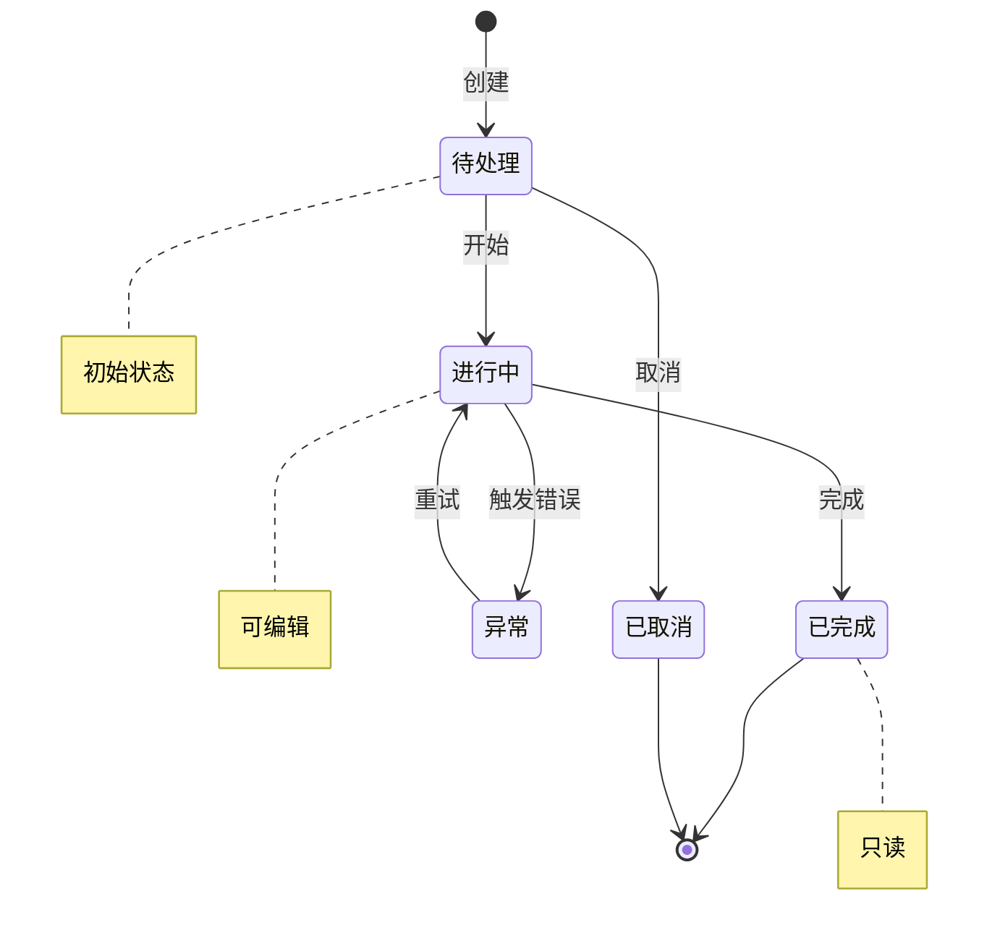

# {页面名称} — 设计文档

> 使用说明：将 `{...}` 替换为实际内容。`<!-- 可选 -->` 标记的段落仅相关页面类型需要填写。
> 各 Section 中的「关键字」会被 skill 用于页面类型判定和组件注册表匹配，请保留。

---

## 一、页面元信息

| 项目 | 内容 |
|------|------|
| 页面名称 | `{页面中文名，如：设备巡检列表}` |
| 所属模块 | `{模块名，如：运维管理}` |
| 页面类型 | `{列表管理 / 详情展示 / 表单提交 / 统计看板 / 树形管理}` |
| 路由路径 | `/{module}/{page}` |

### 功能描述

> 一句话描述必须包含页面类型关键字，skill 据此判定页面类型。
> - 列表管理：含「列表」「表格」「管理」
> - 详情展示：含「详情」「查看」「信息」
> - 表单提交：含「新增」「编辑」「配置」「录入」
> - 统计看板：含「统计」「看板」「仪表板」「概览」
> - 树形管理：含「树」「层级」「分类」

`{一句话功能描述，例如：设备巡检任务的列表管理页面，支持搜索筛选、新增编辑、批量删除、状态标签展示。}`

---

## 二、页面结构

> 用表格列出页面从顶到底的每个区域。一行一个区域，按页面上的视觉顺序排列。
> **区域名称必须含注册表匹配关键字**（搜索筛选/操作栏/表格/弹窗/抽屉/指标卡/汇总/图表/详情信息/摘要/时间线等）。
> 可选组件：StatusTag / FilterBar / ToolBar / DataTable / FormDialog / FormDrawer / MetricCard / SummaryCard / ChartCard / InfoCard / DetailHeader / ProcessTimeline
> 
> **`位置` 列取值**：
> - `顶部` — 面包屑/返回按钮所在行，页面最上方
> - `全宽` — 独占一行，纵向堆叠（默认值）
> - `底部` — 页面底部的操作栏
> - `并排-N` — N 个区域同行排列（如 `并排-2` = 两人同行，`并排-4` = 四列指标卡）
> - `Tab:xxx` — 在名为 xxx 的 Tab 页签内（详情页切换子内容时使用）
> - `左侧` / `右侧` — 仅在需要左右分栏对比信息时使用（如"订单信息 vs 客户信息"）

### {列表管理 / 详情展示 / 表单提交 / 统计看板 / 树形管理} 页布局

| # | 区域名称 | 位置 | 注册表组件 | 包含元素 |
|---|---------|------|-----------|---------|
| 1 | `{如：搜索筛选区}` | 顶部 | `FilterBar` | `{如：关键词输入框 + 状态下拉 + 日期范围 + 查询按钮}` |
| 2 | `{如：操作按钮栏}` | 顶部 | `ToolBar` | `{如：+ 新增(primary) + 批量删除(danger) + 导出}` |
| 3 | `{如：数据表格}` | 中部 | `DataTable` | `{如：复选框列 + 状态标签列(StatusTag) + 名称 + 时间 + 操作列(fixed right)}` |
| 4 | 分页器 | 底部 | `el-pagination` | layout="total, sizes, prev, pager, next, jumper" |
| 5 | `{如：新增编辑弹窗}` | 浮层 | `FormDialog` | `{如：≤6字段，width=520px，含 名称+状态+时间 字段}` |

<!-- 可选：详情展示页行 -->
<!--
| # | 区域名称 | 位置 | 注册表组件 | 包含元素 |
|---|---------|------|-----------|---------|
| 1 | 面包屑导航 | 顶部 | `el-breadcrumb` | 模块 > 子模块 > 详情 |
| 2 | 返回按钮 | 顶部 | `el-button link` | ArrowLeft icon |
| 3 | 基本信息卡片 | 左侧 | `InfoCard` | columns=2，含 {字段列表} |
| 4 | 扩展信息卡片 | 左侧 | `InfoCard` | columns=2，含 {字段列表} |
| 5 | 关联数据标签页 | 右侧 | `el-tabs` > `el-tab-pane` | 关联数据表格 + 操作日志 |
| 6 | 底部操作栏 | 底部 | `ToolBar` | 编辑 + 删除 + 返回 |
-->

<!-- 可选：统计看板页行 -->
<!--
| # | 区域名称 | 位置 | 注册表组件 | 包含元素 |
|---|---------|------|-----------|---------|
| 1 | 统计指标行 | 顶部 | `MetricCard` × {N} | `{每个指标的 label + value + trend}` |
| 2 | 汇总总分区 | 中部 | `SummaryCard` | `{title + total + items grid}` |
| 3 | 趋势图表区 | 中部 | `ChartCard` | `{title + ECharts 折线图}` |
-->

<!-- 可选：树形管理页行 -->
<!--
| # | 区域名称 | 位置 | 注册表组件 | 包含元素 |
|---|---------|------|-----------|---------|
| 1 | 左侧分类树 | 左侧 260px | `el-tree` | highlight-current, node-click |
| 2 | 右侧数据表格 | 右侧 | `DataTable` | 选中节点的关联数据 |
-->

<!-- 可选：表单提交页行 -->
<!--
| # | 区域名称 | 位置 | 注册表组件 | 包含元素 |
|---|---------|------|-----------|---------|
| 1 | 表单区块1: 基本信息 | 顶部 | `el-card` | `{字段1, 字段2, 字段3}` |
| 2 | 表单区块2: 扩展配置 | 中部 | `el-card` | `{字段4, 字段5, 字段6}` |
| 3 | 提交按钮栏 | 底部 | `el-button` group | 保存(primary) + 取消 |
-->

---

## 三、数据模型

### 3.1 实体字段

> 字段表直接映射为 `XxxItem` 接口。

| 字段名 | 中文名 | 类型 | 必填 | 校验规则 | 说明 |
|--------|--------|------|------|---------|------|
| `id` | ID | `number` | 是 | — | 主键 |
| `{fieldName}` | `{中文名}` | `{string/number/boolean}` | `{是/否}` | `{如：max:100, required}` | `{说明}` |
| `status` | 状态 | `number` | 是 | — | `{见状态枚举}` |
| `createdAt` | 创建时间 | `string` | 是 | — | ISO 8601 |
| `updatedAt` | 更新时间 | `string` | 否 | — | ISO 8601 |

### 3.2 状态枚举

> 每个状态值需要「标签文字 + 颜色类型」，skill 会据此生成 StatusTag 的映射表。

| 枚举值 | 标签文字 | 颜色类型 | 说明 |
|--------|---------|---------|------|
| `{0}` | `{如：待处理}` | `{warning}` | `{说明}` |
| `{1}` | `{如：进行中}` | `{info}` | `{说明}` |
| `{2}` | `{如：已完成}` | `{success}` | `{说明}` |
| `{3}` | `{如：异常}` | `{danger}` | `{说明}` |

> 颜色类型：`success`(绿) / `warning`(黄) / `danger`(红) / `info`(蓝) / `normal`(灰)

### 3.3 新增/编辑表单字段

> 映射为 `XxxForm` 接口。如果表单字段与实体字段一致可跳过本节。

| 字段名 | 中文名 | 类型 | 必填 | 控件类型 | 校验规则 | 说明 |
|--------|--------|------|------|---------|---------|------|
| `{fieldName}` | `{中文名}` | `{string/number}` | `{是/否}` | `{input/select/date-picker/switch/textarea}` | `{规则}` | `{说明}` |

<!-- 可选：表单分区块（>6字段或复杂表单时填写） -->
<!--
| 区块 | 包含字段 |
|------|---------|
| 基本信息 | {字段1, 字段2, 字段3} |
| 扩展配置 | {字段4, 字段5, 字段6} |
-->

---

## 四、查询参数

> 映射为 `XxxQuery` 接口。用于列表页搜索筛选。

| 参数名 | 中文名 | 类型 | 控件类型 | 选项（如 select） |
|--------|--------|------|---------|-----------------|
| `keyword` | 关键词 | `string` | `input` | — |
| `{paramName}` | `{中文名}` | `{string/number}` | `{input/select/date-picker/date-range}` | `{如：[{label:'启用',value:1}]}` |
| `page` | 页码 | `number` | — | 默认 1 |
| `size` | 每页条数 | `number` | `select` | `[10,20,50,100]` |

---

## 五、接口定义

> 每个接口一行。skill 按此生成 `src/api/{module}.ts`。

| 操作 | 方法 | 路径 | 请求类型 | 响应类型 |
|------|------|------|---------|---------|
| 获取列表 | `GET` | `/api/{module}` | `XxxQuery` | `PaginatedData<XxxItem>` |
| 获取详情 | `GET` | `/api/{module}/{id}` | — | `XxxItem` |
| 新增 | `POST` | `/api/{module}` | `XxxForm` | `XxxItem` |
| 编辑 | `PUT` | `/api/{module}/{id}` | `Partial<XxxForm>` | `XxxItem` |
| 删除 | `DELETE` | `/api/{module}/{id}` | — | — |
<!-- 可选：额外接口 -->
<!--
| `{操作名}` | `{GET/POST/PUT/DELETE}` | `{路径}` | `{请求类型}` | `{响应类型}` |
-->

---

## 六、业务逻辑

### 6.1 状态流转

> 用 Mermaid `stateDiagram-v2` 描述。人和 AI 都能直接理解，无需画 ASCII 边框。
> 语法：`状态A --> 状态B : 触发操作`

> 上例用 `{实际状态名}` 替换，每个转换标注触发操作。不需要的状态行删掉即可。

### 6.2 交互行为

| 操作 | 触发条件 | 行为描述 |
|------|---------|---------|
| 新增 | 点击 ToolBar [新增] | `{如：打开 FormDialog，表单为空，提交后刷新列表}` |
| 编辑 | 点击表格行 [编辑] | `{如：打开 FormDialog，回填数据，提交后刷新列表}` |
| 删除 | 点击表格行 [删除] | `{如：弹出 ElMessageBox.confirm，确认后调删除接口，刷新列表}` |
| 批量删除 | 选中行 > 0，点击 ToolBar [批量删除] | `{行为描述}` |
| 查看详情 | 点击表格行 / [查看] | `{如：跳转详情页 / 打开 Drawer}` |

### 6.3 特殊规则

- `{规则1，如：进行中 和 已完成 的任务不可编辑}`
- `{规则2，如：已删除的记录不在列表中显示}`
- `{规则3，如：同一名称的任务不可重复创建}`

---

## 七、UI 组件分配

> 将页面每个区域分配到注册表组件或标记为自定义。

| 页面区域 | 注册表组件 | 关键 Props / 自定义说明 |
|---------|-----------|----------------------|
| 搜索筛选区 | `FilterBar` | `{如：筛选项含 关键词+状态+日期范围}` |
| 操作按钮栏 | `ToolBar` | `{如：新增(primary)+批量删除(danger,需选中)}` |
| 数据表格 | `DataTable` | `{如：checkbox列+状态列(StatusTag)+操作列(fixed right)}` |
| 新增编辑弹窗 | `FormDialog` | `{如：≤6字段用Dialog，width=520px}` |
<!-- 如使用 FormDrawer -->
<!--
| 配置抽屉 | `FormDrawer` | `{如：>6字段用Drawer，size=640px}` |
-->
| 状态标签 | `StatusTag` | 见 §3.2 状态枚举 |

<!-- 可选：看板页组件 -->
<!--
| 统计指标行 | `MetricCard` × {N} | `{每个指标的 label/value/trend}` |
| 汇总区 | `SummaryCard` | `{title+total+items}` |
| 图表区 | `ChartCard` | `{title+chart slot}` |
-->

<!-- 可选：详情页组件 -->
<!--
| 基本信息 | `InfoCard` | `{columns=2}` |
| 扩展信息 | `InfoCard` | `{columns=2}` |
-->
