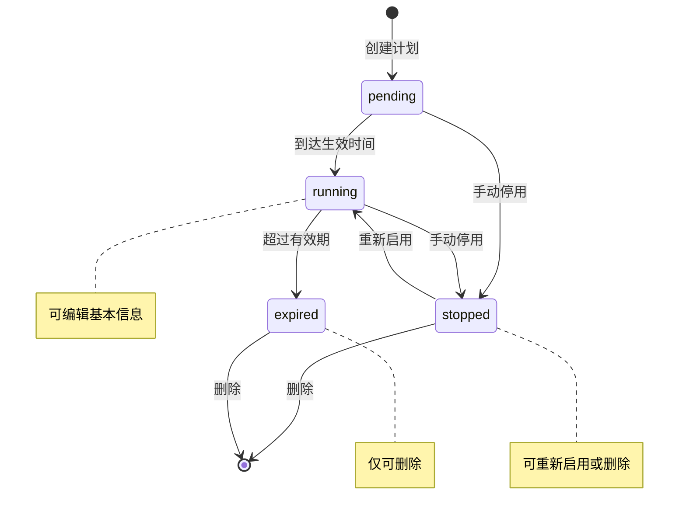

# 保养计划列表 — 设计文档

> 本文档按 md-figma-to-vue3 skill 的 md-template.md 范式编写，用于 skill 直接解析生成代码。

---

## 一、页面元信息

| 项目 | 内容 |
|------|------|
| 页面名称 | 保养计划列表 |
| 所属模块 | 保养管理 |
| 页面类型 | 列表管理 |
| 路由路径 | `/maintenance/plans` |

### 功能描述

`保养计划的列表管理页面，支持按计划名称搜索、按状态和周期筛选、新增编辑弹窗、复制计划、开关启停、批量删除、状态标签展示。`

---

## 二、页面结构

### 列表管理页布局

| # | 区域名称 | 位置 | 注册表组件 | 包含元素 |
|---|---------|------|-----------|---------|
| 1 | 搜索筛选区 | 顶部 | `FilterBar` | 计划名称输入框 + 状态下拉 + 周期下拉 + 查询按钮 |
| 2 | 操作按钮栏 | 顶部 | `ToolBar` | + 新增保养计划(primary, outline 样式) |
| 3 | 数据表格 | 中部 | `DataTable` | 状态列(StatusTag) + 计划名称 + 设备总数(可排序) + 保养项目(可排序) + 保养类型 + 执行人 + 下次生成时间(可排序) + 操作列(fixed right) |
| 4 | 分页器 | 底部 | `el-pagination` | layout="total, sizes, prev, pager, next, jumper" |
| 5 | 新增编辑弹窗 | 浮层 | `FormDialog` | ≤6字段，width=520px，含 计划名称 + 状态 + 周期 + 执行人 + 设备总数 + 保养项目数 |

---

## 三、数据模型

### 3.1 实体字段

| 字段名 | 中文名 | 类型 | 必填 | 校验规则 | 说明 |
|--------|--------|------|------|---------|------|
| `id` | ID | `number` | 是 | — | 主键 |
| `planName` | 计划名称 | `string` | 是 | max:50, required | 保养计划名称 |
| `status` | 状态 | `PlanStatus` | 是 | — | 见状态枚举 |
| `deviceCount` | 设备总数 | `number` | 是 | min:0 | 关联设备数量 |
| `maintenanceItems` | 保养项目 | `number` | 是 | min:0 | 保养检查项数 |
| `maintenanceType` | 保养类型 | `PlanCycle` | 是 | — | 周期类型 |
| `executor` | 执行人 | `string` | 是 | required | 负责人或部门 |
| `nextGenTime` | 下次生成时间 | `string` | 是 | — | 格式 YYYY-MM-DD HH:mm |
| `enabled` | 启用开关 | `boolean` | 是 | — | true=启用, false=停用 |

### 3.2 状态枚举

| 枚举值 | 标签文字 | 颜色类型 | 说明 |
|--------|---------|---------|------|
| `running` | 执行中 | `success` | 当前正在执行的计划 |
| `pending` | 待生效 | `info` | 已创建但未到生效时间 |
| `stopped` | 已停用 | `warning` | 手动停用的计划 |
| `expired` | 已过期 | `normal` | 超过有效期的计划 |

### 3.3 保养类型枚举

| 枚举值 | 标签文字 | 说明 |
|--------|---------|------|
| `daily` | 每日保养 | 每天执行一次 |
| `weekly` | 每周保养 | 每周执行一次 |
| `monthly` | 每月保养 | 每月执行一次 |
| `quarterly` | 每季保养 | 每季度执行一次 |
| `yearly` | 每年保养 | 每年执行一次 |

### 3.4 新增/编辑表单字段

| 字段名 | 中文名 | 类型 | 必填 | 控件类型 | 校验规则 | 说明 |
|--------|--------|------|------|---------|---------|------|
| `planName` | 计划名称 | `string` | 是 | `input` | required, max:50 | — |
| `status` | 状态 | `PlanStatus` | 是 | `select` | required | 选项来自状态枚举 |
| `maintenanceType` | 保养类型 | `PlanCycle` | 是 | `select` | required | 选项来自保养类型枚举 |
| `executor` | 执行人 | `string` | 是 | `input` | required | — |
| `deviceCount` | 设备总数 | `number` | 是 | `input` | min:0 | 数字输入 |
| `maintenanceItems` | 保养项目数 | `number` | 是 | `input` | min:0 | 数字输入 |

---

## 四、查询参数

| 参数名 | 中文名 | 类型 | 控件类型 | 选项 |
|--------|--------|------|---------|------|
| `planName` | 计划名称 | `string` | `input` | — |
| `status` | 状态 | `PlanStatus` | `select` | 执行中/待生效/已停用/已过期 |
| `cycle` | 周期 | `PlanCycle` | `select` | 每日/每周/每月/每季/每年 |
| `page` | 页码 | `number` | — | 默认 1 |
| `size` | 每页条数 | `number` | `select` | `[10,20,50,100]` |

---

## 五、接口定义

| 操作 | 方法 | 路径 | 请求类型 | 响应类型 |
|------|------|------|---------|---------|
| 获取列表 | `GET` | `/api/maintenance/plans` | `PlanQuery` | `PaginatedData<MaintenancePlan>` |
| 获取详情 | `GET` | `/api/maintenance/plans/{id}` | — | `MaintenancePlan` |
| 新增 | `POST` | `/api/maintenance/plans` | `MaintenancePlanForm` | `MaintenancePlan` |
| 编辑 | `PUT` | `/api/maintenance/plans/{id}` | `Partial<MaintenancePlanForm>` | `MaintenancePlan` |
| 删除 | `DELETE` | `/api/maintenance/plans/{id}` | — | — |
| 复制计划 | `POST` | `/api/maintenance/plans/{id}/copy` | — | `MaintenancePlan` |
| 切换启停 | `PUT` | `/api/maintenance/plans/{id}/toggle` | `{enabled:boolean}` | — |

---

## 六、业务逻辑

### 6.1 状态流转

### 6.2 交互行为

| 操作 | 触发条件 | 行为描述 |
|------|---------|---------|
| 新增 | 点击 ToolBar [新增保养计划] | 打开 FormDialog，表单为空，提交后刷新列表，计划初始状态为 pending |
| 编辑 | 点击表格行 [编辑] | 打开 FormDialog，回填数据，提交后刷新列表 |
| 删除 | 点击表格行 [删除] | 弹出 ElMessageBox.confirm，确认后调删除接口，刷新列表 |
| 查看 | 点击表格行 [查看] | 跳转详情页（预留路由） |
| 复制 | 点击表格行 [复制] | 调复制接口，新计划名称为"{原名} (副本)"，刷新列表 |
| 切换启停 | 点击开关 | 调 toggle 接口更新 enabled 状态，实时生效 |
| 排序 | 点击表头排序图标 | 设备总数、保养项目、下次生成时间列支持排序 |

### 6.3 特殊规则

- `执行中(running)` 和 `已过期(expired)` 的计划不可编辑
- `已过期(expired)` 的计划开关为禁用状态，不可切换
- 同一名称的计划不可重复创建
- 删除操作不可逆，二次确认后执行
- 复制计划时设备关联关系一并复制

---

## 七、UI 组件分配

| 页面区域 | 注册表组件 | 关键 Props / 自定义说明 |
|---------|-----------|----------------------|
| 搜索筛选区 | `FilterBar` | 筛选项：planName(input) + status(select) + cycle(select) + 查询按钮 |
| 操作按钮栏 | `ToolBar` | 新增(primary, outline 样式，文字"新增保养计划") |
| 数据表格 | `DataTable` | checkbox列(可选，用于批量操作) + 状态列(StatusTag) + 计划名称 + 设备总数(可排序) + 保养项目(可排序) + 保养类型 + 执行人 + 下次生成时间(可排序) + 操作列(fixed right) |
| 新增编辑弹窗 | `FormDialog` | ≤6字段用Dialog，width=520px，字段见 §3.4 |
| 状态标签 | `StatusTag` | 见 §3.2 状态枚举，颜色 success/info/warning/normal |
| 分页器 | `el-pagination` | layout="total, sizes, prev, pager, next, jumper" |
