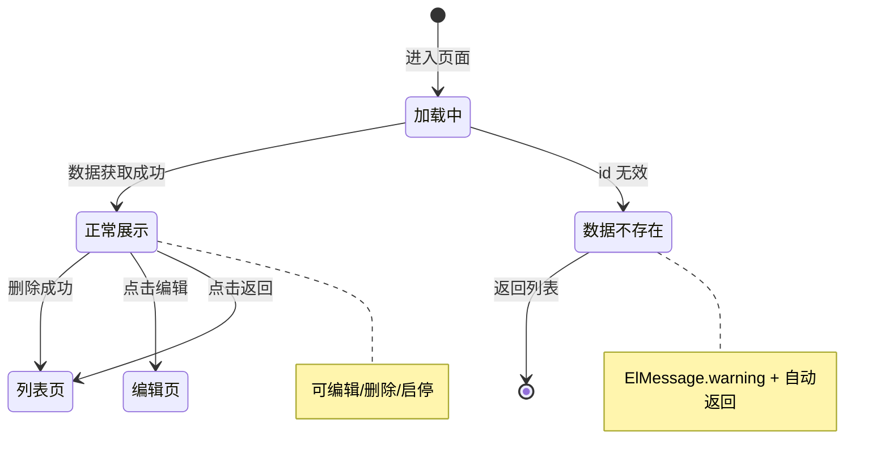

# 保养计划详情 — 设计文档

> 本文档按 md-figma-to-vue3 skill 的 md-template.md 范式编写，用于 skill 直接解析生成代码。
> 数据模型、枚举与列表页 DESIGN.md 一致，此处复用不重复罗列。

---

## 一、页面元信息

| 项目 | 内容 |
|------|------|
| 页面名称 | 保养计划详情 |
| 所属模块 | 保养管理 |
| 页面类型 | 详情展示 |
| 路由路径 | `/maintenance/plans/detail/:id` |

### 功能描述

`保养计划的详情查看页面，展示计划基本信息和关联设备。支持返回列表、编辑跳转、删除操作。`

---

## 二、页面结构

### 详情展示页布局

| # | 区域名称 | 位置 | 注册表组件 | 包含元素 |
|---|---------|------|-----------|---------|
| 1 | 面包屑导航 | 顶部 | `el-breadcrumb` | 保养管理 > 保养计划 > 详情 |
| 2 | 返回按钮 | 左上角 | `el-button link` | ArrowLeft icon + "返回列表" |
| 3 | 基本信息卡片 | 横向100% | `InfoCard` | 计划名称 / 状态(StatusTag) / 保养类型 / 执行人 / 下次生成时间 / 开关组件 启用/停用，含状态说明文字，columns=1 |
| 4 | 统计摘要卡片 | 横向100% | `InfoCard` | 设备总数 / 保养项目数，columns=2 |
| 5 | 操作日志标签页 | 横向100% | `el-tabs` > `el-tab-pane` | 最近操作记录列表（置灰空态占位） |
| 6 | 底部操作栏 | 底部 | `ToolBar` | 编辑(primary) + 删除(danger) + 返回列表 |

---

## 三、数据模型

> 复用列表页的 `MaintenancePlan` 实体和枚举，不重复定义。详情页额外需要的衍生字段：

| 字段名 | 中文名 | 类型 | 说明 |
|--------|--------|------|------|
| `statusLabel` | 状态文字 | `string` | 从 PlanStatus 枚举映射（见列表页 §3.2） |
| `statusColor` | 状态颜色 | `string` | success/info/warning/normal |
| `cycleLabel` | 保养类型文字 | `string` | 从 PlanCycle 枚举映射（见列表页 §3.3） |

---

## 四、接口定义

| 操作 | 方法 | 路径 | 请求类型 | 响应类型 |
|------|------|------|---------|---------|
| 获取详情 | `GET` | `/api/maintenance/plans/{id}` | — | `MaintenancePlan` |
| 删除 | `DELETE` | `/api/maintenance/plans/{id}` | — | — |
| 切换启停 | `PUT` | `/api/maintenance/plans/{id}/toggle` | `{enabled:boolean}` | — |

---

## 五、业务逻辑

### 5.1 页面状态

### 5.2 交互行为

| 操作 | 触发条件 | 行为描述 |
|------|---------|---------|
| 返回 | 点击返回按钮 | `router.back()` |
| 编辑 | 点击底部 [编辑] | 跳转编辑页（暂预留 `router.push` 到编辑路由） |
| 删除 | 点击底部 [删除] | 弹出 ElMessageBox.confirm，确认后调删除接口，成功后跳回列表 |
| 切换启停 | 点击开关 | 调 togglePlanStatus 接口，更新本地 enabled，ElMessage 提示 |
| 查看操作日志 | 切换到"操作日志"tab | 展示占位数据（功能预留） |

### 5.3 特殊规则

- `过期(expired)` 的计划开关禁用，不可切换
- 删除确认提示包含计划名称：`确认删除「{planName}」？`
- 面包屑最后一项为当前计划名称，不可点击
- 数据加载失败或 id 无效时 toast 提示并自动返回列表

---

## 六、UI 组件分配

| 页面区域 | 注册表组件 | 关键 Props / 自定义说明 |
|---------|-----------|----------------------|
| 面包屑 | `el-breadcrumb` | separator="/"，最后一项 plain |
| 返回按钮 | `el-button link` | :icon="ArrowLeft"，@click="$router.back()" |
| 基本信息 | `InfoCard` | title="基本信息"，columns=1，显示 planName/status(StatusTag)/maintenanceType/executor/nextGenTime |
| 统计摘要 | `InfoCard` | title="统计信息"，columns=2，显示 deviceCount/maintenanceItems |
| 启用开关 | inline（基本信息卡片内） | el-switch + 状态文字，expired 时 disabled，不单独成卡 |
| 操作日志 | `el-tabs` + `el-tab-pane` | 空态占位，label="操作日志" |
| 底部操作栏 | `ToolBar` | left slot: 编辑(primary)，right slot: 删除(danger) + 返回 |
| 状态标签 | `StatusTag` | 复用现有组件 |
