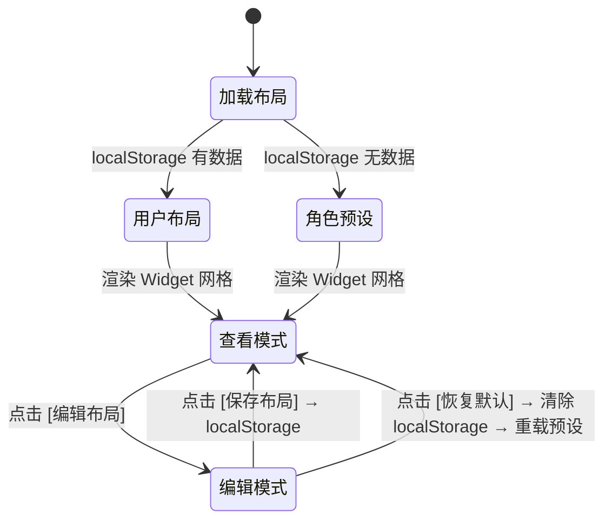

# 工作台主页 — 设计文档

---

## 一、页面元信息

| 项目 | 内容 |
|------|------|
| 页面名称 | `工作台主页` |
| 所属模块 | `工作台` |
| 页面类型 | `统计看板` |
| 路由路径 | `/workbench` |

### 功能描述

平台默认首页，角色化的跨业务域统计看板概览页面，包含快捷入口、快捷操作、我的待办、消息通知四类核心 Widget 及占位卡片，支持可编辑 Widget 网格布局、查看/编辑模式切换、布局持久化。

---

## 二、页面结构

### 统计看板 页布局

| # | 区域名称 | 位置 | 注册表组件 | 包含元素 |
|---|---------|------|-----------|---------|
| 1 | 看板标题操作栏 | 顶部 | `ToolBar` | 左侧标题"工作台"；右侧查看模式 `[编辑布局]` 按钮(link)，编辑模式 `[+ 添加组件]` `[保存布局]`(primary) `[恢复默认]`(default) |
| 2 | 各应用快捷入口卡片 | 并排-N | `MetricCard` | 3×2 按钮网格：设备管理🏭、巡查检查🔍、远程值守📡、维保应用🔧、隐患管理⚠、系统管理⚙；点已实现模块跳转路由，未实现模块不可点击；**适用所有角色** |
| 3 | 快捷操作入口卡片 | 并排-N | `MetricCard` | 纵向按钮列表：[📋 发起工单] 触发 CreateOrderDialog(width=560px)；后续追加 [⚠ 上报隐患]、[📅 创建维保计划]；按钮按模块可用性动态显示，未实现时隐藏；**适用所有角色** |
| 4 | 我的待办卡片 | 并排-N | `MetricCard` | 顶部三指标：待办(橙) / 已完成(绿) / 剩余(蓝)；下方待办列表按模块分组，每行显示 [模块标签] + 任务类型 + 工单编号+模板名 + 紧急badge；点击跳转详情；骨架屏加载/空态"暂无待办"/重试按钮；**适用所有角色** |
| 5 | 消息通知卡片 | 并排-N | `MetricCard` | 最近 5 条通知列表，每行：类型圆点(SLA红/指派橙/验收蓝/系统灰) + 内容摘要 + 时间相对显示；点击跳转对应链接；空态"暂无消息"；阶段 1 Mock 数据，阶段 2 接消息中心 API；**适用所有角色** |
| 6 | 工单概览卡片 | 并排-N | `MetricCard` | 四统计数（待处理/进行中/待验收/已关闭）+ 最近 5 条工单（编号+模板+StatusTag+时间）+ [查看全部 →] 跳转 /system/monitor；**适用工单监控角色**，按角色过滤 |
| 7 | SLA 概览卡片 | 并排-N | `MetricCard` | 三色仪表（超时红/预警橙/正常绿）+ 最近 3 条超时工单 + [查看全部 →] 跳转 /system/monitor?sla=timeout；**适用：安全监管员** |
| 8 | 维保概览占位卡片 | 并排-N | `MetricCard` | 📅 维保计划 + "即将上线"；**适用：物业管理员+工程师**，阶段 2 替换为真实数据 |
| 9 | 隐患概览占位卡片 | 并排-N | `MetricCard` | ⚠ 隐患管理 + "即将上线"；**适用：物业管理员+监管员**，阶段 2 替换为真实数据 |
| 10 | 设备概览占位卡片 | 并排-N | `MetricCard` | 🏭 设备管理 + "即将上线"；**适用：物业管理员**，阶段 3 替换为真实数据 |
| 11 | 巡查概览占位卡片 | 并排-N | `MetricCard` | 🔍 巡查检查 + "即将上线"；**适用：物业管理员**，阶段 3 替换为真实数据 |
| 12 | 组件池选择面板 | 浮层 | `FormDialog` | width=320px，编辑模式点击 [+ 添加组件] 弹出；网格展示可用组件（图标+名称），已添加的置灰标记"已添加" |
| 13 | 发起工单弹窗 | 浮层 | `FormDialog` | width=560px，步骤1 模板选择（2×2 卡片网格，单选蓝色高亮，显示模板名称+v版本+节点数）；步骤2 工单信息（priority radio-group: 普通/紧急/低优 默认normal + description textarea maxlength=200） |

> 角色默认布局见附录 B。编辑模式下各卡可自由拖拽排序，按栅格自动吸附填充 + × 删除按钮。

---

## 三、数据模型

### 3.1 实体字段

#### WidgetSlot（组件槽位）

| 字段名 | 中文名 | 类型 | 必填 | 校验规则 | 说明 |
|--------|--------|------|------|---------|------|
| id | 槽位 ID | string | 是 | 唯一 | 实例标识，格式 `{dashboardId前缀}-{序号}` |
| type | 组件类型 | WidgetType | 是 | 在 registry 中已注册 | 对应全局注册表 key |
| size | 列跨度 | 1\|2\|3 | 是 | 1-3 | CSS grid-column span，默认 1 |
| order | 排序 | number | 是 | ≥0 | 从 0 递增 |
| config | 实例配置 | object | 否 | — | 如 `{ moduleName: '隐患管理' }` |

#### WidgetType 枚举（核心 9 种）

| 枚举值 | 标签文字 | 颜色类型 | 说明 |
|--------|---------|---------|------|
| app-shortcuts | 各应用快捷入口 | info | 导航类：跳转到各业务模块 |
| quick-actions | 快捷操作入口 | info | 动作类：触发 Dialog/流程 |
| my-tasks | 我的待办 | warning | 任务类：聚合待办事项 |
| notifications | 消息通知 | info | 通知类：展示系统消息 |
| order-overview | 工单概览 | success | 概览类：工单统计+最近列表 |
| sla-overview | SLA 概览 | danger | 概览类：超时/预警/正常统计 |
| plan-status | 维保概览 | info | 占位（阶段 2） |
| hazard-overview | 隐患概览 | warning | 占位（阶段 2） |
| placeholder | 占位卡片 | normal | 通用占位（阶段 2-3） |

### 3.2 状态枚举

#### 编辑模式

| 枚举值 | 标签文字 | 颜色类型 | 说明 |
|--------|---------|---------|------|
| viewing | 查看模式 | normal | 默认，Widget 正常渲染，[编辑布局] 显示 |
| editing | 编辑模式 | warning | Widget 显示拖拽按钮，内容区半透明，工具栏切换 |

### 3.3 表单字段

#### 发起工单弹窗

| 字段名 | 中文名 | 类型 | 控件类型 | 必填 | 校验规则 | 说明 |
|--------|--------|------|---------|------|---------|------|
| templateId | 工单模板 | number | 卡片选择 | 是 | 必须选中一个 | 2×2 网格，蓝色高亮，再次点击取消 |
| priority | 优先级 | string | radio-group | 是 | — | urgent/紧急 normal/普通 low/低优，默认 normal |
| description | 工单描述 | string | textarea | 否 | maxlength=200 | "请简要描述工单内容" |

---

## 四、查询参数

> 工作台无查询参数。页面加载根据路由 `dashboardId='workbench'` + 当前角色从 localStorage/presets 加载布局。

---

## 五、接口定义

> 工作台无独立后端接口。各 Widget 内部自行调用对应模块 API。

| 接口名称 | 方法 | 路径 | 使用 Widget | 说明 |
|---------|------|------|------------|------|
| 获取工单列表 | GET | `/api/v1/work-order/instances` | order-overview, sla-overview, my-tasks | 按角色传 orgId/assigneeId 过滤 |
| 创建工单 | POST | `/api/v1/work-order/instances` | quick-actions→发起工单 | 从模板创建草稿工单 |

---

## 六、业务逻辑

### 6.1 布局初始化流程

### 6.2 交互行为

| 操作 | 触发条件 | 行为描述 |
|------|---------|---------|
| 页面加载 | 路由 `/workbench` | DashboardShell.mounted → initDashboard('workbench', role) → 加载布局 → 渲染 （要有骨架屏显示） |
| 进入编辑模式 | 点击 [编辑布局] | isEditing=true，每卡片可自由拖拽排序 |
| 删除组件 | 点击 × | 从 layouts 数组移除 |
| 添加组件 | [+ 添加组件] → 选择 | 组件池面板弹出，点击追加到末尾 |
| 保存布局 | 点击 [保存布局] | JSON → localStorage，退出编辑 |
| 恢复默认 | 点击 [恢复默认] | 清除 localStorage，重载角色预设 |
| 发起工单 | quick-actions 中点击 | CreateOrderDialog 弹出 |
| 选模板 | 点击模板卡片 | 蓝色高亮，展开表单；[确认发起] disabled 直到选中 |
| 提交工单 | 点击 [确认发起] | createWorkOrder API，成功后弹窗关闭 |
| 跳转模块 | app-shortcuts 点击 | router.push 到对应路由 |
| Widget 数据加载 | Widget mounted | 独立 fetch，骨架屏→数据/错误 |
| 消息通知点击 | notifications 点击条目 | router.push 到链接 |

### 6.3 特殊规则

| 规则 | 说明 |
|------|------|
| 角色数据隔离 | 物业管理员传 orgId；监管员全量；工程师传 assigneeId |
| 不重复添加 | 同 type 的 Widget 已添加时在组件池中置灰 |
| 异常隔离 | 单 Widget 崩溃不影响其他，WidgetRenderer 捕获处理 |
| 编辑不自动保存 | 退出编辑需显式点 [保存布局]，否则丢弃 |
| 布局上限 | 单仪表盘 < 5KB，localStorage 失败静默降级 |
| 占位无请求 | PlaceholderWidget 纯展示，不调 API |

---

## 七、UI 组件分配

| # | 区域名称 | 注册表组件 | 关键 Props |
|---|---------|-----------|-----------|
| 1 | 看板标题操作栏 | `ToolBar` | title="工作台", 查看/编辑按钮切换 |
| 2 | 各应用快捷入口卡片 | `MetricCard` | title="各应用快捷入口", 3×2 grid, router-link |
| 3 | 快捷操作入口卡片 | `MetricCard` | title="快捷操作", 纵向 button list, config.actions |
| 4 | 我的待办卡片 | `MetricCard` | title="我的待办", stats(待办/已完成/剩余), task list |
| 5 | 消息通知卡片 | `MetricCard` | title="消息通知", dot+text+time list |
| 6 | 工单概览卡片 | `MetricCard` | title="工单概览", stats×4, recent 5, "查看全部 →" |
| 7 | SLA 概览卡片 | `MetricCard` | title="SLA 概览", gauge×3, timeout list |
| 8-11 | 占位卡片×4 | `MetricCard` | title="维保/隐患/设备/巡查", icon + "即将上线" |
| 12 | 组件池选择面板 | `FormDialog` | width=320, available widgets grid |
| 13 | 发起工单弹窗 | `FormDialog` | width=560, 2-step: template cards + priority+textarea |

---

## 附录 A：Widget 清单

> 来源：PRD 附录 A。

| Widget | Key | 目标角色 | 内容 | 数据来源 | 阶段 | 状态 |
|--------|-----|---------|------|---------|------|------|
| 各应用快捷入口 | app-shortcuts | 所有 | 6 个模块按钮(3×2) | 无(纯导航) | 1 | ✅ |
| 快捷操作入口 | quick-actions | 物业 | 发起工单按钮→Dialog | 无(纯入口) | 1 | ✅ |
| 我的待办 | my-tasks | 所有 | 待办/完成/剩余+列表 | getWorkOrderList | 1 | ✅ |
| 消息通知 | notifications | 物业+监管 | 最近5条通知 | Mock(阶段2 API) | 1 | ✅ |
| 工单概览 | order-overview | 所有 | 4统计+5条工单 | getWorkOrderList | 1 | ✅ |
| SLA 概览 | sla-overview | 监管 | 三色统计+超时列表 | getWorkOrderList | 1 | ✅ |
| 维保概览 | plan-status | 物业+工程师 | 计划执行率 | 待实现 | 2 | ⏳ |
| 隐患概览 | — | 物业+监管 | 整改进度 | 待设计 | 2-3 | ⏳ |
| 设备概览 | — | 物业 | 异常/过期 | 待设计 | 3 | ⏳ |
| 巡查概览 | — | 物业 | 今日任务 | 待设计 | 3 | ⏳ |

## 附录 B：角色-Widget 映射表

> 来源：§3 区域描述，以区域描述为准。

| Widget | 物业管理员 | 安全监管员 | 消防服务工程师 | 依据 |
|--------|:---:|:---:|:---:|------|
| app-shortcuts | ✅ | ✅ | ✅ | §3 区域2：适用所有角色 |
| quick-actions | ✅ | ✅ | ✅ | §3 区域3：适用所有角色 |
| my-tasks | ✅ | ✅ | ✅ | §3 区域4：适用所有角色 |
| notifications | ✅ | ✅ | ✅ | §3 区域5：适用所有角色 |
| order-overview | ✅ | ✅ | ✅ | §3 区域6：适用工单监控角色（三角色均有工单相关权限） |
| sla-overview | — | ✅ | — | §3 区域7：安全监管员 |
| plan-status | ⏳ | — | ⏳ | §3 区域8：物业管理员+工程师 |
| 隐患概览 | ⏳ | ⏳ | — | §3 区域9：物业管理员+监管员 |
| 设备概览 | ⏳ | — | — | §3 区域10：物业管理员 |
| 巡查概览 | ⏳ | — | — | §3 区域11：物业管理员 |

> ✅ = 默认显示  ⏳ = 占位显示  — = 不显示
