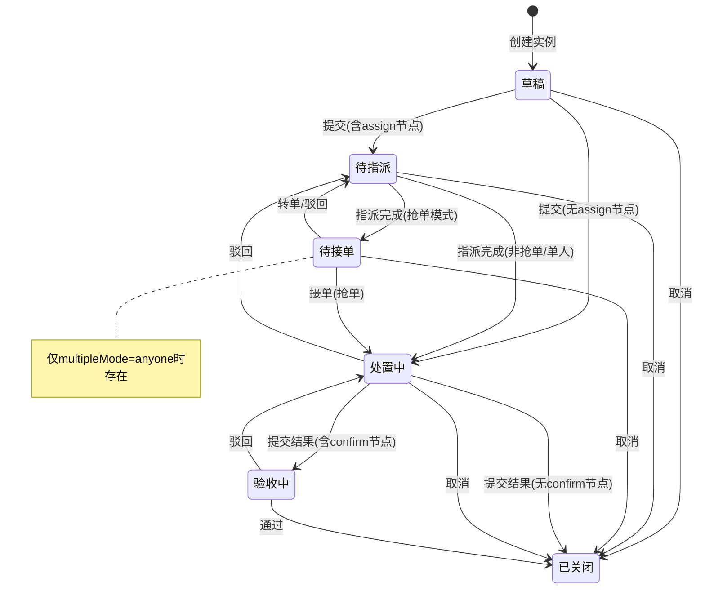

# 工单监控列表 — 设计文档

---

## 一、页面元信息

| 项目 | 内容 |
|------|------|
| 页面名称 | `工单监控列表` |
| 所属模块 | `工单监控` |
| 页面类型 | `列表管理` |
| 路由路径 | `/workflow/monitor` |

### 功能描述

`工单实例的列表管理页面，支持统计卡片快速筛选、多维度搜索筛选、SLA 三色预警标签展示、工单进度显示和实时刷新。`

---

## 二、页面结构

### 列表管理页布局

| # | 区域名称 | 位置 | 注册表组件 | 包含元素 |
|---|---------|------|-----------|---------|
| 1 | 统计指标行 | 并排-7 | `MetricCard` × 7 | 全部(总数) + 草稿 + 待指派 + 待接单 + 处置中 + 验收中 + 已关闭，每卡片含数字和标签，hover 可点击筛选，计数由后端 `WorkOrderStats` 驱动。待接单卡片仅在含 `multipleMode = anyone`（抢单模式）的指派节点时出现非零值 |
| 2 | 搜索筛选区 | 顶部 | `FilterBar` | 关键词输入框(placeholder="工单编号/发起人") + 模板名称下拉单选 + 优先级下拉单选(紧急/普通/低优) + SLA状态下拉单选(正常/预警/超时) + 创建时间日期范围选择器(快捷选项:今天/本周/本月，默认近30天) + 查询按钮 + 重置按钮。实例状态筛选已由统计卡片点击覆盖，不重复放置状态下拉; 与操作按钮区 同行顶部居左 |
| 3 | 操作按钮栏 | 顶部 | `ToolBar` |  发起工单(primary)按钮; 与搜索筛选区 同行顶部具右  |
| 3 | 工单详情抽屉 | 浮层 | `FormDrawer` | titleTemplate=`[{statusTag}] 工单详情 — {orderNo}`，size=640px。内部分区：基本信息区域 + 流转时间线区域 + 操作按钮栏。详细结构见 `工单详情抽屉.md` |
| 4 | 数据表格 | 全宽 | `DataTable` | 列：工单编号(link，点击打开抽屉) + 模板名称 + 工单进度(如`3/5`，来自`currentNodeIndex/totalNodes`) + 实例状态(StatusTag) + 优先级(StatusTag) + SLA状态(自定义红黄绿圆点+剩余时间文案，hover 弹出 TTR/TTS 明细 Tooltip) + 当前处理人 + 发起人 + 创建时间 + 操作列(详情按钮, fixed right)。空数据文案："暂无工单实例" |
| 5 | 分页器 | 底部 | `el-pagination` | layout="total, sizes, prev, pager, next, jumper"，默认每页 20 条 |

---

## 三、数据模型

### 3.1 实体字段（WorkOrderItem）

| 字段 | 类型 | 说明 |
|------|------|------|
| `id` | `number` | 主键，自增 |
| `orderNo` | `string` | 工单编号，格式 `WO{YYYYMMDD}-{序号}`，唯一 |
| `templateId` | `number` | 关联模板 ID |
| `templateName` | `string` | 模板名称（冗余） |
| `templateVersion` | `number` | 模板版本号 |
| `status` | `InstanceStatus` | 实例状态，见 §3.2 |
| `priority` | `Priority` | 优先级：`urgent` / `normal` / `low`（工单固定字段，非表单字段） |
| `currentNodeId` | `number` | 当前节点 ID |
| `currentNodeName` | `string` | 当前节点名称 |
| `currentNodeIndex` | `number` | 当前节点序号，从 1 开始 |
| `totalNodes` | `number` | 流程节点总数 |
| `currentNodeType` | `string` | 当前节点类型：`start` / `assign` / `execute` / `confirm` / `close` / `custom` |
| `currentAssigneeId` | `number \| null` | 当前处理人 ID |
| `currentAssigneeName` | `string \| null` | 当前处理人姓名 |
| `creatorId` | `number` | 发起人 ID |
| `creatorName` | `string` | 发起人姓名 |
| `creatorOrgId` | `number` | 发起人所属企业 ID |
| `creatorOrgName` | `string` | 发起人所属企业名称 |
| `parentOrderId` | `number \| null` | 父工单 ID（跨企业场景） |
| `createdAt` | `string` | 创建时间，格式 `YYYY-MM-DD HH:mm` |
| `updatedAt` | `string` | 最后更新时间 |
| `closedAt` | `string \| null` | 关闭时间 |
| `closedBy` | `string \| null` | 关闭操作人 |
| `sla` | `SlaInfo` | SLA 子对象，见 §3.3 |

### 3.2 实例状态枚举（InstanceStatus）

| 枚举值 | 标签文字 | 颜色类型 | 说明 | 出现条件 |
|--------|---------|---------|------|---------|
| `draft` | 草稿 | `info` | 已创建未提交 | 始终 |
| `pending_assign` | 待指派 | `info` | 等待分配处理人 | 模板含 `assign` 节点 |
| `pending_accept` | 待接单 | `warning` | 已指派，等待抢单/接单 | `assign` 节点 `multipleMode = anyone`（抢单模式） |
| `processing` | 处置中 | `warning` | 处理人正在处理 | 始终（经执行节点） |
| `verifying` | 验收中 | `warning` | 等待确认人审核 | 模板含 `confirm` 节点 |
| `closed` | 已关闭 | `normal` | 流程结束（通过/取消） | 始终 |

### 3.3 优先级枚举（Priority）

| 枚举值 | 标签文字 | 颜色类型 | 说明 |
|--------|---------|---------|------|
| `urgent` | 紧急 | `danger` | 需立即处理 |
| `normal` | 普通 | `warning` | 标准处理 |
| `low` | 低优 | `info` | 非紧急 |

### 3.4 SLA 子对象（SlaInfo）

| 字段 | 类型 | 说明 |
|------|------|------|
| `ttrMinutes` | `number \| null` | TTR 时限（分钟），无指派节点时为 null |
| `ttsMinutes` | `number` | TTS 时限（分钟） |
| `ttrStartedAt` | `string \| null` | TTR 开始时间 |
| `ttrEndedAt` | `string \| null` | TTR 结束时间（接单时间） |
| `ttsStartedAt` | `string` | TTS 开始时间 |
| `ttsPausedAt` | `string \| null` | TTS 暂停时间（验收中时暂停） |
| `yellowThreshold` | `number` | 黄灯阈值，默认 0.8 |
| `ttrProgress` | `number \| null` | TTR 进度 0-1+ |
| `ttsProgress` | `number` | TTS 进度 0-1+ |
| `slaStatus` | `SlaStatus` | SLA 状态：`normal` / `warning` / `timeout`，实时计算不可存储 |

### 3.5 SLA 状态枚举（SlaStatus）

| 枚举值 | 标签文字 | 颜色 | 条件 |
|--------|---------|------|------|
| `normal` | 正常 | 🟢 `#52C41A` | 进度 < 80% |
| `warning` | 预警 | 🟡 `#FAAD14` | 80% ≤ 进度 < 100% |
| `timeout` | 超时 | 🔴 `#FF4D4F` | 进度 ≥ 100% |

> `progress = usedTime / slaLimit × 100%`
> 有指派节点：TTR（到达→接单）+ TTS（接单→关闭）
> 无指派节点：仅 TTS（到达→关闭），TTS 起点为执行节点到达

### 3.6 统计对象（WorkOrderStats）

| 字段 | 类型 | 说明 |
|------|------|------|
| `all` | `number` | 全部工单数 |
| `draft` | `number` | 草稿数 |
| `pendingAssign` | `number` | 待指派数 |
| `pendingAccept` | `number` | 待接单数（抢单模式时非零） |
| `processing` | `number` | 处置中数 |
| `verifying` | `number` | 验收中数 |
| `closed` | `number` | 已关闭数 |

> stats 接口始终返回 7 个字段（含零值），前端据此动态渲染 7 张统计卡片，不得硬编码卡片列表。

---

## 四、查询参数

| 参数名 | 中文名 | 类型 | 控件类型 | 默认值 | 选项 | folded |
|--------|--------|------|---------|--------|------|--------|
| `keyword` | 关键词 | `string` | `input` | — | — | — |
| `templateId` | 模板名称 | `number` | `select` | — | 从已发布模板列表获取 | — |
| `priority` | 优先级 | `string` | `select` | — | `urgent/normal/low` | — |
| `slaStatus` | SLA 状态 | `string` | `select` | — | `normal/warning/timeout` | — |
| `startDate` | 开始日期 | `string` | `date-picker` | 近30天 | 快捷选项：今天/本周/本月 | — |
| `endDate` | 结束日期 | `string` | `date-picker` | 当天 | — | — |
| `page` | 页码 | `number` | — | `1` | — | — |
| `size` | 每页条数 | `number` | — | `20` | — | — |

---

## 五、接口定义

| 接口名称 | 方法 | 路径 | 请求类型 | 响应类型 |
|---------|------|------|---------|---------|
| 获取工单实例列表 | `GET` | `/api/v1/work-order/instances` | `WorkOrderQuery` | `PaginatedData<WorkOrderItem>` |
| 获取工单统计卡片 | `GET` | `/api/v1/work-order/instances/stats` | — | `WorkOrderStats` |

---

## 六、业务逻辑

### 6.1 状态流转

### 6.2 交互行为

| 操作 | 触发条件 | 行为描述 |
|------|---------|---------|
| 页面加载 | — | 加载统计卡片数据 + 列表数据（默认第1页，每页20条，按创建时间倒序）。SLA 红灯工单置顶 |
| 点击统计卡片 | 点击 MetricCard | 将该卡片对应的状态值设为筛选条件，列表刷新为该状态的工单；再次点击同一卡片取消筛选恢复全部 |
| 搜索/筛选 | 任一筛选项变更 | 防抖 300ms 后触发列表刷新（关键词搜索），下拉/日期即时触发。筛选条件反映在 URL query 参数中 |
| 重置筛选 | 点击重置按钮 | 一键清空所有筛选条件，列表恢复默认（第1页，全部状态，近30天） |
| 分页切换 | 点击分页器 | 页码变更或每页条数变更后刷新列表数据 |
| 查看详情 | 点击工单编号或"详情"按钮 | 右侧滑出工单详情抽屉（FormDrawer, 640px），加载工单详情、节点链路和处理记录 |
| SLA 悬浮 | 鼠标悬浮 SLA 列 | Tooltip 展示详细 SLA 信息（TTR/TTS 各自进度、时限值、黄灯阈值） |
| 数据权限 | 页面加载 | 根据当前登录角色过滤可见工单范围（平台运营方全量 / 服务商本企业 / 执行人自己的 + 公海池 / 业主本企业发起的） |

### 6.3 特殊规则

- 已关闭的工单默认折叠到列表末尾
- SLA 超时（红灯）的工单置顶显示
- 草稿和已关闭状态的工单 SLA 列显示"—"
- 驳回不重置 TTS，转单不重置 TTS
- SLA 进度每 30 秒自动刷新一次（前端轮询或 WebSocket）
- 统计卡片始终展示 7 张（全部 + 6 种 InstanceStatus），计数为 0 时正常显示 0

---

## 七、UI 组件分配

| 页面区域 | 注册表组件 | 关键 Props / 自定义说明 |
|---------|-----------|----------------------|
| 统计指标行 | `MetricCard` × 7 | 7 个指标卡片并排：label=全部/草稿/待指派/待接单/处置中/验收中/已关闭，value=对应数字。@click 切换筛选 |
| 搜索筛选区 | `FilterBar` | 筛选项含关键词输入框 + 模板下拉 + 优先级下拉 + SLA状态下拉 + 日期范围选择器(快捷选项:今天/本周/本月) + 查询/重置按钮。实例状态通过统计卡片点击筛选 |
| 数据表格 | `DataTable` | 列:工单编号(link)+模板名称+工单进度+实例状态(StatusTag)+优先级(StatusTag)+SLA状态(自定义Tooltip)+处理人+发起人+创建时间+操作(fixed right)。超时行红色背景。分页默认20条 |
| 分页器 | `el-pagination` | layout="total, sizes, prev, pager, next, jumper" |
| 工单详情抽屉 | `FormDrawer` | size=640px，title含状态标签，内容:基本信息+流转时间线+操作按钮。详见 `工单详情抽屉.md` |
| 状态标签 | `StatusTag` | 实例状态和优先级均使用 StatusTag，颜色类型见 §3.2 和 §3.3 |
