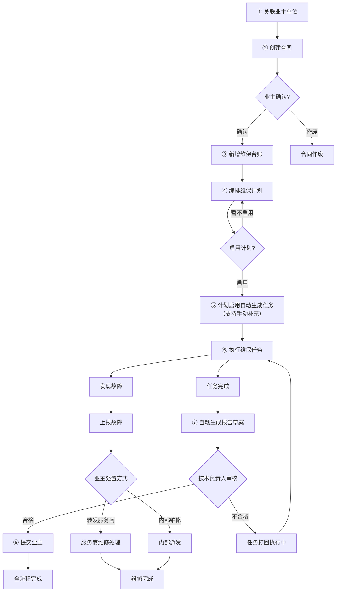
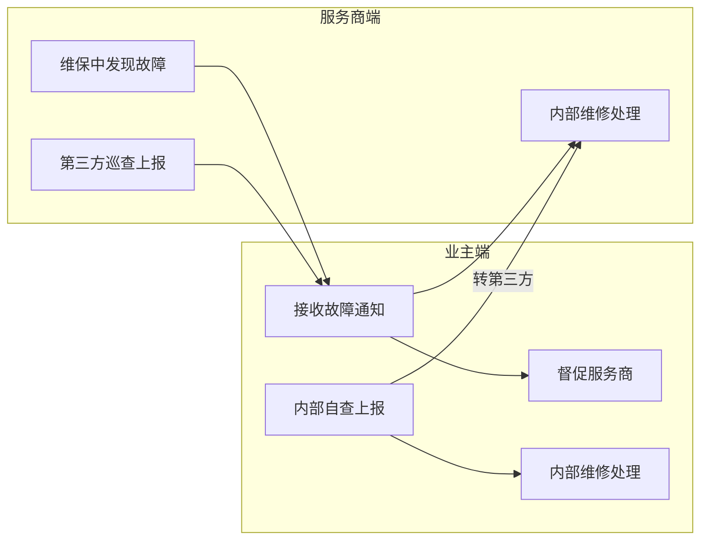

# 维保服务协作平台 — 业务设计文档

> **文档版本**: v1.9  
> **生成日期**: 2026-05-18  
> **最后更新**: 2026-05-20（领导反馈修订：履约计算方式 + 任务执行交互 + 故障闭环确认）  

---

## 1. 产品定位

**消防维保双边协作平台** — 连接第三方消防服务机构（维保公司）与业主单位，实现消防维保业务（巡查、检测、维修）的数字化全流程管理。

平台底层由**流程编排引擎**（M0）驱动，支持工单、督办、审批等流程场景的模板化定义与运行时管控，支撑企业内及跨企业流转。

### 核心价值主张

| 角色 | 价值 |
|------|------|
| 服务商（维保公司） | 维保过程数字化（台账/计划/任务一站管理）、故障闭环处理 |
| 业主单位 | 维保进度透明可监督、故障实时通知、历史资料归档可查 |

---

## 2. 用户旅程地图

### 2.1 服务商端核心旅程

| 阶段 | 用户行为 | 用户目标 | 痛点/机会点 | 系统响应 |
|------|---------|---------|------------|---------|
| **企业关联** | 搜索并关联业主单位 | 建立服务关系基础 | 业主尚未录入系统时需手动新建 | 校验重复关联，建立关联关系 |
| **合同签订** ⭐ | 起草合同 → 提交业主确认 | 确立法律合作关系 | 合同条款需线下沟通后再确认 | 生成合同编号，推送给业主端 |
| **台账准备** | 录入/导入单个设备信息（设备编码、名称、系统类别、位置、建筑、分值） | 建立"维保哪些设备"的基础清单 | 设备数量多（几百上千台），手工录入效率低，需要批量导入 | CSV 批量导入，支持查重校验和设备编码自动生成建议 |
| **计划编排** ⭐ | 选择维保系统 → 分配人员 → 上传确认函 → 启用 | 定义"何时做、谁来做" | 计划须业主确认，但确认流程完全在线下 | 状态机控制（未启用→已启用↔已停用） |
| **任务执行** ⭐ | 签到 → 按区域/系统分组 → 按组勾选检查 → 仅标记异常 | 高效完成维保执行 | 逐台确认正常操作负担大，改为按组操作仅标异常 | 标记异常时手动录入设备编码和位置，异常设备自动联动故障上报 |
| **故障维修** ⭐ | 接收故障 → 待维修 → 维修中 → 已完成 | 闭环处理维保中发现的问题 | 故障双向流转，来源判断复杂 | 与业主端双向同步进度，repairBtnStatus 控制操作按钮 |
| **报告归档** | 任务完成 → 技术负责人审核 → 合格后提交业主 | 完成服务交付闭环 | 审核发现问题时任务打回执行中重新执行 | 审核通过后业主端只读查看/下载 |

### 2.2 业主端核心旅程

| 阶段 | 用户行为 | 用户目标 | 痛点/机会点 | 系统响应 |
|------|---------|---------|------------|---------|
| **合同确认** ⭐ | 查看合同 → 确认签订 / 作废 | 审核服务商发起的合同 | 业主被动接收，无起草能力 | 服务商端状态同步更新 |
| **消防台账** | 登记设备资产/区域/组织 | 管理本单位消防设备 | 数据与服务商维保台账独立，需手动同步 | 服务商可单向拉取设备数据 |
| **进度监督** | 查看维保任务执行状态 | 了解维保进度 | 只读视角，无法干预执行 | 与服务商端实时同步 |
| **故障跟踪** | 接收故障通知 → 督促 / 转派 | 推动故障及时处理 | 故障来源多（维保/巡查/智慧消防） | 支持督促、内部维修、转发服务商 |
| **自查上报** | 内部巡查 → 上报隐患 → 指派服务商 | 发现消防隐患并闭环 | 自查与维保巡检是两个独立体系 | 可自行处理或转发第三方服务公司 |
| **查阅归档** | 查看报告/合同 → 下载 | 获取服务成果文件 | 仅只读查看 | 支持下载 |

---

## 3. 核心业务流程

### 3.1 维保业务全流程

### 3.2 合同状态流转

### 3.3 维保计划状态流转

### 3.4 故障双向流转

---

## 4. 业务设计摘要

### 4.1 产品定位
消防维保双边协作平台 — 连接第三方消防服务机构（维保公司）与业主单位，实现消防维保业务的数字化全流程管理。

### 4.2 核心价值主张
- **服务商**：维保过程数字化（台账/计划/任务一站管理）、故障闭环处理
- **业主**：维保进度透明可监督、故障实时通知、历史资料归档可查

### 4.3 关键业务规则

1. **维保三层架构** — 台账（设备清单）→ 计划（排期 + 选设备）→ 任务（逐台维保），逐层依赖不可跳级。台账以单个设备为最小记录单位，每台设备有唯一编码。分值在台账层按设备设定，任务继承快照不可手动修改

2. **计划启用即生成任务** — 计划创建时展示全部设备（不按周期过滤），通过建筑/系统类别检索选择，启用后系统自动生成维保任务并分发至指定人员；支持手动补充生成，任务支持改派和取消，业主确认函为可选

3. **故障双向流转** — 服务商维保上报的故障和业主自查上报的隐患进入同一故障池，由 `repairBtnStatus`（canInternal / canRelayToEnterprise / canRelayToISP）控制可选操作——内部维修、转发业主、转发服务商

4. **数据权限边界** — 两端共享同一数据库，通过"企业类型 + 所属企业 ID"隔离数据权限。服务商管理多家业主数据，业主仅看本单位数据

5. **台账双轨制** — 服务商端"维保台账"（设备清单）与业主端"消防台账"（设备资产）是两个独立模块，仅支持服务商手动单向拉取，不自动同步

6. **合同"待确认"可编辑** — 合同在"待确认"状态下，服务商可编辑合同内容（业主单位、期限、负责人等），编辑后保留同一编号和状态；业主端同步看到更新后的字段

7. **签到配置跟随计划** — 签到时是否需要记录位置和拍摄照片，在维保计划创建时勾选配置。任务生成时继承计划的签到配置，执行时根据配置展示对应的签到交互。未勾选则对应字段不展示。

8. **台账设备级管理** — 台账以单个设备为最小记录单位，每台设备有唯一编码（格式：{系统缩写}-{建筑}-{序号}）。设备编码不可重复，作为设备唯一标识。检查周期不在台账层定义，由维保标准库（M10）统一管理。支持 CSV 文件批量导入设备。任务执行时维保结果逐台记录，精确到每台设备

9. **双端角色体系** — 服务商端 3 角色：管理员（admin）、业务负责人（biz_manager）、维保人员（maintainer）；业主端 3 角色：管理员（admin）、安全负责人（safety_manager）、巡查人员（inspector）。各模块根据角色控制操作权限和数据可见范围，详见 M1 企业基础管理模块详细设计

10. **任务执行"默认正常+只标记异常"** — 计划生成任务后，设备清单按建筑/系统分组折叠展示，所有设备默认为"正常"状态。维保人员到场后只需对发现问题的设备手动标记异常（选故障类型+填描述），提交时未标记设备自动记录为正常。异常设备在任务执行页底部集中展示，支持撤销标记。（2026-05-20 领导反馈修订）

11. **合同履约按计划执行计算** — 合同履约率不再按时间进度（已过月数/总月数）计算，改为按计划实际执行次数计算。合同覆盖 N 个系统 → 各系统按地标/国标要求有对应检查频次 → 合同期内应执行 X 次计划 → 实际已完成 Y 次计划 → 履约率 = Y / X。合同详情页和业主看板同步展示缺漏月份。（2026-05-20 领导反馈修订）

12. **故障闭环确认** — 故障状态推进至"已完成"时，弹出确认对话框，记录闭环时间（closedAt）和确认人（closedBy）。闭环后的故障计入已解决统计，故障详情弹窗展示闭环信息。任务执行标记的异常设备自动生成故障记录，关联来源任务。（2026-05-20 领导反馈修订）

### 4.4 MVP 成功指标

| 指标 | 说明 |
|------|------|
| 全链路跑通率 | 从企业关联到报告归档，完整走通一个项目闭环 |
| 故障闭环率 | 上报的故障在系统内完成维修并更新状态 |
| 两端数据一致性 | 合同/任务/故障等协作数据在两端实时同步 |

### 4.5 已完成的详细设计模块

| 模块 | 文档路径 |
|------|---------|
| **M0 流程编排（基础模块）** | `docs/design/00-流程编排模块详细设计.md` |
| 顶层设计 | `docs/design/顶层设计.md` |
| 服务企业管理 | `docs/design/服务企业管理模块详细设计.md` |
| 合同管理 | `docs/design/合同管理模块详细设计.md` |
| 维保台账 | `docs/design/维保台账模块详细设计.md` |
| 维保计划 | `docs/design/维保计划模块详细设计.md` |

### 4.6 待补充的详细设计模块

| 模块 | 优先级 |
|------|--------|
| 维保任务模块 | 高 |
| 故障与隐患模块 | 高 |
| 报告管理模块 | 中 |
| 待办工作模块 | 中 |
| 人员管理模块 | 中 |
| 企业注册/登录 | 低 |

> **注**：4.5 与 4.6 为早期快照，当前所有 12 个模块（M0-M11）均已完成设计。详见 [模块拆分方案](module-plan.md)。

---

## 5. 待澄清问题

| 问题 | 说明 |
|------|------|
| 人脸识别对接 | 任务执行中的人脸识别是调用第三方服务还是自建？ |
| 智慧消防报警 | 智慧消防设备自动触发报警，与"故障与隐患"模块是融合还是独立列表展示？ |
| 签到位置校验 | 签到是否依赖 GPS/地理围栏进行位置校验？ |
| 电子签名 | 任务完成和报告确认是否需要电子签名功能？ |
| 分值后续用途 | 分值在后续绩效考核中如何具体使用？当前仅记录不分析 |

---
## 变更记录
| 日期 | 版本 | 变更内容 | 来源 |
|------|------|---------|------|
| 2026-05-18 | v1.1 | 新增业务规则#6：合同"待确认"状态下服务商可编辑合同内容 | 走查报告 P0#5 |
| 2026-05-18 | v1.2 | 新增业务规则#7：签到配置跟随计划，支持位置和拍照配置 | 走查决策 #3 |
| 2026-05-18 | v1.3 | 更新报告管理：任务完成后系统自动生成草案，服务商补充结论后提交 | 走查决策 #4 |
| 2026-05-18 | v1.4 | 新增待办动态聚合规则：待办从各模块业务数据实时计算生成 | 走查决策 #5 |
| 2026-05-18 | v1.5 | 更新规则 #1 和旅程地图台账准备阶段（台账改为设备级），新增规则 #8 设备级管理 | 台账优化决策 |
| 2026-05-18 | v1.6 | 台账移除检查周期字段，周期由维保标准库（M10）定义；更新规则 #8 | 台账字段精简 |
| 2026-05-20 | v1.7 | 更新规则 #2（计划确认函改为可选，状态机简化为三级），同步 3.1/3.3 流程图 | 文档对齐 #1 |
| 2026-05-20 | v1.8 | 合同状态机简化为 3 状态（待确认→执行中→已结束），同步 3.2 流程图；新增规则 #9 角色体系；清理已解决待澄清问题 | 文档对齐 #3 |
| 2026-05-20 | v1.9 | 新增规则 #10（默认正常+只标记异常）、#11（合同履约按执行计算）、#12（故障闭环确认）；更新旅程地图任务执行阶段 | 领导反馈修订 |
