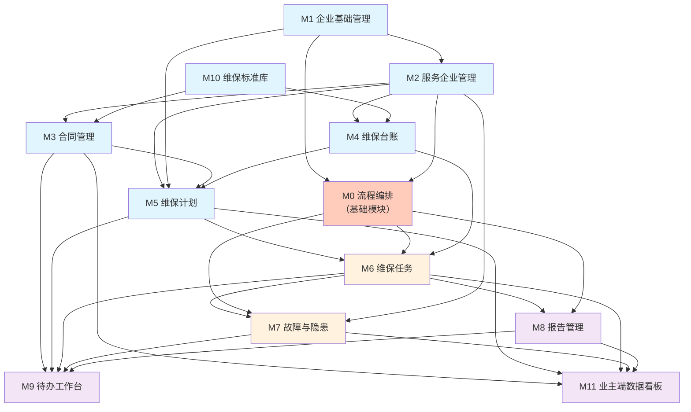

# 消防维保平台 — 模块拆分方案

> **文档版本**: v1.3  
> **生成日期**: 2026-05-18  
> **最后更新**: 2026-06-02（新增 M0 流程编排基础模块）  
> **基于业务设计**: docs/design/biz-design.md

---

## 1. 模块清单

### 模块 0：流程编排（基础模块）
- **职责**：提供可泛化的流程编排框架，为所有业务模块提供统一的流程引擎能力
- **定位**：平台基础设施，非独立业务模块。支撑工单、督办、审批等流程场景
- **核心功能点**：
  - [x] 模板管理（CRUD + 状态流转：待生效/执行中/已停用/已过期）
  - [x] 三步模板配置（基础设置 → 表单设计 → 流程设计）
  - [x] 6 类节点类型（发起/指派/执行/确认/关闭/自定义）
  - [x] 静态指派 + 动态指派双范式
  - [x] SLA 计时（TTR/TTS）+ 三色预警 + 红灯升级
  - [x] 模板版本管理（新旧并存，运行中实例走旧版本快照）
  - [x] 跨企业流转（父子工单接力 + 数据权限隔离）
  - [x] 父子工单机制（父提交→自动生成子工单→结果回传）
- **关键页面**：
  - 流程模板列表页（`/workflow/template`）
  - 流程模板配置页（`/workflow/template/config/:id?`）
  - 工单监控列表页（运行时管控，见 M0-Runtime）
  - 工单详情抽屉
- **依赖模块**：M1（企业基础数据—人员选择）、M2（服务企业—跨企业指派）
- **被依赖模块**：M6（维保任务工单化）、M7（故障工单）、M8（报告审核流程）
- **复杂度评估**：高（流程引擎核心）
- **Demo 优先级**：P0（基础设施）
- **设计文档**：[00-流程编排模块详细设计](00-流程编排模块详细设计.md)、[00a-督办流程交互设计](00a-督办流程交互设计.md)、[00b-节点指派范式](00b-节点指派范式.md)
- **PRD**：[流程编排 PRD](../prd/流程编排.md)

---

### 模块 1：企业基础管理
- **职责**：企业信息管理、人员管理和两端登录入口
- **核心功能点**：
  - [ ] 企业基本信息查看/编辑（名称、地址、联系人）
  - [ ] 人员管理 CRUD（列表、新增、编辑、删除，含岗位和职业资格证书）
  - [ ] 登录/登出（角色权限过滤）
  - [ ] 当前用户信息展示
- **关键页面**：
  - 登录页（两端通用）
  - 人员列表页（含增删改弹窗）
  - 企业信息页
- **依赖模块**：无
- **复杂度评估**：低
- **Demo 优先级**：P0

---

### 模块 2：服务企业管理
- **职责**：管理服务商与业主单位的关联关系（已出详细设计）
- **核心功能点**：
  - [x] 服务商端：关联/解除业主单位
  - [x] 服务商端：企业详情查看 + 内联编辑备注/负责人
  - [x] 业主端：相关方企业列表（只读查看）
  - [ ] 业主端：企业详情查看（只读）
- **关键页面**：
  - 服务商端：服务企业列表 + 关联弹窗
  - 服务商端：企业详情页（含内联编辑）
  - 业主端：相关方企业列表 + 详情
- **依赖模块**：模块 1（企业基础数据）
- **复杂度评估**：低
- **Demo 优先级**：P0

---

### 模块 3：合同管理
- **职责**：合同全生命周期管理和两端同步（已出详细设计）
- **核心功能点**：
  - [x] 服务商端：创建合同（自动编号）
  - [x] 服务商端：合同列表 + 详情
  - [x] 状态流转：待确认→执行中→已结束
  - [x] 业主端：合同列表（只读 + 确认签订）
- **关键页面**：
  - 服务商端：合同列表 + 创建表单
  - 服务商端：合同详情页
  - 业主端：合同列表 + 详情
- **依赖模块**：模块 2（服务企业关联）、模块 10（维保标准库—系统类别下拉来源）
- **复杂度评估**：中
- **Demo 优先级**：P0

---

### 模块 4：维保台账
- **职责**：设备级台账 CRUD，维保三层架构的基石（已出详细设计）
- **核心功能点**：
  - [x] 设备 CRUD（所属企业/设备编码/名称/系统类别/周期/分值）
  - [x] 两种视图（系统划分 / 区域划分）
  - [x] CSV 批量导入
  - [x] 设备详情（台账信息 + 维保记录）
  - [x] 业主端：台账只读查看
- **关键页面**：
  - 服务商端：维保台账列表（含筛选/分页）
  - 服务商端：新增/编辑设备（右侧抽屉）
  - 服务商端：设备详情弹窗
  - 业主端：维保台账查看页
- **依赖模块**：模块 2（企业关联数据）、模块 10（系统/设备类型来源）
- **复杂度评估**：中
- **Demo 优先级**：P0

---

### 模块 5：维保计划
- **职责**：维保计划编排，链接台账与任务的中间层（已出详细设计）
- **核心功能点**：
  - [x] 新增计划（自动命名 + 选择台账项 + 分配人员）
  - [x] 状态流转：未启用→已启用↔已停用（确认函可选）
  - [x] 上传业主确认函（PDF，可选）
  - [x] 分值自动汇总
  - [x] 启用后自动生成任务（支持手动补充）
- **关键页面**：
  - 服务商端：维保计划列表（统计卡片 + 表格）
  - 服务商端：计划详情页（含关联任务列表）
  - 服务商端：新增计划（右侧抽屉，选择合同→选择周期→选择设备→分配人员）
  - 服务商端：上传确认函弹窗（可选）
- **依赖模块**：模块 2（服务企业）、模块 3（合同选择）、模块 4（维保台账—选择台账项）、模块 1（人员—分配人员）
- **复杂度评估**：中
- **Demo 优先级**：P0

---

### 模块 6：维保任务
- **职责**：维保任务的生成、执行和进度同步
- **核心功能点**：
  - [x] 双轨制任务生成：计划启用自动生成 + 手动补充生成（选择已启用计划 + 执行人，含冲突检测）
  - [x] 任务列表（含统计卡片 + 状态筛选 Tab + 完成率）
  - [x] 任务执行（签到 → 逐项检查 → 提交结果）
  - [x] 执行中上报故障（关联 M7 故障记录）
  - [x] 业主端：历史任务列表 + 详情（只读）
  - [x] 待执行任务支持改派执行人、取消任务（→已取消终态）
- **关键页面**：
  - 服务商端：任务列表（含 Tab 筛选 + 生成任务入口）
  - 服务商端：任务执行页（签到面板 + 逐项检查表单 + 故障上报）
  - 业主端：历史任务列表 + 详情
- **依赖模块**：模块 5（维保计划—任务从计划生成）、模块 4（维保台账—任务继承分值）
- **复杂度评估**：高（现场执行交互复杂）
- **Demo 优先级**：P0

---

### 模块 7：故障与隐患
- **职责**：故障双向流转和闭环处理
- **核心功能点**：
  - [ ] 故障列表（区分来源：维保上报/自查上报/智慧消防）
  - [ ] 服务商端：维修处理（待维修→维修中→已完成）
  - [ ] 业主端：故障查看 + 督促 + 维修弹窗（内部/转发服务商）
  - [ ] 故障详情弹窗（含 repairBtnStatus 控制）
  - [ ] 业主端：自查上报隐患 + 指派服务商
- **关键页面**：
  - 服务商端：故障列表 + 详情弹窗
  - 业主端：故障列表 + 详情弹窗（含维修/督促按钮）
  - 业主端：自查上报表单
- **依赖模块**：模块 6（维保任务—执行中上报故障）、模块 2（服务企业—指派服务商）
- **复杂度评估**：高（双向同步 + 按钮权限控制复杂）
- **Demo 优先级**：P1

---

### 模块 8：报告管理
- **职责**：维保报告审核、提交和两端归档
- **核心功能点**：
  - [x] 任务完成后自动生成报告草案（状态：待审核）
  - [x] 技术负责人审核（查看任务执行记录 → 审核合格/不合格）
  - [x] 审核不合格时关联任务打回"执行中"重新执行
  - [x] 审核合格后提交业主（状态：已提交）
  - [x] 业主端：报告列表 + 查阅下载（只读）
  - [x] 标准报告模板（7 章节 + 签章区）+ PDF 导出（html2pdf.js）
- **关键页面**：
  - 服务商端：报告列表 + 审核页面（Drawer，含任务执行记录）
  - 业主端：报告列表 + 详情页
- **依赖模块**：模块 6（维保任务—任务完成后生成报告草案）
- **复杂度评估**：中
- **Demo 优先级**：P1

---

### 模块 10：维保标准库
- **职责**：维保标准知识库管理，定义系统类别/设备类型/维保项目与标准（新增）
- **核心功能点**：
  - [x] 系统类别维护（14+1 类，预置基于 DB 13/T 3035—2023）
  - [x] 设备类型维护（预置各系统下设备类型列表）
  - [x] 维保项目与标准维护（含维保标准、周期、拍照要求）
  - [x] 单页面集成操作（左侧树+右侧表格布局）
  - [x] CSV 批量导入
- **关键页面**：
  - 维保标准库管理页（左侧系统树+右侧维保项目表格）
  - 新增/编辑维保项目弹窗
  - CSV 导入预览弹窗
- **依赖模块**：无
- **复杂度评估**：中（数据量大但结构简单）
- **Demo 优先级**：P0（台账的上游依赖）

---

### 模块 9：待办工作台
- **职责**：两端统一的待办工作入口，汇总各模块未处理事项
- **核心功能点**：
  - [ ] 待办列表（按模块分类：合同待确认、任务待执行、故障待维修等）
  - [ ] 优先级/类别筛选
  - [ ] 点击待办跳转至对应业务模块
- **关键页面**：
  - 服务商端：待办工作列表
  - 业主端：待办工作列表
- **依赖模块**：模块 3（合同待确认）、模块 6（任务待执行）、模块 7（故障待维修）、模块 8（报告待提交）
- **复杂度评估**：中（聚合多模块数据）
- **Demo 优先级**：P1

---

### 模块 11：业主端数据看板
- **职责**：业主端首页数据看板，聚合展示维保业务关键指标（新增）
- **核心功能点**：
  - [x] M1 四张状态卡（合同履约状态 / 本月计划执行 / 本月设备检查 / 故障处理效率）
  - [x] M2 年度维保日历（12 月 grid + 状态图标 + 计划类型标签）
  - [x] M3 设备健康度（正常/异常双态，设备去重取最新结果）
  - [x] M4 故障清单（按状态分组：待维修/维修中/已完成 + 折叠/展开）
  - [x] M5 报告档案（最新报告摘要 + 月度归档条）
  - [x] M6 维保趋势与预警（月份/计划完成/故障闭环 3 列 + 三级预警）
- **关键页面**：
  - 业主端：数据看板首页（6 区域布局）
- **依赖模块**：模块 3（合同数据）、模块 5（计划数据）、模块 6（任务数据）、模块 7（故障数据）、模块 8（报告数据）
- **复杂度评估**：中（纯聚合展示）
- **Demo 优先级**：P1

---

## 2. 模块依赖图



**图例**：蓝色=P0核心，橙色=P1主线，紫色=P1辅助

---

## 3. MVP 建议范围

### 3.1 MVP 包含模块

| 优先级 | 模块 | 状态 | Demo 工作量 | 说明 |
|--------|------|------|-----------|------|
| **P0** | M1 企业基础管理 | ✅ 已设计 | 小 | 登录 + 人员 CRUD，约 3 页 |
| **P0** | M2 服务企业管理 | ✅ 已设计 | 小 | 已出详细设计，约 2 页 |
| **P0** | M3 合同管理 | ✅ 已设计 | 中 | 已出详细设计，约 4 页 |
| **P0** | M4 维保台账 | ✅ 已设计 | 中 | 已出详细设计，约 4 页 |
| **P0** | M5 维保计划 | ✅ 已设计 | 中 | 已出详细设计，约 3 页 |
| **P0** | M6 维保任务 | ✅ 已设计 | 大 | 现场执行交互复杂，约 3 页 |
| **P0** | M10 维保标准库 | ✅ 已设计 | 中 | 单页面集成，约 1 页 |
| **P0** | M0 流程编排（基础） | ✅ 已设计 | 大 | 流程引擎核心，约 3 页 |
| **P1** | M7 故障与隐患 | ✅ 已设计 | 大 | 双向流转逻辑复杂，约 3 页 |
| **P1** | M8 报告管理 | ✅ 已设计 | 小 | 审核流程，约 2 页 |
| **P1** | M9 待办工作台 | ✅ 已设计 | 中 | 聚合多模块，约 2 页 |
| **P1** | M11 业主端数据看板 | ✅ 已设计 | 中 | 6 区域聚合展示，约 1 页 |

### 3.2 建议开发顺序

```
第一批（P0，核心链路）    第二批（P0 收尾）       第三批（P1，完整体验）
────────────────        ────────────────       ────────────────────────
M0 流程编排（基础）         M6 维保任务             M7 故障与隐患
M1 企业基础管理                                    M8 报告管理
M2 服务企业管理                                    M9 待办工作台
M3 合同管理                                         M11 业主端数据看板
M4 维保台账
M5 维保计划
```

**第一批（M0-M5）** 先搭建流程编排基础设施 + 跑通"关联→合同→台账→计划"的前半段链路，验证基础数据流。
**第二批（M6）** 接入维保任务执行后，即可跑通完整闭环。
**第三批（M7-M11）** 补充故障闭环、报告归档、待办入口和数据看板，形成完整体验。

### 3.3 按端视图

| 端 | MVP 涉及模块 | 预估页面数 |
|---|-------------|-----------|
| 服务商端 | M0 + M1(人员+企业) + M2 + M3 + M4 + M5 + M6 + M7 + M8 + M9 | 约 17 页 |
| 业主端 | M1(人员+企业) + M2(只读) + M3(只读+确认) + M4(只读) + M6(只读) + M7 + M8(只读) + M9 + M11(看板首页) | 约 9 页 |

---

## 4. 详细设计文档清单

所有 12 个模块均已完成详细设计：

| 模块 | 设计文档 | 状态 |
|------|---------|------|
| **M0 流程编排** | **`docs/design/00-流程编排模块详细设计.md`** | **✅** |
| M1 企业基础管理 | `docs/design/01-企业基础管理模块详细设计.md` | ✅ |
| M2 服务企业管理 | `docs/design/服务企业管理模块详细设计.md` | ✅ |
| M3 合同管理 | `docs/design/合同管理模块详细设计.md` | ✅ |
| M4 维保台账 | `docs/design/维保台账模块详细设计.md` | ✅ |
| M5 维保计划 | `docs/design/维保计划模块详细设计.md` | ✅ |
| M6 维保任务 | `docs/design/维保任务模块详细设计.md` | ✅ |
| M7 故障与隐患 | `docs/design/故障与隐患模块详细设计.md` | ✅ |
| M8 报告管理 | `docs/design/报告管理模块详细设计.md` | ✅ |
| M9 待办工作台 | `docs/design/09-待办工作台模块详细设计.md` | ✅ |
| **M10 维保标准库** | **`docs/design/10-维保标准库模块详细设计.md`** | **✅** |
| M11 业主端数据看板 | `docs/design/11-业主端数据看板模块设计.md` | ✅ |

下一步建议：使用 `/demo-scaffold` 为优先模块搭建 Demo 骨架，或使用 `/gen-prd` 生成 PRD 文档。

---

## 5. 页面路由总览

### 服务商端（约 17 页）

| 模块 | 页面 | 路由建议 |
|------|------|---------|
| M0 | 流程模板列表 | `/workflow/template` |
| M0 | 流程模板配置 | `/workflow/template/config/:id?` |
| M0 | 工单监控列表 | `/workflow/monitor` |
| M1 | 登录页 | `/login` |
| M1 | 人员列表 | `/company/staff` |
| M1 | 企业信息 | `/company/profile` |
| M2 | 服务企业列表 | `/business/enterprises` |
| M2 | 企业详情（内联编辑） | `/business/enterprises/:id` |
| M3 | 合同列表 | `/business/contracts` |
| M3 | 合同详情 | `/business/contracts/:id` |
| M4 | 维保台账列表 | `/maintenance/ledger` |
| M5 | 维保计划列表 | `/maintenance/plans` |
| M5 | 计划详情 | `/maintenance/plans/:id` |
| M6 | 任务列表 | `/maintenance/tasks` |
| M6 | 任务执行页 | `/maintenance/tasks/:id/execute` |
| M7 | 故障列表 | `/faults/maintenance` |
| M8 | 报告列表 | `/reports` |
| M9 | 待办工作台 | `/dashboard/todo` |

### 业主端（约 8 页）

| 模块 | 页面 | 路由建议 |
|------|------|---------|
| M1 | 登录页 | `/login` |
| M1 | 人员列表 | `/company/staff` |
| M1 | 企业信息 | `/company/profile` |
| M2 | 相关方企业列表 | `/related-enterprises` |
| M2 | 企业详情 | `/related-enterprises/:id` |
| M3 | 合同列表 | `/third-party/contracts` |
| M3 | 合同详情 | `/third-party/contracts/:id` |
| M4 | 维保台账查看 | `/maintenance/ledger` |
| M6 | 历史任务列表 | `/third-party/tasks` |
| M7 | 故障列表 | `/faults/maintenance` |
| M8 | 报告列表 | `/third-party/reports` |
| M9 | 待办工作台 | `/dashboard/todo` |
| M11 | 数据看板首页 | `/dashboard` |

---

*文档版本: v1.3 | 生成日期: 2026-05-18 | 最后更新: 2026-06-02 | 基于业务设计: docs/design/biz-design.md*
