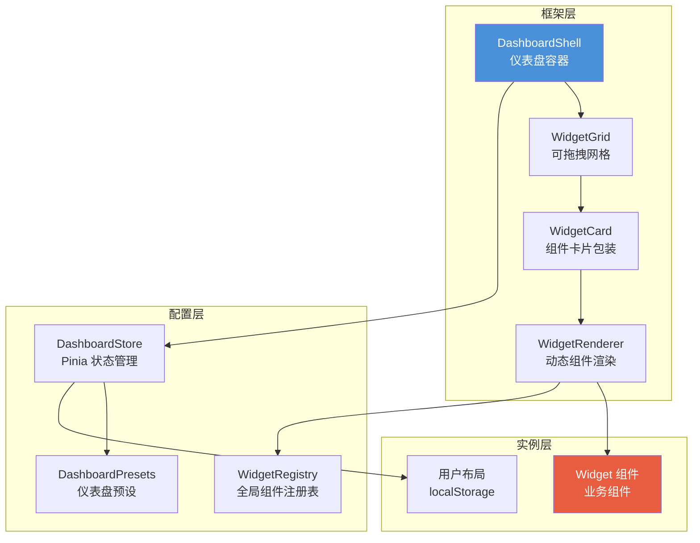

# 仪表盘框架 — 详细设计

> 可编辑、可排序的通用仪表盘框架。工作台和各业务域数据看板均基于此框架构建。
> 最后更新：2026-06-03。

---

## 1. 产品定位

**一个可复用的仪表盘框架**，支撑平台内所有仪表盘页面（工作台、工单数据看板、维保数据看板等）。提供组件插槽式布局、拖拽排序、角色预设、个性化持久化能力。

```
                    ┌─→ 工作台（跨域聚合）
Dashboard Framework ──→ 系统管理·数据看板（工单 M5）
                    ├─→ 维保应用·数据看板（维保 M11）
                    └─→ … 后续每个域的数据看板

同一个框架，不同的组件池 + 布局配置。
```

---

## 2. 核心概念模型



| 概念 | 说明 | 举例 |
|------|------|------|
| **DashboardShell** | 仪表盘页面容器，管理查看/编辑模式切换 | `Workbench.vue` 内部使用 |
| **WidgetGrid** | CSS Grid 布局容器，支持拖拽排序 | 基于 vuedraggable |
| **WidgetCard** | 单个组件的包装器，提供标题栏、拖拽手柄、删除按钮 | 编辑模式下显示 ≡ 和 × |
| **WidgetRenderer** | 根据 Widget type 从注册表动态加载对应组件 | `defineAsyncComponent` |
| **WidgetRegistry** | 全局 Widget 组件注册表，key → 组件映射 | `'order-overview' → OrderOverviewWidget.vue` |
| **DashboardPresets** | 每个仪表盘 + 角色的默认布局定义 | 物业管理员的工作台默认有 6 个组件 |
| **DashboardStore** | Pinia Store，管理布局的 CRUD 和 localStorage 同步 | — |

---

## 3. 框架能力

| 能力 | 说明 | 实现方式 |
|------|------|---------|
| **组件插槽** | 仪表盘 = 组件网格，每个格子是一个 Widget | CSS Grid + WidgetRenderer |
| **拖拽排序** | 编辑模式下拖拽调整组件位置 | vuedraggable@next（SortableJS） |
| **添加/移除** | 从组件池选取添加，点击 × 删除 | DashboardToolbar + 组件池面板 |
| **尺寸调整** | Widget 支持 1/2/3 列宽度 | CSS Grid `grid-column: span N` |
| **角色预设** | 不同角色默认看到不同的组件布局 | dashboard-presets.ts 中按 role 定义 |
| **个性化持久** | 用户调整后存 localStorage，跨会话保留 | key = `dashboard:${id}:${role}` |
| **一键重置** | 恢复为角色默认布局 | 从 presets 重新加载 |

---

## 4. 组件架构

### 4.1 组件树

```
src/
├── components/dashboard/           ← 框架层（通用，不依赖业务）
│   ├── DashboardShell.vue          ← 仪表盘容器
│   ├── DashboardToolbar.vue        ← 编辑工具栏
│   ├── WidgetGrid.vue              ← 可拖拽 Grid
│   ├── WidgetCard.vue              ← 卡片包装器
│   └── WidgetRenderer.vue          ← 动态组件加载器
│
├── config/
│   ├── widget-registry.ts          ← Widget 全局注册表
│   └── dashboard-presets.ts        ← 各仪表盘默认布局
│
├── stores/
│   └── dashboard.ts                ← Pinia Store
│
├── views/
│   ├── workbench/Workbench.vue     ← 工作台（使用 DashboardShell）
│   └── system/Dashboard.vue        ← 工单数据看板（使用 DashboardShell）
│
└── views/*/widgets/                ← Widget 按业务模块存放
    ├── work-order/widgets/         ← 工单相关 Widget
    │   ├── OrderOverviewWidget.vue
    │   ├── SlaOverviewWidget.vue
    │   └── CreateOrderAction.vue
    └── maintenance/widgets/        ← 维保相关 Widget（后续）
        └── PlanStatusWidget.vue
```

### 4.2 组件职责

#### DashboardShell.vue

仪表盘页面容器，提供：

- **查看模式**：展示 Widget 网格 + 页面标题 + "编辑布局"按钮
- **编辑模式**：展示拖拽手柄 + 删除按钮 + 组件池 + "保存"/"恢复默认"按钮
- **角色上下文**：接收 `dashboardId` prop，根据当前角色加载对应布局

```typescript
// Props
interface DashboardShellProps {
  dashboardId: string   // 对应 dashboard-presets.ts 中的 key
  title?: string        // 页面标题，默认从 preset.label 取
}
```

#### DashboardToolbar.vue

编辑模式下的工具栏：

- **左侧**：页面标题
- **右侧**：
  - `[+ 添加组件]` 下拉菜单或弹出面板
  - `[保存布局]` 主按钮
  - `[恢复默认]` 次要按钮

组件池面板：网格展示当前仪表盘 `availableWidgets` 中尚未添加的组件，点击即添加。

#### WidgetGrid.vue

可拖拽的 CSS Grid 容器：

- 包裹 `<vue-draggable>` 组件
- 响应式列数：≥1440px 为 3 列，1024-1439px 为 2 列，＜1024px 为 1 列
- 每个 item 通过 `grid-column: span N` 控制宽度
- `dragClass`：拖拽中的视觉反馈（阴影 + 缩放）

```typescript
// Props
interface WidgetGridProps {
  widgets: WidgetSlot[]    // 当前组件列表
  editable: boolean        // 是否可拖拽
}

// Emits
interface WidgetGridEmits {
  'update:order': (widgets: WidgetSlot[]) => void   // 排序变更
  'remove': (widgetId: string) => void              // 删除组件
}
```

#### WidgetCard.vue

单个组件的卡片包装器：

- **查看模式**：标题栏 + 内容区，无操作按钮
- **编辑模式**：标题栏 + 拖拽手柄（≡）+ 删除按钮（×）+ 内容区变灰半透明
- 标题从 Widget 组件通过 slot 传入，或从 `preset` 中的 `config.title` 读取

```typescript
// Props
interface WidgetCardProps {
  widget: WidgetSlot       // 组件槽位信息
  editable: boolean        // 编辑模式
}

// Slots
// default: Widget 内容
// title: Widget 标题（可选，覆盖默认）
```

#### WidgetRenderer.vue

动态组件加载器：

- 根据 `widget.type` 从 `widgetRegistry` 查找对应组件
- 使用 `<Suspense>` 包裹异步组件，提供 loading 状态
- 加载失败时显示错误卡片（可重试）

```typescript
// Props
interface WidgetRendererProps {
  type: WidgetType         // Widget 类型 key
  widgetId: string         // 实例 ID
  config?: Record<string, any>  // Widget 配置
}
```

---

## 5. Widget 组件规范

### 5.1 接口约定

每个 Widget 是一个普通 Vue 3 SFC，必须满足：

```typescript
// Widget Props（框架传入）
interface WidgetProps {
  widgetId: string              // 实例 ID，用于数据获取 key
  config?: Record<string, any>  // 用户自定义配置
}

// Widget 自身职责：
// ✅ 数据获取 — 调用所属模块 API
// ✅ 三态处理 — loading / empty / error
// ✅ 链接跳转 — 使用 router.push
// ❌ 不依赖仪表盘框架传入业务数据
// ❌ 不直接操作 DashboardStore
```

### 5.2 状态规范

每个 Widget **必须**处理以下三种状态：

| 状态 | 触发条件 | UI 表现 |
|------|---------|---------|
| **loading** | 数据获取中 | 骨架屏（`el-skeleton`） |
| **empty** | 数据返回为空 | 插图 + "暂无数据" + 操作引导 |
| **error** | API 异常 | 错误图标 + 错误信息 + "重试"按钮 |

### 5.3 尺寸规范

| 尺寸 | CSS 列跨度 | 适用场景 |
|------|-----------|---------|
| `small (1)` | `grid-column: span 1` | 快捷操作、简单统计数 |
| `medium (1)` | `grid-column: span 1` | 概览卡片、列表卡片 |
| `large (2)` | `grid-column: span 2` | 图表、复杂表格 |
| `full (3)` | `grid-column: span 3` | 全宽数据表格 |

### 5.4 Widget 注册

```typescript
// src/config/widget-registry.ts
import { defineAsyncComponent } from 'vue'

export const widgetRegistry = {
  // ===== 工单类（阶段 1 可实现）=====
  'order-overview':  defineAsyncComponent(() => import('@/views/work-order/widgets/OrderOverviewWidget.vue')),
  'sla-overview':    defineAsyncComponent(() => import('@/views/work-order/widgets/SlaOverviewWidget.vue')),
  'create-order':    defineAsyncComponent(() => import('@/views/work-order/widgets/CreateOrderAction.vue')),
  
  // ===== 维保类（阶段 2 接入）=====
  'plan-status':     defineAsyncComponent(() => import('@/views/maintenance/widgets/PlanStatusWidget.vue')),
  
  // ===== 通用 =====
  'placeholder':     defineAsyncComponent(() => import('@/components/business/PlaceholderWidget.vue')),
} as const

export type WidgetType = keyof typeof widgetRegistry
```

---

## 6. 仪表盘配置

### 6.1 数据结构

```typescript
// src/config/dashboard-presets.ts

/** 单个组件槽位 */
interface WidgetSlot {
  id: string              // 实例唯一 ID，如 "wb-1"
  type: WidgetType        // 对应 widgetRegistry 的 key
  size: 1 | 2 | 3         // 列跨度
  order: number           // 排序序号
  config?: Record<string, any>  // Widget 实例配置
}

/** 仪表盘预设 */
interface DashboardPreset {
  id: string                              // 唯一标识
  label: string                           // 显示名称
  description?: string                    // 描述
  maxColumns: 3 | 4                       // 最大列数
  roleDefaults: Record<string, WidgetSlot[]>   // 角色 → 默认布局
  availableWidgets: WidgetType[]           // 编辑模式下可添加的组件池
}
```

### 6.2 工作台预设

```typescript
workbench: {
  id: 'workbench',
  label: '工作台',
  description: '跨业务域聚合工作入口',
  maxColumns: 3,
  availableWidgets: [
    'order-overview', 'sla-overview', 'create-order',
    'plan-status', 'placeholder',
  ],
  roleDefaults: {
    // 物业管理员
    property: [
      { id: 'wb-1', type: 'create-order',   size: 1, order: 0 },
      { id: 'wb-2', type: 'order-overview',  size: 1, order: 1 },
      { id: 'wb-3', type: 'plan-status',     size: 1, order: 2 },
      { id: 'wb-4', type: 'placeholder',     size: 1, order: 3, config: { moduleName: '隐患管理', icon: 'warning' } },
      { id: 'wb-5', type: 'placeholder',     size: 1, order: 4, config: { moduleName: '设备管理', icon: 'cpu' } },
      { id: 'wb-6', type: 'placeholder',     size: 1, order: 5, config: { moduleName: '巡查检查', icon: 'search' } },
    ],
    // 安全监管员
    supervisor: [
      { id: 'wb-s1', type: 'sla-overview',   size: 2, order: 0 },
      { id: 'wb-s2', type: 'order-overview',  size: 1, order: 1 },
      { id: 'wb-s3', type: 'placeholder',     size: 1, order: 2, config: { moduleName: '隐患管理' } },
      { id: 'wb-s4', type: 'placeholder',     size: 1, order: 3, config: { moduleName: '远程值守' } },
    ],
    // 消防服务工程师
    engineer: [
      { id: 'wb-e1', type: 'order-overview',  size: 1, order: 0 },
      { id: 'wb-e2', type: 'plan-status',     size: 1, order: 1 },
    ],
  },
}
```

### 6.3 系统管理·工单数据看板预设

```typescript
'system-dashboard': {
  id: 'system-dashboard',
  label: '工单数据看板',
  description: '工单 SLA 达标率、趋势、效率排行',
  maxColumns: 3,
  availableWidgets: ['order-overview', 'sla-overview', 'order-trend'],
  roleDefaults: {
    supervisor: [
      { id: 'sd-1', type: 'sla-overview',   size: 2, order: 0 },
      { id: 'sd-2', type: 'order-overview',  size: 1, order: 1 },
    ],
    property: [
      { id: 'sd-1', type: 'order-overview',  size: 2, order: 0 },
    ],
  },
}
```

---

## 7. Dashboard Store（Pinia）

### 7.1 状态结构

```typescript
// src/stores/dashboard.ts

interface DashboardState {
  /** 每个仪表盘的组件列表：dashboardId → WidgetSlot[] */
  layouts: Record<string, WidgetSlot[]>
  
  /** 当前是否处于编辑模式 */
  isEditing: boolean
  
  /** 当前活跃的仪表盘 ID */
  currentDashboardId: string
  
  /** 当前用户角色 */
  currentRole: string
}

// localStorage key 格式
// dashboard:${dashboardId}:${role}:${userId}
```

### 7.2 核心方法

| 方法 | 说明 |
|------|------|
| `initDashboard(id, role)` | 初始化仪表盘。优先从 localStorage 加载用户布局，无则从 presets 加载角色默认 |
| `addWidget(type, afterId?)` | 从组件池添加 Widget，默认追加到末尾 |
| `removeWidget(widgetId)` | 移除 Widget |
| `reorderWidgets(newOrder)` | 更新排序（拖拽完成后调用） |
| `saveLayout()` | 保存当前布局到 localStorage |
| `resetLayout()` | 重置为角色默认布局 |
| `toggleEdit()` | 切换编辑/查看模式 |

### 7.3 数据流

```
DashboardShell.vue (onMounted)
    │
    ├→ dashboardStore.initDashboard('workbench', currentRole)
    │       │
    │       ├→ localStorage.getItem('dashboard:workbench:property:1')
    │       │   ├→ 有 → 使用用户布局
    │       │   └→ 无 → dashboardPresets.workbench.roleDefaults.property
    │       │
    │       └→ layouts['workbench'] = [...]
    │
    ├→ WidgetGrid 渲染 layouts['workbench']
    │
    ├→ 用户进入编辑模式 → toggleEdit()
    │   ├→ 拖拽排序 → reorderWidgets()
    │   ├→ 添加组件 → addWidget()
    │   ├→ 删除组件 → removeWidget()
    │   └→ 保存     → saveLayout() → localStorage.setItem()
    │
    └→ 用户点击恢复默认 → resetLayout() → 清除 localStorage → 重载 presets
```

---

## 8. 交互设计

### 8.1 查看模式

- 顶部显示页面标题 + `[编辑布局]` 按钮
- Widget 正常渲染数据内容
- 无拖拽手柄、无删除按钮
- 点击 Widget 内的链接跳转至对应业务页面

### 8.2 编辑模式

- 顶部显示页面标题 + `[保存布局]` `[恢复默认]` 按钮 + `[+ 添加组件]` 下拉
- 每个 Widget 卡片顶部显示拖拽手柄（≡）和删除按钮（×）
- 内容区覆盖半透明遮罩，提示"编辑中"
- 底部或侧边显示"可用组件池"面板
- 拖拽时 Widget 出现阴影 + 轻微缩放

### 8.3 添加组件流程

```
用户点击 [+ 添加组件]
    → 弹出组件选择面板（网格展示可用组件）
    → 每个组件显示：图标 + 名称 + 描述
    → 已添加的组件置灰（不可重复添加，标记"已添加"）
    → 点击未添加的组件 → 追加到网格末尾 → 面板关闭
```

### 8.4 拖拽排序

- 鼠标按下拖拽手柄（≡）开始拖拽
- 拖拽中的 Widget 半透明 + 蓝色边框
- 目标位置的 Widget 自动腾出空间（SortableJS 动画）
- 松手完成排序，自动更新 `order` 字段
- 点击"保存布局"持久化

---

## 9. CSS Grid 响应式布局

```css
.widget-grid {
  display: grid;
  gap: 16px;
  grid-template-columns: repeat(3, 1fr);
  grid-auto-rows: auto;
}

/* Widget 尺寸 */
.widget-card.size-1 { grid-column: span 1; }
.widget-card.size-2 { grid-column: span 2; }
.widget-card.size-3 { grid-column: span 3; }

/* 响应式 */
@media (max-width: 1439px) {
  .widget-grid { grid-template-columns: repeat(2, 1fr); }
}
@media (max-width: 1023px) {
  .widget-grid { grid-template-columns: repeat(1, 1fr); }
}
```

---

## 10. 扩展指南

### 10.1 新增一个 Widget

1. 在 `src/views/{模块}/widgets/` 下创建 `.vue` 文件
2. 实现 `WidgetProps` 接口（widgetId + config）
3. 处理 loading / empty / error 三态
4. 在 `widget-registry.ts` 中注册
5. 在 `dashboard-presets.ts` 的目标仪表盘的 `availableWidgets` 中添加
6. 在目标仪表盘的角色默认布局中添加槽位

### 10.2 新增一个仪表盘

1. 在 `dashboard-presets.ts` 中新增配置对象
2. 创建页面 Vue 文件，引用 `DashboardShell`，传入 `dashboardId`
3. 在路由中注册
4. 在导航菜单中添加入口

---

## 11. 技术依赖

| 依赖 | 版本 | 用途 |
|------|------|------|
| `vuedraggable` | `@next`（Vue 3） | 拖拽排序 |
| `sortablejs` | `^1.x` | vuedraggable 底层 |
| Pinia | 已有（^3.0.4） | 状态管理 |
| Element Plus | 已有（^2.14.0） | Skeleton、Dialog、Button |
| Vue 3 + TS | 已有 | Composition API |

---

## 12. 与现有设计文档的关联

| 关联文档 | 关系 |
|---------|------|
| [工作台 biz-design](../工作台/biz-design.md) | 工作台是框架的第一个实例 |
| [工作台 module-plan](../工作台/module-plan.md) | 工作台模块拆分 |
| [05-维保计划模块详细设计](../维保管理/05-维保计划模块详细设计.md) | PlanStatusWidget 数据来源 |
| [07-故障与隐患模块详细设计](../维保管理/07-故障与隐患模块详细设计.md) | PlaceholderWidget 后续替换 |
| [M9 待办工作台](../../../docs/design/09-待办工作台模块详细设计.md) | 待办聚合理念的来源之一 |
| [M11 业主端数据看板](../../../docs/design/11-业主端数据看板模块设计.md) | 数据看板理念的来源之一 |
