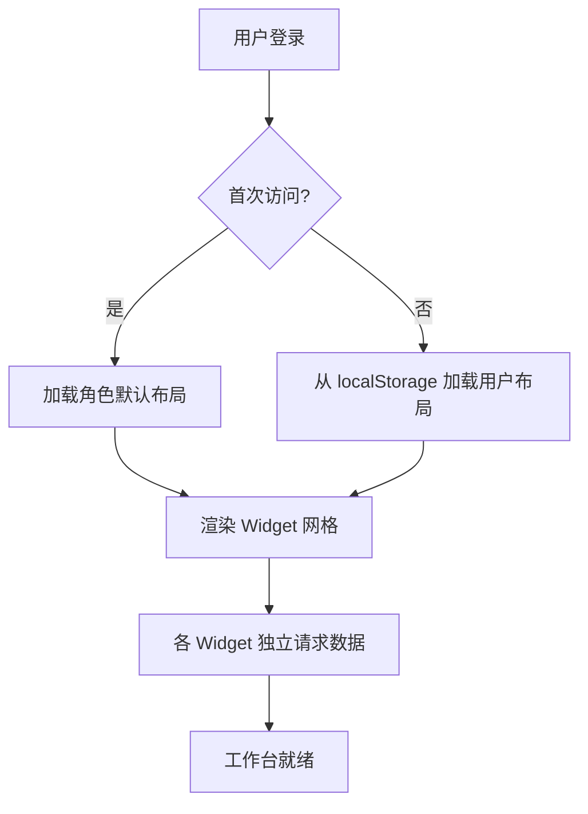
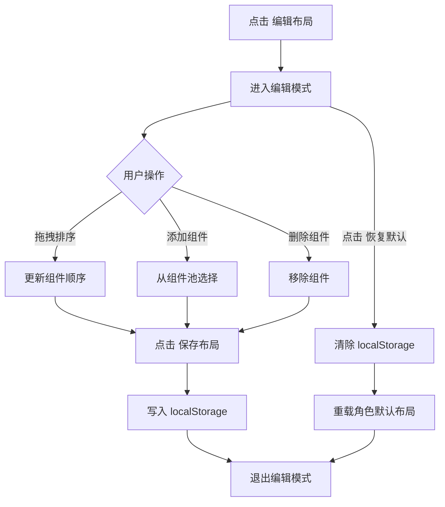
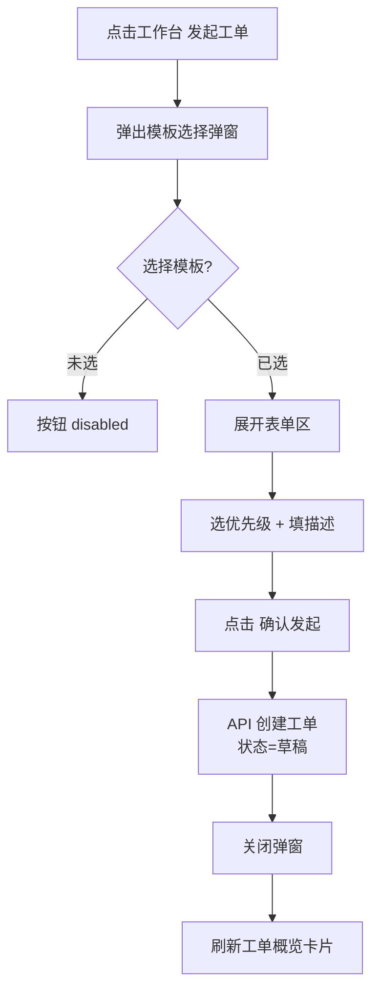
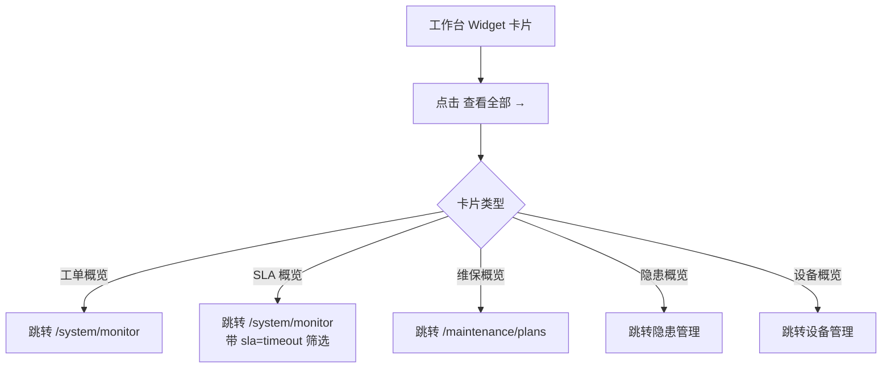

# 工作台模块 — 业务设计

> AI 安全管理平台顶层入口。最后更新：2026-06-03。
> 工作台是用户进入平台后的第一个页面，跨业务域聚合关键信息与快捷操作。

---

## 一、模块定位

工作台是平台的**总入口**，解决两个核心问题：

1. **"我应该关注什么？"** — 跨业务域（工单、维保、隐患、设备…）聚合与我相关的关键指标
2. **"我应该做什么？"** — 提供快捷操作入口（发起工单、上报隐患等），无需进入具体模块即可完成高频动作

工作台**不是**：
- 不是各模块的替代品（用户仍可进入具体模块进行深度操作）
- 不是监管大屏（不做实时刷新、动画效果、全屏展示）
- 不是数据仓库（工作台只读摘要，不存储业务数据）

---

## 二、用户旅程地图

### 角色 A — 物业管理员（Web 管理端）

| 阶段 | 用户行为 | 用户目标 | 痛点/机会点 | 系统响应 |
|------|---------|---------|------------|---------|
| 进入平台 | 打开浏览器，登录系统 | 第一时间看到与我相关的工作概览 | **当前没有工作台，直接跳到维保计划页** | 工作台首页，展示工单+维保+隐患+设备卡片 |
| 快速操作 | 点击"发起工单"快捷按钮 | 快速创建工单，不进入工单监控页 | 不需要监控权限即可发起 | 弹窗，选模板→填表单→提交 |
| 查看工单 | 浏览"工单概览"卡片 | 看到本企业工单的最新状态 | 不希望看到其他企业的工单 | 按 orgId 过滤，显示最近 5 条 + 状态分布 |
| 查看维保 | 浏览"维保概览"卡片 | 了解本月维保计划执行情况 | 进入维保应用层级太深 | 本月计划完成率 + 即将到期提醒 |
| 深入操作 | 点击卡片中"查看全部" | 跳入具体模块进行深度操作 | — | 路由跳转到对应业务域 |

### 角色 B — 安全监管员（Web 管理端）

| 阶段 | 用户行为 | 用户目标 | 痛点/机会点 | 系统响应 |
|------|---------|---------|------------|---------|
| 进入平台 | 登录系统 | 全局掌握消防安全态势 | **当前直接跳到维保计划页，非监管视角** | 工作台首页，展示 SLA + 隐患 + 值守卡片 |
| 查看 SLA | 浏览"SLA 概览"卡片 | 快速发现超时/预警工单 | 需要一眼看到哪些工单有风险 | 超时/预警/正常三色统计 + 超时工单列表 |
| 查看隐患 | 浏览"隐患概览"卡片 | 了解隐患整改率 | 需要知道哪些隐患超期未改 | 整改率 + 超时未整改数 |
| 深入处理 | 点击超时工单 → 进入工单监控 | 具体督办超时工单 | — | 路由跳转到工单监控，带 SLA=超时 筛选 |

### 角色 C — 消防服务工程师（Web 端，次要）

| 阶段 | 用户行为 | 用户目标 | 痛点/机会点 | 系统响应 |
|------|---------|---------|------------|---------|
| 进入平台 | Web 端登录（主力在小程序） | 快速查看待办 | Web 端体验不完整 | 工作台展示待接单+处置中工单 |
| 查看待办 | 浏览"我的待办"卡片 | 了解今天要处理多少工单 | 主要操作在小程序 | 显示数量统计 + 点击跳转工单监控 |

---

## 三、功能全景

### 3.1 框架能力（所有角色共有）

| 功能 | 说明 | 状态 |
|------|------|------|
| 可编辑布局 | 用户可拖拽调整组件顺序 | 阶段 1 实现 |
| 添加/移除组件 | 从组件池选择要显示的卡片 | 阶段 1 实现 |
| 布局持久化 | 用户调整后存 localStorage | 阶段 1 实现 |
| 角色预设 | 不同角色默认看到不同的组件组合 | 阶段 1 实现 |
| 一键重置 | 恢复为角色默认布局 | 阶段 1 实现 |

### 3.2 物业管理员功能

| 功能 | 说明 | 阶段 |
|------|------|------|
| 快捷发起工单 | 点击弹出模板选择弹窗，创建草稿工单 | 阶段 1 |
| 工单概览卡片 | 本企业工单状态分布 + 最近 5 条 | 阶段 1 |
| 维保概览卡片 | 本月维保计划执行率 + 即将到期提醒 | 阶段 2 |
| 隐患概览卡片 | 待整改隐患数量 + 整改中数量 | 阶段 2 |
| 设备概览卡片 | 异常设备数量 + 过期未检设备 | 阶段 3 |
| 巡查概览卡片 | 今日巡查任务进度 | 阶段 3 |

### 3.3 安全监管员功能

| 功能 | 说明 | 阶段 |
|------|------|------|
| SLA 概览卡片 | 超时/预警/正常工单统计 + 超时列表 | 阶段 1 |
| 工单概览卡片 | 全量工单状态分布 | 阶段 1 |
| 隐患概览卡片 | 全量隐患整改率 + 超时未改列表 | 阶段 2 |
| 值守概览卡片 | 今日报警统计 + 未处理报警 | 阶段 3 |

### 3.4 消防服务工程师功能（Web 端）

| 功能 | 说明 | 阶段 |
|------|------|------|
| 我的工单 | 待接单 + 处置中工单统计 | 阶段 1 |
| 今日维保任务 | 当天需要执行的维保任务 | 阶段 2 |

---

## 四、核心业务流程

### 4.1 工作台加载流程

### 4.2 布局编辑流程

### 4.3 快捷发起工单流程（物业管理员）

### 4.4 点击"查看全部"跳转流程

---

## 五、关键业务规则

1. **数据按角色隔离**：物业管理员只看本企业数据，监管员看全量数据，工程师只看分配给自己的
2. **布局按角色预设**：每个角色有独立的默认布局，用户调整不跨角色共享
3. **组件不重复添加**：单实例 Widget（如"发起工单"）在组件池中只可添加一次
4. **占位不影响使用**：未实现的模块 Widget 显示占位卡片（模块名 + "即将上线"），不影响已实现 Widget 的正常数据加载
5. **异常隔离**：一个 Widget 加载失败不影响其他 Widget，各自独立处理 error 状态
6. **编辑模式不影响数据**：编辑布局时 Widget 内部不加载数据，退出编辑后统一刷新

---

## 六、成功指标

- 物业管理员从登录到发起工单的操作步骤 ≤ 2 次点击（含登录后首次页面加载）
- 监管员从登录到发现超时工单的时间 ≤ 5 秒（数据已缓存）
- 用户布局调整后留存率 ≥ 90%（不是每次登录都重置）
- 单 Widget 加载失败不影响页面其余部分（异常隔离率 100%）

---

## 七、技术约束

- **依赖仪表盘框架**：工作台是 [仪表盘框架](../仪表盘框架/框架设计.md) 的第一个实例
- **Widget 异步加载**：所有 Widget 通过 `defineAsyncComponent` 按需加载，首屏不加载未激活的 Widget
- **localStorage 容量**：单个仪表盘布局数据 < 5KB
- **不依赖后端**：布局配置完全前端管理，不增加后端接口负担
