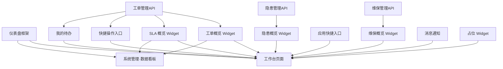

# 工作台 — 模块拆分方案

> 基于业务设计：[biz-design.md](biz-design.md)
> 基于框架设计：[仪表盘框架/框架设计.md](../仪表盘框架/框架设计.md)
> 生成日期：2026-06-03

---

## 1. 核心实体

| 实体 | 核心属性 | 说明 |
|------|---------|------|
| **仪表盘** | `id, label, maxColumns, roleDefaults` | 一个仪表盘实例（工作台本身是一个仪表盘） |
| **组件槽位** | `id, type, size, order, config` | 仪表盘上的一个 Widget 位 |
| **Widget 组件** | `type, asyncLoader` | 可被渲染到槽位中的业务组件 |
| **用户布局** | `dashboardId, role, userId, widgets[]` | 用户个性化后的布局快照（localStorage） |
| **角色预设** | `dashboardId, role, widgets[]` | 角色的默认布局配置（代码中定义） |

---

## 2. 模块清单

### M0 仪表盘框架（新增 · P0 · 基础设施）

- **职责**：提供可复用的仪表盘容器，支持组件插槽、拖拽排序、角色预设、个性化持久化
- **定位**：平台基础设施，非独立业务模块。工作台、各域数据看板均基于此框架
- **核心功能点**：
  - [x] DashboardShell 容器（查看/编辑模式切换）
  - [x] WidgetGrid 可拖拽网格（3/2/1 列响应式）
  - [x] WidgetCard 卡片包装器（标题栏 + 拖拽手柄 + 删除按钮）
  - [x] WidgetRenderer 动态组件加载器
  - [x] WidgetRegistry 全局组件注册表
  - [x] DashboardPresets 仪表盘预设配置
  - [x] DashboardStore Pinia 状态管理 + localStorage 持久化
  - [ ] 尺寸调整（后续版本）
- **关键组件**：
  - `components/dashboard/DashboardShell.vue`
  - `components/dashboard/DashboardToolbar.vue`
  - `components/dashboard/WidgetGrid.vue`
  - `components/dashboard/WidgetCard.vue`
  - `components/dashboard/WidgetRenderer.vue`
- **配置文件**：
  - `config/widget-registry.ts`
  - `config/dashboard-presets.ts`
- **Store**：`stores/dashboard.ts`
- **依赖模块**：无（纯前端框架）
- **被依赖模块**：M1（工作台页面）、后续所有数据看板
- **复杂度评估**：高（核心基础设施）
- **Demo 优先级**：P0（首要实现）

### M1 工作台页面（新增 · P0）

- **职责**：用户登录后的默认落地页，跨业务域聚合关键信息与快捷操作
- **核心功能点**：
  - [ ] 使用 M0 DashboardShell，配置 `dashboardId='workbench'`
  - [ ] 物业管理员默认布局（6 组件：发起工单 + 工单概览 + 维保概览 + 3 占位）
  - [ ] 安全监管员默认布局（4 组件：SLA 概览 + 工单概览 + 2 占位）
  - [ ] 消防服务工程师默认布局（2 组件：我的工单 + 维保任务）
  - [ ] 顶部导航"工作台"为第一个菜单项
- **关键页面**：`views/workbench/Workbench.vue`
- **依赖模块**：M0（仪表盘框架）、M2（工单概览 Widget）、M3（SLA 概览 Widget）、M6（发起工单 Widget）
- **复杂度评估**：低（组装 M0 框架 + M2-M6 组件）

### M2 工单概览 Widget（新增 · P0）

- **职责**：在工作台/数据看板上展示工单状态分布与最近工单
- **核心功能点**：
  - [ ] 角色感知：物业管理员显示本企业工单（按 orgId），监管员显示全量
  - [ ] 状态分布：草稿/待指派/待接单/处置中/验收中/已关闭 统计数字
  - [ ] 最近列表：最近 5 条工单（编号 + 模板 + 状态 + 时间）
  - [ ] "查看全部 →"：点击跳转到对应列表（物业→我的工单，监管→工单监控）
  - [ ] loading（骨架屏）/ empty（"暂无工单"）/ error（"加载失败，点击重试"）
- **关键组件**：`views/work-order/widgets/OrderOverviewWidget.vue`
- **依赖模块**：工单管理（复用 `src/api/work-order.ts` 的 `getWorkOrderList`）
- **复杂度评估**：低

### M3 SLA 概览 Widget（新增 · P0）

- **职责**：在工作台/工单数据看板上展示 SLA 时效概览
- **核心功能点**：
  - [ ] 三色统计：超时/预警/正常 工单数量 + 超时占比
  - [ ] 超时工单列表：最近 3 条超时工单（编号 + 模板 + 超时时长）
  - [ ] "查看全部 →"：跳转工单监控，带 SLA=超时筛选
  - [ ] loading（骨架屏）/ empty（"暂无超时工单"）/ error
- **关键组件**：`views/work-order/widgets/SlaOverviewWidget.vue`
- **依赖模块**：工单管理（复用 `src/api/work-order.ts` 的 `getWorkOrderStats`）
- **复杂度评估**：低
- **目标角色**：安全监管员

### M4 维保概览 Widget（新增 · P1）

- **职责**：在工作台上展示维保计划执行概览
- **核心功能点**：
  - [ ] 本月计划完成率（进度条）
  - [ ] 即将到期计划提醒
  - [ ] "查看全部 →"：跳转维保应用
  - [ ] 占位卡片（M5 维保计划 API 就绪前）
- **关键组件**：`views/maintenance/widgets/PlanStatusWidget.vue`
- **依赖模块**：M5 维保计划
- **复杂度评估**：中
- **Demo 优先级**：P1（阶段 2）

### M5 隐患概览 Widget（新增 · P1）

- **职责**：在工作台上展示隐患整改概览
- **核心功能点**：
  - [ ] 待整改 + 整改中 + 整改率
  - [ ] 超时未改列表
  - [ ] "查看全部 →"：跳转隐患管理
  - [ ] 阶段 1 为占位卡片
- **关键组件**：`views/risk/widgets/HazardOverviewWidget.vue`
- **依赖模块**：M7 故障与隐患
- **复杂度评估**：中
- **Demo 优先级**：P1（阶段 2）

### M6 快捷操作入口 Widget（新增 · P0）

- **职责**：集中展示各模块的快捷操作按钮（发起工单、上报隐患等），每个按钮触发对应模块的 Dialog
- **核心功能点**：
  - [ ] 按钮组容器，通过 config.actions 配置可用操作
  - [ ] 阶段 1 仅"发起工单"按钮（复用 `CreateOrderDialog`）
  - [ ] 后续追加"上报隐患""创建维保计划"等
  - [ ] 模块未实现时对应按钮隐藏
- **关键组件**：`views/workbench/widgets/QuickActionsWidget.vue`
- **依赖模块**：工单管理
- **复杂度评估**：低
- **Demo 优先级**：P0

### M7 各应用快捷入口 Widget（新增 · P0）

- **职责**：提供顶部导航各业务模块的快捷跳转按钮，点击直接进入对应模块
- **核心功能点**：
  - [ ] 3×2 网格布局，每个按钮图标 + 名称
  - [ ] 按钮与 topMenus 同步（排除工作台自身）
  - [ ] 已实现模块可点击跳转，未实现模块显示但不可点击
- **关键组件**：`views/workbench/widgets/AppShortcutsWidget.vue`
- **依赖模块**：路由配置
- **复杂度评估**：低

### M8 我的待办 Widget（新增 · P0）

- **职责**：跨模块聚合与登录用户相关的待办任务，集中显示
- **核心功能点**：
  - [ ] 顶部三指标：待办 / 已完成 / 剩余
  - [ ] 按模块分组的待办列表
  - [ ] 阶段 1 数据仅来自工单管理，按角色过滤
  - [ ] 点击待办项跳转到对应详情
- **关键组件**：`views/workbench/widgets/MyTasksWidget.vue`
- **依赖模块**：工单管理 API
- **复杂度评估**：中（多模块聚合）

### M9 消息通知 Widget（新增 · P0）

- **职责**：在工作台上展示最近的系统通知/消息
- **核心功能点**：
  - [ ] 最近 5 条通知，按时间倒序
  - [ ] 类型图标 + 内容摘要 + 时间
  - [ ] 阶段 1 Mock 数据，阶段 2 接消息中心 API
- **关键组件**：`views/workbench/widgets/NotificationWidget.vue`
- **依赖模块**：M6 消息通知（阶段 2）
- **复杂度评估**：低

### M10 占位 Widget（新增 · P0）

- **职责**：为尚未实现的模块提供占位卡片
- **核心功能点**：
  - [ ] 显示模块名称 + 图标
  - [ ] "即将上线"文案
  - [ ] 通过 config 配置 moduleName 和 icon
- **关键组件**：`components/business/PlaceholderWidget.vue`
- **依赖模块**：无
- **复杂度评估**：最低

### M11 系统管理·工单数据看板（新增 · P1）

- **职责**：系统管理下的工单数据看板页面（M5 统计看板的前身）
- **核心功能点**：
  - [ ] 使用 M0 DashboardShell，配置 `dashboardId='system-dashboard'`
  - [ ] 预设包含 SLA 概览 + 工单概览 + 后续图表组件
  - [ ] 作为系统管理的默认落地页
- **关键页面**：`views/system/Dashboard.vue`
- **依赖模块**：M0 + M2 + M3
- **复杂度评估**：低（组装现有 Widget）
- **Demo 优先级**：P1

---

## 3. 模块依赖图



---

## 4. MVP 建议

| 阶段 | 模块 | 工作量 | 累计效果 |
|------|------|--------|---------|
| **阶段 1** | M0 + M1 + M2 + M3 + M6 + M7 + M8 + M9 + M10 | 中（框架+9组件） | 工作台可见可编辑、四类核心 Widget 就位、工单数据真实、其他占位 |
| **阶段 2** | M4 + M5 + M11 | 小（3 组件） | 维保+隐患数据接入、系统管理数据看板上线 |
| **阶段 3** | 图表 Widget + ECharts | 中（图表组件） | 趋势图、排行表、饼图等可视化组件 |

建议开发顺序：M0 → M10 → M7 → M2 → M3 → M6 → M8 → M9 → M1 → M11 → M4 → M5

说明：**M0 必须先做**（所有页面依赖它），占位组件最简单可并行，工单 Widget 有现成 API，工作台页面是最后一个组装步骤。

---

## 5. 导航调整

### 5.1 顶部菜单（新增"工作台"）

```
位置     key           label
─────────────────────────────
1 (新)   workbench     工作台
2        device        设备管理
3        inspect       巡查检查
4        remote        远程值守
5        maintain      维保应用
6        risk          隐患管理
7        platform      平台配置
8        training      培训演练
9        system        系统管理
```

### 5.2 工作台侧栏

```
概览             → /workbench          (默认)
消息中心          → /workbench/messages  (预留)
```

### 5.3 系统管理侧栏（调整）

```
数据看板          → /system/dashboard   (新增默认页)
流程模板          → /system/template    (已有)
工单监控          → /system/monitor     (已有)
工单归档          → /system/archive     (预留)
```

### 5.4 路由变更

| 旧路径 | 新路径 | 说明 |
|--------|--------|------|
| `/` → `/maintenance/plans` | `/` → `/workbench` | 默认首页改为工作台 |
| `/workflow/template` | `/system/template` | 移到系统管理下 |
| `/workflow/monitor` | `/system/monitor` | 移到系统管理下 |
| — | `/system/dashboard` | 新增数据看板 |
| — | `/workbench` | 新增工作台 |
| `/workflow/*` | redirect → `/system/*` | 兼容旧链接 |

---

## 6. 实施风险与对策

| 风险 | 影响 | 对策 |
|------|------|------|
| vuedraggable 与 CSS Grid 兼容性 | 拖拽动画不流畅 | 提前 POC 验证，不行退回按钮排序 |
| 旧路由 `/workflow/*` 变更影响已有链接 | 用户书签失效 | 保留 redirect 兼容 |
| localStorage 容量溢出 | 布局无法保存 | 单个布局 < 5KB，设置 try-catch |
| 异步 Widget 加载时序 | 首屏闪烁 | DashboardShell 统一管理 loading 状态 |
