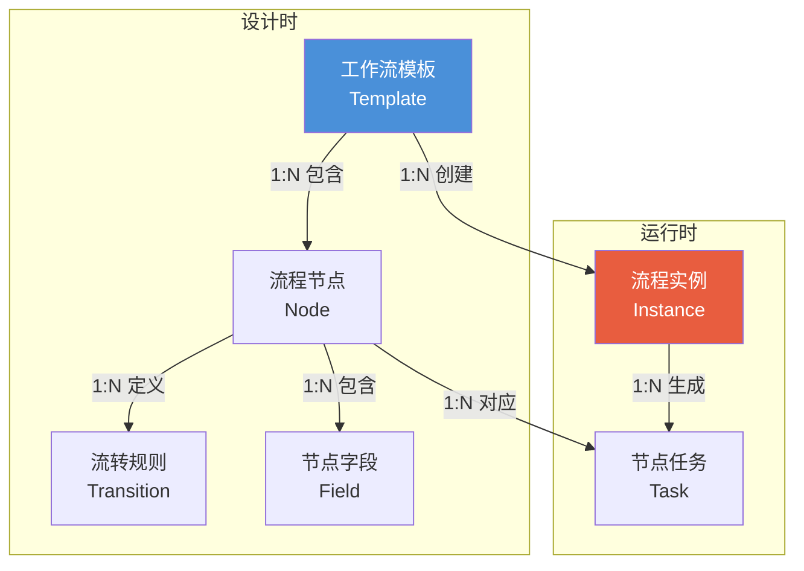
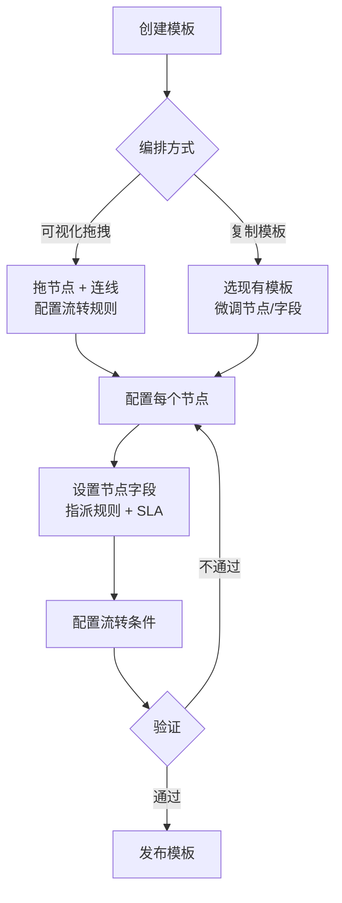
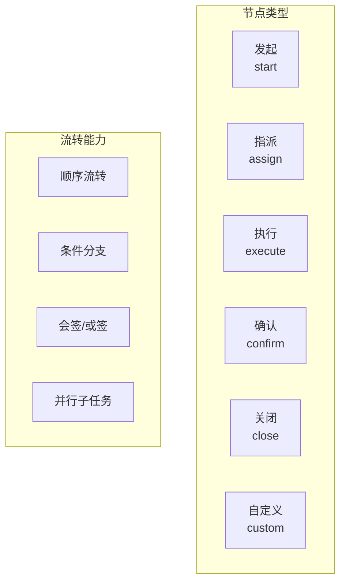
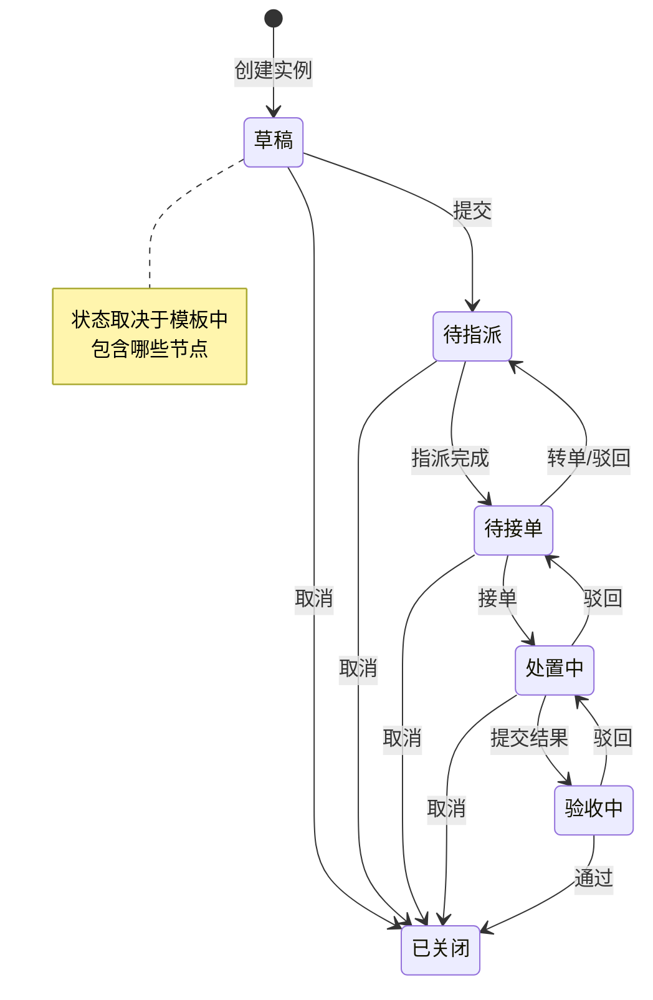
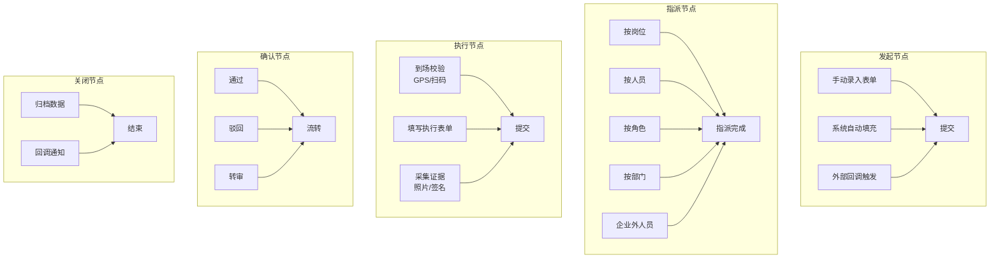
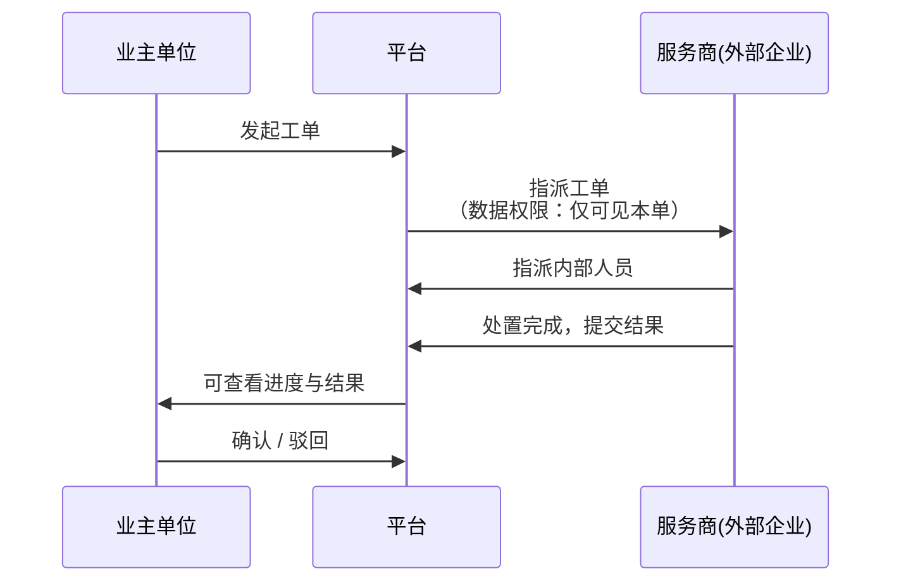

# 00-流程编排模块详细设计

> 基于产品需求文档整理，描述流程编排框架的核心概念、节点类型、SLA 计时、跨企业流转与模板版本管理。
> 表单字段渲染机制详见 [00c-动态表单渲染设计](00c-动态表单渲染设计.md)。

---

## 1. 产品定位
**一个可泛化的流程编排框架，支持工单、督办、审批等 90% 以上的流程场景，支撑企业内及跨企业流转。**

---

## 2. 核心概念模型


| 概念 | 说明 | 举例 |
| --- | --- | --- |
| **模板 (Template)** | 流程蓝图，定义节点和流转规则 | "设备维修工单模板 v1" |
| **节点 (Node)** | 流程中的一个步骤，包含表单字段、指派规则、SLA、可执行操作 | "执行节点" |
| **字段 (Field)** | 节点上需填写/展示的数据项 | "故障描述"、"现场照片" |
| **实例 (Instance)** | 按模板创建的一次具体运行 | "20260525-001 号工单" |
| **任务 (Task)** | 某个节点分配给某人的待办 | "张三需要执行的维修任务" |
| **流转规则 (Transition)** | 节点间的跳转条件，定义"什么操作 → 去往哪个节点" | "通过→关闭节点，驳回→执行节点" |


---

## 3. 模板编排流程图


### 3.1 编排能力


---

## 4. 流程实例状态机


> **驳回有两种**，名称相同但语义不同：
>
> + **指派驳回**（`待接单 → 待指派` / `处置中 → 待接单`）：执行人认为指派不当或自身无法处理，退回重新分配。`处置中 → 待接单` 时执行人已接单但尚未提交结果，TTR 不重置，新执行人接单后 TTS 从原始接单时间累计。
> + **验收驳回**（`验收中 → 处置中`）：验收人认为结果不合格，打回重做。TTS 继续累计，不重新开始。
>
> **取消的权限与后果**：从草稿至处置中的任意状态均可取消。草稿、待指派阶段由发起人或调度员取消；待接单、处置中阶段需执行人或其主管发起。取消后实例进入"已关闭"状态，但不触发关闭节点的归档与回调逻辑——取消意味着工单未完成，不生成资产履历，不回调外部系统。若需记录取消原因，可在模板中配置取消必填备注。
>
> **注意**: 实例状态取决于模板包含哪些节点。如保养模板无"指派"和"确认"节点，"待指派"状态不会出现，"处置中"直接流转到"已关闭"。

---

## 5. 节点类型定义


### 5.1 节点 = 预设类型 + 自由扩展

> **自定义节点（custom）：**当 5 种预设类型无法覆盖业务场景时，管理员可创建自定义节点。需自行配置该节点的操作按钮名称、目标流转节点及所需表单字段。自定义节点的 SLA、指派等能力与预设节点一致，区别仅在于不绑定预设语义（如"执行""确认"等系统标签），完全由配置者定义其含义。v1 中自定义节点的流转条件仅支持操作结果分支。

| 维度 | 预设能力 | 自定义能力 |
| --- | --- | --- |
| **操作按钮** | 提交/通过/驳回/转单 等内置动作 | 可新增自定义按钮，绑定目标节点 |
| **表单字段** | 系统默认字段（时间、人员等自动值） | 完全自定义字段类型、必填、校验规则 |
| **指派策略** | 按岗位/人员/角色/部门/企业外 | 组合策略（部门+角色） |
| **流转条件** | 基于操作结果、组织属性 | 自定义表达式 |


### 5.2 字段的自动填充
```
字段来源 (source) ：
  ├── manual    → 用户手动填写
  ├── auto      → 系统自动填入（当前时间、当前人员、GPS位置等）
  ├── inherited → 从上游继承
  │     ├── 本工单上游节点（如发起节点的"设备编号"自动带入执行节点）
  │     └── 父工单（如巡检工单的设备编号、故障描述自动带入子维修单）
  └── callback  → 外部系统回调写入
```

---

## 6. 指派逻辑

静态指派与动态指派两种范式的详细说明见 [00b-节点指派范式](00b-节点指派范式.md)。

### 6.1 转单
+ **权限**：当前执行人、部门负责人均可发起转单
+ **范围**：限同部门/同岗位
+ **SLA**：计时累积，不重置

---

## 7. SLA 计时与预警状态机

> **进度计算公式**: `进度 = 已用时间 / SLA时限`
>
> 例：时限 2 小时，已过 1 小时 → 进度 = 50%

| 参数 | 默认值 | 说明 |
| --- | --- | --- |
| 黄灯阈值 | 80% | 可自定义（如 50% 更敏感） |
| 红灯阈值 | 100% | 即超时 |
| 轮询间隔 | 1 分钟 | SLA 状态检查频率 |
| 计时重置 | - | 仅接单时：TTR 结束，TTS 从 0 开始。驳回时 TTS 继续累计。模板无 assign 节点时仅计算 TTS |


### 7.1 SLA 计时模型
```
TTR（响应时限）: 任务到达 → 接单         ← 衡量响应速度
TTS（解决时限）: 接单     → 关闭         ← 衡量端到端时效，用于 SLA 考核/预警/升级

辅助指标（绩效分析用，不做 SLA 预警）:
  执行耗时 : 接单 → 提交                 ← 衡量执行人效率
  确认耗时 : 提交 → 关闭                 ← 衡量确认人效率
```

> **设计意图**: SLA 考核"端到端解决"，倒逼全链路高效；绩效另拆执行/确认耗时，不冤枉个人。

**关键锚点的判定逻辑**：

| **锚点** | **触发条件** | **判定依据** |
| --- | --- | --- |
| **任务到达**（TTR 起点） | 指派节点的任务写入执行人待办列表 | 指派给具体人：`assignee_id` 写入时间戳；放入公海池/抢单：任务进入公共待办池的时间戳。到达 ≠ 用户看到，任务进入"等待被接"状态即开始计时 |
| **接单**（TTR 终点 / TTS 起点） | 执行人主动点击"确认接单"，状态 `待接单 → 处置中` | 记录接单时间戳，TTR 锁定，TTS 从 0 启动 |


```
模板不含 assign 节点时，不存在"待指派 → 待接单"阶段，TTR 不适用。
TTS 起点下沉为执行节点到达：任务出现在执行人待办列表的那一刻开始计时。
这保证了框架对不同业务场景的兼容性——不因某类工单不需要指派而需要单独 fork 一套逻辑。

有指派节点：  发起 → 待指派 → 待接单 → 处置中 → ... → 关闭
              ─────────TTR─────────
                                ───────────TTS───────────

无指派节点：  发起 ────────────→ 处置中 → ... → 关闭
              ──────────────TTS───────────────→
```

### 7.2 SLA 配置模型
```
SLA 配置 (模板级，各节点可按需覆盖):
  ├── priority         紧急程度（紧急 / 普通 / 低优），决定默认时限值
  ├── ttr_minutes     响应时限（任务到达 → 接单），模板无 assign 节点时可为 null
  ├── tts_minutes     解决时限（接单 → 关闭），无 assign 节点时起点为执行节点到达
  ├── 计时模式         自然时间 / 工作时间 [v2]
  ├── 工作时间段       9:00-18:00（若按工作时间）[v2]
  ├── 节假日策略       顺延 / 不顺延 [v2]
  ├── 黄灯阈值         默认 80% 时限，可自定义
  └── 红灯动作
       ├── 抄送人      按角色/按人员
       ├── 自动转派    是/否
       └── 退回上级    是/否
```

### 7.3 使用方式（简单易用）
```
用户操作路径:
  选场景模板 → 预设"紧急/普通/低优"三档 → 一键填充时限
            → 不满意？展开高级设置，逐项自定义调整
```

+ 预设三档，不写死，所有值可改
+ 默认值覆盖 80% 场景，高级设置覆盖剩余 20%
+ 优先级与默认时限的参考映射（各场景可覆盖）：

| **优先级** | **TTR 默认** | **TTS 默认** | **典型场景** |
| --- | --- | --- | --- |
| 紧急 | 15 分钟 | 2 小时 | 火警核实、安全事件 |
| 普通 | 2 小时 | 24 小时 | 设备报修、常规巡检 |
| 低优 | 8 小时 | 72 小时 | 台账更新、计划保养 |


---

## 8. 条件分支

> **v1 优先**: 操作结果分支 + 组织属性分支。表单字段值分支和外部回调分支后续迭代。
>
> **组织属性分支的边界**：组织属性指的是发起人的部门、岗位等预置于组织架构中的静态标签。它与表单字段值分支的关键区别在于——组织属性不需要执行人填写，系统从组织模块自动获取，因此不依赖表单字段的解析能力。v1 支持组织属性分支，v2 才支持基于任意表单字段值（如金额、类型、自定义下拉）的分支。

---

## 9. 跨企业流转


**关键约束**：

+ 企业间关系（上下级/相关方）需在组织管理中预配置
+ 指派时可选择关联企业的联系人

**跨企业数据权限矩阵**：

| **角色** | **可见工单范围** | **可见字段范围** | **可执行操作** |
| --- | --- | --- | --- |
| 业主单位 | 本企业发起的所有工单 | 全部字段（含服务商执行结果） | 发起、查看进度、确认/驳回 |
| 平台运营方 | 全平台工单 | 全部字段 | 查看、手动干预（转单/取消） |
| 服务商管理员 | 指派给本企业的工单 | 本企业相关字段，不可见业主内部备注 | 内部指派、查看 |
| 服务商执行人 | 分配给自己或本企业公海池的工单 | 执行节点字段，不可见业主内部信息 | 接单、执行、提交 |


> 服务商的内部组织树由服务商管理员在入驻时自行维护，平台不主动同步。

---

## 10. 完整生命周期示例
### 示例一：工单生命周期
以"设备维修工单"为例——单主体内部流转，通过 发起→指派→执行→确认→关闭 五类节点的组合覆盖。

### 示例二：督办生命周期
以"监管方收到预警后发起督办"为例。该场景涉及**两个主体**——监管方与预警方，工单跨主体流转。详细交互流程见 [00a-督办流程交互设计](00a-督办流程交互设计.md)。

> **以上两个示例——设备维修工单（单主体内部流转）和督办（跨主体流转）——虽然业务场景截然不同，但本质上都是基于同一套核心概念模型的泛化实现：框架通过 发起→指派→执行→确认→关闭 五类节点的灵活组合，覆盖了 90% 以上的流程场景，无需为不同业务单独开发流程引擎。**

> **跨主体流转说明**：
>
> + **监管方职责**：接收预警 → 研判是否督办 → 下达督办内容（含事项描述、时限、整改标准）→ 审核整改结果 → 关闭归档
> + **预警方职责**：接收督办 → **内部指派**（预警方管理员将任务分派给具体处理人，监管方不参与指派）→ 制定整改计划 → 执行整改 → 更新处理结果
> + **指派节点位于预警方侧**：督办下达后工单已流入预警方，指派是预警方内部的管理动作，与普通工单中由发起方指派不同
> + **跨主体边界**：`跨主体下发` 和 `跨主体回流` 两条边标注了工单在监管方与预警方之间的两次交接点
> + **实时双向可见**：预警方在处置过程中可多次更新处理进展，监管方可随时查看最新结果
> + **驳回-整改循环**：监管方审核后若认为整改不到位，可驳回至预警方继续整改，TTS 继续累计

---

## 11. 模板版本管理
| 场景 | 行为 |
| --- | --- |
| 管理员修改已发布模板 | 生成新版本，旧版本保留 |
| 新创建的实例 | 走最新版本 |
| 进行中的旧版实例 | 继续走旧版本快照，不受影响 |
| 管理员强制迁移 | 提供手动迁移工具（谨慎操作） |


---

## 12. v1 vs v2 分界
| **能力** | **v1** | **v2+** |
| --- | --- | --- |
| 节点类型 | start / assign / execute / confirm / close | 会签、或签、子流程 |
| 流转模式 | 顺序 + 操作结果分支 + 组织属性分支 | 表单字段分支、并行、外部回调分支 |
| 指派策略 | 岗位/人员/角色/部门/企业外 | 轮询、最少指派 |
| 转单 | 同部门，SLA 累积 | 跨部门转 |
| 动态干预 | 转单 + 强制改派 | 加签 + 临时插节点 |
| 表单 | 节点内字段配置 | 表单模板库（若需要） |
| SLA | 自然时间 + 三色预警 + 升级 | 工作时间 + 节假日 |

---

## 相关文档
- [00a-督办流程交互设计](00a-督办流程交互设计.md) — 跨企业督办全流程交互演示
- [00b-节点指派范式](00b-节点指派范式.md) — 静态指派 vs 动态指派技术设计
- [工单监控 PRD](../prd/工单监控.md) — 流程引擎运行时管控中心
- [流程编排 AI 规格](../ai-spec/流程编排/README.md)
