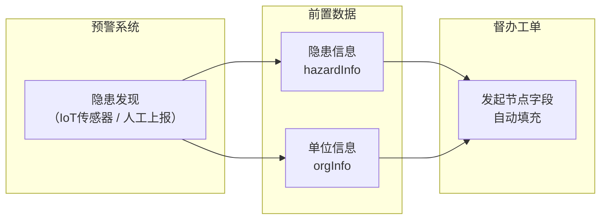
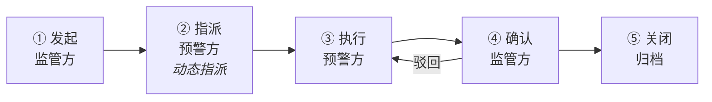
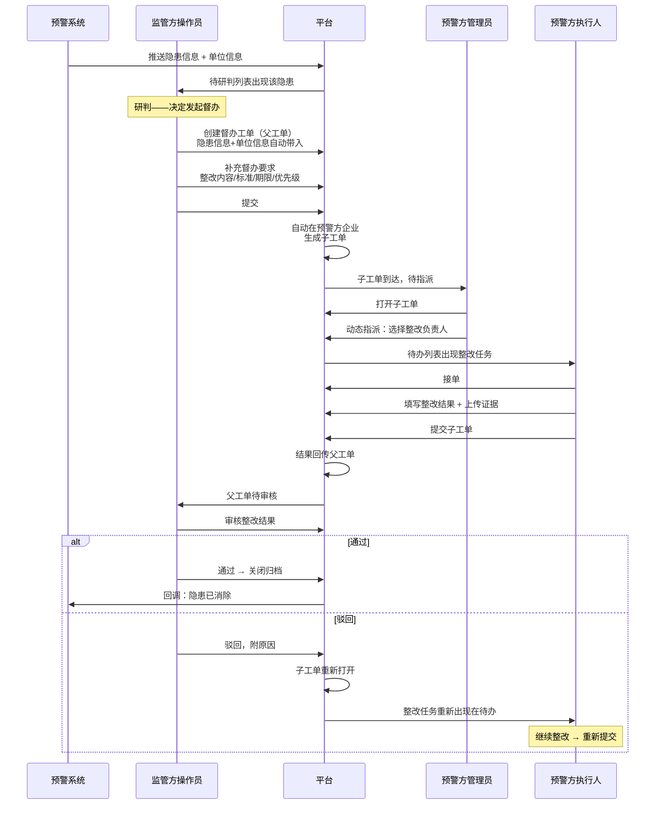
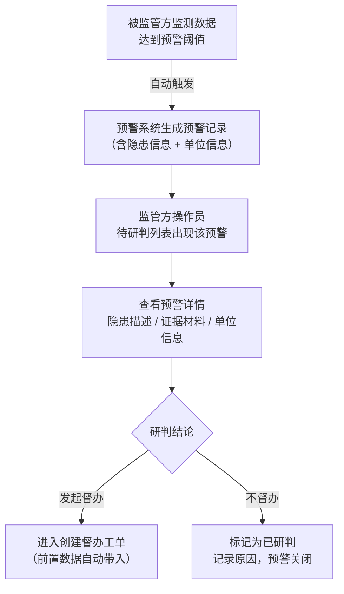
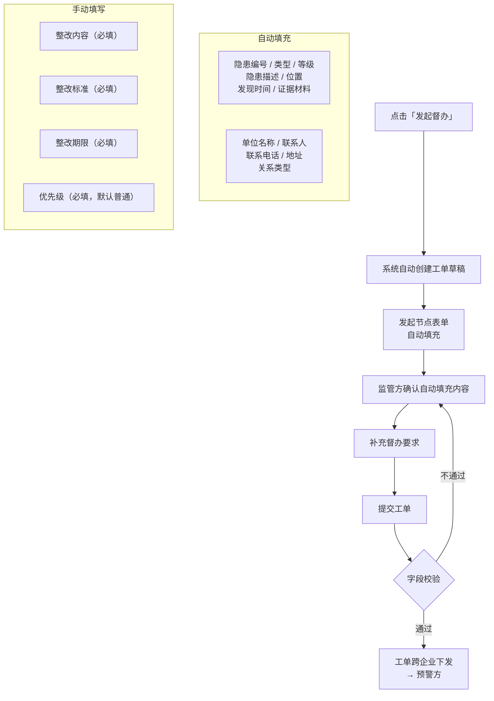
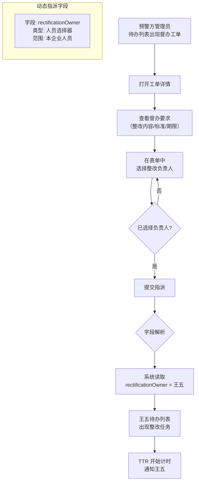
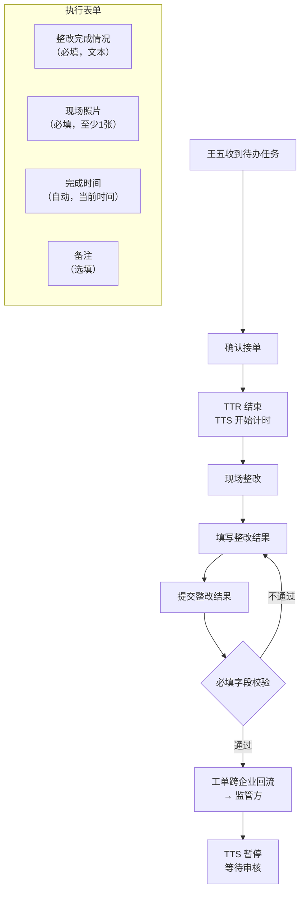
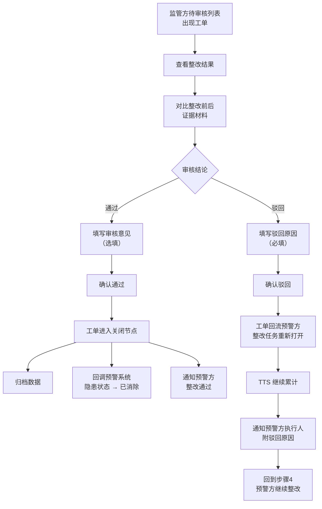
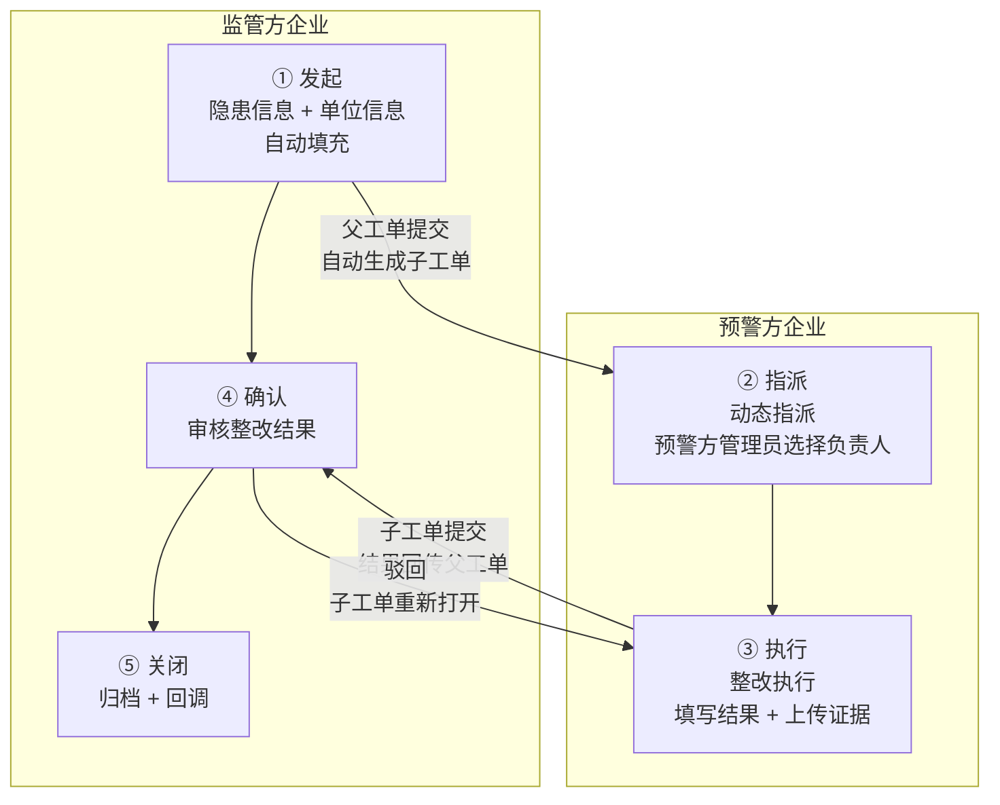
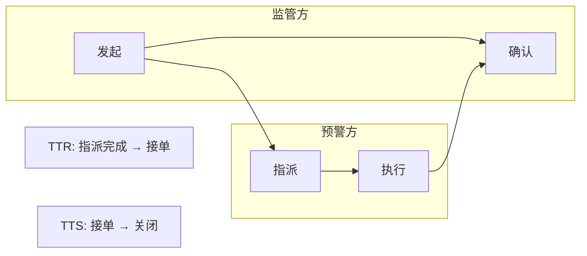

# 督办流程交互设计

> 基于 [00-流程编排模块详细设计](00-流程编排模块详细设计.md) §10 示例二，描述监管方发起督办到预警方整改完成的全流程操作步骤。
> 核心是**两个企业工单接力** + **前置数据获取**（隐患信息、单位信息）。

---

## 1. 场景概述

```
监管方（如消防支队）接到系统预警 → 研判隐患 → 向预警方（如物业公司）
下达督办工单 → 预警方内部指派 → 整改执行 → 结果回流 → 监管方审核归档

关键特征：
  - 跨企业：工单从监管方流转到预警方，再回流
  - 动态指派：监管方不知道预警方内部谁负责，由预警方管理员自行分派
  - 前置数据：隐患信息和单位信息在发起督办前已由预警系统提供
```

---

## 2. 前置数据模型

### 2.1 数据来源链路



### 2.2 隐患信息（hazardInfo）

| 字段名 | 中文名 | 类型 | 来源 | 说明 |
|--------|--------|------|------|------|
| `hazardId` | 隐患编号 | `string` | 预警系统 | 唯一标识，关联原始预警记录 |
| `hazardType` | 隐患类型 | `enum` | 预警系统 | 消防隐患 / 安全隐患 / 环保隐患 |
| `hazardLevel` | 隐患等级 | `enum` | 预警系统 | 重大 / 较大 / 一般 / 轻微 |
| `hazardDesc` | 隐患描述 | `string` | 预警系统 | AI 或人工填写的隐患详情 |
| `hazardLocation` | 隐患位置 | `string` | 预警系统 | 具体地址或楼栋楼层 |
| `discoveredAt` | 发现时间 | `datetime` | 预警系统 | 隐患首次被检测到的时间 |
| `evidenceUrls` | 证据材料 | `string[]` | 预警系统 | 现场照片、传感器截图等 URL |
| `alertLevel` | 预警级别 | `enum` | 预警系统 | 红色 / 橙色 / 黄色 / 蓝色 |

### 2.3 单位信息（orgInfo）

| 字段名 | 中文名 | 类型 | 来源 | 说明 |
|--------|--------|------|------|------|
| `orgId` | 单位 ID | `string` | 组织管理 | 预警方在企业关系中的唯一标识 |
| `orgName` | 单位名称 | `string` | 组织管理 | 预警方企业全称 |
| `orgType` | 单位类型 | `enum` | 组织管理 | 物业 / 企业 / 事业单位 / 个体工商户 |
| `legalPerson` | 法定代表人 | `string` | 组织管理 | — |
| `contactName` | 联系人 | `string` | 组织管理 | 预警方主要对接人 |
| `contactPhone` | 联系电话 | `string` | 组织管理 | — |
| `address` | 地址 | `string` | 组织管理 | 企业注册或经营地址 |
| `relationType` | 关系类型 | `enum` | 组织管理 | 上下级 / 相关方 / 管辖 |

### 2.4 监管方补充字段（supervisionConfig）

监管方研判时补充的督办要求，不属于前置数据，由监管方手动填写：

| 字段名 | 中文名 | 类型 | 必填 | 说明 |
|--------|--------|------|------|------|
| `rectificationContent` | 整改内容 | `string` | 是 | 具体整改事项和要求 |
| `rectificationStandard` | 整改标准 | `string` | 是 | 达标依据，如国标编号 |
| `deadline` | 整改期限 | `datetime` | 是 | 必须在此时间前完成 |
| `priority` | 优先级 | `enum` | 是 | 紧急 / 高 / 普通 / 低，决定 SLA 默认值 |
| `supervisorRemark` | 备注 | `string` | 否 | 监管方内部备注，预警方不可见 |

---

## 3. 流程模板设计



| 节点 | 位置 | 指派方式 | 关键字段 |
|------|------|---------|---------|
| ① 发起 | 监管方 | — | 隐患信息(自动) + 单位信息(自动) + 督办要求(手动) |
| ② 指派 | 预警方 | **动态指派** | 绑定字段 `rectificationOwner`，由预警方管理员选择整改负责人 |
| ③ 执行 | 预警方 | 动态结果 | 整改结果、整改照片、完成时间 |
| ④ 确认 | 监管方 | 静态指派 | 审核意见（通过/驳回）、驳回原因 |
| ⑤ 关闭 | 系统 | — | 归档、回调通知预警系统 |

> **父子工单机制**：监管方提交父工单后，系统自动在预警方企业生成子工单，父子通过 `parentOrderId` 关联。
>
> - **监管方模板**（发起→确认→关闭）定义父工单
> - **平台预置子模板**（指派→执行）定义子工单，预警方不可修改字段结构
> - **父→子同步**：整改内容、标准、期限（只读带入子工单）
> - **子→父回传**：整改结果、照片、完成时间（写入父工单确认节点）

---

## 4. 交互步骤详解

### 4.1 整体时序



### 4.2 步骤 1：监管方 —— 接收预警 & 研判

**操作路径**：预警列表 → 查看隐患详情 → 研判 → 发起督办



**关键交互**：
- 预警由被监管方监测数据达到配置阈值后自动触发，无需人工上报
- 隐患信息和单位信息随预警记录一并推送，数据完整性由上游系统保证
- 关联单位是数据到达的前置条件（不关联则预警数据不会到达监管方），运行时不做关联判断
- 监管方职责为查看确认 + 研判决策，不做数据补全
- 研判为"不督办"时记录原因，预警记录关闭

### 4.3 步骤 2：监管方 —— 创建督办工单

**操作路径**：研判通过 → 创建工单 → 确认前置数据 → 补充督办要求 → 提交



**关键交互**：
- 发起节点字段采用 `source: auto` 或 `source: inherited`，隐患信息和单位信息自动填充
  - `inherited`：从上游系统继承而来（隐患信息来自预警系统，单位信息来自组织管理），值已由外部提供，工单创建时自动带入
  - `auto`：由平台自身生成，无需人工输入也不依赖外部数据源（如工单编号、创建时间等）
- 监管方不可修改自动填充的前置数据（只读），仅能补充督办要求
- 提交后预警方管理员收到待办

> **父子工单机制**：监管方提交的是父工单。提交时系统自动在预警方企业生成子工单（采用平台预置的"督办整改子模板"，包含指派→执行节点），父子通过 `parentOrderId` 关联。父工单向子工单同步整改内容、整改标准、整改期限（子工单中为只读），后续预警方全部操作都在子工单上进行。

### 4.4 步骤 3：预警方 —— 内部指派（动态指派）

**操作路径**：预警方管理员待办列表 → 打开督办工单 → 选择整改负责人 → 提交



**为什么用动态指派**：
- 监管方不知道预警方内部人员结构，无法在模板中写死
- 模板中声明 `assignSource: 'dynamic'`，绑定表单字段 `rectificationOwner`
- 由预警方管理员在运行时从本企业人员中选择，实现"谁的人谁指派"

### 4.5 步骤 4：预警方 —— 执行整改

**操作路径**：整改负责人待办列表 → 接单 → 现场整改 → 填写结果 → 提交



**关键交互**：
- 接单操作终止 TTR，启动 TTS
- 现场照片为必填，作为整改完成的佐证
- 提交后监管方待审核列表出现该工单
- 若整改期限内未提交，系统根据 SLA 配置触发黄灯/红灯预警

> **结果回传**：预警方提交的是子工单。提交时子工单状态变更为"已完成"，同时整改结果（整改完成情况、现场照片、完成时间）自动回传父工单，父工单状态从"整改中"变更为"待审核"。

### 4.6 步骤 5：监管方 —— 审核 & 归档

**操作路径**：监管方待审核列表 → 查看整改结果 → 通过/驳回 → 关闭归档



**关键交互**：
- 驳回时驳回原因为必填，便于预警方明确整改方向
- 驳回不重置 TTS，倒逼整改效率
- 通过后回调预警系统，形成闭环——隐患状态从"待处理"变为"已消除"
- 关闭节点触发归档和外部回调，生成操作记录

> **驳回路径**：监管方在父工单上驳回。驳回后父工单状态回退为"整改中"，同时子工单重新打开，预警方执行人待办列表重新出现该整改任务。驳回原因从父工单同步至子工单，执行人可查看。

---

## 5. 两个企业工单接力的关键设计

### 5.1 接力模型



| 方向 | 内容 | 同步时机 |
|------|------|---------|
| 父→子 | 整改内容、整改标准、整改期限（只读） | 父工单提交时 |
| 子→父 | 整改结果、现场照片、完成时间 | 子工单提交时 |
| 父→子（驳回） | 驳回原因 | 父工单驳回时 |

### 5.2 跨企业边界的数据权限

| 阶段 | 监管方可见 | 预警方可见 |
|------|-----------|-----------|
| 发起时 | 全部（含内部备注） | 不可见（工单尚未到达） |
| 预警方处理中 | 工单状态、处理人 | 督办内容、整改要求，不可见监管方内部备注 |
| 整改结果回流后 | 整改结果、证据照片 | 已提交结果 |
| 审核驳回后 | 驳回原因 | 驳回原因，需继续整改 |
| 关闭归档后 | 全部归档数据 | 本企业相关数据 |

### 5.3 为什么发起不指定人、指派用动态？

监管方发起工单时，并不知道预警方内部谁该负责整改——也不应该知道。所以跨企业流转时，**只路由到企业，不路由到人**。至于企业内部谁来执行，由预警方管理员在运行时自行决定。

```
监管方发起节点（①）                    预警方指派节点（②）
─────────────────────                 ─────────────────────
不指定具体人员                          由预警方管理员在运行时选择
仅路由到企业                            绑定表单字段供管理员填写
                                      
模板配置:                              模板配置:
  assignSource: 'static'                assignSource: 'dynamic'
  targetIds: []  ← 空，不指派任何人       dynamicAssignFieldId:
                                          = 'rectificationOwner'
                                      字段类型: 人员选择器（限定本企业）

运行时:                                运行时:
  监管方提交父工单                        预警方管理员打开子工单
  → 系统按 orgId 路由到预警方企业          → 在表单中选择整改负责人
  → 自动生成子工单                         → 提交后系统解析字段值
  → 预警方管理员收到待办                    → 指定人员收到执行任务
```

| | 发起节点（①） | 指派节点（②） | 确认节点（④） |
|---|---|---|---|
| **位置** | 监管方 | 预警方 | 监管方 |
| **指派方式** | 不指派（仅路由到企业） | **动态指派** | **静态指派** |
| **含义** | 工单按 orgId 进入预警方，不指定具体人 | 运行时由预警方管理员从本企业选人 | 审核人固定为发起人自身，模板设计时即确定 |
| **为什么这样设计** | 监管方不应干预预警方内部人员安排 | 监管方无法预知预警方内部谁有空/谁负责 | 谁发起谁审核，责任闭环 |


---

## 6. 前置数据获取的实现要点

### 6.1 数据获取时机

```
预警产生 → 监管方研判 → 发起督办
          ↑
     隐患信息 + 单位信息
     在此阶段已完成获取
```

### 6.2 字段映射策略

工单模板的发起节点中，配置字段的 `source` 属性：

```
发起节点字段:
  ├── hazardId          source: inherited   ← 从预警记录继承
  ├── hazardType        source: inherited
  ├── hazardLevel       source: inherited
  ├── hazardDesc        source: inherited
  ├── hazardLocation    source: inherited
  ├── discoveredAt      source: inherited
  ├── evidenceUrls      source: inherited
  ├── orgId             source: inherited   ← 从组织管理继承
  ├── orgName           source: inherited
  ├── contactName       source: inherited
  ├── contactPhone      source: inherited
  ├── address           source: inherited
  ├── rectificationContent   source: manual   ← 监管方手动填写
  ├── rectificationStandard  source: manual
  ├── deadline               source: manual
  ├── priority               source: manual
  └── supervisorRemark       source: manual
```

### 6.3 数据校验

| 校验项 | 时机 | 规则 |
|--------|------|------|
| 隐患信息完整性 | 研判阶段 | 必填字段不能为空，否则不允许发起督办 |
| 单位关联有效性 | 研判阶段 | orgId 必须在组织关系中存在且为已关联状态 |
| 整改内容必填 | 提交工单 | rectificationContent 不能为空 |
| 整改期限合理性 | 提交工单 | deadline > 当前时间，且不超过 30 天 |
| 整改负责人必填 | 预警方指派 | rectificationOwner 不能为空 |

---

## 7. SLA 计时在督办场景中的表现



| 计时指标 | 起点 | 终点 | 说明 |
|---------|------|------|------|
| TTR | 预警方管理员完成指派 | 整改负责人接单 | 衡量预警方内部响应速度 |
| TTS | 整改负责人接单 | 监管方确认通过 | 端到端整改时效，含驳回循环时间 |

> 若督办模板不含指派节点（监管方直接指定了预警方联系人），则 TTR 不适用，TTS 起点下沉为执行节点到达。

---

## 8. 完整操作步骤汇总

| 步骤 | 操作者 | 操作 | 触发流转 | SLA 状态 |
|------|--------|------|---------|---------|
| 0 | 预警系统 | 推送隐患 + 单位信息 | — | — |
| 1 | 监管方 | 查看预警详情，研判 | — | — |
| 2 | 监管方 | 创建督办父工单，确认前置数据 | — | — |
| 3 | 监管方 | 补充整改要求，提交 | 父工单提交 → 系统自动生成子工单 | — |
| 4 | 预警方管理员 | 在子工单中选择整改负责人 | 动态指派完成 | TTR 开始 |
| 5 | 预警方执行人 | 确认接单 | — | TTR 结束，TTS 开始 |
| 6 | 预警方执行人 | 填写整改结果，提交子工单 | 子工单提交 → 结果回传父工单 | TTS 暂停 |
| 7a | 监管方 | 审核通过 | → 关闭归档 | TTS 结束 |
| 7b | 监管方 | 审核驳回 | 父工单驳回 → 子工单重新打开 | TTS 继续 |
| 8 | 系统 | 归档 + 回调预警系统 | 流程结束 | — |

---

## 相关文档
- [00-流程编排模块详细设计](00-流程编排模块详细设计.md) — 流程编排框架核心设计
- [00b-节点指派范式](00b-节点指派范式.md) — 静态指派 vs 动态指派技术设计
