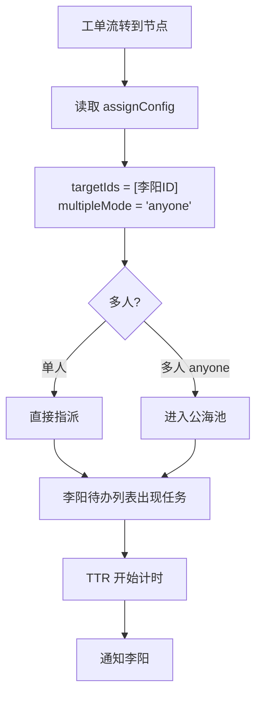
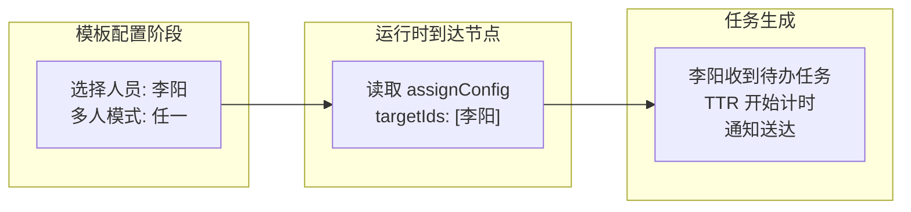
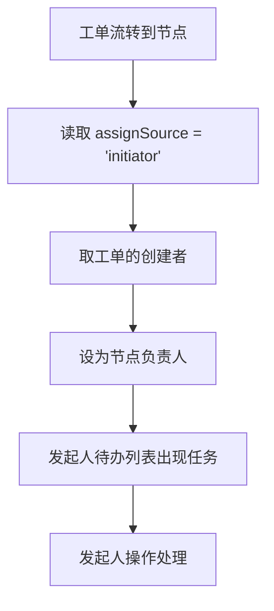
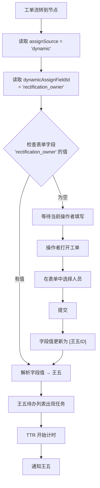
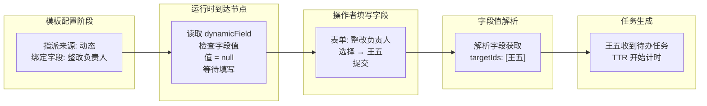
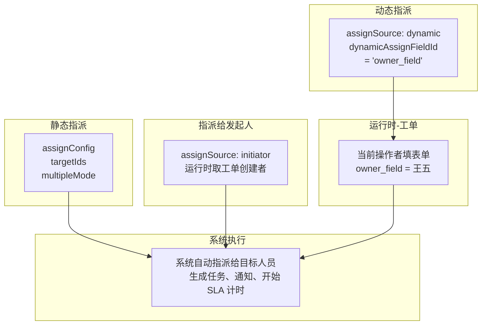

# 节点指派范式

## 1. 核心问题

流程中的 `assign`（指派）节点和 `confirm`（确认）节点都需要回答同一个问题：

> **"这个节点由谁处理？"**

答案有三种来源：

| 范式 | 决定时机 | 决定者 | 适用场景 | 仅确认节点？ |
|------|---------|--------|---------|:---:|
| **静态指派** | 模板配置时 | 模板设计者 | 企业内流程，处理人已知且固定 | — |
| **指派给发起人** | 模板配置时（选择） | 模板设计者 | 谁发起谁处理的简单场景 | — |
| **动态指派** | 工单运行时 | 工单当前操作者 | 跨企业流程，处理人需接收方自行指定 | — |

---

## 2. 数据模型

```
FlowNode {
  assignSource: 'static' | 'dynamic' | 'initiator'   // 指派来源，默认 static
  assignConfig?: {                                   // 静态指派配置（assignSource='static' 时生效）
    targetIds: number[]                              // 选中的人员 ID 列表
    multipleMode: 'anyone' | 'each'                  // 多人分发模式
  }
  dynamicAssignFieldId?: string                      // 动态指派绑定的表单字段 ID
  assignToInitiator?: boolean                        // @deprecated 使用 assignSource='initiator' 代替
}
```

> `assignSource` 是互斥的三选一：`static`（静态指派，需配置 `assignConfig`）、`dynamic`（动态指派，需配置 `dynamicAssignFieldId`）、`initiator`（指派给发起人，无需额外配置）。三者作为平级的 radio 选项展示。
>
> `assignToInitiator` 为旧版遗留字段，已废弃。新版使用 `assignSource = 'initiator'` 表达同一语义。

---

## 3. 静态指派

### 3.1 概念

模板设计者在配置流程时，直接选定处理人。模板发布后，每次工单走到该节点，系统按配置自动指派。

### 3.2 配置方式

模板设计者通过 PersonSelector 弹窗（支持按人员/部门/岗位三个 Tab 筛选）选择处理人，设置多人模式即可。系统内部默认使用 `user` 策略，targetIds 存储选中的人员 ID 列表。

### 3.3 多人模式

| 模式 | 含义 | SLA 起点 |
|------|------|---------|
| `anyone` | 任一人接单（抢单），先接先得 | 任务进入公海池时间 |
| `each` | 每人各自生成独立任务 | 各自任务到达时间 |

### 3.4 运行时流程



### 3.5 流程图



---

## 4. 指派给发起人

### 4.1 概念

流程节点的处理人有时就是发起人本人——"谁发单谁处理/谁验收"。模板设计者在节点的指派策略中选择"指派给发起人"，运行时系统自动将发起人设为节点负责人，无需每次手动选人。

### 4.2 配置方式

节点属性面板 → 指派策略 → radio 选择 **"指派给发起人"**。

选择后无需进一步配置（发起人只有一人，无需选人或绑定字段）。

### 4.3 运行时流程



### 4.4 与其他范式的区别

| | 静态指派 | 指派给发起人 | 动态指派 |
|------|------|------|------|
| 配置工作量 | 需要选人 | 选择即可 | 需绑定表单字段 |
| 人员变动 | 需更新模板版本 | 无需（发起人跟着工单走） | 无需 |
| 模板可移植性 | 差，绑死具体人 | 好，模板可跨企业复用 | 好，模板可跨企业复用 |
| 适用节点 | assign / confirm | assign / confirm | assign / confirm |

---

## 5. 动态指派

### 5.1 概念

模板设计者不指定具体人员，而是绑定表单中的一个字段。工单流转到节点时，系统等待当前操作者填写该字段，然后根据字段值自动指派。

### 5.2 典型场景：跨企业督办

```
监管方                          预警方
───────                        ──────
创建督办模板                     收到工单
配置指派节点                     打开工单
  assignSource = 'dynamic'      在表单中选择"整改负责人"
  dynamicAssignFieldId          → 系统读取字段值 → 王五
  = 'rectification_owner'      王五收到执行任务
```

模板设计者（监管方）不知道预警方内部谁负责整改，所以不写死人，而是声明"从表单中'整改负责人'字段取值"。

### 5.3 运行时流程



### 5.4 流程图



---

## 6. 三种范式对比



| 维度 | 静态指派 | 指派给发起人 | 动态指派 |
|------|------|------|------|
| **决定时机** | 模板配置时 | 模板配置时（选择） | 工单运行时 |
| **决定者** | 模板设计者 | 模板设计者 | 工单当前操作者 |
| **目标人** | 固定人员 | 发起人（运行时确定） | 运行时表单字段取值 |
| **灵活性** | 低，修改需更新模板版本 | 中，发起人变则处理人变 | 高，每次工单可指不同人 |
| **适用节点** | assign / confirm | assign / confirm | assign / confirm |
| **适用场景** | 处理人已知且固定 | 谁发起谁处理/验收 | 接收方自行分派 |
| **配置复杂度** | 低，选人即可 | 最低，选择即可 | 需先设计表单字段 |
| **运维成本** | 人员变动需更新模板 | 无 | 无 |
| **模板可移植性** | 差，绑死具体人 | 好，不绑人 | 好，模板可跨企业复用 |

---

## 7. 校验规则

| 规则 | 说明 |
|------|------|
| 静态 + 未配置 assignConfig | ❌ 校验不通过："必须指定指派目标" |
| 静态 + assignConfig.targetIds 为空 | ❌ 校验不通过："必须指定指派目标" |
| 指派给发起人 | ✅ 无需校验，运行时自动取发起人 |
| 动态 + 未绑定 dynamicAssignFieldId | ❌ 校验不通过："必须绑定表单字段" |
| 动态 + 绑定的字段不存在于表单 | ❌ 保存时警告 |

---

## 相关文档
- [00-流程编排模块详细设计](00-流程编排模块详细设计.md) — 流程编排框架核心设计
- [00a-督办流程交互设计](00a-督办流程交互设计.md) — 跨企业督办全流程交互演示
