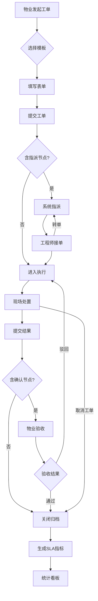

# 工单管理模块 — 业务设计

> AI 安全管理平台子模块。最后更新：2026-06-02。
> 工单管理承载"任务流转与处置闭环"核心能力。
> 平台其他模块：设备管理、巡查检查、远程值守、维保应用、隐患管理、培训演练、系统管理。

---

## 一、模块定位

工单管理是消防安全管理平台的**流程中枢**，承载"任务流转与处置闭环"核心能力。其本质是一个可泛化的流程编排框架 + 工单全生命周期管理系统。

**四方协同模型**（详见 [平台岗位设计.md](../平台岗位设计.md) §一）：

| 租户方 | 典型角色 | 工单职责 |
|--------|---------|---------|
| 阳光物业管理有限公司（物业方） | 消防安全管理人、消控值班员、消防安全责任人 | 发起工单、核查验收、SLA 监督 |
| 蓝盾消防技术服务公司（服务方） | 维保工程师、项目负责人、技术负责人 | 接单处置、团队管理、技术审核 |
| 应急管理局安全管理中心（监管方） | 安全监管员 | 督办发起、核查验收、监管报告 |
| 平台运营方 | 平台管理员 | 流程模板配置、全局参数、全平台干预 |

**两种产品视角**（详见 [§八 岗位分离原则](#八岗位分离原则)）：

- **"我的工单"** — 个人视角。入口：工作台。数据范围：与我相关（我发起的 + 指派给我的）。信息密度低，无统计卡片。面向消防安全管理人、消控值班员、维保工程师。
- **"工单监控"** — 管理视角。入口：`/system/monitor`。数据范围：按岗位全量过滤。信息密度高，必须有统计卡片 + SLA 预警。面向消防安全责任人、项目负责人、技术负责人、安全监管员。

**工单管理不是**：
- 不是告警系统（告警核实后由消控值班员发起工单，但告警本身属于远程值守模块）
- 不是隐患管理系统（隐患发现与评估属于隐患管理模块，但隐患可通过 inherited 字段自动带入工单）
- 不是独立的统计分析工具（统计分析数据来源于工单流转，但深度 BI 能力属于数据可视化模块）

---

## 二、用户旅程地图

> 基于 [平台岗位设计.md](../平台岗位设计.md) 的 11 岗位 × 四方协同模型，按"我的工单"与"工单监控"两种视角组织。仅查看岗位（企业管理员 × 3）不展开完整旅程。

### 2.1 "我的工单" — 个人视角（工作台入口）

> 入口：工作台 `QuickActionsWidget` → `CreateOrderDialog`。数据范围：与我相关（我发起的 + 指派给我的）。不需要统计卡片。

#### 消防安全管理人（Web，物业方）

| 阶段 | 用户行为 | 用户目标 | 痛点/机会点 | 系统响应 |
|------|---------|---------|------------|---------|
| 发起工单 | 工作台点击"发起工单"，选模板（卡片列表）→ 填标题/优先级/备注 → DynamicForm 填写发起字段 | 快速生成标准化工单，不进入监控页 | ⭐ 大量模板时卡片选择效率低，需搜索 | CreateOrderDialog（已完成） |
| 跟踪我的工单 | 工作台 `MyTasksWidget` 查看我发起 + 由我验收的工单 | 掌握个人相关工单进展 | 需要区分"待我验收"和"我发起的"两类 | 我的工单列表 + 状态筛选（待补充） |
| 查看详情 | 点击工单进入详情页 `/system/order/:id` | 查看完整流程、处置记录和当前节点操作 | 验收时需要对比整改前后情况 | 双栏布局：进度+只读信息+当前节点操作+流转记录（已完成） |
| 核查验收 | 确认节点操作区：查看整改结果/照片 → 填写验收意见 → 通过/驳回 | 确保整改质量达标 | ⭐ 驳回后需重新进入整改循环，不能遗漏 | 通过/驳回+意见填写（已完成），驳回后工单回到执行节点 |
| 归档查阅 | 检索本企业历史已关闭工单，导出报告 | 历史追溯、合规审计 | **当前无归档入口** | 归档检索+筛选+导出（待补充） |

#### 消控值班员（Web，物业方）

| 阶段 | 用户行为 | 用户目标 | 痛点/机会点 | 系统响应 |
|------|---------|---------|------------|---------|
| 紧急发起工单 | 消控室发现告警 → 工作台点击"发起工单" → 选紧急优先级 → 填告警信息 | 告警核实后快速生成紧急工单，最小操作步骤 | ⭐ 告警信息应自动带入工单，减少重复填写 | CreateOrderDialog（已完成），告警数据自动填充（待补充） |
| 跟踪我的工单 | 工作台查看由我发起的工单列表 | 确认工单已被响应和处理 | 不知道是否有人接单 | 我的工单列表 + 当前状态（待补充） |

#### 维保工程师（微信小程序，服务方）

| 阶段 | 用户行为 | 用户目标 | 痛点/机会点 | 系统响应 |
|------|---------|---------|------------|---------|
| 接收工单 | 打开小程序待办列表 | 快速看到分配给我的任务 | ⭐ **当前完全无移动端** | 待接单 + 处置中列表（待补充） |
| 接单处理 | 查看详情后一键接单 | 确认任务，TTR 终止锁定，TTS 开始计时 | 网络中断时操作受限（暂不需要离线能力） | 一键接单，状态→处置中（待补充） |
| 现场处置 | 小程序版 DynamicForm：填写处置结果 + 拍照上传（必填）+ 提交 | 记录处置过程及现场照片留痕 | 需拍照留痕，上传大图可能慢 | 表单提交→流转下一节点（待补充） |
| 转单 | 不属于自己范围时选择转交人员 + 填写原因 → 提交 | 快速流转，不阻塞 SLA | 转单需填原因，且限于同部门/同岗位 | 人员选择器 + 原因必填 → 流转（待补充） |

### 2.2 "工单监控" — 管理视角

> 入口：侧栏导航"工单监控"。数据范围：按岗位数据范围过滤。必须有统计卡片。

#### 消防安全责任人（Web，物业方）

| 阶段 | 用户行为 | 用户目标 | 痛点/机会点 | 系统响应 |
|------|---------|---------|------------|---------|
| 监控全貌 | 打开工单监控页，查看本企业全量工单统计卡片（按状态 + SLA 三色分布） | 对本企业消防安全态势一目了然 | ⭐ 需要看到哪些工单有 SLA 风险 | 统计卡片 + 列表（已完成），岗位数据范围已过滤本企业 |
| SLA 督办 | 筛选 SLA 黄灯/红灯工单，查看超时原因 | 及时发现超时风险，推动处理 | SLA 超时无主动通知 | 列表（已完成），消息通知（待补充） |
| 强制干预 | 对阻塞工单执行强制改派/取消 | 异常情况可控，不阻塞流程 | 需要明确改派原因留痕 | 强制改派（已完成），取消工单（已完成） |

#### 项目负责人（Web，服务方）

| 阶段 | 用户行为 | 用户目标 | 痛点/机会点 | 系统响应 |
|------|---------|---------|------------|---------|
| 团队监控 | 打开工单监控页，查看本服务商全量工单（按人员 + SLA 分布） | 掌握团队工单全貌，对接甲方物业 | ⭐ 需要看到每个工程师的负荷 | 统计卡片 + 列表（已完成），岗位数据范围已过滤本服务商 |
| SLA 绩效 | 查看团队 SLA 达标率、平均处置时长 | 作为客户满意度和绩效考核依据 | **当前无统计看板** | 统计看板（待补充） |
| 强制干预 | 对阻塞/分配不当的工单执行强制改派/取消 | 团队资源调配，确保 SLA | 需要了解当前各工程师负荷 | 强制改派（已完成），取消工单（已完成） |

#### 技术负责人（Web，服务方）

| 阶段 | 用户行为 | 用户目标 | 痛点/机会点 | 系统响应 |
|------|---------|---------|------------|---------|
| 审核处置结果 | 工作台"待审核工单"Widget → 进入验收节点 → 查看处置结果/照片/备注 | 技术把关，确保处置质量达标 | ⭐ 疑难工单需要更详细的处置记录 | 详情页确认节点操作区（已完成） |
| 强制改派 | 对分配不当的工单执行强制改派 | 确保合适的人处理合适的问题 | 需要了解团队技术专长匹配 | 人员选择器 + 改派原因 → 强制改派（已完成） |

#### 安全监管员（Web，监管方）

| 阶段 | 用户行为 | 用户目标 | 痛点/机会点 | 系统响应 |
|------|---------|---------|------------|---------|
| 研判发起督办 | 在预警系统发现隐患 → 发起督办父工单（父工单：发起→确认→关闭），前置数据自动带入 | 依法对消防隐患启动督办程序 | ⭐ 隐患信息应自动带入，减少手动录入 | 父工单发起（待补充），前置数据 inherited 自动填充（待补充） |
| 督办进展监控 | 查看督办工单列表，跟踪被督办方整改进度 | 实时掌握督办进展，超时预警 | 需要跨企业查看子工单状态 | 父子工单关联视图（待补充），SLA 预警（待补充） |
| 核查验收 | 被督办方提交整改结果 → 对比整改前后情况 → 通过/驳回 | 确保整改质量达标，形成监管闭环 | 需对比整改前后照片/数据 | 父工单确认节点：通过/驳回+意见填写（待补充） |
| 统计分析 | 查看 SLA 达标率、趋势、排行，生成监管报告 | 向上级汇报监管成效 | ⭐ **当前无统计看板** | 看板+趋势图+排行表（待补充） |

### 2.3 平台运营 — 跨租户管理

> 平台管理员跨租户操作，不参与具体工单流转，负责流程基础设施。

#### 平台管理员（Web，平台方）

| 阶段 | 用户行为 | 用户目标 | 痛点/机会点 | 系统响应 |
|------|---------|---------|------------|---------|
| 流程模板配置 | 进入流程模板列表 → 新建/编辑模板 → 三步配置（基础设置→表单设计→流程设计）→ 发布模板 | 定义标准化工单类型、表单字段、流转节点，服务所有租户 | ⭐ 模板版本发布后修改会影响已有工单 | TemplateList + TemplateConfig（FlowDesigner + FormDesigner）（已完成） |
| 全局参数管理 | 配置 SLA 默认值、优先级映射、通知规则等平台级参数 | 统一平台运营标准 | 参数变更需要通知所有租户 | 平台配置（待补充） |
| 全平台干预 | 对任意工单执行强制改派/取消/删除 | 异常兜底处理 | 平台操作需完整审计日志 | 强制改派/取消/删除（已完成），操作日志（待补充） |

---

## 三、核心业务流程

---

## 四、功能全景

> 状态标记：✅ 已完成 · 🔧 部分完成 / 改造中 · 📝 已设计待开发 · 📋 已规划

### 4.1 流程编排与配置

工单模板的完整生命周期管理，是工单系统的设计时基础。

| 子功能 | 说明 | 状态 | 模块 | 参考 |
|--------|------|:----:|------|------|
| 模板列表 | 模板 CRUD + 状态管理（已发布/草稿/已停用），含搜索/筛选/分页 | ✅ | M0 | — |
| 三步配置向导 | TemplateConfig：基础设置（名称/优先级/SLA 默认值）→ 表单设计（FormDesigner）→ 流程设计（FlowDesigner） | ✅ | M0 | — |
| 表单设计器 | 自定义字段类型、必填、校验规则，支持 auto / inherited / manual / callback 四种填充来源 | ✅ | M0 | [详细设计](00-流程编排模块详细设计.md) §5.2 |
| 流程引擎 | 拖拽节点 + 连线定义流转规则，支持顺序流转和操作结果分支跳转 | ✅ | M0 | [详细设计](00-流程编排模块详细设计.md) §3 |
| 节点类型定义 | 7 种预设节点：发起(start) / 指派(assign) / 执行(execute) / 确认(confirm) / 条件(condition) / 外部(external) / 关闭(close)，覆盖 90%+ 流程场景 | ✅ | M0 | [详细设计](00-流程编排模块详细设计.md) §5 |
| SLA 计时配置 | 模板级预设 4 档优先级（紧急/高/普通/低）→ TTR / TTS 默认值映射，支持逐节点按需覆盖，红灯升级动作配置 | ✅ | M0 | [详细设计](00-流程编排模块详细设计.md) §7 |
| 节点指派范式 | 三选一：静态指派（选人 + anyone / each 多人模式）/ 指派给发起人 / 动态指派（绑定表单字段确定负责人） | ✅ | M0 | [00b-节点指派范式](00b-节点指派范式.md) |
| 节点字段权限配置 | 每字段在节点级配置 hidden / readonly / editable 三态，三段式 radio 界面 | ✅ | M0 | [00c-动态表单渲染设计](00c-动态表单渲染设计.md) §2.4 |
| 模板版本管理 | 发布 / 停用 / 历史版本管理；已发布模板锁定不可编辑，修改需新建版本；进行中老旧实例继续走旧版本快照 | 📝 | M0 | [详细设计](00-流程编排模块详细设计.md) §11 |

### 4.2 工单生命周期

工单实例从发起到关闭的完整运行时生命周期。

| 子功能 | 说明 | 状态 | 模块 | 参考 |
|--------|------|:----:|------|------|
| 工单发起 | CreateOrderDialog（工作台弹窗模式）：选模板（卡片列表）→ 填标题/优先级/备注 → DynamicForm 填写发起字段 → 保存草稿 / 立即发起 | ✅ | M2 | — |
| 工单监控 | WorkOrderMonitor：统计卡片（按状态 + SLA 三色一键筛选）、筛选操作区、数据表格（SLA 进度条 + 操作列）、岗位数据范围过滤 | ✅ | M1 | — |
| 工单详情 | WorkOrderDetail：双栏布局（左栏：流程步骤进度 + 只读信息区 + 当前节点操作区，右栏：流转记录时间线），所有节点处置统一在此页面完成 | ✅ | M1 | — |
| SLA 双计时 | TTR（响应时限：工单到达 → 接单）+ TTS（解决时限：接单 → 关闭），实时进度计算，黄灯 80% / 红灯 100% 阈值，1 分钟轮询刷新 | ✅ | M1 | [详细设计](00-流程编排模块详细设计.md) §7 |
| 岗位数据范围隔离 | 物业看本企业、服务商看分配、监管看全量（2026-06-09 新增） | ✅ | M1 | — |
| 实例状态机 | 三态标准化：草稿 → 进行中 → 已关闭。中间进度（待指派 / 待接单 / 处置中 / 验收中）由 currentNodeName 体现，进度由 activePathIndex / activePathNodeCount 计算 | ✅ | M0 | [详细设计](00-流程编排模块详细设计.md) §4 |
| 详情页 DynamicForm 集成 | 只读区聚合已完成节点数据展示 + 操作区当前节点可编辑字段按权限分离渲染 | 🔧 | M1 | [00c-动态表单渲染设计](00c-动态表单渲染设计.md) §6 |
| Web 端处置 | 详情页操作区按 nodeType 切换：执行节点（保存 + 提交）/ 确认节点（通过 / 驳回 + 意见）/ 指派节点（人员选择器），已关闭状态全局 readonly | 🔧 | M3 | [00c-动态表单渲染设计](00c-动态表单渲染设计.md) §5 |
| 工单归档 | WorkOrderArchive：独立归档检索页，默认展示已关闭列表，高级筛选（时间范围 + 模板 + 优先级 + SLA 结果），Excel / CSV 导出 | 📋 | M4 | — |

### 4.3 基础设施与权限

跨模块复用的基础组件与权限判定体系。

| 子功能 | 说明 | 状态 | 模块 | 参考 |
|--------|------|:----:|------|------|
| DynamicForm 组件 | 通用运行时表单渲染：fields + permissions + initialData → 渲染 Element Plus 表单，支撑发起 / 处置 / 详情等所有表单场景 | 🔧 | M-N | [00c-动态表单渲染设计](00c-动态表单渲染设计.md) §3 |
| 字段权限三态 | hidden（v-if 不渲染）/ readonly（回填禁用）/ editable（正常交互），按节点配置控制，支持全局 readonly 模式（已关闭工单） | 📝 | M-N | [00c-动态表单渲染设计](00c-动态表单渲染设计.md) §2 |
| 8 种字段类型映射 | input / textarea / radio / checkbox / select / date / upload / number → 对应 Element Plus 控件 | 📝 | M-N | [00c-动态表单渲染设计](00c-动态表单渲染设计.md) §3.3 |
| 表单数据生命周期 | nodeRecords 分节点存储提交记录 + formData 聚合当前快照 + initialData 逐节点自动回填继承字段 | 📝 | M-N | [00c-动态表单渲染设计](00c-动态表单渲染设计.md) §4 |
| 虚拟角色体系 | 按运行时状态自动判定：发起人 / 节点负责人 / 管理员 / 查看者，纯算法判定无需后端 | 📝 | M-N | [button-permissions.md](button-permissions.md) §1 |
| 按钮判定 composable | 按钮可见性 + 可操作 = 状态（草稿 / 进行中 / 已关闭）× 虚拟角色 × 当前节点类型（7 种）→ 布尔值 | 📝 | M-N | [button-permissions.md](button-permissions.md) §4, §8 |
| 按钮权限决策流 | 完整判定逻辑链：编辑 / 删除（草稿 + 发起人）、接单（指派节点 + 节点负责人）、转单（执行节点 + 节点负责人）、通过 / 驳回（确认节点 + 确认人）、强制改派 + 取消（管理员） | 📝 | M-N | [button-permissions.md](button-permissions.md) §5 |
| 通用业务组件 | StatusTag（三色状态标签）/ PersonSelector（人员选择器，3 Tab 筛选）/ AppIcon（应用图标） | ✅ | — | — |

### 4.4 跨企业协同

监管方、业主方、服务商之间的跨企业工单流转与督办机制。

| 子功能 | 说明 | 状态 | 模块 | 参考 |
|--------|------|:----:|------|------|
| 父子工单机制 | 监管方发起父工单 → 系统自动在被督办方企业生成子工单，parentOrderId 关联，父叫子回 | 📝 | M0 | [00a-督办流程交互设计](00a-督办流程交互设计.md) §3 |
| 督办全流程 | 5 步标准流程：①监管方研判发起 → ②被督办方动态指派 → ③整改执行 → ④监管方审核 → ⑤关闭归档，含驳回-整改循环 | 📝 | M0 | [00a-督办流程交互设计](00a-督办流程交互设计.md) §4 |
| 跨企业数据权限 | 4 级可见矩阵：业主方（全字段可见）/ 平台运营方（全平台）/ 服务商管理员（本企业）/ 服务商执行人（仅执行字段，不可见内部备注） | 📝 | M0 | [00a-督办流程交互设计](00a-督办流程交互设计.md) §5.2 |
| 前置数据自动填充 | 隐患信息（类型 / 等级 / 描述 / 位置 / 证据）+ 单位信息（名称 / 联系人 / 电话）自动带入，监管方不可修改 | 📝 | M0 | [00a-督办流程交互设计](00a-督办流程交互设计.md) §2, §6 |
| 跨企业结果同步 | 父→子：整改内容 / 标准 / 期限只读带入；子→父：整改结果 / 照片 / 完成时间回流；驳回：驳回原因同步至子工单 | 📝 | M0 | [00a-督办流程交互设计](00a-督办流程交互设计.md) §5.1 |
| 跨企业动态指派 | 模板中 assignSource='dynamic' 绑定被督办方字段，被督办方管理员运行时从本企业选人后自动触发指派 | 📝 | M0 | [00b-节点指派范式](00b-节点指派范式.md) §5 |

### 4.5 移动端

微信小程序，面向消防服务工程师的现场作业终端。

| 子功能 | 说明 | 状态 | 模块 | 参考 |
|--------|------|:----:|------|------|
| 待办列表 | 待接单 + 处置中列表，显示工单编号、标题、优先级、SLA 超时状态 | 📋 | M3 | — |
| 接单 | 一键接单：TTR 终止锁定，TTS 从 0 启动，通知被督办方管理员 | 📋 | M3 | — |
| 现场处置 | 小程序版 DynamicForm：填写处置结果 + 拍照上传（必填）+ 提交流转至下一节点 | 📋 | M3 | — |
| 转单 | 选择转交人员 + 填写转单原因，限于同部门 / 同岗位，SLA 计时继续累计不重置 | 📋 | M3 | — |

### 4.6 分析与归档

工单数据的统计分析与历史归档能力。

| 子功能 | 说明 | 状态 | 模块 | 参考 |
|--------|------|:----:|------|------|
| 归档检索 | 归档列表默认展示已关闭工单，高级筛选（时间范围 + 模板 + 优先级 + SLA 结果） | 📋 | M4 | — |
| 工单导出 | 归档工单导出为 Excel / CSV 文件 | 📋 | M4 | — |
| 统计看板 | WorkOrderStats Dashboard：顶部指标卡（本月总数 / 达标率 / 平均时长 / 超时数）+ 近 30 天趋势折线图 + 模板分布饼图 + 时间范围筛选器 | 📋 | M5 | — |
| 处理人效率排行 | 按处理人统计完成工单数、平均处理时长、SLA 达标率排序表 | 📋 | M5 | — |
| SLA 达标率分析 | 整体达标率 + 按优先级 / 模板 / 时间维度分组下钻 | 📋 | M5 | — |

### 4.7 消息通知

覆盖 SLA 预警与工单指派的多渠道通知体系。

| 子功能 | 说明 | 状态 | 模块 | 参考 |
|--------|------|:----:|------|------|
| 站内消息 | Web 端顶部铃铛入口 + 消息中心列表：工单指派通知 / SLA 黄灯预警 / SLA 红灯升级 / 审核结果通知 | 📋 | M6 | — |
| 语音通知 | SLA 红灯时自动拨打预设电话（责任人 / 值班人） | 📋 | M6 | — |
| 短信通知 | 紧急工单指派时自动发送短信 | 📋 | M6 | — |
| 移动端推送 | 微信消息模板推送：SLA 预警 + 工单指派 | 📋 | M3/M6 | — |
| 通知配置 | 各类型通知开关（站内 / 语音 / 短信）、接收人设置、SLA 阈值触发规则 | 📋 | M6 | — |

---

## 五、关键业务规则

1. **SLA 双计时**：TTR（指派→接单）+ TTS（接单→关闭），驳回/转单不重置
2. **状态三态标准化**：草稿 → 进行中 → 已关闭。具体进度（待指派、处置中、验收中等）由 `currentNodeName`（当前节点名称）体现，不再单独枚举中间状态。进度数字由 `activePathIndex / activePathNodeCount` 计算
3. **已关闭只读**：归档后不可修改，展示 TTR/TTS/总耗时
4. **三方权限隔离**：物业看本企业、服务商看分配、监管看全量
5. **模板独立版本**：已发布模板产生工单后锁定，修改需新建版本
6. **按钮权限按作用域分离**（2026-06-08 确定）：

   | 层级 | 按钮 | 显示条件 | 位置 |
   |------|------|---------|------|
   | **工单级** | 取消工单 | `status !== 'closed'` | 底部操作栏 |
   | **工单级** | 强制改派 | `status === 'active' && currentAssigneeId != null` | 底部操作栏 |
   | **节点级** | 接单 | assign 节点 + `assignConfig.multipleMode === 'anyone'` + 无人认领 | 节点操作卡片 |
   | **节点级** | 通过/驳回 | confirm 节点，由模板 `flowNode.actions` 配置 | 节点操作卡片 |

   - 工单级操作不关心当前节点类型，有管理权限即可操作
   - 节点级操作由节点自身配置决定，"接单"不需要额外配置项——指派策略 (`multipleMode`) 本身就是答案：`anyone`（多人抢单）才需要"接单"，`each`（指定到人）不需要

---

## 六、成功指标

- 平均 TTS ≤ 时限的 80%（黄灯阈值以下）
- SLA 超时率 ≤ 10%
- 紧急工单 TTR ≤ 30 分钟

---

## 七、已明确的实现方案

- **移动端**：微信小程序，无需离线能力
- **工单发起**：工作台快捷发起（`QuickActionsWidget` → `CreateOrderDialog`），**不在工单监控页发起**
- **统计看板**：Dashboard 页面即可，无需大屏适配
- **消息通知**：站内消息 + 语音通知 + 短信通知

---

## 八、岗位分离原则

### 8.1 两种工单视角

| 维度 | 我的工单（个人视角） | 工单监控（管理视角） |
|------|-------------------|---------------------|
| **用户** | 普通岗位（消防安全管理人、消控值班员、维保工程师） | 管理岗位（消防安全责任人、项目负责人、技术负责人、安全监管员） |
| **入口** | 工作台  | 独立页面  |
| **数据范围** | 与我相关（我发起的 + 指派给我的） | 全量（按岗位数据范围过滤） |
| **信息密度** | 低 — 工单编号、标题、状态、时间 | 高 — SLA 进度、三色预警、节点详情 |
| **操作** | 发起、处置、验收 | 查看、督办、改派、取消 |
| **统计卡片** | 不需要 | 必须 — 按状态分布、SLA 达标率 |

### 8.2 发起工单的入口

- **工作台**：`QuickActionsWidget` → `CreateOrderDialog`，面向消防安全管理人、消控值班员
- **工单监控页**：不提供发起入口，纯监控用途

### 8.3 岗位权限

详见 [平台岗位设计.md](../平台岗位设计.md) §三 "岗位 × 工单操作矩阵"。
