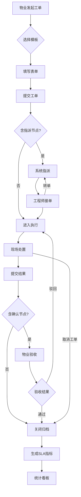

# 工单管理模块 — 业务设计

> AI 安全管理平台子模块。最后更新：2026-06-02。
> 工单管理承载"任务流转与处置闭环"核心能力。
> 平台其他模块：设备管理、巡查检查、远程值守、维保应用、隐患管理、培训演练、系统管理。

---

## 一、模块定位

AI 安全管理平台的**工单管理子模块**。消防场景下三方协同：xxx物业管理有限公司（发起+验收）、yyy消防技术服务公司（处置执行）、zzz安全管理中心（监管督办）。

---

## 二、用户旅程地图

### 角色 A — 物业管理员（Web 管理端）

| 阶段 | 用户行为 | 用户目标 | 痛点/机会点 | 系统响应 |
|------|---------|---------|------------|---------|
| 配置模板 | 进入流程模板列表，新建或编辑工单模板 | 定义工单类型、表单字段、流转节点 | ⭐ 模板版本发布后修改会影响已有工单 | FlowDesigner + FormDesigner（已有） |
| 发起工单 | 监控页点击"发起工单"，选模板填表单 | 快速生成标准化工单 | **当前仅 mock 数据，缺创建入口** | 模板选择 → 表单填写 → 提交（**待补充**） |
| 跟踪进度 | 查看列表、统计卡片、SLA 预警 | 全局掌握状态，发现超时 | SLA 超时无主动通知 | 列表+三色圆点+统计卡片筛选（已有） |
| 查看详情 | 右侧滑出抽屉 | 查看完整流程和处置记录 | 已关闭工单缺指标总结 | ⭐ 基本信息+时间线三态+SLA指标（已有） |
| 归档查阅 | 检索历史工单，导出报告 | 历史追溯、合规审计 | **当前无归档入口** | 归档检索+筛选+导出（**待补充**） |
| 统计分析 | 查看 SLA 趋势、排行、达标率 | 评估服务质量、发现瓶颈 | **当前无统计能力** | 看板+趋势图+排行表（**待补充**） |

### 角色 B — 消防服务工程师（微信小程序）

| 阶段 | 用户行为 | 用户目标 | 痛点/机会点 | 系统响应 |
|------|---------|---------|------------|---------|
| 接收工单 | 打开小程序待办列表 | 快速看到分配给我的任务 | ⭐ **当前完全无移动端** | 待接单+处置中列表（**待补充**） |
| 接单处理 | 查看详情后接单 | 确认任务，开始 TTS 计时 | 网络中断时操作受限 | 一键接单，状态→处置中（**待补充**） |
| 现场处置 | 填写结果、拍照上传 | 记录处置过程及现场照片 | 需拍照留痕 | 表单提交→流转下一节点（**待补充**） |
| 转单 | 不属于自己范围时转他人 | 快速流转，不阻塞 | 转单需填原因 | 选择人员+原因→流转（**待补充**） |

### 角色 C — 安全监管员（Web 管理端）

| 阶段 | 用户行为 | 用户目标 | 痛点/机会点 | 系统响应 |
|------|---------|---------|------------|---------|
| 监管督办 | 查看安全生产督办工单 | 监督消防安全合规 | 被动查看，无预警推送 | 列表+筛选+详情（已有） |
| 核查验收 | 对整改结果确认 | 确保整改质量达标 | 需对比整改前后情况 | 通过/驳回+意见填写（已有） |
| 统计分析 | SLA 达标率、趋势、排行 | 生成监管报告 | ⭐ **当前无统计看板** | 看板+趋势+排行（**待补充**） |

---

## 三、核心业务流程

---

## 四、功能全景

### 已完成（不做修改）

| 模块 | 已实现 |
|------|--------|
| 配置 | TemplateList + TemplateConfig（FlowDesigner + FormDesigner） |
| 监控 | WorkOrderMonitor（列表+统计卡片+筛选+详情抽屉） |
| 详情 | WorkOrderDetail（独立页+SLA指标+时间线三态） |
| 组件 | StatusTag / PersonSelector / AppIcon |

### 待补充（按优先级）

| 优先级 | 功能 | 端 | 要点 |
|--------|------|-----|------|
| P0 | 工单发起 | Web | 弹窗模式，选模板→填表单→提交 |
| P0 | 移动端处置 | 微信小程序 | 待办列表、接单、处置表单+拍照、转单 |
| P1 | 工单归档 | Web | 独立归档检索页 `/workflow/archive`，支持导出 |
| P1 | 统计看板 | Web | Dashboard 页面 `/workflow/stats`，SLA 达标率+趋势+排行 |
| P2 | 模板版本 | Web | 发布/停用/历史版本，已发布锁定 |
| P2 | 消息通知 | 双端 | 站内+语音+短信，覆盖 SLA 预警+工单指派 |

---

## 五、关键业务规则

1. **SLA 双计时**：TTR（指派→接单）+ TTS（接单→关闭），驳回/转单不重置
2. **状态-进度强绑定**：草稿(1/5)→待指派(1/5)→待接单(2/5)→处置中(3/5)→验收中(4/5)→已关闭(5/5)
3. **已关闭只读**：归档后不可修改，展示 TTR/TTS/总耗时
4. **三方权限隔离**：物业看本企业、服务商看分配、监管看全量
5. **模板独立版本**：已发布模板产生工单后锁定，修改需新建版本

---

## 六、成功指标

- 平均 TTS ≤ 时限的 80%（黄灯阈值以下）
- SLA 超时率 ≤ 10%
- 紧急工单 TTR ≤ 30 分钟

---

## 七、已明确的实现方案

- **移动端**：微信小程序，无需离线能力
- **工单发起**：弹窗模式（el-dialog）
- **统计看板**：Dashboard 页面即可，无需大屏适配
- **消息通知**：站内消息 + 语音通知 + 短信通知
