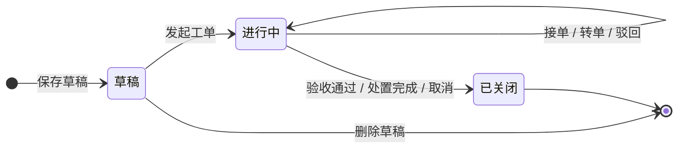
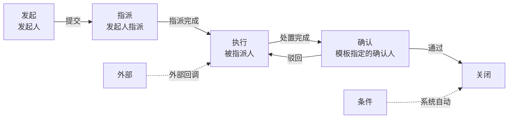
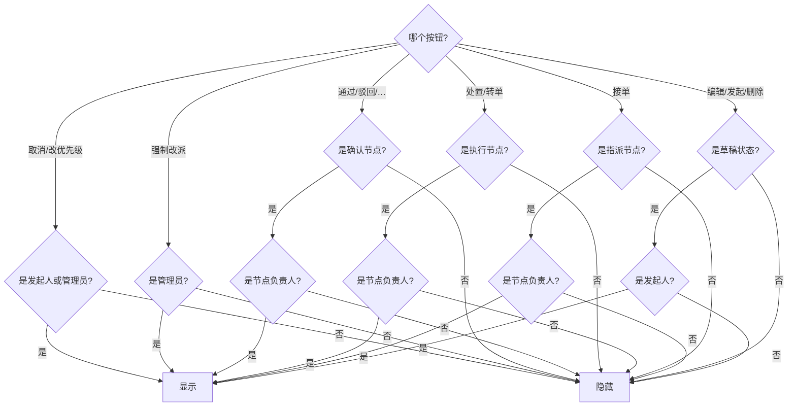

# 工单流转 — 按钮权限设计

> 不绑定物业/消防/监管等业务身份，用虚拟角色替代。

---

## 一、虚拟角色

| 角色 | 是谁 | 判定方式 |
|------|------|---------|
| **发起人** | 工单创建者 | 当前用户 = 工单创建者 |
| **节点负责人** | 当前节点指派的人 | 当前用户 = 当前节点的负责人 |
| **管理员** | 平台管理员 | 系统全局标记 |
| **查看者** | 无关人员 | 以上都不是 |

> **"节点负责人"随节点变化**。指派节点的负责人是发单时选的人；执行节点的负责人是被指派的人；确认节点的负责人是模板配置的确认人。

---

## 二、工单状态流转



---

## 三、七种节点一览

| 节点 | 含义 | 有负责人? | 有操作按钮? | 说明 |
|------|------|:---:|:---:|------|
| **发起** | 工单创建时填表 | 固定=发起人 | 无 | 在发起弹窗完成 |
| **指派** | 分发任务给人 | ✅ 模板配置 | 无 | 接入→指派→执行 |
| **执行** | 人到现场处置 | ✅ 承接指派的人 | 保存 | 处置→提交→下一节点 |
| **确认** | 验收处置结果 | ✅ 模板配置 | 通过/驳回/… | 模板可配确认人来源 |
| **条件** | 自动分支判断 | 无 | 无 | 系统自动，无人参与 |
| **外部** | 外部系统回调 | 无 | 无 | 等待外部接口回调 |
| **关闭** | 流程终点 | 无 | 无 | 到达即关闭 |



---

## 四、按钮权限矩阵

> 规则：**按钮 = 状态 × 角色 × 当前节点**

### 4.1 列表页

| 按钮 | 草稿 | 进行中 | 已关闭 | 谁能点 |
|------|:---:|:-----:|:-----:|------|
| 详情 | ✅ | ✅ | ✅ | 所有人 |
| 发起 | ✅ | — | — | 发起人 / 管理员 |
| 删除 | ✅ | — | — | 发起人 / 管理员 |

### 4.2 详情页 — 顶部和底部

| 按钮 | 草稿 | 进行中 | 已关闭 | 谁能点 |
|------|:---:|:-----:|:-----:|------|
| 编辑 | ✅ | — | — | 发起人 |
| 发起 | ✅ | — | — | 发起人 |
| 删除 | ✅ | — | — | 发起人 / 管理员 |
| 修改优先级 | ✅ | ✅ | — | 发起人 / 管理员 |
| 接单 | — | 指派节点 | — | 节点负责人 |
| 转单 | — | 执行节点 | — | 节点负责人 |
| 强制改派 | — | ✅ | — | 管理员 |
| 取消 | ✅ | ✅ | — | 发起人 / 管理员 |

### 4.3 详情页 — 节点操作区

| 按钮 | 哪个节点出现 | 谁能点 |
|------|------------|------|
| 保存（指派） | 指派节点 | 节点负责人 |
| 保存（处置） | 执行节点 | 节点负责人 |
| 通过 / 驳回 / … | 确认节点 | 节点负责人（确认人） |
| — | 发起 / 条件 / 外部 / 关闭 | 无操作 |

> 确认节点的按钮文字和数量由模板的动作列表（`actions`）配置，不限于"通过/驳回"。确认人是谁也由模板配置决定。

---

## 五、决策流程



---

## 六、确认人配置（模板配置时决定）

确认节点已支持指派配置，和指派节点共用同一套机制：

| 指派来源 | 选项 | 说明 |
|---------|------|------|
| 静态指定 | 选人 + 多人模式 | 模板配死，运行时不改 |
| 动态表单字段 | 选表单字段 | 运行时从表单中取指派人 |

**缺失项**："发起人确认"目前没有快捷入口。建议在静态指定中增加一个勾选框：

```
┌─────────────────────────────────┐
│ 指派策略                         │
│  ○ 静态指定  ○ 动态表单字段       │
│  ☑ 指派给发起人（发起人确认）      │  ← 新增：勾选后自动填入发起人
│  ── 或 ──                       │
│  指派人员  [人员选择器]           │
│  多人模式  [任一人 / 每人]         │
└─────────────────────────────────┘
```

勾选"指派给发起人"后，运行时 `getRole()` 判断确认节点的负责人 = 发起人。

---


## 八、落地方案

```
src/utils/permission.ts            →  getRole(order, currentNode, user)
                                       返回"发起人/节点负责人/管理员/查看者"

src/composables/useButtonPerms.ts   →  useButtonPerms(order, currentNode, user)
                                       返回 { 可编辑, 可发起, 可删除, 可接单,
                                              可转单, 可处置, 可通过, 可驳回,
                                              可改派, 可取消, ... }
```

模板只用布尔值：

```vue
<button v-if="perms.可接单" @click="接单">接单</button>
<button v-if="perms.可改派" @click="改派">强制改派</button>
<button v-if="perms.可通过" @click="通过">通过</button>
```
