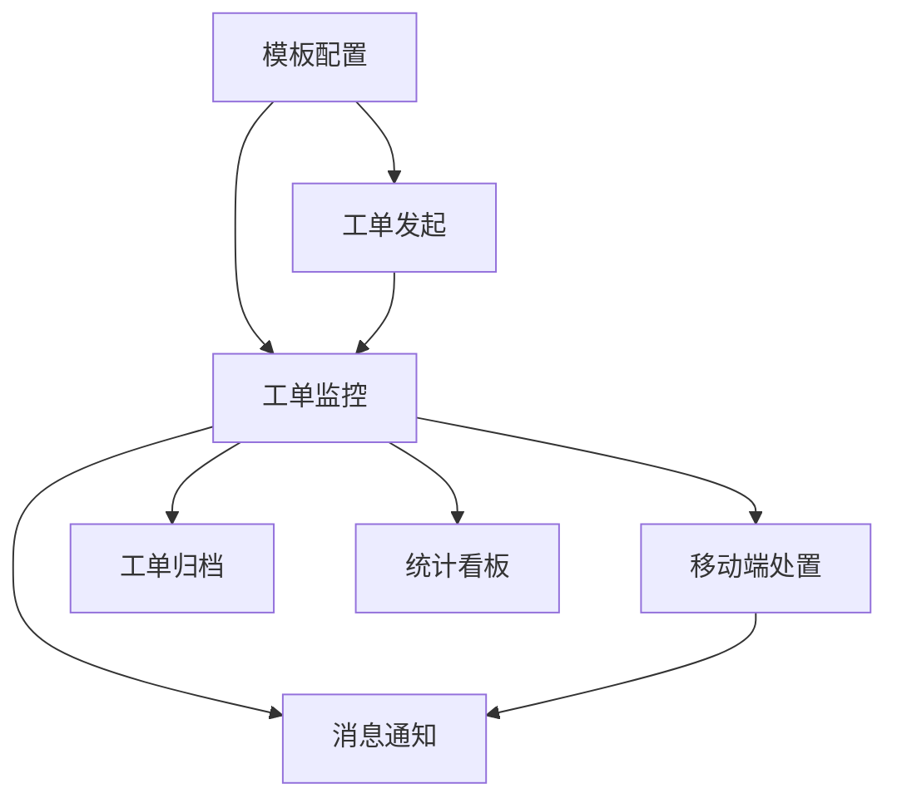

# 工单管理 — 模块拆分方案

> 基于业务设计：[biz-design.md](biz-design.md)
> 生成日期：2026-06-02

---

## 1. 核心实体

| 实体 | 核心属性 | 说明 |
|------|---------|------|
| **工单模板** | `id, name, version, status, nodes[], formFields[]` | 定义工单类型和流转规则 |
| **工单实例** | `id, orderNo, status, priority, templateId, currentNodeIndex, totalNodes, sla` | 运行时工单 |
| **流程节点** | `id, name, type, status, assigneeName, completedAt, order` | 工单流转的每一步 |
| **操作记录** | `id, action, operatorName, content, createdAt` | 每个节点的处置痕迹 |
| **SLA 指标** | `ttrMinutes, ttsMinutes, ttsProgress, slaStatus, yellowThreshold` | 时效管控数据 |
| **用户/角色** | `id, name, orgId, role` | 三方权限主体 |

---

## 2. 模块清单

### M0 模板配置 ✅ 已有
- **职责**：定义工单类型、表单字段、流转节点
- **核心功能点**：
  - [x] 模板列表（CRUD + 状态管理）
  - [x] 三步配置（基础设置→表单设计→流程设计）
  - [x] 6 类节点 + 动态指派
  - [x] SLA 计时配置
  - [ ] 模板版本管理（发布/停用/历史版本）
- **关键页面**：`TemplateList`、`TemplateConfig`
- **依赖模块**：无
- **复杂度评估**：高
- **Demo 优先级**：P0（已完成）

### M1 工单监控 ✅ 已有
- **职责**：工单列表、筛选、详情查看
- **核心功能点**：
  - [x] 统计卡片（7 种状态一键筛选）
  - [x] 筛选操作区（搜索+下拉+日期+查询/重置）
  - [x] 数据表格（SLA 三色+进度+操作列）
  - [x] 详情抽屉（基本信息两列+时间线三态+SLA 指标）
  - [x] 独立详情页（已关闭工单完整查看）
- **关键页面**：`WorkOrderMonitor`、`WorkOrderDetail`
- **依赖模块**：M0
- **复杂度评估**：高
- **Demo 优先级**：P0（已完成）

### M2 工单发起 新增 P0
- **职责**：从模板创建工单实例
- **核心功能点**：
  - [ ] 模板选择（卡片列表，显示名称+节点数）
  - [ ] 表单填写（动态渲染模板定义字段）
  - [ ] 提交创建（状态=草稿，可继续编辑或正式提交）
- **关键页面**：发起弹窗（el-dialog，嵌入 WorkOrderMonitor）
- **依赖模块**：M0、M1
- **复杂度评估**：低
- **Demo 优先级**：P0

### M3 移动端处置 新增 P0
- **职责**：工程师在微信小程序中处理工单
- **核心功能点**：
  - [ ] 待办列表（待接单+处置中，按紧急程度排序）
  - [ ] 工单详情（基本信息+时间线+操作按钮）
  - [ ] 接单/转单（一键操作）
  - [ ] 现场处置（填写结果+拍照上传）
- **关键页面**：任务列表、任务详情、处置表单
- **依赖模块**：M1、M2
- **复杂度评估**：中（新端，新 UI 框架）
- **Demo 优先级**：P0

### M4 工单归档 新增 P1
- **职责**：已关闭工单检索、查看、导出
- **核心功能点**：
  - [ ] 归档列表（复用 filter-bar 范式，默认展示已关闭）
  - [ ] 高级筛选（时间范围+模板+优先级+SLA 结果）
  - [ ] 导出（Excel/CSV）
  - [ ] 详情查看（复用 M1 的 WorkOrderDetail 独立页）
- **关键页面**：`WorkOrderArchive`
- **依赖模块**：M1
- **复杂度评估**：低
- **Demo 优先级**：P1

### M5 统计看板 新增 P1
- **职责**：SLA 达标率、工单趋势、效率排行
- **核心功能点**：
  - [ ] 顶部指标卡（本月总数/达标率/平均时长/超时数）
  - [ ] 工单趋势图（近30天折线图）
  - [ ] 模板分布饼图
  - [ ] 处理人效率排行表
  - [ ] 时间范围筛选器
- **关键页面**：`WorkOrderStats`
- **依赖模块**：M1
- **复杂度评估**：中（需引入 ECharts）
- **Demo 优先级**：P1

### M6 消息通知 新增 P2
- **职责**：SLA 预警、工单指派通知
- **核心功能点**：
  - [ ] 站内消息中心（Web 顶部铃铛+列表）
  - [ ] 语音通知（SLA 红灯时自动拨打）
  - [ ] 短信通知（紧急工单指派时发送）
- **关键页面**：消息中心、通知配置
- **依赖模块**：M1、M2、M3
- **复杂度评估**：中（第三方服务对接）
- **Demo 优先级**：P2

---

## 3. 模块依赖图

---

## 4. MVP 建议

| 阶段 | 模块 | 工作量 | 累计效果 |
|------|------|--------|---------|
| **已有** | M0 + M1 | — | 配置+监控闭环 |
| **MVP-1** | M2 工单发起 | 小（1 弹窗） | 发起→监控→详情 闭环 |
| **MVP-2** | M3 移动端处置 | 中（3 页面，新端） | 发起→处置→验收 全链路 |
| **MVP-3** | M4 + M5 | 小+中 | 归档检索+统计看板 |
| **延后** | M6 | 中 | 消息通知（需第三方对接） |

建议开发顺序：M2 → M3 → M4 → M5 → M6
