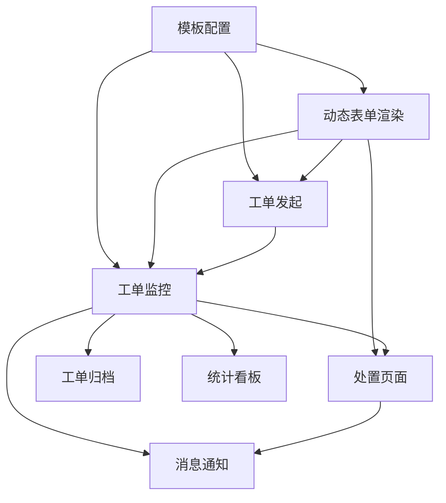

# 工单管理 — 模块拆分方案

> 基于业务设计：[biz-design.md](biz-design.md)
> 生成日期：2026-06-02

---

## 1. 核心实体

| 实体 | 核心属性 | 说明 |
|------|---------|------|
| **工单模板** | `id, name, version, status, nodes[], formFields[]` | 定义工单类型和流转规则 |
| **工单实例** | `id, orderNo, status, priority, templateId, currentNodeIndex, totalNodes, sla` | 运行时工单 |
| **流程节点** | `id, name, type, status, assigneeName, completedAt, order` | 工单流转的每一步 |
| **操作记录** | `id, action, operatorName, content, createdAt` | 每个节点的处置痕迹 |
| **SLA 指标** | `ttrMinutes, ttsMinutes, ttsProgress, slaStatus, yellowThreshold` | 时效管控数据 |
| **用户/角色** | `id, name, orgId, role` | 三方权限主体 |

---

## 2. 模块清单

### M0 模板配置 ✅ 已有（2026-06-15 设计更新）
- **职责**：定义工单类型、表单字段、流转节点
- **核心功能点**：
  - [x] 模板列表（CRUD + 状态管理）：操作列=预览/编辑/删除/开关/复制，列含模版概览(节点·字段数)
  - [x] 三步配置（基础设置→表单设计→流程设计）：按钮=取消/上一步/下一步
  - [x] 基础设置：模版名称* + 工单说明 + 谁可发起工单(人员选择器) + SLA 四档独立配置(紧急/高/普通/低)
  - [x] 表单设计：三栏布局(组件面板+实时预览+属性配置)，基础组件6种+业务组件3种(事件/异常/隐患信息)
  - [x] 流程设计：7 类节点 + 动态指派，节点属性面板(节点信息/表单权限/超时配置 Tab)
  - [x] SLA 计时配置：四档优先级独立卡片(TTR+TTS)
  - [ ] 模板版本管理（发布/停用/历史版本）
- **关键页面**：`TemplateList`、`TemplateConfig`
- **依赖模块**：无
- **复杂度评估**：高
- **Demo 优先级**：P0（已完成）

### M1 工单监控 ✅ 已有（2026-06-15 设计更新）
- **职责**：工单全量列表、SLA 监控、详情查看、按岗位数据范围过滤
- **核心功能点**：
  - [x] 统计卡片（全部/草稿/进行中/已关闭，按状态一键筛选 + 按岗位数据范围过滤）
  - [x] 筛选操作区（工单编号/发起人搜索+SLA状态+优先级+日期范围+查询/重置）
  - [x] 数据表格（工单状态Tag + SLA Tag+icon + 工单编号 + 工单标题 + 优先级 Tag+icon + 流程进度条 + 发起时间 + 操作列仅预览）
  - [x] 独立详情页（三状态：指派/执行/确认，双栏布局：流程进度+只读信息+当前节点操作+流转记录）
  - [x] 工单级操作栏（转派/取消工单/手动关闭）
  - [x] 岗位数据范围过滤（2026-06-09 新增）
  - [ ] 详情页 DynamicForm 只读/可编辑分离（改造中）
- **关键页面**：`WorkOrderMonitor`、`WorkOrderDetail`
- **依赖模块**：M0、M-N（DynamicForm）
- **复杂度评估**：高
- **Demo 优先级**：P0（已完成）
- **设计决策**：工单监控是管理工具，**不提供"发起工单"入口**。发起工单属于工作台（M2）。但监控页提供"发起工单"快捷按钮（outlined）以方便管理角色快速操作。

### M-N 动态表单渲染（新增 · P0 · 基础设施）
- **职责**：将模板配置的表单字段在运行时渲染为可交互表单，按节点权限控制可编辑/只读/隐藏
- **定位**：平台基础设施。支撑工单发起、节点处置、详情查看等所有需要渲染动态表单的场景
- **核心功能点**：
  - [ ] DynamicForm 组件（fields + permissions + initialData → 渲染表单）
  - [ ] 三态权限控制（hidden / readonly / editable）
  - [ ] 8 种字段类型映射（input, textarea, radio, checkbox, select, date, upload, number）
  - [ ] initialData 回填
  - [ ] 全局 readonly 模式
- **关键组件**：`components/business/DynamicForm.vue`
- **依赖模块**：@form-create/element-ui（运行时渲染）、M0（模板字段定义）
- **复杂度评估**：中
- **Demo 优先级**：P0
- **设计文档**：[00c-动态表单渲染设计](00c-动态表单渲染设计.md)

### M2 工单发起 ✅ 已完成
- **职责**：从模板创建工单实例，动态渲染模板定义的表单字段
- **入口**：工作台 `QuickActionsWidget`（不再是工单监控页按钮）
- **核心功能点**：
  - [x] 模板选择（卡片列表，显示名称+节点数）
  - [x] 优先级 + 工单标题 + 备注
  - [x] DynamicForm 嵌入：渲染模板发起节点的可编辑字段
  - [x] 保存草稿 / 立即发起
- **关键组件**：`CreateOrderDialog.vue`（抽屉模式）
- **依赖模块**：M0、M-N（DynamicForm）
- **复杂度评估**：中
- **Demo 优先级**：P0（已完成）
- **设计决策**：发起工单是个人操作，入口在工作台而非监控页。监控页是管理工具，不承担创建职责。

### M3 处置页面 + 移动端处置 修改 P0（2026-06-15 设计更新）
- **职责**：Web 端详情页处置（指派/执行/确认）+ 微信小程序处置
- **Web 端核心功能点**：
  - [x] 详情页 `/system/order/:id` 操作区（工单上下文 + DynamicForm）
  - [x] 按 nodeType 切换三状态操作区：指派(人员选择器+保存)/执行(DynamicForm+保存)/确认(驳回danger+通过primary)
  - [x] 工单信息（只读区）：灰色背景卡片，展示已完成节点数据（含照片等附件）
  - [ ] DynamicForm 渲染 editable 字段（只读字段已在只读区展示）
  - [x] 表单提交 → nodeRecords + formData 更新
- **移动端核心功能点**：
  - [ ] 待办列表（待接单+处置中）
  - [ ] 处置表单（DynamicForm 小程序版）
- **关键页面**：`WorkOrderDetail.vue`（Web）+ 小程序页面
- **依赖模块**：M1、M2、M-N（DynamicForm）
- **复杂度评估**：高
- **Demo 优先级**：P0

### M4 工单归档 新增 P1
- **职责**：已关闭工单检索、查看、导出
- **核心功能点**：
  - [ ] 归档列表（复用 filter-bar 范式，默认展示已关闭）
  - [ ] 高级筛选（时间范围+模板+优先级+SLA 结果）
  - [ ] 导出（Excel/CSV）
  - [ ] 详情查看（复用 M1 的 WorkOrderDetail 独立页）
- **关键页面**：`WorkOrderArchive`
- **依赖模块**：M1
- **复杂度评估**：低
- **Demo 优先级**：P1

### M5 统计看板 新增 P1
- **职责**：SLA 达标率、工单趋势、效率排行
- **核心功能点**：
  - [ ] 顶部指标卡（本月总数/达标率/平均时长/超时数）
  - [ ] 工单趋势图（近30天折线图）
  - [ ] 模板分布饼图
  - [ ] 处理人效率排行表
  - [ ] 时间范围筛选器
- **关键页面**：`WorkOrderStats`
- **依赖模块**：M1
- **复杂度评估**：中（需引入 ECharts）
- **Demo 优先级**：P1

### M6 消息通知 新增 P2
- **职责**：SLA 预警、工单指派通知
- **核心功能点**：
  - [ ] 站内消息中心（Web 顶部铃铛+列表）
  - [ ] 语音通知（SLA 红灯时自动拨打）
  - [ ] 短信通知（紧急工单指派时发送）
- **关键页面**：消息中心、通知配置
- **依赖模块**：M1、M2、M3
- **复杂度评估**：中（第三方服务对接）
- **Demo 优先级**：P2

---

## 3. 模块依赖图

---

## 4. MVP 建议

| 阶段 | 模块 | 工作量 | 累计效果 |
|------|------|--------|---------|
| **已有** | M0 + M1 | — | 配置+监控闭环 |
| **MVP-1** | M2 工单发起 | 小（1 弹窗） | 发起→监控→详情 闭环 |
| **MVP-2** | M3 移动端处置 | 中（3 页面，新端） | 发起→处置→验收 全链路 |
| **MVP-3** | M4 + M5 | 小+中 | 归档检索+统计看板 |
| **延后** | M6 | 中 | 消息通知（需第三方对接） |

建议开发顺序：M2 → M3 → M4 → M5 → M6
