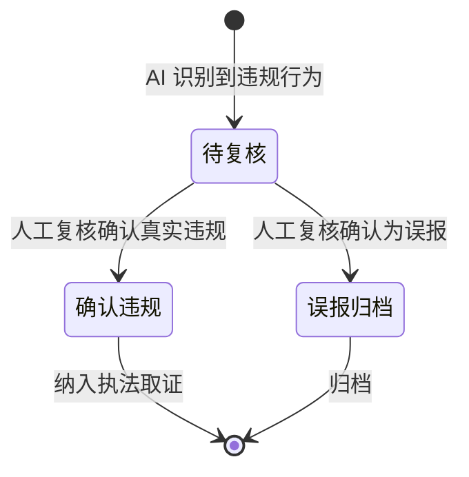

# AI 预警记录列表 — 设计文档

> 大屏 Tab 内嵌组件：消防控制室管理 > AI 预警 Tab。🆕 新建。
> Demo 用 Mock 数据模拟 AI 识别结果，不接入真实 AI 摄像头 SDK。

---

## 一、页面元信息

| 项目 | 内容 |
|------|------|
| 页面名称 | `AI 预警记录列表` |
| 所属模块 | `M1 AI 视频预警` |
| 页面类型 | `列表管理` |
| 路由路径 | Tab 组件 `FireControlAlerts.vue`（内嵌于 `FireControlPage.vue`） |

### 功能描述

AI 视频预警记录的列表管理页面，按预警类型统计、支持类型筛选、处置状态标记，展示 AI 识别到的消控室违规行为。

---

## 二、页面结构

### 列表管理 页布局

| # | 区域名称 | 位置 | 注册表组件 | 包含元素 |
|---|---------|------|-----------|---------|
| 1 | 预警类型统计卡片 | 并排-5 | `MetricCard` × 5 | 5 张统计卡片：脱岗预警 / 睡岗预警 / 替岗预警 / 吸烟预警 / 明火预警。每张卡片显示预警类型名称 + 今日数量，点击切换表格筛选 |
| 2 | 数据表格 | 全宽 | `DataTable` | 列：预警时间、预警类型(StatusTag)、消控室名称、截图缩略图(64×40)、处置状态(StatusTag)、处置人、处置时间。预警截图 click 放大预览（el-image-viewer） |
| 3 | 分页器 | 底部 | `el-pagination` | layout="prev, pager, next"，page-size=10 |

---

## 三、数据模型

### 3.1 实体字段

| 字段名 | 中文名 | 类型 | 必填 | 说明 |
|--------|--------|------|------|------|
| id | 记录ID | number | 是 | 主键 |
| enterpriseId | 企业ID | number | 是 | 所属企业 |
| roomName | 消控室名称 | string | 是 | 如"1#消控室" |
| alertType | 预警类型 | string | 是 | off-post / sleeping / substitution / smoking / fire |
| alertTime | 预警时间 | string | 是 | YYYY-MM-DD HH:mm:ss |
| snapshotUrl | 截图地址 | string | 是 | AI 抓拍图片 URL |
| status | 处置状态 | string | 是 | pending / confirmed / false-alarm |
| handlerName | 处置人 | string | 否 | 复核人姓名 |
| handledAt | 处置时间 | string | 否 | YYYY-MM-DD HH:mm:ss |

### 3.2 预警类型枚举

| 枚举值 | 标签文字 | 颜色类型 | 说明 |
|--------|---------|---------|------|
| off-post | 脱岗 | danger | 值班员离开消控室超过设定时间 |
| sleeping | 睡岗 | danger | AI 识别到值班员睡觉 |
| substitution | 替岗 | warning | 人证比对不一致，无证人员顶岗 |
| smoking | 吸烟 | warning | 消控室内吸烟 |
| fire | 明火 | danger | AI 识别到明火 |

### 3.3 处置状态枚举

| 枚举值 | 标签文字 | 颜色类型 | 说明 |
|--------|---------|---------|------|
| pending | 待复核 | warning | 预警生成，等待人工复核 |
| confirmed | 确认违规 | danger | 复核确认为违规，纳入执法取证 |
| false-alarm | 误报归档 | normal | 复核确认为误报 |

---

## 四、查询参数

| 参数名 | 中文名 | 类型 | 控件类型 | 选项 | folded |
|--------|--------|------|---------|------|--------|
| alertType | 预警类型 | string | select | all / off-post / sleeping / substitution / smoking / fire | — |
| status | 处置状态 | string | select | all / pending / confirmed / false-alarm | true |
| page | 页码 | number | — | — | — |
| size | 每页条数 | number | — | — | — |

> 注：统计卡片已覆盖预警类型筛选（5 张卡片 = 全部类型），故 FilterBar 中**不重复放置预警类型下拉**。仅放置处置状态下拉（折叠展示）。

---

## 五、接口定义

> Demo 阶段使用 Mock 数据。后端接口规格预留。

| 接口 | 方法 | 路径 | 说明 |
|------|------|------|------|
| 查询预警记录 | GET | `/api/fire-control/alerts` | 分页查询，支持 alertType/status 筛选 |

**请求参数**：`{ enterpriseId, alertType, status, page, size }`

**响应类型**：
```typescript
{
  total: number
  list: AlertRecord[]
  stats: { offPost: number, sleeping: number, substitution: number, smoking: number, fire: number }
}
```

---

## 六、业务逻辑

### 6.1 状态流转



### 6.2 交互行为

| 操作 | 触发条件 | 行为描述 |
|------|---------|---------|
| 点击统计卡片 | 点击任意预警类型卡片 | 表格筛选对应类型的预警记录，卡片高亮 |
| 点击截图缩略图 | 点击表格中截图列 | 弹出 `el-image-viewer` 大图预览 |
| 切换处置状态下拉 | 选择"待复核/确认违规/误报归档" | 表格按处置状态筛选 |

### 6.3 特殊规则

| 规则编号 | 规则内容 | 判定逻辑 |
|---------|---------|---------|
| A01 | 预警生成 | AI 识别到违规行为 → 自动生成预警记录，status=pending |
| A02 | 预警推送 | status=pending 的记录同步推送至安全管理员（Demo 略） |
| A03 | 统计卡片联动 | 卡片显示今日各类型预警数量，点击切换表格筛选 |

---

## 七、UI 组件分配

| # | 区域 | 注册表组件 | 关键 Props |
|---|------|-----------|-----------|
| 1 | 预警类型统计卡片 | `MetricCard` × 5 | label + value + color，click 事件切换筛选 |
| 2 | 数据表格 | `DataTable` | columns（含 StatusTag × 2 + 截图缩略图），截图列 click 弹出 viewer |
| 3 | 分页器 | `el-pagination` | layout="prev, pager, next" |
