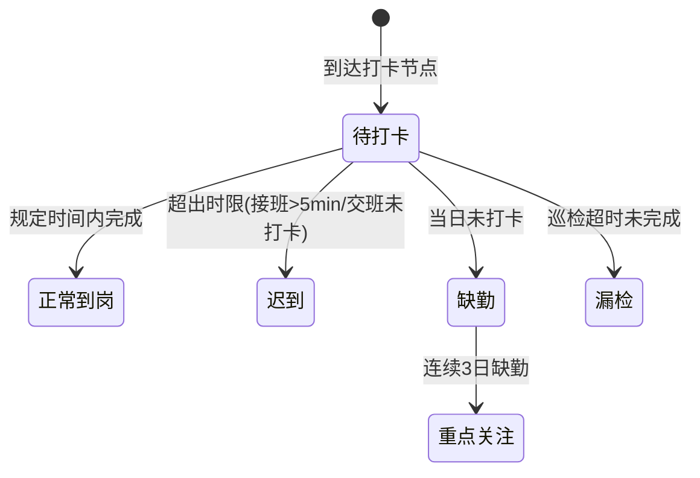

# 值班记录列表 — 设计文档

> 大屏 Tab 内嵌组件：消防控制室管理 > 值班记录 Tab。
> 改造目标：从简单到岗/离岗记录 → 强制打卡节点 + 规则引擎 + 履责卡链接。

---

## 一、页面元信息

| 项目 | 内容 |
|------|------|
| 页面名称 | `值班记录列表` |
| 所属模块 | `M0 值班履责打卡` |
| 页面类型 | `列表管理` |
| 路由路径 | Tab 组件 `FireControlDutyRecords.vue`（内嵌于 `FireControlPage.vue`） |

### 功能描述

值班履责打卡的列表管理页面，支持按日期筛选、打卡类型分类展示、迟到/缺勤/漏检规则判定、连续缺勤重点关注标记。

---

## 二、页面结构

### 列表管理 页布局

| # | 区域名称 | 位置 | 注册表组件 | 包含元素 |
|---|---------|------|-----------|---------|
| 1 | 日期筛选区 | 顶部 | `FilterBar` | 快捷按钮组：今日 / 本周 / 本月，切换更新表格数据。额外下拉：打卡类型（全部 / 到岗打卡 / 交接班打卡 / 巡检打卡） |
| 2 | 数据表格 | 全宽 | `DataTable` | 列：值班日期、消控室名称、值班人员、打卡类型(StatusTag)、到岗时间、离岗时间、打卡状态(StatusTag)、备注。数据源由父组件 `FireControlPage.vue` 传入 `records` prop，本组件负责筛选和展示 |
| 3 | 分页器 | 底部 | `el-pagination` | layout="prev, pager, next"，page-size=10 |

---

## 三、数据模型

### 3.1 实体字段

| 字段名 | 中文名 | 类型 | 必填 | 说明 |
|--------|--------|------|------|------|
| id | 记录ID | number | 是 | 主键 |
| enterpriseId | 企业ID | number | 是 | 所属企业 |
| roomName | 消控室名称 | string | 是 | 如"1#消控室" |
| personnelName | 值班人员 | string | 是 | 值班员姓名 |
| dutyType | 打卡类型 | string | 是 | check-in / handover / patrol |
| shiftDate | 值班日期 | string | 是 | YYYY-MM-DD |
| checkInTime | 到岗时间 | string | 是 | HH:mm，缺勤时显示"--" |
| checkOutTime | 离岗时间 | string | 否 | HH:mm |
| status | 打卡状态 | string | 是 | on-time / late / absent / missed |
| notes | 备注 | string | 否 | 如"迟到12分钟""连续3日缺勤→重点关注" |

### 3.2 状态枚举

| 枚举值 | 标签文字 | 颜色类型 | 说明 |
|--------|---------|---------|------|
| on-time | 正常到岗 | success | 规定时间内完成打卡 |
| late | 迟到 | warning | 接班超 5 分钟 / 交班前未打卡 |
| absent | 缺勤 | danger | 当日未打卡 |
| missed | 漏检 | danger | 巡检打卡超时未完成 |

### 3.3 打卡类型枚举

| 枚举值 | 标签文字 | 颜色类型 | 说明 |
|--------|---------|---------|------|
| check-in | 到岗打卡 | info | 接班时打卡 |
| handover | 交接班打卡 | warning | 交班前后打卡 |
| patrol | 巡检打卡 | success | 每 2 小时整点巡检 |

---

## 四、查询参数

| 参数名 | 中文名 | 类型 | 控件类型 | 选项 | folded |
|--------|--------|------|---------|------|--------|
| dateFilter | 日期范围 | string | select | today / week / month | — |
| dutyType | 打卡类型 | string | select | all / check-in / handover / patrol | true |
| page | 页码 | number | — | — | — |
| size | 每页条数 | number | — | — | — |

---

## 五、接口定义

> Demo 阶段使用 Mock 数据，父组件传入 `records` prop。后端接口规格预留。

| 接口 | 方法 | 路径 | 说明 |
|------|------|------|------|
| 查询值班记录 | GET | `/api/fire-control/duty-records` | 分页查询，支持 dateFilter/dutyType 筛选 |

**请求参数**：`{ enterpriseId, dateFilter, dutyType, page, size }`

**响应类型**：
```typescript
{
  total: number
  list: DutyRecord[]
}
```

---

## 六、业务逻辑

### 6.1 状态流转



### 6.2 交互行为

| 操作 | 触发条件 | 行为描述 |
|------|---------|---------|
| 切换日期筛选 | 点击快捷按钮（今日/本周/本月） | 更新 `dateFilter`，表格数据按日期过滤 |
| 切换打卡类型 | 下拉选择 | 更新 `dutyType`，表格数据按打卡类型过滤 |
| 连续缺勤标记 | 系统判定同一人员连续 3 日 status=absent | notes 列追加"连续3日缺勤→重点关注"，行背景变红 |

### 6.3 特殊规则

| 规则编号 | 规则内容 | 判定逻辑 |
|---------|---------|---------|
| D01 | 接班打卡时限 | dutyType=check-in 且 checkInTime 超过接班时间 5 分钟 → status=late |
| D02 | 交班打卡时限 | dutyType=handover 且交班前 10 分钟未完成双人打卡 → status=late |
| D03 | 巡检打卡频率 | dutyType=patrol 且距上次巡检超过 2 小时 → status=missed |
| D04 | 连续缺勤升级 | 同一 personnelName + 连续 3 日 status=absent → notes 追加"重点关注"标签 |

---

## 七、UI 组件分配

| # | 区域 | 注册表组件 | 关键 Props |
|---|------|-----------|-----------|
| 1 | 日期筛选区 | `FilterBar` | 按钮组 + `el-select`（打卡类型） |
| 2 | 数据表格 | `DataTable` | columns（含 StatusTag × 2）、row-class-name（缺勤红底） |
| 3 | 分页器 | `el-pagination` | layout="prev, pager, next" |
