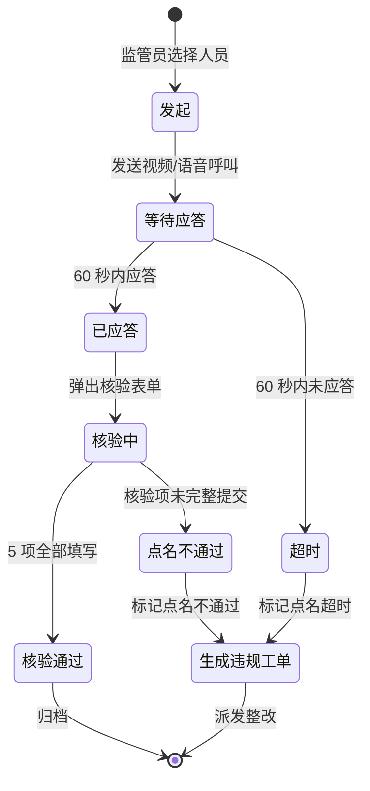

# 远程点名操作 — 设计文档

> 大屏 Tab 内嵌组件：消防控制室管理 > 远程点名 Tab。
> 改造目标：从简单有感点名 → 有感点名 + 无感点名记录 + 现场 5 项核验表单。

---

## 一、页面元信息

| 项目 | 内容 |
|------|------|
| 页面名称 | `远程点名操作` |
| 所属模块 | `M2 视频巡检点名` |
| 页面类型 | `列表管理` |
| 路由路径 | Tab 组件 `FireControlRollCall.vue`（内嵌于 `FireControlPage.vue`） |

### 功能描述

视频巡检点名的列表管理页面，左侧在岗人员列表（选人点名），右侧点名操作区（选人标签 + 发起点名 + 实时结果反馈）和历史点名记录表格。改造增加现场核验 5 项表单和无感点名记录。

---

## 二、页面结构

### 列表管理 页布局

| # | 区域名称 | 位置 | 注册表组件 | 包含元素 |
|---|---------|------|-----------|---------|
| 1 | 在岗人员列表 | 左侧 260px | 卡片列表 | 标题"在岗值班人员"，每个在岗人员一行（Checkbox + 绿点 + 姓名 + 所属消控室），支持多选。数据源：父组件传入 `personnel` prop（已过滤 onDuty=true） |
| 2 | 点名操作区 | 右侧（上部） | 卡片区域 | **已选人员标签行**：已选人员姓名 Tag（可移除）。**发起点名按钮**："发起远程点名（N人）"，disabled when N=0 or calling。**点名结果反馈列表**：逐人显示应答状态（✅已应答/❌超时/⏳等待中）+ 应答方式（📹视频/🎤语音） |
| 3 | 现场核验表单 | 右侧（中部） | `FormDialog` 内嵌 | **展开/折叠**：点名应答后展开。5 项必填：①消防主机状态(select:正常/有火警/有故障/有屏蔽) ②联动设备状态(checkbox-group:喷淋泵/消火栓泵/排烟风机/防火卷帘) ③应急物资(checkbox-group:对讲机/灭火器/应急灯/消防电话) ④门窗监控(select:正常/异常) ⑤证件核验(自动回填证书编号+人工确认 switch) |
| 4 | 点名记录表格 | 右侧（下部） | `DataTable` | 列：点名时间、被点名人、发起人、响应时间、点名状态(StatusTag)、应答方式、核验结果(StatusTag) |

---

## 三、数据模型

### 3.1 点名记录实体

| 字段名 | 中文名 | 类型 | 必填 | 说明 |
|--------|--------|------|------|------|
| id | 记录ID | number | 是 | 主键 |
| enterpriseId | 企业ID | number | 是 | 所属企业 |
| personnelName | 被点名人 | string | 是 | 值班员姓名 |
| initiator | 发起人 | string | 是 | 如"应急局监管员-张华" |
| callTime | 点名时间 | string | 是 | YYYY-MM-DD HH:mm:ss |
| responseTime | 响应时间 | string | 否 | 超时时为 null |
| status | 点名状态 | string | 是 | responded / timeout |
| responseMethod | 应答方式 | string | 否 | video / voice / null |
| callMode | 点名模式 | string | 是 | manual / auto（有感/无感） |
| checkItems | 核验结果 | object | 否 | 见 3.2 |

### 3.2 核验结果对象 (checkItems)

| 字段名 | 中文名 | 类型 | 说明 |
|--------|--------|------|------|
| hostStatus | 消防主机状态 | string | 正常 / 有火警 / 有故障 / 有屏蔽 |
| linkageDevices | 联动设备状态 | string[] | 喷淋泵 / 消火栓泵 / 排烟风机 / 防火卷帘 |
| emergencyGear | 应急物资 | string[] | 对讲机 / 灭火器 / 应急灯 / 消防电话 |
| doorWindow | 门窗监控 | string | 正常 / 异常 |
| certVerify | 证件核验 | boolean | true=核验通过 |

### 3.3 状态枚举

| 枚举值 | 标签文字 | 颜色类型 | 说明 |
|--------|---------|---------|------|
| responded | 已应答 | success | 60 秒内视频/语音应答 |
| timeout | 超时 | danger | 60 秒内未应答 |

### 3.4 点名模式枚举

| 枚举值 | 标签文字 | 颜色类型 | 说明 |
|--------|---------|---------|------|
| manual | 有感点名 | info | 监管员手动发起 |
| auto | 无感点名 | normal | AI 定时自动发起，记录在岗状态 |

---

## 四、查询参数

| 参数名 | 中文名 | 类型 | 控件类型 | 选项 | folded |
|--------|--------|------|---------|------|--------|
| callMode | 点名模式 | string | select | all / manual / auto | — |
| status | 点名状态 | string | select | all / responded / timeout | — |
| page | 页码 | number | — | — | — |
| size | 每页条数 | number | — | — | — |

---

## 五、接口定义

> Demo 阶段使用 Mock 数据和模拟点名流程。后端接口规格预留。

| 接口 | 方法 | 路径 | 说明 |
|------|------|------|------|
| 查询点名记录 | GET | `/api/fire-control/roll-calls` | 分页查询，支持 callMode/status 筛选 |
| 发起有感点名 | POST | `/api/fire-control/roll-calls` | 选择人员，发起视频/语音呼叫 |
| 提交核验结果 | PUT | `/api/fire-control/roll-calls/:id/check` | 点名应答后提交核验表单 |
| 查询在岗人员 | GET | `/api/fire-control/roll-calls/personnel` | 获取在岗值班人员列表 |

---

## 六、业务逻辑

### 6.1 点名流程

### 6.2 交互行为

| 操作 | 触发条件 | 行为描述 |
|------|---------|---------|
| 选择人员 | 点击左侧人员行 / Checkbox | 切换选中状态，已选标签行实时更新 |
| 移除已选人员 | 点击已选标签的 × 按钮 | 取消该人员选中，calling 状态下禁用 |
| 发起点名 | 点击"发起远程点名（N人）"按钮 | 按钮禁用 → 显示 spinner → 逐一呼叫（1.5~4.5s 随机延迟模拟），实时更新结果 |
| 展开核验表单 | 人员应答成功后 | 点名结果行展开"填写核验"链接，点击展开 5 项核验表单 |
| 提交核验 | 5 项全部填写后点击"确认核验" | 核验结果计入点名记录 checkItems 字段，更新记录核验状态 |
| 切换点名模式筛选 | 下拉选择"有感/无感" | 表格筛选对应模式记录 |

### 6.3 特殊规则

| 规则编号 | 规则内容 | 判定逻辑 |
|---------|---------|---------|
| R01 | 口令响应时限 | 点名发起后 60 秒内未应答 → status=timeout |
| R02 | 核验项必填 | 应答后 5 项核验内容未完整提交 → 点名不通过 |
| R03 | 无感点名记录 | callMode=auto 的记录为系统 AI 自动生成，只读展示，无需人工发起 |
| R04 | 人证核验 | certVerify=false or 证书编号与应答人不一致 → 标记人证不符 |

---

## 七、UI 组件分配

| # | 区域 | 注册表组件 | 关键 Props |
|---|------|-----------|-----------|
| 1 | 在岗人员列表 | —（卡片列表） | `personnel` prop，Checkbox + 状态点 + 姓名 + 消控室 |
| 2 | 点名操作区 | —（按钮 + 标签行） | 已选标签（可移除）+ 发起点名按钮（loading 态）+ 实时结果反馈 |
| 3 | 现场核验表单 | `FormDialog` | 内嵌于操作区，5 项表单控件（select / checkbox-group / switch） |
| 4 | 点名记录表格 | `DataTable` | columns（含 StatusTag × 2：点名状态 + 核验结果） |
