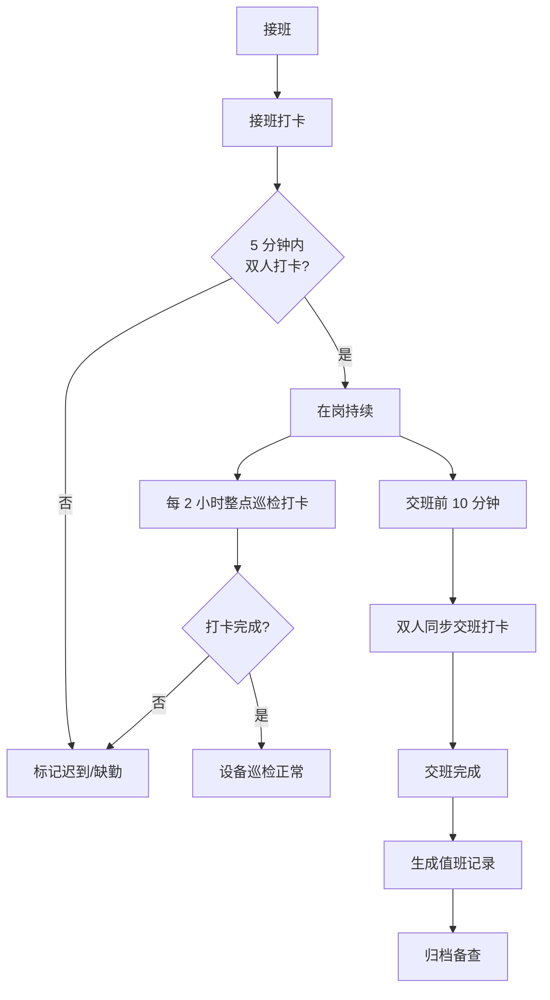
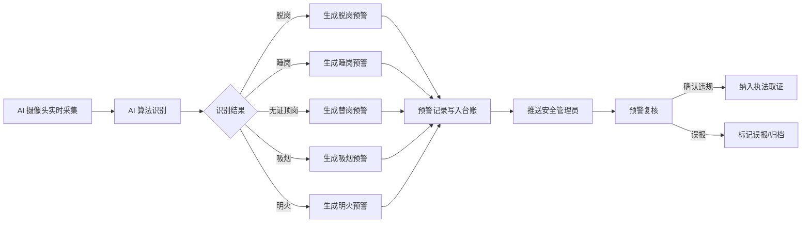
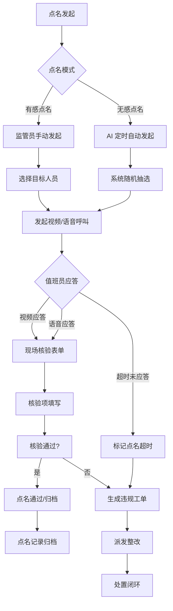
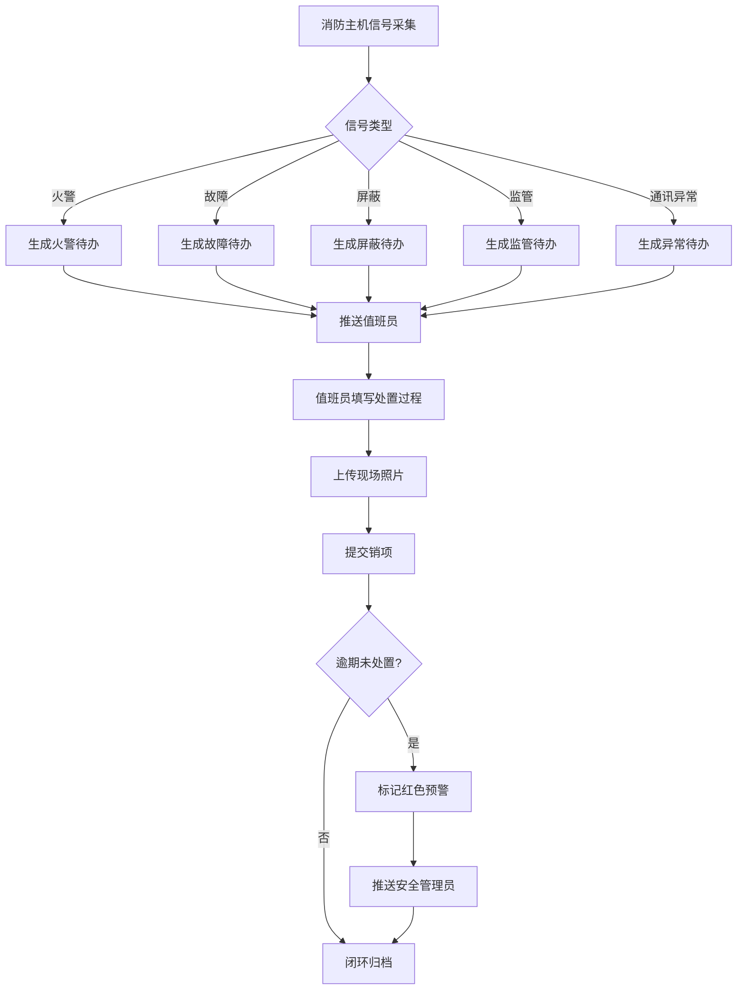
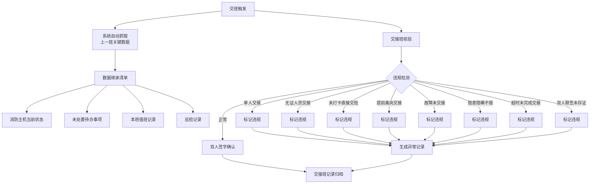
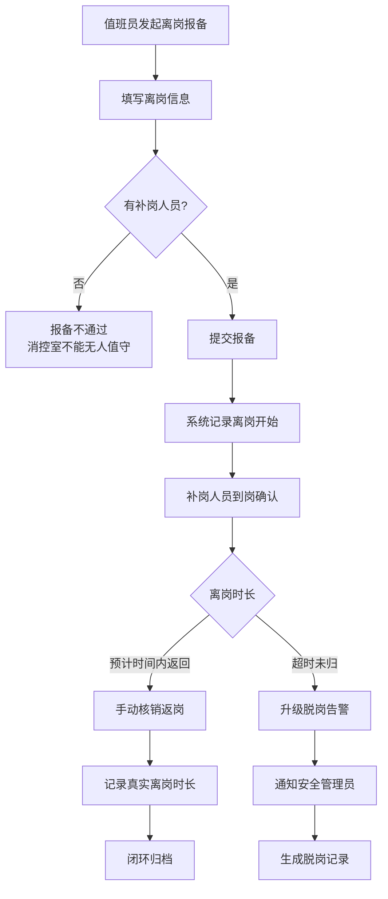

# 消防控制室管理 — 业务设计

> AI 安全管理平台子模块。最后更新：2026-07-02。
> 基于《"人工智能+消防值班室"应消联勤系统》方案设计，面向消防控制室值守全流程数字化管理。

---

## 一、产品定位

消防控制室管理是 AI 安全管理平台的**消控值守中枢**，以 AI 视频、主机数据、全流程台账为支撑，实现消控值班履职规范化、火灾风险预警前置化、多级应急联勤协同化、消防监管精准化。

**三级协同体系**：

| 层级 | 角色 | 核心职责 |
|------|------|---------|
| 企业自律层 | 消控值班员、安全管理员 | 值班打卡、设备巡检、报警处置、交接班 |
| 第三方值守网格 | 远程值守服务商 | AI 预警复核、远程视频点名、值守托管 |
| 应消监管层 | 应急局监管员 | 非现场执法、远程抽查、数据核查、执法取证 |

**核心闭环**：值班打卡 → AI 预警 → 视频点名 → 主机台账 → 交接班 → 离岗请假，6 大子模块串联消控室值守全流程。

**当前定位**：监管端大屏可视化，以"企业列表 → 消控室监控 → 值班履责 → 人员管理 → 远程点名"为主线，可按企业、消控室逐级下钻查看。

**消防控制室管理不是**：
- 不是消防报警系统（报警信号来自消防主机，本模块负责接收、记录、追溯，不负责产生报警）
- 不是视频监控平台（视频用于 AI 识别 + 远程点名核验，不做全域安防监控）
- 不是独立的考勤系统（打卡服务于消防合规，非企业人事考勤）

---

## 二、核心用户与价值

| 角色 | 端侧 | 核心诉求 | 价值 |
|------|------|---------|------|
| 消控值班员 | H5/APP | 打卡、核验、处置、报备离岗 | 替代纸质台账，操作留痕，合规免责 |
| 安全管理员（企业端） | Web | 查看本企业消控室状态、值班履责、预警处置 | 实时掌握消控室运行，满足消防检查 |
| 应急局监管员 | Web（大屏） | 远程抽查点名、非现场执法、调取历史记录 | 降本增效（免去现场巡查），精准执法 |
| 第三方值守服务商 | Web | 远程值守、AI 预警复核、代管处置 | 为无专职值班员的企业提供值守服务 |

---

## 三、模块全景

| 编号 | 模块 | 定位 | Demo 状态 |
|------|------|------|-----------|
| M0 | 值班履责打卡 | 强制打卡节点 + 规则引擎 + 履责卡链接 | 🔧 Demo 有基础（值班记录），缺打卡节点和规则 |
| M1 | AI 视频预警 | AI 智能识别违规行为 + 自动记录预警台账 | ❌ 待新增（Demo 仅有摄像头画面，无 AI 识别） |
| M2 | 视频巡检点名 | 有感点名 + 无感点名 + 现场核验 + 违规派单 | 🔧 Demo 有基础（远程点名），缺无感点名和核验 |
| M3 | 消防主机台账 | 主机数据采集 + 待办生成 + 处置闭环 + 责任追溯 | ❌ 待新增 |
| M4 | 交接班档案 | 数据继承 + 双人签认 + 8 类违规识别 + 电子存档 | ❌ 待新增 |
| M5 | 离岗请假 | 线上报备 + 补岗约束 + 超时告警 + 返岗核销 | ❌ 待新增 |
| M6 | 实时视频监控 | 消控室摄像头画面实时查看 + OSD 叠加 | ✅ Demo 已有 |

---

## 四、核心业务流程

### 4.1 值班履责打卡流程

**关键节点**：
- **接班打卡**：接班后 5 分钟内完成双人打卡，超时标记迟到
- **整点巡检打卡**：每 2 小时一次设备巡检，记录消防主机状态
- **交班打卡**：交班前 10 分钟双人同步打卡，超时标记异常
- **履责卡**：APP 端扫码激活，链接法律红线清单、隐患排查清单、值班人证件信息

### 4.2 AI 视频预警流程

**识别场景**：脱岗、睡岗、无证顶岗、主机无人看管、室内吸烟、明火识别
**Demo 实现**：用 Mock 预警记录列表替代真实 AI 识别，数据字段保持与真实系统一致

### 4.3 视频巡检点名流程

**现场核验 5 项必填内容**（依据 PDF 方案）：
1. 消防主机状态：有无火警、故障、屏蔽、监管信号
2. 联动设备状态：喷淋泵、消火栓泵、排烟风机、防火卷帘
3. 应急物资：对讲机、灭火器、应急灯、消防电话完好性
4. 门窗监控：消控室门禁、窗户是否正常
5. 值班人员证件核验：姓名、身份证、消防设施操作员证书编号、证书照片

**无感点名**：系统定时发起，无需人工操作，AI 自动识别值班人员在岗情况，记录在岗/离岗状态。

### 4.4 消防主机台账流程

**数据维度**：
- 火灾报警信号、消防水系统状态、电气监测数据
- 防火门状态、视频烟火感知数据
- 每条记录自动绑定当班值班员

### 4.5 交接班档案流程

**8 类违规自动识别**：系统根据交接班数据自动校验，违规项标记红色预警，纳入监管考核。

### 4.6 离岗请假流程

**硬约束**：无补岗人员、单人离岗 —— 系统自动拒绝报备，确保消控室始终满足双人值守要求。

---

## 五、关键业务规则

### 5.1 打卡规则

| 规则编号 | 规则内容 | 触发条件 | 判定结果 |
|---------|---------|---------|---------|
| D01 | 接班打卡时限 | 接班后超 5 分钟未完成双人打卡 | 标记迟到 |
| D02 | 交班打卡时限 | 交班前 10 分钟未完成双人同步打卡 | 标记异常 |
| D03 | 巡检打卡频率 | 每 2 小时未完成整点巡检打卡 | 标记漏检 |
| D04 | 连续缺勤升级 | 连续 3 日未完成任何打卡 | 升级为"重点关注商户" |
| D05 | 双人值守 | 单人在岗（无第二位值班员）| 标记双人不合规 |

### 5.2 点名规则

| 规则编号 | 规则内容 | 触发条件 | 判定结果 |
|---------|---------|---------|---------|
| R01 | 口令响应时限 | 点名发起后 60 秒内未应答 | 标记超时 |
| R02 | 核验项必填 | 应答后 5 项核验内容未完整提交 | 点名不通过 |
| R03 | 无感点名异常 | AI 识别到脱岗、睡岗 | 自动生成预警记录 |
| R04 | 人证核验 | 应答人员与证书信息不一致 | 标记人证不符 |

### 5.3 台账规则

| 规则编号 | 规则内容 | 触发条件 | 判定结果 |
|---------|---------|---------|---------|
| L01 | 火警响应时限 | 火警信号产生后 60 秒内未确认 | 标记延误 |
| L02 | 处置时限 | 故障待办 30 分钟内未处置 | 标记黄色预警 |
| L03 | 逾期升级 | 故障待办 2 小时内未处置 | 标记红色预警，推送安全管理员 |
| L04 | 责任绑定 | 每条主机信号自动关联当班值班员 | 追溯时可精准定责 |

### 5.4 交接班规则

| 规则编号 | 规则内容 | 触发条件 |
|---------|---------|---------|
| H01 | 单人交接 | 仅 1 人签字确认交接 |
| H02 | 无证交接 | 交接人中任意一方无有效证书 |
| H03 | 未打卡交接 | 交班方本班次无有效打卡记录 |
| H04 | 提前离岗 | 距交班时间超过 10 分钟即离岗 |
| H05 | 故障未交接 | 主机存在未处置故障即交班 |
| H06 | 隐患隐瞒 | 交班记录中未如实记录本班异常 |
| H07 | 超时交接 | 交接班时间超过规定时限 |
| H08 | 联签未存证 | 双人签字后未上传系统存证 |

### 5.5 风险评级规则

| 指标 | 权重 | 计算方式 |
|------|------|---------|
| 值班打卡率 | 40% | 有效打卡次数 ÷ 应打卡次数 × 100 |
| AI 预警处置率 | 30% | 已处置预警数 ÷ 预警总数 × 100 |
| 点名通过率 | 30% | 点名通过次数 ÷ 点名总次数 × 100 |

> 综合得分 < 60% → 红色（重点关注），< 80% → 黄色，≥ 80% → 绿色（正常）

---

## 六、与平台组织模型的关系

### 6.1 多企业纳管

消防控制室管理复用平台的**扁平企业模型**，一个企业（物业/酒店/商超/医院/学校等）可拥有多间消控室，每间消控室配备若干摄像头。

**管理链**：应急局（监管端）→ 被纳管企业 → 消控室 → 值班员

### 6.2 数据权限

- **监管端**：查看所有纳管企业的消防控制室数据（当前页面定位）
- **企业端**：查看本企业所有消控室数据
- **数据沿链向上透传**：值班记录、预警记录、点名记录从企业端汇聚至监管端

### 6.3 平台侧栏归属

当前已归属「🖥 监控与值守」分组下的"远程值守"域（12 模块之一）。

---

## 七、与商业街安全管理项目的关系

| 维度 | 商业街安全管理 | 消防控制室管理 |
|------|---------------|---------------|
| **核心场景** | 商户每日履责打卡 + 烟感核实 | 消控室 24h 值守 + 设备巡检 |
| **打卡模式** | 每日 1 次履责打卡（20:00 前） | 多节点强制打卡（接班/巡检/交班） |
| **风险升级** | 连续 3 日未履责 → "重点关注商户" | 连续缺勤 → 点名异常 → 红色预警 |
| **视频能力** | 烟感报警 3 分钟内商户核实 | AI 视频识别 + 远程点名 + 全程录像 |
| **组织模型** | 四级管理链（应急局→街道→商业街→商户） | 三级协同（监管→企业→消控室） |
| **合规要求** | 商户安全主体责任落地 | 《消防控制室通用技术要求》双人持证值守 |

**共用基础设施**：平台组织模型、权限体系、工单引擎、消息通知——两类场景可在同一平台上运行。

---

## 八、Demo 当前状态

> 最后更新：2026-07-02

| 模块 | Demo 路径 | 覆盖内容 |
|------|----------|---------|
| M6 实时视频监控 | `FireControlMonitoring.vue` | ✅ 摄像头画面 + OSD + 在线/离线 |
| M0 值班履责打卡 | `FireControlDutyRecords.vue` | ⚠️ 仅到岗/离岗记录，无打卡节点 |
| — 值班人员 | `FireControlPersonnel.vue` | ✅ 人员卡片 + 持证 + 证书到期预警 |
| M2 视频巡检点名 | `FireControlRollCall.vue` | ⚠️ 手感点名，缺无感/核验/工单 |
| M1/M3/M4/M5 | — | ❌ 待新增 |

---

## 九、模块设计索引

| 文档 | 说明 |
|------|------|
| biz-design.md | 本文档 — 顶层业务设计 |
| module-plan.md | 模块规划（待生成，Phase 2） |
