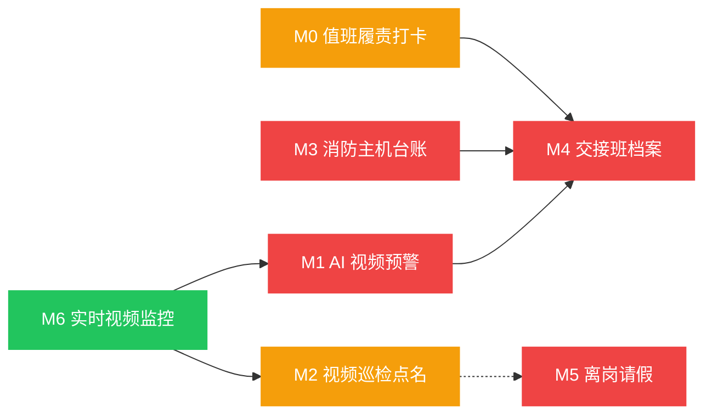

# 消防控制室管理 — 模块拆分方案

> 基于业务设计：[biz-design.md](biz-design.md)
> 生成日期：2026-07-02

---

## 1. 核心实体

| 实体 | 核心属性 | 说明 |
|------|---------|------|
| **消控室** | `id, name, enterpriseId, cameras[]` | 一个企业可有多间消控室，每间配备多路摄像头 |
| **值班记录** | `id, enterpriseId, roomName, personnelName, dutyType, shiftDate, checkInTime, checkOutTime, status, notes` | 打卡、巡检等各类值班行为记录 |
| **值班人员** | `id, enterpriseId, name, roomName, position, certificationNo, certificationExpiry, phone, onDuty, leaveStatus` | 持证值班员，绑定消控室 |
| **点名记录** | `id, enterpriseId, personnelName, initiator, callTime, responseTime, status, responseMethod, checkItems` | 每次视频/语音点名完整记录 |
| **AI 预警记录** | `id, enterpriseId, roomName, alertType, alertTime, snapshotUrl, status, handlerName, handledAt` | AI 识别到的违规行为预警 |
| **主机台账条目** | `id, enterpriseId, roomName, signalType, pointNo, location, alertTime, status, handlerName, handledAt, notes` | 消防主机每一路信号的处置记录 |
| **交接班记录** | `id, enterpriseId, roomName, shiftDate, fromPersonnel[], toPersonnel[], handoverTime, hostStatus, unresolvedItems[], violations[], status` | 每班交接的完整档案 |
| **离岗记录** | `id, enterpriseId, personnelName, reason, leaveTime, expectedReturn, replacementName, actualReturn, isOvertime, status` | 值班员临时离岗报备与核销 |

---

## 2. 模块清单

### M0 值班履责打卡 🔧 改造
- **职责**：覆盖接班打卡、整点巡检打卡、交班打卡三类强制节点，按规则判定迟到/缺勤/漏检
- **核心功能点**：
  - [ ] 打卡节点分类展示（到岗 / 巡检 / 交班），含打卡类型 Tag
  - [ ] 规则判定：接班 5 分钟超时 → 迟到，交班前 10 分钟未打卡 → 异常，每 2 小时巡检 → 漏检
  - [ ] 连续 3 日缺勤自动标记"重点关注"
  - [ ] 今日/本周/本月筛选
  - [ ] 值班记录列表（`BigscreenListTable`）含打卡类型、状态标签、备注
- **关键页面/组件**：`FireControlDutyRecords.vue`（改造）
- **依赖模块**：无
- **复杂度评估**：低
- **Demo 优先级**：P0

### M1 AI 视频预警 🆕 新增
- **职责**：展示 AI 识别到的违规行为预警列表，支持复核标记
- **核心功能点**：
  - [ ] 预警类型统计卡片（脱岗 / 睡岗 / 替岗 / 吸烟 / 明火）
  - [ ] 预警记录列表（`BigscreenListTable`）：预警时间、类型、截图、所属消控室、处置状态
  - [ ] 预警详情（点击行或缩略图放大查看截图）
  - [ ] 处置状态标签（待复核 / 确认违规 / 误报归档）
  - [ ] 按预警类型筛选
- **Demo 说明**：用 Mock 数据模拟 AI 预警记录，不接入真实 AI 摄像头 SDK
- **关键页面/组件**：🆕 `FireControlAlerts.vue`
- **依赖模块**：无
- **复杂度评估**：低
- **Demo 优先级**：P0

### M2 视频巡检点名 🔧 改造
- **职责**：有感点名操作 + 点名记录查看，补全现场核验表单
- **核心功能点**：
  - [x] 在岗人员列表（左侧，按消控室分组）
  - [x] 选人 → 发起远程点名（视频/语音应答）
  - [x] 点名结果实时反馈（已应答 / 超时）
  - [x] 点名记录列表（`BigscreenListTable`）
  - [ ] 现场核验 5 项表单（主机状态 + 联动设备 + 应急物资 + 门窗监控 + 证件核验）
  - [ ] 核验结果计入点名记录
  - [ ] 无感点名记录展示（AI 自动在岗检测记录，作为另一类点名数据源）
- **关键页面/组件**：`FireControlRollCall.vue`（改造）
- **依赖模块**：无
- **复杂度评估**：中
- **Demo 优先级**：P0

### M3 消防主机台账 🆕 新增
- **职责**：消防主机信号数据面板 + 待办处置 + 逾期预警
- **核心功能点**：
  - [ ] 主机数据概览卡片（火警数 / 故障数 / 屏蔽数 / 监管数 / 异常数）
  - [ ] 台账列表（`BigscreenListTable`）：信号时间、类型、点位编号、位置、处置状态、处置人
  - [ ] 处置状态标签（待处置 / 处置中 / 已处置 / 逾期未处置）
  - [ ] 逾期自动标红（故障超 2 小时 → 红色预警）
  - [ ] 按信号类型筛选（火警 / 故障 / 屏蔽 / 监管 / 通讯异常）
  - [ ] 每条记录绑定当班值班员
- **Demo 说明**：用 Mock 数据模拟主机信号，不接入真实消防主机协议
- **关键页面/组件**：🆕 `FireControlHostLedger.vue`
- **依赖模块**：无
- **复杂度评估**：中
- **Demo 优先级**：P1

### M4 交接班档案 🆕 新增
- **职责**：交接班数据继承 + 8 类违规自动识别 + 电子存档
- **核心功能点**：
  - [ ] 交接班记录列表（`BigscreenListTable`）：班次、交班人、接班人、时间、状态
  - [ ] 交接详情展开（数据继承清单：主机状态 + 未处置事项 + 值班记录 + 巡检记录）
  - [ ] 8 类违规自动标记（红色高亮）：单人交接 / 无证 / 未打卡 / 提前离岗 / 故障未交接 / 隐患隐瞒 / 超时 / 联签未存证
  - [ ] 交接异常统计（纳入辖区指标行）
  - [ ] 筛选：正常 / 异常
- **Demo 说明**：Mock 数据中预设少量正常记录 + 违规记录，验证 8 类违规识别逻辑
- **关键页面/组件**：🆕 `FireControlHandover.vue`
- **依赖模块**：M3（交接时继承主机台账未处置事项）
- **复杂度评估**：高
- **Demo 优先级**：P1

### M5 离岗请假 🆕 新增
- **职责**：线上报备 → 补岗约束 → 返岗核销 → 超时告警
- **核心功能点**：
  - [ ] 离岗报备入口（值班人员卡片上"报备离岗"按钮）
  - [ ] 报备表单：离岗事由 + 预计返回时间 + 补岗人员选择（从在岗人员列表选）
  - [ ] 硬约束校验：无补岗人员 → 拒绝提交（提示"消控室不能无人值守"）
  - [ ] 离岗状态细分：在岗（绿）/ 离岗中（黄）/ 已下班（灰）
  - [ ] 超时检测：超过预计返回时间未核销 → 红色闪烁边框 + "脱岗告警"标签
  - [ ] 返岗核销：手动点击核销，记录真实离岗时长
  - [ ] 离岗记录查看（personnel 卡片内嵌或独立表）
- **Demo 说明**：在 `FireControlPersonnel.vue` 中嵌入报备表单和状态逻辑，不新建独立 Tab
- **关键页面/组件**：`FireControlPersonnel.vue`（改造）
- **依赖模块**：无
- **复杂度评估**：中
- **Demo 优先级**：P1

### M6 实时视频监控 ✅ 已完成
- **职责**：消控室摄像头画面实时展示 + OSD 信息叠加 + 在线/离线检测
- **核心功能点**：
  - [x] 按消控室分组展示摄像头画面（16:10 写实监控风格）
  - [x] OSD 叠加层（REC 指示 + 摄像头编号 + 实时时间戳）
  - [x] 离线占位（灰色 + 断开图标）
  - [x] 暗角 + 扫描线视觉效果
- **关键页面/组件**：`FireControlMonitoring.vue`
- **依赖模块**：无
- **复杂度评估**：低
- **Demo 优先级**：P1（已完成）

---

## 3. 模块依赖图



> 图例：🟢 已完成　🟡 改造中　🔴 待新增

**依赖说明**：
- **M3 → M4**：交接班时 M4 自动继承 M3 中未处置的主机台账条目（唯一强依赖）
- **M6 → M1**：AI 预警数据源来自视频监控画面，但 Demo 层 M1 用独立 Mock 数据
- **M6 → M2**：点名时参考摄像头画面，Demo 层 M2 用独立 Mock 交互
- **M0 → M4**：交接班违规检测依赖值班打卡记录（H03 未打卡交接）

---

## 4. MVP 建议范围

### MVP 包含模块

| 优先级 | 模块 | 操作 | 工作量 | 理由 |
|--------|------|------|--------|------|
| P0 | M0 值班履责打卡 | 改造 | 小 | 核心闭环起点，改造量小（加 Tag + 规则判定） |
| P0 | M1 AI 视频预警 | 新增 | 中 | 核心差异化能力，Mock 数据即可展示 |
| P0 | M2 视频巡检点名 | 改造 | 中 | 监管端核心操作，补核验表单 |
| P1 | M3 消防主机台账 | 新增 | 中 | 台账闭环基础，M4 的前置依赖 |
| P1 | M4 交接班档案 | 新增 | 大 | 功能最多，依赖 M3，最后实现 |
| P1 | M5 离岗请假 | 改造 | 中 | 嵌入 personnel 组件，不新建 Tab |

### 建议开发顺序

```
M0（改造）→ M2（改造）→ M1（新增）→ M5（改造）→ M3（新增）→ M4（新增）
```

> 按依赖链：先改现有组件（M0、M2、M5），再建新 Tab（M1），最后做有依赖的模块（M3 → M4）

### 改造后 Tab 布局

```
实时监控 | 值班记录 | 值班人员 | 远程点名 | AI预警 | 交接班 | 主机台账
  M6       M0          M5        M2       M1       M4        M3
```

> 从当前 4 Tab 扩展到 7 Tab。M0/M2/M5 复用现有组件改造，M1/M3/M4 为新建组件。
