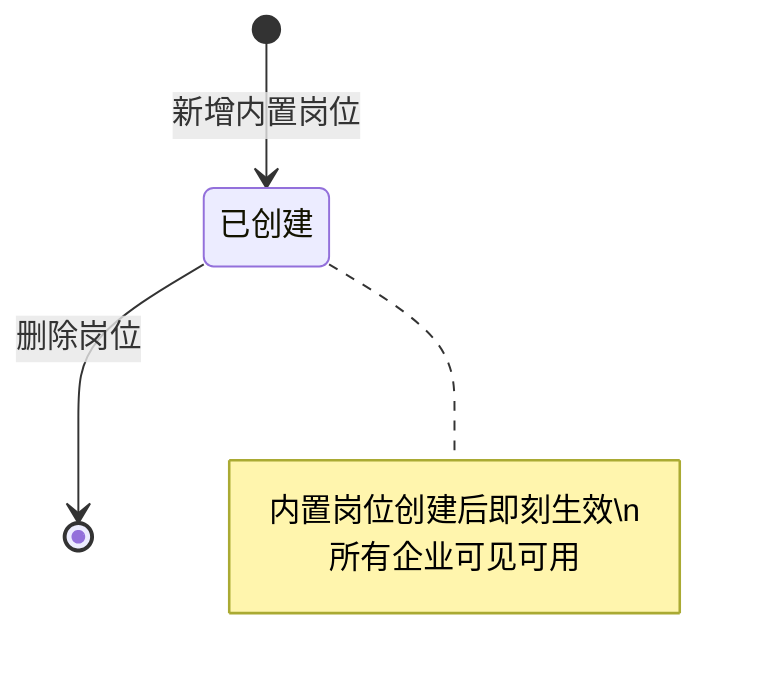

# 内置岗位列表 — 设计文档

---

## 一、页面元信息

| 项目 | 内容 |
|------|------|
| 页面名称 | `内置岗位列表` |
| 所属模块 | `用户管理` |
| 页面类型 | `列表管理` |
| 路由路径 | `/admin/positions` |

### 功能描述

平台管理员的内置岗位列表管理页面，支持岗位名称/Key搜索、分页、数据范围标签展示、使用人数查看，以及新增岗位、编辑、删除、权限配置等操作。仅平台管理员可访问。

---

## 二、页面结构

### 列表管理页布局

| # | 区域名称 | 位置 | 注册表组件 | 包含元素 |
|---|---------|------|-----------|---------|
| 1 | 搜索筛选区 | 顶部 | `FilterBar` | 左侧 `.filter-left`：岗位名称/Key输入框 + 查询按钮。右侧 `.filter-right`：新增岗位按钮(primary, +图标) |
| 2 | 数据表格 | 全宽 | `DataTable` | 列：岗位名称 + Key(mono字体的code样式) + 数据范围(StatusTag) + 岗位说明(truncate) + 使用人数 + 创建时间 + 操作列(fixed right)。操作列含：配置权限 / 编辑 / 删除。空数据文案："暂无内置岗位" |
| 3 | 分页器 | 底部 | `el-pagination` | layout="total, sizes, prev, pager, next, jumper"，默认每页 20 条 |
| 4 | 新增岗位弹窗 | 浮层 | `FormDialog` | title="新增内置岗位"，width=520px，3 个字段：岗位名称、岗位说明、数据范围 |
| 5 | 编辑岗位弹窗 | 浮层 | `FormDialog` | title="编辑内置岗位"，width=520px，字段同新增，预填已有数据 |
| 6 | 权限配置抽屉 | 浮层 | `FormDrawer` | title="权限配置 — {岗位名称}"，size=640px，右侧抽屉，详见《权限配置.md》 |
| 7 | 删除确认 | 浮层 | `ElMessageBox` | 二次确认弹窗："确定删除该岗位吗？删除后已分配此岗位的用户将失去对应权限，且不可恢复。" |

---

## 三、数据模型

### 3.1 实体字段（PositionItem）

| 字段 | 类型 | 说明 |
|------|------|------|
| `id` | `number` | 主键，自增 |
| `name` | `string` | 岗位名称，如"消防安全管理人" |
| `key` | `string` | 岗位唯一标识，格式 `platform:{slug}`，如 `platform:fire-safety-manager` |
| `description` | `string` | 岗位说明，描述岗位职责 |
| `dataScope` | `string` | 数据范围类型，见 §3.2 |
| `dataScopeLabel` | `string` | 数据范围中文标签 |
| `userCount` | `number` | 使用该岗位的用户数（关联 UserEnterprise.positions） |
| `isBuiltin` | `boolean` | 是否内置岗位，M2 列表固定为 `true` |
| `createdAt` | `string` | 创建时间，格式 `YYYY-MM-DD HH:mm` |

### 3.2 数据范围枚举

| 枚举值 | 标签文字 | 颜色类型 | 说明 |
|--------|---------|---------|------|
| `self` | 本企业 | `info` | 仅查看本企业数据 |
| `assigned` | 分配给我的 | `warning` | 仅查看分配给当前用户的数据 |
| `service` | 本服务商 | `info` | 查看本服务商项目数据 |
| `all` | 全量 | `success` | 查看管辖范围内全量数据 |
| `platform` | 全平台 | `danger` | 跨所有企业，无过滤 |

### 3.3 新增/编辑岗位表单字段（PositionForm）

| 字段名 | 中文名 | 类型 | 必填 | 控件类型 | 校验规则 | 说明 |
|--------|--------|------|------|---------|---------|------|
| `name` | 岗位名称 | `string` | 是 | `input` | `required`, `max: 20` | 如"消防安全管理人" |
| `key` | 岗位Key | `string` | 是 | `input` | `required`, `pattern: /^[a-z][a-z0-9-]*$/`, 唯一 | 自动从名称生成拼音slug，可手动修改。编辑时只读 |
| `description` | 岗位说明 | `string` | 否 | `textarea` | `max: 200` | 描述岗位职责，在岗位选择器中展示 |
| `dataScope` | 数据范围 | `string` | 是 | `select` | `required` | 选项：self/assigned/service/all/platform，带中文标签和说明 |

---

## 四、查询参数

| 参数名 | 中文名 | 类型 | 控件类型 | 选项 |
|--------|--------|------|---------|------|
| `keyword` | 关键词 | `string` | `input` | 匹配岗位名称或 Key |
| `page` | 页码 | `number` | — | 默认 1 |
| `size` | 每页条数 | `number` | `select` | `[10, 20, 50]` |

---

## 五、接口定义

| 操作 | 方法 | 路径 | 请求类型 | 响应类型 |
|------|------|------|---------|---------|
| 获取岗位列表 | `GET` | `/api/admin/positions` | `PositionQuery` | `PaginatedData<PositionItem>` |
| 获取岗位详情 | `GET` | `/api/admin/positions/:id` | — | `PositionDetail`（含权限配置） |
| 新增岗位 | `POST` | `/api/admin/positions` | `PositionForm` | `PositionItem` |
| 编辑岗位 | `PUT` | `/api/admin/positions/:id` | `PositionForm` | `PositionItem` |
| 删除岗位 | `DELETE` | `/api/admin/positions/:id` | — | — |
| 保存权限配置 | `PUT` | `/api/admin/positions/:id/permissions` | `PermissionConfig` | `PositionDetail` |

---

## 六、业务逻辑

### 6.1 状态流转

> 内置岗位无"启用/停用"状态——创建即生效，删除即移除。岗位本身不设生命周期状态，权限通过权限配置控制。

### 6.2 交互行为

| 操作 | 触发条件 | 行为描述 |
|------|---------|---------|
| 查询 | 输入关键词 + 回车/点击查询 | 重新加载列表，page 重置为 1 |
| 新增 | 点击 FilterBar [新增岗位] | 打开新增岗位弹窗，表单为空，Key 随名称输入自动生成（拼音slug），提交后刷新列表 |
| 编辑 | 点击行操作 [编辑] | 打开编辑岗位弹窗，回填名称、说明、数据范围，Key 只读 |
| 配置权限 | 点击行操作 [配置权限] | 打开权限配置抽屉，详见《权限配置.md》 |
| 删除 | 点击行操作 [删除] | 弹出 ElMessageBox.confirm，确认后调用 DELETE，刷新列表 |
| Key 自动生成 | 名称输入框 blur | 将中文名称转为拼音 slug（小写字母+连字符），填充到 Key 字段。用户可以手动修改 |
| 删除被拒绝 | 后端返回 409（岗位正在被使用） | ElMessage.warning("该岗位正在被 X 个用户使用，请先取消分配后再删除") |

### 6.3 特殊规则

- 内置岗位创建后全平台所有企业可见可用（企业管理员在 M1 分配岗位时可选择）
- 岗位 Key 全局唯一（包括内置和企业自定义）
- 编辑时 Key 不可修改（避免权限配置引用断裂）
- 删除岗位需校验是否有关联用户——有关联时禁止删除
- 删除岗位同时清空该岗位的权限配置
- v1 阶段预置 12 个内置岗位（来自 `docs/平台岗位设计.md` 11 岗 + 平台管理员）

---

## 七、UI 组件分配

| 页面区域 | 注册表组件 | 关键 Props / 自定义说明 |
|---------|-----------|----------------------|
| 搜索筛选区 | `FilterBar` | 关键词输入框 + 查询按钮 + 新增按钮(primary) |
| 数据表格 | `DataTable` | 无复选框列，Key 列用 mono 字体 `<code>` 样式，数据范围用 StatusTag，岗位说明列 truncate，操作列 fixed right |
| 新增岗位弹窗 | `FormDialog` | title="新增内置岗位"，width=520px，4 字段（名称/Key/说明/数据范围），底部 保存 + 取消 |
| 编辑岗位弹窗 | `FormDialog` | title="编辑内置岗位"，width=520px，Key 只读，其他可编辑 |
| 权限配置抽屉 | `FormDrawer` | size=640px，详见《权限配置.md》 |
| 数据范围标签 | `StatusTag` | self=info, assigned=warning, service=info, all=success, platform=danger |
