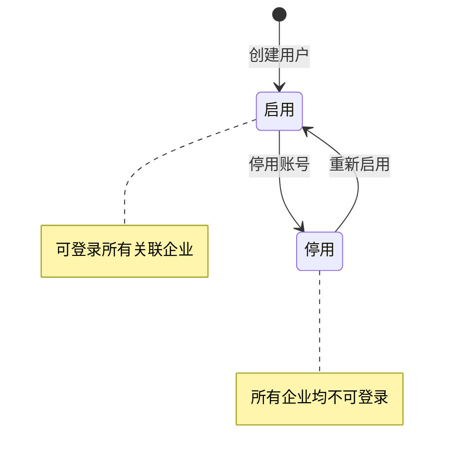

# 用户列表 — 设计文档

---

## 一、页面元信息

| 项目 | 内容 |
|------|------|
| 页面名称 | `用户列表` |
| 所属模块 | `用户管理` |
| 页面类型 | `列表管理` |
| 路由路径 | `/admin/users` |

### 功能描述

平台管理员的用户账号列表管理页面，支持手机号/姓名搜索、分页、状态标签展示、关联企业数查看，以及新增用户、编辑、停用/启用、重置密码等操作。

---

## 二、页面结构

### 列表管理页布局

| # | 区域名称 | 位置 | 注册表组件 | 包含元素 |
|---|---------|------|-----------|---------|
| 1 | 搜索筛选区 | 顶部 | `FilterBar` | 左侧 `.filter-left`：手机号/姓名输入框 + 查询按钮。右侧 `.filter-right`：新增用户按钮(primary, +图标) |
| 2 | 数据表格 | 全宽 | `DataTable` | 列：状态(StatusTag) + 手机号 + 真实姓名 + 邮箱 + 关联企业数 + 创建时间 + 操作列(fixed right)。操作列含：编辑 / 停用启用 / 重置密码 / 关联企业。空数据文案："暂无用户" |
| 3 | 分页器 | 底部 | `el-pagination` | layout="total, sizes, prev, pager, next, jumper"，默认每页 20 条 |
| 4 | 新增用户弹窗 | 浮层 | `FormDialog` | title="新增用户"，width=480px，3 个字段：手机号、真实姓名、初始密码 |
| 5 | 编辑用户弹窗 | 浮层 | `FormDialog` | title="编辑用户"，width=480px，2 个字段：真实姓名、邮箱（手机号只读展示） |
| 6 | 关联企业抽屉 | 浮层 | `FormDrawer` | title="关联企业"，size=480px，右侧抽屉，展示用户加入的所有企业列表（企业名称 + 岗位 + 加入时间） |
| 7 | 重置密码确认 | 浮层 | `ElMessageBox` | 二次确认弹窗："确定重置该用户的密码吗？重置后密码为随机生成的6位数字。" |

---

## 三、数据模型

### 3.1 实体字段（UserItem）

| 字段 | 类型 | 说明 |
|------|------|------|
| `id` | `number` | 主键，自增 |
| `phone` | `string` | 手机号，即账号，全局唯一 |
| `realName` | `string` | 真实姓名 |
| `email` | `string` | 邮箱，预留 |
| `status` | `number` | 账号状态：1=启用，0=停用，见 §3.2 |
| `enterpriseCount` | `number` | 关联企业数 |
| `creatorName` | `string` | 创建人姓名 |
| `createdAt` | `string` | 创建时间，格式 `YYYY-MM-DD HH:mm` |
| `lastLoginAt` | `string \| null` | 最后登录时间 |
| `lastLoginIp` | `string \| null` | 最后登录 IP |

### 3.2 账号状态枚举

| 枚举值 | 标签文字 | 颜色类型 | 说明 |
|--------|---------|---------|------|
| `1` | 启用 | `success` | 账号正常，可登录 |
| `0` | 停用 | `danger` | 账号停用，所有企业均不可登录 |

### 3.3 新增用户表单字段（CreateUserForm）

| 字段名 | 中文名 | 类型 | 必填 | 控件类型 | 校验规则 | 说明 |
|--------|--------|------|------|---------|---------|------|
| `phone` | 手机号 | `string` | 是 | `input` | 11位手机号格式，全局唯一 | 即登录账号 |
| `realName` | 真实姓名 | `string` | 是 | `input` | max: 20 | 列表展示用 |
| `password` | 初始密码 | `string` | 是 | `input` (type=password) | min: 6, max: 20 | 首次登录强制修改 |

### 3.4 编辑用户表单字段（UpdateUserForm）

| 字段名 | 中文名 | 类型 | 必填 | 控件类型 | 校验规则 | 说明 |
|--------|--------|------|------|---------|---------|------|
| `phone` | 手机号 | `string` | — | `input` (readonly) | — | 只读展示，不可修改 |
| `realName` | 真实姓名 | `string` | 是 | `input` | max: 20 | |
| `email` | 邮箱 | `string` | 否 | `input` | email 格式 | 预留 |

### 3.5 关联企业子实体（UserEnterpriseItem）

| 字段 | 类型 | 说明 |
|------|------|------|
| `enterpriseId` | `number` | 企业 ID |
| `enterpriseName` | `string` | 企业名称 |
| `positions` | `string[]` | 在该企业的岗位名称列表 |
| `joinedAt` | `string` | 加入时间 |

---

## 四、查询参数

| 参数名 | 中文名 | 类型 | 控件类型 | 选项 |
|--------|--------|------|---------|------|
| `keyword` | 关键词 | `string` | `input` | 匹配手机号或真实姓名 |
| `page` | 页码 | `number` | — | 默认 1 |
| `size` | 每页条数 | `number` | `select` | `[10, 20, 50]` |

---

## 五、接口定义

| 操作 | 方法 | 路径 | 请求类型 | 响应类型 |
|------|------|------|---------|---------|
| 获取用户列表 | `GET` | `/api/admin/users` | `UserQuery` | `PaginatedData<UserItem>` |
| 获取用户详情 | `GET` | `/api/admin/users/:id` | — | `UserItem` |
| 新增用户 | `POST` | `/api/admin/users` | `CreateUserForm` | `UserItem` |
| 编辑用户 | `PUT` | `/api/admin/users/:id` | `UpdateUserForm` | `UserItem` |
| 停用/启用 | `POST` | `/api/admin/users/:id/toggle-status` | — | `UserItem` |
| 重置密码 | `POST` | `/api/admin/users/:id/reset-password` | — | `{ password: string }` |
| 获取关联企业 | `GET` | `/api/admin/users/:id/enterprises` | — | `UserEnterpriseItem[]` |
| 添加关联企业 | `POST` | `/api/admin/users/:id/enterprises` | `{ enterpriseId: number, positions: string[] }` | `UserEnterpriseItem` |
| 删除用户 | `DELETE` | `/api/admin/users/:id` | — | — |
| 移除关联企业 | `DELETE` | `/api/admin/users/:userId/enterprises/:enterpriseId` | — | — |

---

## 六、业务逻辑

### 6.1 状态流转

### 6.2 交互行为

| 操作 | 触发条件 | 行为描述 |
|------|---------|---------|
| 查询 | 输入关键词 + 回车/点击查询 | 重新加载列表，page 重置为 1 |
| 新增 | 点击 FilterBar [新增用户] | 打开新增用户弹窗，表单为空，提交后刷新列表 |
| 编辑 | 点击行操作 [编辑] | 打开编辑用户弹窗，回填真实姓名和邮箱，手机号只读展示 |
| 停用 | 点击行操作 [停用]，当前状态=启用 | 弹出 ElMessageBox.confirm("确定停用该用户吗？停用后所有企业均不可登录")，确认后切换状态为停用 |
| 启用 | 点击行操作 [启用]，当前状态=停用 | 直接切换状态为启用，无需确认 |
| 重置密码 | 点击行操作 [重置密码] | 弹出 ElMessageBox.confirm("确定重置密码吗？")，确认后返回新密码并展示在 ElMessage 中 |
| 查看关联企业 | 点击行操作 [关联企业] | 打开右侧抽屉，展示该用户加入的所有企业及岗位，支持添加/移除 |
| 添加关联企业 | 抽屉内点击添加关联 | 搜索企业 + 选择岗位（按企业过滤），提交后刷新抽屉和列表 |
| 移除关联企业 | 抽屉内点击行操作 [移除] | 弹出确认框，确认后设置关联状态为已移除，刷新抽屉和列表 |
| 删除用户 | 点击行操作 [删除] | 弹出 ElMessageBox.confirm 确认，确认后软删除（设置 deletedAt），不可逆但可数据库恢复 |

### 6.3 特殊规则

- 手机号全局唯一，新增时需后端校验重复
- 用户支持软删除（设置 deletedAt），列表自动过滤已删除用户，不可删除自己
- 重置密码后自动生成 6 位随机密码，首次登录强制修改
- 关联企业支持添加（POST）和移除（DELETE），移除为软删除（status=0）

---

## 七、UI 组件分配

| 页面区域 | 注册表组件 | 关键 Props / 自定义说明 |
|---------|-----------|----------------------|
| 搜索筛选区 | `FilterBar` | 关键词输入框 + 查询按钮 + 新增按钮 |
| 数据表格 | `DataTable` | 无复选框列（单行操作），状态列用 StatusTag，操作列 fixed right |
| 新增用户弹窗 | `FormDialog` | width=480px，3 字段（手机号/姓名/密码），底部 保存 + 取消 |
| 编辑用户弹窗 | `FormDialog` | width=480px，手机号只读 + 姓名可编辑 + 邮箱可编辑 |
| 关联企业抽屉 | `FormDrawer` | size=480px，表格展示企业+岗位+加入时间，只读 |
| 状态标签 | `StatusTag` | 启用=success，停用=danger |
