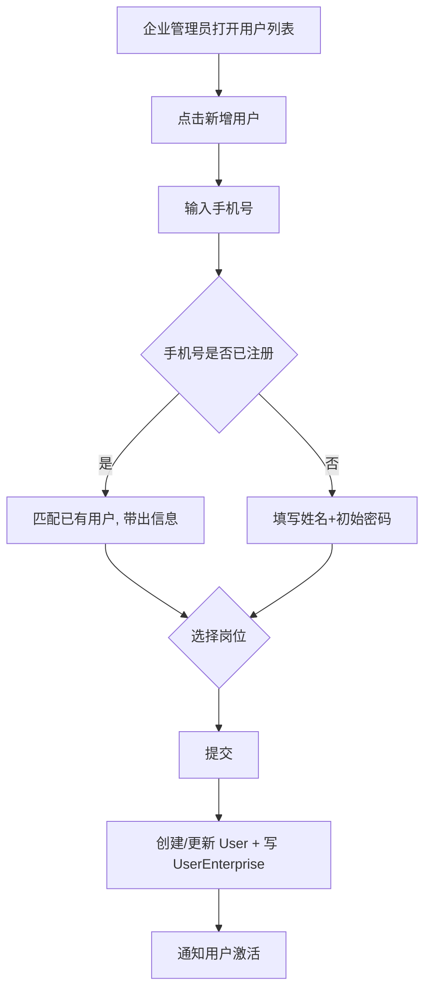
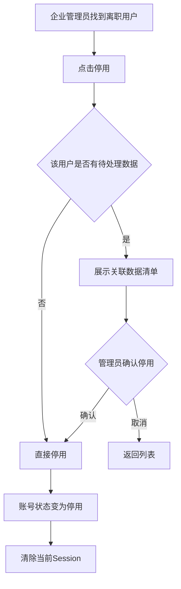

# 用户管理 — 业务设计

---
> 版本：v2.0 | 日期：2026-07-01 | 状态：已确认
> 上游文档：[平台总业务设计](../biz-design.md) · [平台岗位设计](../平台岗位设计.md) v1.3 · [租户管理业务设计](../租户管理/biz-design.md) v2.2

---

## 一、产品定位

**"一个账号，加入多个企业"**。用户管理采用类似钉钉的组织加入模型：用户注册一个平台账号后，可以被不同企业的管理员邀请加入各自的企业，在每家企业内独立分配岗位和权限。

用户管理不同于租户管理——租户管理管理的是**组织（企业）**，用户管理管理的是**跨组织的人**。一个用户可能与多家企业建立关联（例如：张建国既是"阳光物业"的消防安全管理人，又是"某商业街管委会"的安全顾问）。

核心职责：
- 为用户提供跨企业的统一身份
- 在每家企业内独立分配岗位和权限（同一用户在不同企业可以担任不同岗位）
- 用户切换企业时，岗位、权限、数据视图一并切换
- 作为登录认证和权限判断的唯一数据源

### 用户进入企业有两条路径

| 路径 | 触发方 | 场景 | 流程 |
|------|--------|------|------|
| **租户创建时自动初始化** ⭐ | 平台运营方 | 新增租户时，将联系人初始化为企业管理员 | 提交创建企业 → 系统以联系人手机号检索/新建 User（初始密码 `admin123!@#`）→ 分配通用企业管理员岗位（`org-admin`）→ 写入 UserEnterprise。详见 [租户管理 biz-design §6.1](../租户管理/biz-design.md#61-企业创建)。 |
| **企业管理员手动添加** | 企业管理员 | 企业运营中，添加新成员到企业 | 输入手机号 → 检索匹配/新建 → 分配岗位 → 建立关联（即 M1 企业用户管理的标准流程） |

---

## 二、用户旅程地图

> 按企业类型分类梳理，不同管理角色在企业链中的位置不同→用户管理的规模和复杂度也不同。

### 2.1 管理方（空间管理方 · 物业管理方）— 以阳光物业为例

> **特征**：管理方处于企业链的中间层，向上对监管方负责，向下管理大量社会单位（商户）。用户角色最多：消防安全责任人、消防安全管理人、消控值班员、企业管理员。用户数通常 5-20 人。

| 阶段 | 用户行为 | 用户目标 | 痛点/机会点 | 系统响应 |
|------|---------|---------|------------|---------|
| 入职 | 输入新员工手机号，系统自动检索 | 快速添加——已有账号自动匹配，无账号自动创建 | 手动输入易出错 | 输入手机号 → 检索 → 匹配到则带出信息，未匹配则填写姓名+初始密码 |
| 岗位分配 ⭐ | 为员工选择岗位（消防安全管理人等） | 确保获得正确的权限和数据范围 | 多个岗位可选，不清楚各自区别 | 选择岗位时展示岗位职责说明和数据范围 |
| 密码交付 | 设置初始密码，告知员工自行激活 | 安全地交付账号 | 物业一线人员 IT 素养参差不齐 | 初始密码 + 首次登录强制改密 |
| 日常管理 | 查看用户列表，了解在岗状态 | 掌握企业内谁在用系统 | 不知道哪些账号已失效 | 列表展示状态，按岗位筛选。仅显示本企业用户 |
| 企业切换 ⭐ | 用户从其他企业也被添加进来 | 同一用户在不同企业担任不同岗位 | 如何区分用户在每家企业的身份 | 用户登录后选择当前企业，切换后岗位/权限/视图全切换 |
| 离职处理 ⭐ | 找到离职员工的账号，从本企业移除 | 及时收回本企业权限，堵住安全漏洞 | 物业人员离职频繁，容易遗忘 | 从企业移除用户（不删除用户账号本身）→ 见 §4 数据协同 |
| 信息变更 | 修改用户手机号、岗位等 | 保持用户信息同步 | 人员调岗后权限未及时更新 | 编辑表单，用户名不可改 |

### 2.2 服务单位（消防技术服务机构）— 以蓝盾消防为例

> **特征**：服务方被物业方纳为下级或相关方，核心用户是维保工程师。用户数通常 10-50 人（含大量一线工程师），对岗位分配要求精准——不同岗位对应不同的数据可见范围。

| 阶段 | 用户行为 | 用户目标 | 痛点/机会点 | 系统响应 |
|------|---------|---------|------------|---------|
| 批量入职 | 新项目启动，一批工程师需要加入企业 | 逐个添加，减少重复操作 | 一个个添加效率低 | 支持逐个添加（v1），预留批量导入 |
| 岗位分配 ⭐ | 分配维保工程师 / 技术负责人 / 项目负责人 | 不同岗位数据范围不同：assigned / service | 岗位和数据范围的关系不透明 | 展示岗位对应的数据范围和操作权限说明 |
| 资质关联 | 记录工程师的资质证书信息 | 合规要求持证上岗 | 证书过期未提醒 | 创建关联时可填写资质信息，预留到期提醒 |
| 多企业身份 | 同一工程师可能同时服务多家物业公司 | 在不同企业间切换，各自独立 | 用户需要记住每个企业的身份 | 登录后选择当前企业，岗位/权限随企业切换 |
| 离职交接 ⭐ | 工程师离职→从企业移除 | 防止离职人员登录，妥善处理在途任务 | 人员在途任务怎么交接 | 移除前展示关联的待处理数据 → 见 §4 数据协同 |
| 服务商退出 | 某服务商不再合作，批量移除 | 批量回收所有账号权限 | v1 手动逐个移除 | 列表按企业筛选 + 逐个从企业移除 |

### 2.3 监管方 — 以应急管理局为例

> **特征**：监管方处于企业链的顶端，只有机关内部人员。用户角色少（安全监管员 + 企业管理员），用户数通常 3-15 人。安全要求高于一般企业。

| 阶段 | 用户行为 | 用户目标 | 痛点/机会点 | 系统响应 |
|------|---------|---------|------------|---------|
| 入职 | 为机关内部人员开账号 | 让监管员能登录系统 | 机关入离职流程正式，需要审批 | 同标准流程 |
| 岗位分配 | 分配安全监管员 / 企业管理员岗位 | 控制谁能查看管辖区域数据 | 数据范围"全量"——权限大，需谨慎 | 分配时明确提示"可查看辖区所有企业数据" |
| 权限管理 | 定期检查用户权限是否合理 | 保证权限与岗位匹配 | 人员调岗后权限遗留 | 列表查看，按岗位筛选 |

### 2.4 社会单位（商户/门店）— 以底商便利店为例

> **特征**：企业链末端，消防安全第一责任人。用户极少（通常 1-3 人），一般为消防安全责任人或值班人员。大部分通过 H5 端扫码登录，不涉及复杂的岗位分配。

| 阶段 | 用户行为 | 用户目标 | 痛点/机会点 | 系统响应 |
|------|---------|---------|------------|---------|
| 激活 | 商户开业，企业已创建，需要开用户账号 | 扫码激活后能登录 H5 端 | 商户不懂操作，需要引导 | 上级管理方可通过"下级管理"为商户创建用户 |
| 日常使用 | 每日用 H5 端打卡、上报隐患 | 登录就能用，不关心岗位配置 | 账号丢了怎么办 | 上级可重置密码 |

> **说明**：社会单位通常由上级管理方（物业/商业街）代为创建用户，自己一般不主动管理用户，用户管理需求极简。

### 2.5 平台运营方 — 平台管理员

> **特征**：跨所有企业，拥有全平台视角。不参与具体企业管理，只做兜底干预。

| 阶段 | 用户行为 | 用户目标 | 痛点/机会点 | 系统响应 |
|------|---------|---------|------------|---------|
| 全局监控 ⭐ | 查看平台用户全貌，了解用户关联了哪些企业 | 了解平台用户规模和用户-企业关联情况 | 只能看计数，不能暴露其他企业的用户细节 | 用户列表展示关联企业数；点击查看用户关联的所有企业（只读） |
| 异常处理 | 处理用户账号本身的问题（重置密码、解锁、停用账号） | 解决平台级的问题——企业管理员管不了跨企业的事 | 权限边界 | 重置密码（平台级）、解锁/停用（所有企业均受影响） |
| 审计 | 查看操作日志 | 追溯异常操作 | 日志量大，需要筛选 | 按企业、操作人、时间范围筛选 |

---

## 三、核心业务流程图

### 3.1 创建用户主流程（企业管理员手动添加）

> **说明**：此流程为用户管理模块的标准手动添加流程。与之平行的还有**租户创建时的自动初始化路径**——新增租户时，系统以联系人手机号自动完成上述匹配/新建+分配岗位+写关联，无需企业管理员手动操作。详见 [§一 用户进入企业有两条路径](#一产品定位)。

### 3.2 离职处理流程

---

## 四、用户生命周期与数据协同

### 4.1 核心理念

用户状态变更（停用/删除/岗位变更）不只是改一行数据库记录——系统中有大量数据与用户关联。这些数据不应因用户状态变更而丢失或出错，需要建立清晰的协同规则。

**原则**：用户状态变更 ≠ 数据删除。用户是数据的"操作者"而非"拥有者"——用户离职了，他产生的数据仍然属于企业。

### 4.2 用户与数据的关联关系

一个用户可能与以下数据建立关联：

| 关联类型 | 受影响的数据 | 关联方式 |
|---------|------------|---------|
| **创建者** | 企业、用户、维保计划、巡查计划…… | `creatorId` / `creatorName` |
| **处理人** | 隐患记录、巡查任务、维保报告…… | `assigneeId` / `operatorName` |
| **审批人** | 各类流程中的审批节点 | `approverId` |
| **最后操作人** | 几乎所有的 `updatedBy` 字段 | `updatedBy` |
| **日志记录** | 操作日志中记录的操作者身份 | `operatorName` |

> 以上为示意，实际关联取决于各业务模块的实现。用户管理不应逐个维护此清单——各业务模块自行处理用户状态变更后的数据行为。

### 4.3 各生命周期事件的数据行为

| 事件 | 登录 | 关联数据 | 说明 |
|------|:--:|------|------|
| **租户创建自动初始化** ⭐ | ✅ | 自动关联新企业 | 新增租户时，系统以联系人手机号检索/新建 User → 分配 `org-admin` → 写入 UserEnterprise。初始密码 `admin123!@#`，首次登录强制改密 |
| **创建用户**（手动） | — | 无影响 | 新用户尚无关联数据（M0 平台级创建，不关联企业） |
| **添加到企业**（手动） | — | 用户与企业建立关联 | 企业管理员通过 M1 流程添加（输入手机号 → 匹配/新建 → 分配岗位 → 建立关联） |
| **用户正常使用** | ✅ | 用户操作产生数据，关联其用户ID | 正常状态 |
| **停用用户** | ❌ | 数据保留，关联字段不清理 | 历史操作记录保持完整，责任人字段仍显示该用户名（标注"已停用"） |
| **重新启用** | ✅ | 数据恢复可见（原本就存在，未丢失） | 用户恢复登录能力 |
| **岗位变更** | ✅ | 权限立即切换为新岗位的权限 | 在途数据不受影响，新创建的数据按新岗位关联 |
| **加入新企业** | — | 用户在该企业获得新岗位和权限 | 企业管理员输入手机号，系统自动匹配或创建用户并建立关联 |
| **从企业移除** | ✅ | 用户在该企业内的数据保留，关联岗位失效 | 用户仍可登录平台，切换到其他企业继续使用 |
| **平台级停用** | ❌ | 所有企业均不可登录，关联数据保留 | 平台管理员操作，影响用户在所有企业的使用 |

### 4.4 平台管理员视角

- 停用用户时，系统自动展示该用户关联的**数据清单**（按模块分组，仅展示计数），让管理员了解影响范围
- 停用≠删除数据，管理员无需担心数据丢失
- 特定业务模块如需处理"在途任务交接"，由该业务模块自己提供交接功能（如改派），用户管理只负责停用账号

### 4.5 各业务模块的适配责任

用户管理模块不负责数据交接。各业务模块可订阅用户停用事件，按自身逻辑处理：

| 模块 | 建议处理方式 |
|------|------------|
| 维保管理 | 停用的用户不再出现在"执行人"选择器中，历史记录保留用户名 |
| 巡查检查 | 停用用户的待巡查任务自动回退到管理员，由管理员重新分配 |
| 隐患管理 | 停用用户的待整改隐患标记"责任人已离职"，通知上级 |
| 操作日志 | 不受影响，历史记录永久保留 |
| 报表统计 | 停用用户的历史数据仍计入统计 |

> v1 阶段：用户管理只做账号停用，不订阅各模块数据。各模块的交接逻辑在各自模块的实现中处理。

---

## 五、业务设计摘要

### 5.1 产品定位

平台基础设施模块，让每个企业在自己的组织空间内独立管理用户账号、岗位分配和生命周期状态。

### 5.2 核心价值主张

- **一账号、多企业**：用户用一个账号登录，可加入多个企业。在每家企业独立拥有岗位和权限，切换企业时全部切换
- **岗位即权限**：在每家企业内，分配岗位 = 同时获得该企业内的工作台配置和操作权限
- **企业自治**：企业管理员管理本企业的用户关联和岗位分配，平台管理员只做兜底干预

### 5.3 关键业务规则

1. **用户与企业的关系**：一个用户可以加入多个企业。在每家企业内独立拥有岗位和权限。用户登录后选择当前操作的企业，切换企业时岗位、权限、数据视图一并切换
2. **企业管理员的可见范围**：企业管理员只能看到本企业的关联用户及他们在本企业内的岗位。不能看到用户在其他企业的身份
3. **平台管理员权限**：运营管理（`platform-ops`）可创建/编辑/停用/重置密码，可在新增/编辑时设置用户系统角色。技术管理（`platform-admin`）只读。系统角色用户在列表中标注，企业数列 `-`
4. **岗位分配**：在企业内部，一个用户可分配多个岗位，权限取岗位并集；同一用户在不同企业可担任不同岗位
5. **手机号即账号**：手机号全局唯一，用于登录和检索。可修改（需新旧手机号双重验证）。v1 支持密码登录，v2 预留短信验证码登录
6. **密码策略**：管理员设置初始密码（≥6位）；用户首次登录强制修改密码；每 90 天提醒用户修改（不强制阻断）
7. **账号状态**：启用 / 停用是平台级的。停用后所有企业均不可登录 + 清除当前 Session。用户不可物理删除（软删除）
8. **从企业移除**：不等于删除用户。只是解除该用户与本企业的关联。用户仍可登录平台并切换到其他企业
9. **操作日志**：关键操作记录（创建/邀请加入/编辑/移除/停用/重置密码），含操作人、时间
10. **系统角色用户创建**：运营管理在新增/编辑用户时可选择系统角色（普通用户/运营管理/技术管理）。选了系统角色的用户不关联企业，不分配企业岗位。不可降级自己

### 5.4 权限配置模型

#### 5.4.1 两层岗位体系

平台采用**平台内置岗位 + 企业自定义岗位**的双层模型：

| 层级 | 谁管理 | 范围 | CRUD |
|------|--------|------|:--:|
| 平台内置岗位 | 平台管理员 | 全平台，所有企业可见可用 | 完整 CRUD |
| 企业自定义岗位 | 企业管理员 | 仅本企业，不影响其他企业 | 完整 CRUD（仅自己建的） |

#### 5.4.2 岗位数据模型

| 字段 | 说明 |
|------|------|
| 岗位名称 | 如"消防安全管理人""项目经理" |
| 岗位 Key | 唯一标识。内置岗: \`platform:{key}\`，企业岗: \`ent:{企业ID}:{key}\` |
| 所属企业 | 内置岗位 → null（全局）；企业岗位 → 企业 ID |
| 岗位说明 | 描述岗位职责，在岗位选择器中展示 |
| 权限集 | 该岗位拥有的操作权限列表 |

#### 5.4.3 权限分类

| 权限类别 | 说明 | 示例 |
|---------|------|------|
| **模块访问** | 能不能进入某个业务模块 | 能否进入工单管理 / 维保管理 / 巡查检查 |
| **数据操作** | 进入模块后，能对数据做什么 | 查看列表 / 查看详情 / 新增 / 编辑 / 删除 / 导出 |
| **管理操作** | 能不能管理系统本身 | 用户管理 / 企业配置 / 岗位管理 / 权限配置 |

#### 5.4.4 各角色操作边界

| 操作 | 平台管理员 | 企业管理员 |
|------|:--:|:--:|
| 创建内置岗位 | ✅ | — |
| 编辑/删除内置岗位 | ✅ | — |
| 配置内置岗位权限 | ✅ | — |
| 查看内置岗位 | ✅ | ✅（只读） |
| 创建本企业岗位 | — | ✅ |
| 编辑/删除本企业岗位 | — | ✅（仅自己建的） |
| 配置本企业岗位权限 | — | ✅ |

> **设计意图**：平台提供通用岗位模板（消防安全体系），企业根据自身组织特点自定义岗位。内置岗位保证标准化，企业岗位提供灵活性，互不冲突。

### 5.5 成功指标

| 指标 | 测量方式 |
|------|---------|
| 创建用户耗时 | 从打开新增页面到提交成功 ≤ 2 分钟 |
| 账号回收及时性 | 离职后 24h 内完成停用 |
| 跨企业数据安全 | 0 次跨企业用户数据泄露 |

### 5.6 用户字段

| 字段 | 类型 | 必填 | 说明 |
|------|------|------|------|
#### 用户表（User）

| 字段 | 类型 | 必填 | 说明 |
|------|------|------|------|
| 手机号 | 文本 | ✅ | 全局唯一，即账号，登录用。可修改（需验证新旧手机号） |
| 真实姓名 | 文本 | ✅ | 用户的中文姓名，列表展示用 |
| 邮箱 | 文本 | | 预留 |
| 密码 | 文本 | ✅ | 初始密码，首次登录强制修改 |
| 账号状态 | 枚举 | ✅ | 平台级：启用 / 停用，默认启用 |
| 创建人 | 文本 | 自动 | 记录谁创建的用户账号 |
| 创建时间 | 时间 | 自动 | |
| 最后登录时间 | 时间 | 自动 | 系统记录 |
| 最后登录 IP | 文本 | 自动 | 系统记录 |
| 系统角色 | 文本 | | null=普通用户, `platform-ops`=运营管理, `platform-admin`=技术管理。非空时不关联企业，直接获得对应菜单和 API 权限 |

#### 用户-企业关联表（UserEnterprise）

| 字段 | 类型 | 说明 |
|------|------|------|
| 用户 ID | 关联 User | |
| 企业 ID | 关联 Enterprise | |
| 岗位 | 多选 | 在该企业内分配的岗位（从 8 个平台岗位中选择） |
| 关联状态 | 枚举 | 正常 / 已移除（软删除），默认正常 |
| 加入时间 | 时间 | 被邀请加入企业的时间 |
| 邀请人 | 文本 | 发起邀请的企业管理员 |
| 备注 | 文本 | 管理员填写的备注 |

---

## 六、设计决策记录

已确认的设计决策：

| # | 决策 | 结论 | 确认日期 |
|---|------|------|---------|
| 1 | 一人多岗 vs 一岗 | **一人多岗**，权限取岗位并集 | 2026-06-26 |
| 2 | 平台管理员跨企业权限 | **只读查看**，不可修改 | 2026-06-26 |
| 3 | 密码策略 | **基本策略**：首次强制改密 + ≥6位 + 90天提醒 | 2026-06-26 |
| 4 | 用户是否可删除 | **软删除**：只能停用，不可物理删除 | 2026-06-26 |
| 5 | 账号标识 | **手机号即账号**，登录方式：密码 / v2 短信验证码 | 2026-06-26 |
| 6 | 用户头像 | **v2 考虑**，v1 用系统默认 | 2026-06-26 |
| 7 | 权限定义层级 | **平台层统一定义**，企业层可微调 | 2026-06-26 |
| 8 | 权限配置入口 | **系统管理 → 权限配置**（仅平台管理员可见） | 2026-06-26 |
| 9 | 用户-企业关系 | **一对多**：一用户可加入多企业，企业内独立岗位 | 2026-06-26 |
| 10 | 岗位体系 | **双层模型**：平台内置岗(CRUD) + 企业自定义岗(CRUD) | 2026-06-26 |
| 11 | 租户创建自动初始化管理员 | **租户创建时级联创建用户**：以联系人手机号检索/新建 User → 分配通用企业管理员岗位（`org-admin`）→ 写 UserEnterprise。初始密码固定 `admin123!@#`。编辑租户联系人信息不同步 User/关联。管理员移交走 M1 手动流程。 | 2026-06-29 |
| 12 | **系统角色独立于企业岗位** | 平台管理员从 `UserEnterprise.positions` 迁移至 `User.systemRole`。`systemRole` 非空的用户不依赖企业岗位体系，直接获得对应菜单和 API 权限。平台管理员不再需要关联"平台运营方"企业。 | 2026-07-01 |

---

## 七、变更记录

| 版本 | 日期 | 变更内容 |
|------|------|---------|
| v1.0 | 2026-06-26 | 初稿，完成用户旅程、核心流程、业务规则 |
| v1.1 | 2026-06-26 | 确认 6 项设计决策，更新业务规则 |
| v1.2 | 2026-06-26 | 按租户管理维度A五类管理角色重写用户旅程 |
| v1.3 | 2026-06-26 | 新增权限配置模型 |
| v1.4 | 2026-06-26 | 去工单特化；新增 §4 数据协同；全文重编号 |
| v1.5 | 2026-06-26 | 用户-企业改为一对多模型 |
| v1.6 | 2026-06-26 | 岗位体系改为双层模型：平台内置 + 企业自定义 |
| v1.7 | 2026-06-29 | **同步租户管理 v2.1**：①§一补充"用户进入企业有两条路径"（租户创建自动初始化 vs 手动添加）；②§3.1 重命名为"企业管理员手动添加"并更新流程图（手机号检索→匹配/新建）；③§四生命周期表新增"租户创建自动初始化"事件；④新增设计决策 #11；⑤修正 §二 中已废弃的"维度 A"引用 |
| v1.8 | 2026-06-29 | **精简岗位模型**：去掉岗位级数据范围（dataScope 不属于岗位关注点）；合并 4 变体企业管理员为 1 个通用岗位 `org-admin`；§5.4.2 岗位数据模型去掉"数据范围"行；§5.3 规则 #4 和设计决策 #1 同步更新 |
| v1.9 | 2026-07-01 | **系统角色分离**：新增 `User.systemRole` 字段；平台管理员从岗位体系迁移至系统角色；运营管理 (`platform-ops`) + 技术管理 (`platform-admin`)；系统角色用户不关联企业；新增设计决策 #12 |
| v2.0 | 2026-07-01 | **系统角色创建闭环**：用户新增/编辑支持选择系统角色；运营管理可创建其他管理员；不能降级自己；系统角色用户列表标注+企业数列 `-`；新增业务规则 #10；更新规则 #3 |
