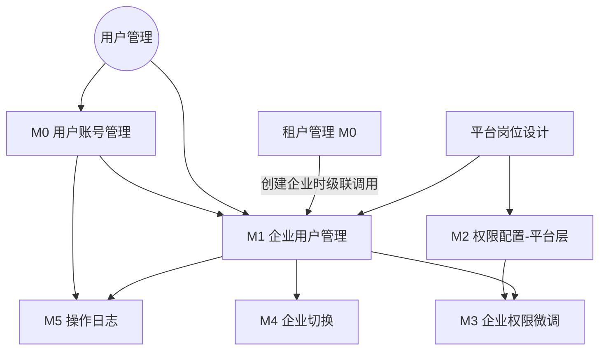

# 用户管理 — 模块规划

> **文档版本**: v1.2
> **生成日期**: 2026-06-26
> **最后更新**: 2026-06-29（去掉岗位级数据范围，合并企业管理员变体，岗位数 12 → 9）
> **上游文档**: docs/用户管理/biz-design.md v1.8 · docs/平台岗位设计.md v1.2

---

## 1. 核心实体

| 实体 | 关键属性 | 说明 |
|------|---------|------|
| **用户 (User)** | 手机号（即账号）、真实姓名、邮箱、密码(bcrypt)、账号状态(启用/停用)、最后登录时间 | 平台级账号，手机号唯一，一个用户可加入多企业 |
| **用户-企业关联 (UserEnterprise)** | 用户ID、企业ID、岗位、关联状态(正常/已移除)、加入时间、邀请人 | 用户与企业的多对多中间表，岗位是关联属性 |
| **岗位 (Position)** | 名称、key、所属企业(null=内置)、权限集 | 平台内置岗 + 企业自定义岗，双层模型。岗位描述角色身份，不绑定数据范围 |
| **企业自定义岗位 (EnterprisePosition)** | enterpriseId、name、key、permissions | 企业管理员自建，仅本企业可用 |
| **操作日志 (OperationLog)** | 操作人、操作类型、目标用户、目标企业、时间、IP | 关键操作审计 |

---

## 2. 模块拆分

### M0 用户账号管理（平台级）

- **职责**：平台管理员的全局用户视图——创建用户账号、查看所有用户、停用/启用账号。不涉及企业内管理（那是 M1 的职责）
- **核心功能点**：
  - [ ] 用户列表页：搜索（手机号/真实姓名）、分页、查看关联企业数
  - [ ] 新增用户：填写手机号、真实姓名、初始密码、邮箱（用户仅被创建，不关联任何企业）
  - [ ] 编辑用户信息：修改真实姓名、邮箱（手机号修改需新旧双重验证，单独页面）
  - [ ] 查看用户关联企业：点击用户 → 展示该用户加入的所有企业及在各企业的岗位（只读）
  - [ ] 停用/启用账号：平台级操作，停用后所有企业均不可登录
  - [ ] 重置密码：平台管理员强制重置用户密码
- **关键页面/接口**：
  - 用户列表 `GET /api/admin/users?page=&size=&keyword=`
  - 新增用户 `POST /api/admin/users`
  - 编辑用户 `PUT /api/admin/users/:id`
  - 用户详情（含关联企业） `GET /api/admin/users/:id`
  - 停用/启用 `POST /api/admin/users/:id/toggle-status`
  - 重置密码 `POST /api/admin/users/:id/reset-password`
- **依赖模块**：无（但 M1 依赖此模块的用户账号）
- **复杂度评估**：中
- **Demo 优先级**：P0

> **说明**：M0 只做用户账号本身的管理。创建用户 ≠ 加入企业。用户如何加入企业由 M1 负责。

---

### M1 企业用户管理

- **职责**：企业管理员视角——添加用户到本企业、分配岗位、从企业移除。**注意**：企业的首个管理员账号在租户创建时已自动初始化（见 [租户管理 M0](../../租户管理/module-plan.md#m0-租户全生命周期管理)），本模块处理的是企业运营中的增量用户管理。
- **核心功能点**：
  - [ ] 企业用户列表页：搜索（姓名/手机号）、按岗位筛选、分页
  - [ ] 添加用户 ⭐（手动路径）：输入手机号 → 系统检索平台用户
    - **匹配到已有用户**：自动带出用户姓名等信息 → 确认添加 → 分配岗位 → 建立关联
    - **未匹配到**：填写用户名、真实姓名、初始密码等 → 创建用户账号 + 同时建立企业关联 + 分配岗位
    - 此流程与租户创建时的自动初始化路径（新增企业 → 以联系人手机号检索/新建 User → 分配 `org-admin`）共享同一套"检索→匹配/新建→关联"逻辑，应复用而非重复实现
  - [ ] 编辑用户在本企业的信息：修改岗位分配、修改关联备注
  - [ ] 从企业移除用户：解除该用户与本企业的关联（不等于删除用户账号）
  - [ ] 岗位选择器：展示 11 个岗位，支持多选，展示每个岗位的职责说明和数据范围
- **关键页面/接口**：
  - 企业用户列表 `GET /api/enterprise/:enterpriseId/users`
  - 按手机号检索用户 `GET /api/admin/users/lookup?phone=`
  - 添加用户到企业 `POST /api/enterprise/:enterpriseId/users`（body 含 phone + 若新建则含用户信息 + positions）
  - 编辑企业内岗位 `PUT /api/enterprise/:enterpriseId/users/:userId`
  - 从企业移除 `DELETE /api/enterprise/:enterpriseId/users/:userId`
- **依赖模块**：M0（用户账号可能已存在）、租户管理（企业已存在）
- **复杂度评估**：中
- **Demo 优先级**：P0

> **说明**：M1 的核心交互是一个手机号输入框——输入后自动匹配或创建用户，一步完成"找到人 → 加入企业 → 分配岗位"。不做邀请确认流程。

---

### M2 岗位与权限管理（平台层）

- **职责**：平台管理员管理内置岗位——岗位 CRUD + 权限配置。全平台生效
- **核心功能点**：
  - [ ] 内置岗位列表页：展示所有平台内置岗位，搜索/分页
  - [ ] 新增内置岗位：岗位名称、岗位说明
  - [ ] 编辑/删除内置岗位：仅平台管理员可操作
  - [ ] 权限配置：选择岗位 → 按模块分组勾选权限（模块访问/数据操作/管理操作）→ 保存
  - [ ] 权限分类：模块访问（能不能进）、数据操作（增删改查导出）、管理操作（用户管理/企业配置）
  - [ ] v1 阶段至少内置 9 个平台岗位
- **关键页面/接口**：
  - 内置岗位列表 `GET /api/admin/positions`
  - 岗位详情+权限 `GET /api/admin/positions/:id`
  - CRUD `POST/PUT/DELETE /api/admin/positions/:id`
  - 保存权限配置 `PUT /api/admin/positions/:id/permissions`
- **依赖模块**：M0（平台管理员身份）
- **复杂度评估**：中
- **Demo 优先级**：P1

> **说明**：v1 阶段内置岗位及权限可先以 JSON 常量 + seed 数据实现，M2 的配置页面在 P1 再做。P0 用硬编码保证 M0/M1 能跑通。

---

### M3 企业自定义岗位

- **职责**：企业管理员创建本企业专属岗位、配置权限。不可修改平台内置岗位
- **核心功能点**：
  - [ ] 岗位列表：展示平台内置岗位（只读，灰色） + 本企业自定义岗位
  - [ ] 新增企业岗位：岗位名称、岗位说明、数据范围 → 配置权限 → 保存
  - [ ] 编辑/删除企业岗位：仅限本企业创建的岗位
  - [ ] 权限配置：同 M2，但仅对企业岗位可编辑
- **关键页面/接口**：
  - 岗位列表 `GET /api/enterprise/:enterpriseId/positions`
  - CRUD 企业岗位 `POST/PUT/DELETE /api/enterprise/:enterpriseId/positions/:id`
  - 保存权限 `PUT /api/enterprise/:enterpriseId/positions/:id/permissions`
- **依赖模块**：M1（企业管理员身份）、M2（内置岗位作为参考）
- **复杂度评估**：低
- **Demo 优先级**：P2

---

### M4 企业切换

- **职责**：用户登录后选择当前操作的企业，切换企业时岗位、权限、数据视图一并切换
- **核心功能点**：
  - [ ] 顶部/侧栏企业切换器：显示当前企业名称，点击展开 → 列出用户关联的所有企业
  - [ ] 切换企业：选择目标企业 → 重新计算岗位和权限 → 刷新当前页面上下文
  - [ ] 默认企业：记住上次选择的企业，下次登录默认进入
  - [ ] 当前企业 Context：全局可访问（类似 `useCurrentEnterprise()`），所有 API 请求自动带企业上下文
- **关键页面/接口**：
  - 获取用户关联企业 `GET /api/auth/enterprises`
  - 切换企业 `POST /api/auth/switch-enterprise`
- **依赖模块**：M1（企业关联数据来源）、用户 Store
- **复杂度评估**：中
- **Demo 优先级**：P1

> **说明**：企业切换是用户登录后的第一个操作点。v1 阶段若用户只关联一个企业，自动进入不展示选择器。

---

### M5 操作日志

- **职责**：记录用户管理相关的关键操作，支持审计追溯
- **核心功能点**：
  - [ ] 日志记录：创建用户、邀请加入企业、修改岗位、移除用户、停用/启用、重置密码
  - [ ] 日志列表：平台管理员按企业/操作人/操作类型/时间范围筛选
  - [ ] 企业管理员只能看本企业的操作日志
- **关键页面/接口**：
  - 平台日志列表 `GET /api/admin/audit-logs?enterpriseId=&operatorId=&action=&start=&end=`
  - 企业日志列表 `GET /api/enterprise/:enterpriseId/audit-logs?operatorId=&action=&start=&end=`
- **依赖模块**：M0/M1（日志数据来自用户管理的操作）
- **复杂度评估**：低
- **Demo 优先级**：P2

---

## 3. 模块依赖图



---

## 4. MVP 建议

### 4.1 阶段划分

| 阶段 | 模块 | 工作量 | 说明 |
|------|------|:---:|------|
| **P0** | M0 用户账号管理 | 中 | 平台管理员 CRUD 用户账号 |
| **P0** | M1 企业用户管理 | 中 | 企业管理员邀请用户、分配岗位、移除 |
| **P1** | M2 权限配置 | 中 | 平台管理员定义岗位→权限映射（v1 可硬编码） |
| **P1** | M4 企业切换 | 中 | 用户选择企业 → 上下文切换 |
| **P2** | M3 企业权限微调 | 低 | 企业管理员微调权限 |
| **P2** | M5 操作日志 | 低 | 关键操作审计追溯 |

### 4.2 MVP 范围（P0）

**后端**：
- 扩展 User 表 + 新建 UserEnterprise 表
- M0 API：用户账号 CRUD + 停用/启用 + 重置密码
- M1 API：企业用户列表 + 邀请 + 分配岗位 + 移除

**前端**：
- 用户列表页（平台管理员视角）
- 用户表单（新增/编辑）
- 企业用户列表页（企业管理员视角）
- 邀请用户弹窗 + 岗位选择器
- 路由注册 + 导航入口

### 4.3 建议开发顺序

```
1. 数据库 Schema 变更（User 表扩展 + UserEnterprise 表）
2. M0 后端 + 前端（用户账号 CRUD）
3. M1 后端 + 前端（企业用户管理）
4. P0 联调验证 → 跑通创建用户 → 邀请加入企业 → 分配岗位 → 登录验证
5. M2 + M4（P1）
6. M3 + M5（P2）
```

---

## 5. 实施风险与应对

| 风险 | 应对 |
|------|------|
| UserEnterprise 表迁移涉及现有 User.orgId 字段废弃 | 现有数据量小（仅 admin 账号），直接重建表 + 重新 seed |
| 岗位从静态常量变为可配置，影响现有的 DataScope 判断逻辑 | M2 P1 阶段保留硬编码权限映射，P0 先用现有逻辑 |
| 企业切换对前端 Store 和 API 层的侵入性大 | M4 放 P1，P0 阶段只做单企业（当前登录用户默认进入唯一关联企业） |
| **租户管理 M0 与用户管理 M1 的检索/创建逻辑重复** ⭐ | 抽取共享 service 层（`userLookupOrCreate(phone, name)`），租户创建和 M1 手动添加均调用同一方法，避免两套实现 |

---

## 变更记录

| 版本 | 日期 | 变更内容 |
|------|------|---------|
| v1.0 | 2026-06-26 | 初稿：6 模块拆分、依赖图、MVP 范围 |
| v1.1 | 2026-06-29 | **同步 biz-design v1.7 + 租户管理 v2.1**：①M1 职责补注"首个管理员在租户创建时已自动初始化"；②M1 添加用户标注"手动路径"，说明与租户创建自动初始化共享同一检索/创建逻辑；③依赖图标注租户管理 M0 级联调用 M1；④实施风险新增共享 service 层应对 |
| v1.2 | 2026-06-29 | **精简岗位模型**：实体表去掉 dataScope 属性；M2 功能点去掉数据范围；内置岗位 12 → 9 |
