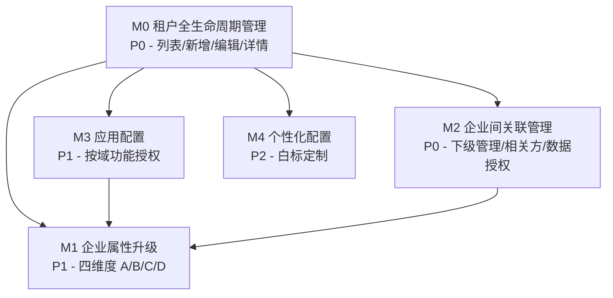

# 租户管理 — 模块规划

> **文档版本**: v1.0
> **生成日期**: 2026-06-25
> **上游文档**: docs/租户管理/biz-design.md v1.0
> **平台参考**: beijingrenxing.com:9443 租户管理实际功能（15 租户，2026-06-25 探索）

---

## 1. 核心实体

| 实体 | 关键属性 | 说明 |
|------|---------|------|
| **企业 (Enterprise)** | 企业名称、企业唯一码、企业性质(维度A)、所在行业(维度C)、行政区划、负责人+手机号、状态、有效期 | 平台所有主体的统一载体 |
| **企业属性 (Enterprise Profile)** | 维度A 平台管理角色、维度B 单位类别、维度C 行业分类、维度D 场所类型 | 四维度自描述，当前平台仅实现 A(简化版)+C |
| **企业关联 (Enterprise Relation)** | 关联类型(下级管理/相关方)、发起方、目标方、关联时间、操作人 | 两种关联，方向由发起方定义 |
| **数据授权 (Data Authorization)** | 管理单元范围、操作权限(允许/不允许) | 仅相关方需要，下级管理自动全量 |
| **应用配置 (App Config)** | 业务域 Tab、模块树勾选 | 按租户控制功能可见性 |
| **个性化配置 (Branding Config)** | 域名、版权公告、ICP备案、平台标题 | 租户白标定制 |

---

## 2. 模块拆分

### M0 租户全生命周期管理

- **职责**：租户的创建、列表、详情查看、编辑、状态变更（锁定/延期）的全流程管理
- **核心功能点**：
  - [ ] 租户列表页：搜索（企业名称）、分页、批量选择
  - [ ] 新增租户向导：第一步基础信息（当前 13 字段）→ 第二步（待探索）
  - [ ] 编辑租户基础信息
  - [ ] 企业详情页 Tab 1 — 企业详情：概览卡片（人员总数/管理单元数/关联企业数）+ 基本信息 + **企业二维码**
  - [ ] 企业详情页 Tab 4 — 操作日志
  - [ ] 状态管理：锁定 / 延期
  - [ ] 企业唯一码自动生成（QY + 雪花 ID）
  - [ ] 企业二维码：创建企业时自动生成（编码 H5 入口 URL + 企业唯一码），支持下载 PNG、失败重生成
- **关键页面/接口**：
  - 租户列表 `GET /admin/enterpriseManagement/index`
  - 新增租户 `POST /admin/enterpriseManagement/create`
  - 企业详情 `GET /admin/enterpriseManagement/detail?id=`
  - 编辑/锁定/延期 `PUT /admin/enterpriseManagement/update`
- **依赖模块**：M1（企业属性作为编辑字段）、M2（详情页下级管理/相关方 Tab）
- **复杂度评估**：中
- **Demo 优先级**：P0

> **当前实现状态**：列表页 + 详情 Tab1 + 新增第一步 + 编辑/锁定/延期 已可用。新增向导第二步待探索。操作日志 Tab 待确认。

---

### M1 企业属性升级

- **职责**：将当前简化的"企业性质（4 选项）+ 所在行业"升级为设计文档定义的四维度属性体系
- **核心功能点**：
  - [ ] 维度 A 平台管理角色：从 4 选项（企业/机关事业单位/社会团体/其他）升级为三级结构（监管方/管理方/社会单位/服务单位/平台运营方，管理方下分空间/集团）
  - [ ] 维度 B 单位类别：新增字段，引用 XF/T 3016.1-2022 §5.26 + 公安部令第61号（下拉 ≈30 项）
  - [ ] 维度 C 行业分类：当前"所在行业"对齐 GB/T 4754-2017 大类
  - [ ] 维度 D 场所类型：新增字段，引用各省消防重点单位标准
  - [ ] 按 §3.6 适用性规则控制各维度的可见/必填（角色联动）
  - [ ] 维度数据的查询过滤支持（为业务域提供元数据）
- **关键页面/接口**：
  - 新增/编辑表单中的属性字段组（替换现有"企业性质""所在行业"）
  - 属性字典接口 `GET /admin/dict/enterprise-attributes`
  - 列表筛选升级（按维度 A/B/C/D 过滤）
- **依赖模块**：M0（属性字段嵌入创建/编辑表单）
- **复杂度评估**：中
- **Demo 优先级**：P1

> **设计关键**：维度 A 替代当前"企业性质"，维度 B/D 为新增，维度 C 升级当前"所在行业"。此为从商业街场景抽象出的平台通用模型，需保持可配置性。

---

### M2 企业间关联管理

- **职责**：维护下级管理链和相关方网络，控制跨企业数据权限
- **核心功能点**：
  - [ ] 企业详情 Tab 2 — 下级管理：搜索、关联下级、取消关联、下级列表
  - [ ] 企业详情 Tab 3 — 相关方管理：搜索（名称+标签）、关联相关方、取消关联、相关方列表
  - [ ] 数据授权弹窗：选择管理单元范围 + 操作权限开关
  - [ ] 关联链完整性校验：一企业一上级约束、环检测
  - [ ] 新建租户时的"上级企业"选择（关联链初始化）
- **关键页面/接口**：
  - 关联下级 `POST /admin/enterpriseManagement/relation/subordinate`
  - 关联相关方 `POST /admin/enterpriseManagement/relation/partner`
  - 取消关联 `DELETE /admin/enterpriseManagement/relation`
  - 数据授权 `PUT /admin/enterpriseManagement/relation/auth`
- **依赖模块**：M0（详情页容器）、M1（列表展示关联企业的属性标签）
- **复杂度评估**：高
- **Demo 优先级**：P0

> **设计关键**：下级管理自动全量权限，相关方需手动数据授权。关联类型与双方企业属性正交——应急局纳管街道用下级管理，物业纳管商户也用下级管理。

---

### M3 应用配置

- **职责**：按租户控制各业务域功能模块的可见性，实现差异化功能权限
- **核心功能点**：
  - [ ] 应用配置弹窗：左侧业务域 Tab（13 域）+ 右侧模块树（checkbox 勾选）
  - [ ] "全部"父节点勾选/取消，子节点联动
  - [ ] 配置持久化：保存后租户侧栏菜单按配置过滤
  - [ ] 新增租户时的默认应用配置（按维度 A 推荐预设）
- **关键页面/接口**：
  - 应用配置弹窗（当前列表行操作"应用配置"按钮触发）
  - 获取应用配置 `GET /admin/enterpriseManagement/app-config?enterpriseId=`
  - 保存应用配置 `PUT /admin/enterpriseManagement/app-config`
  - 模块树字典 `GET /admin/dict/module-tree`
- **依赖模块**：M0（列表行操作入口）、M1（按维度 A 推荐默认配置）
- **复杂度评估**：中
- **Demo 优先级**：P1

> **当前实现状态**：应用配置弹窗功能完整（13 域 Tab × 模块树），为基础较好的模块。Demo 阶段主要做 UI 对齐和交互优化。

---

### M4 个性化配置

- **职责**：支持租户级白标定制，包括域名、版权、ICP 备案、平台标题
- **核心功能点**：
  - [ ] 个性化配置弹窗：域名、版权公告、ICP 备案号、平台标题
  - [ ] 配置生效：登录页/页面 Footer 按租户配置展示
  - [ ] 域名绑定校验（避免冲突）
- **关键页面/接口**：
  - 个性化配置弹窗（当前列表行操作"个性化配置"按钮触发，也存在于左侧"企业配置→个性化"）
  - 获取个性化配置 `GET /admin/enterpriseManagement/branding?enterpriseId=`
  - 保存个性化配置 `PUT /admin/enterpriseManagement/branding`
- **依赖模块**：M0（列表行操作入口）
- **复杂度评估**：低
- **Demo 优先级**：P2

> **当前实现状态**：弹窗已有 4 个字段，功能简单。Demo 阶段可延后。

---

## 3. 模块依赖图



> M0 是所有模块的容器（列表页提供操作入口，详情页提供 Tab 容器）。M1 为 M2（列表展示属性标签）和 M3（按角色推荐默认配置）提供属性数据。

---

## 4. MVP 建议

### 4.1 范围

| 模块 | 优先级 | MVP | 工作量 | 理由 |
|------|:--:|:--:|:--:|------|
| M0 租户全生命周期管理 | P0 | ✅ | 中 | 核心入口，不可绕过 |
| M2 企业间关联管理 | P0 | ✅ | 高 | 下级管理+相关方是平台组织模型的核心，当前已有基础 |
| M1 企业属性升级 | P1 | ✅ 部分 | 中 | 维度 A 升级为 MVP 必须（替代企业性质），维度 B/D 可 P2 |
| M3 应用配置 | P1 | ○ | 中 | 当前已可用，Demo 优先 UI 对齐 |
| M4 个性化配置 | P2 | ✕ | 低 | 纯展示定制，不影响核心流程 |

### 4.2 MVP 开发顺序

```
第 1 步：M0 租户全生命周期（列表 + 新增 + 详情容器 + 编辑/锁定/延期）
          ↓
第 2 步：M2 企业间关联管理（下级管理 + 相关方 + 数据授权，嵌入详情 Tab）
          ↓
第 3 步：M1 企业属性升级 — MVP 范围（维度 A 升级为三级结构 + 维度 C 对齐国标）
          ↓
第 4 步：M3 应用配置（UI 对齐 + 按维度 A 推荐默认配置）
          ↓
后续：M1 维度 B/D + M4 个性化配置
```

### 4.3 预估总工作量

| 阶段 | 模块 | 预估 |
|------|------|------|
| P0 | M0 + M2 | 4–6 人天 |
| P1 | M1(MVP) + M3 | 3–4 人天 |
| P2 | M1(B/D) + M4 | 1–2 人天 |
| **合计** | | **8–12 人天** |

---

## 5. 关键设计约束

1. **M1 属性升级需向后兼容**：当前"企业性质"4 选项 → 维度 A 三级结构，需做数据迁移映射（企业→社会单位、机关事业单位→监管方/属地政府、社会团体→可配置、其他→可配置）
2. **M2 关联链约束**：一企业一上级的约束需在后端保证，前端仅做友好提示
3. **M3 应用配置与导航联动**：应用配置的模块树需与 `src/config/navigation.ts` 的导航数据结构对齐
4. **所有模块共享同一个详情页容器**：M0 的详情页作为 M2 Tab 的宿主，模块间通过路由参数 `?id=` 传递企业标识

---

## 变更记录

| 日期 | 版本 | 变更内容 |
|------|------|---------|
| 2026-06-25 | v1.0 | 初始版本：5 模块拆分、依赖图、MVP 范围、工作量估算 |
| 2026-06-25 | v1.1 | M0 新增企业二维码功能点（自动生成、下载 PNG、失败重生成）；上游文档同步至 v1.1 |
