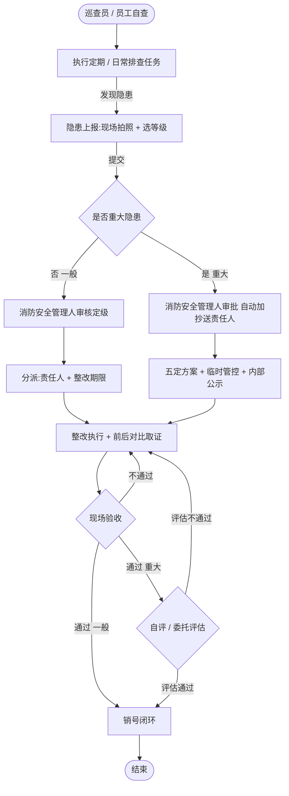
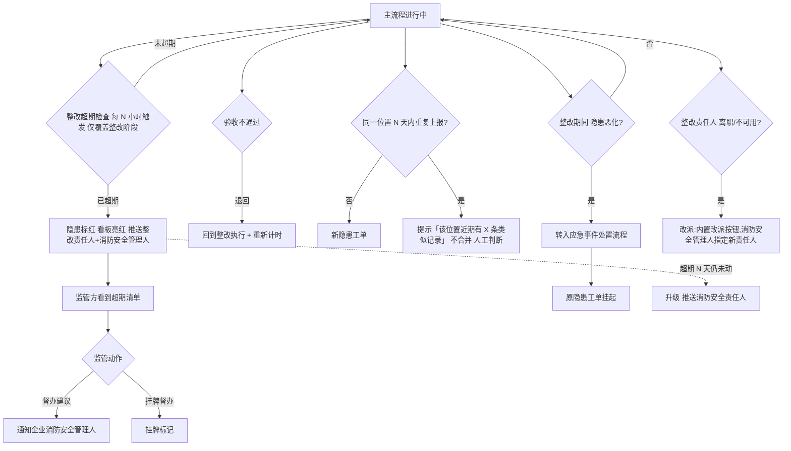
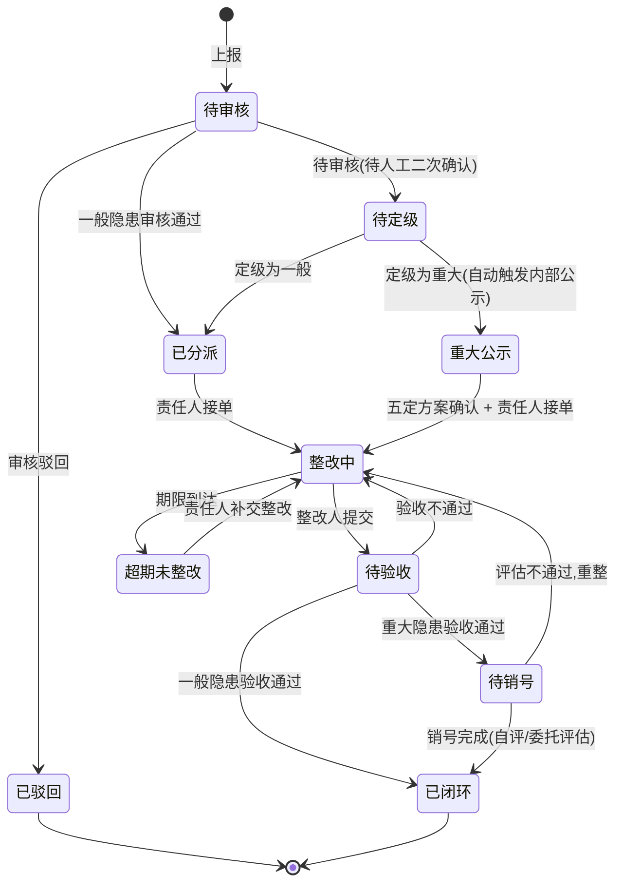
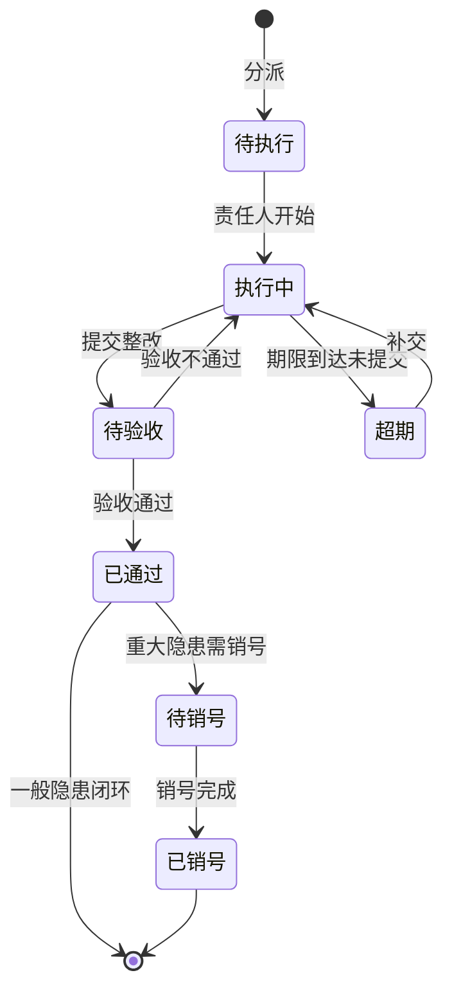
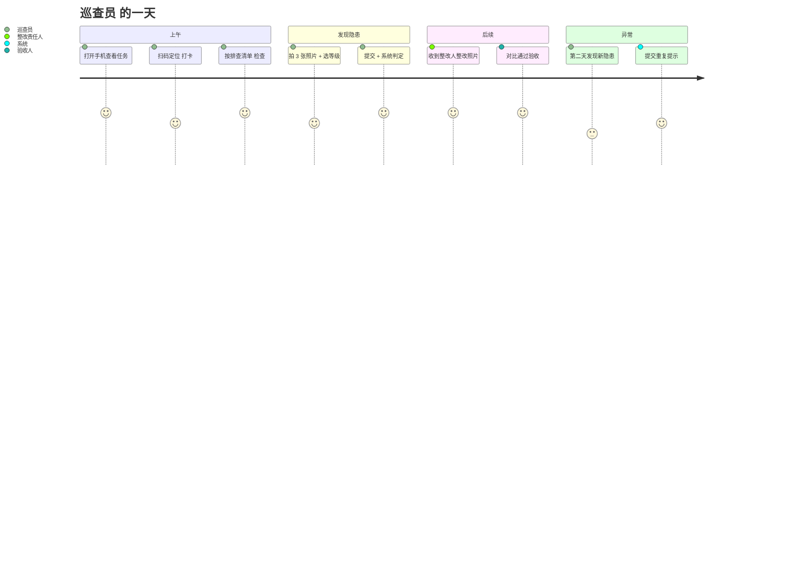
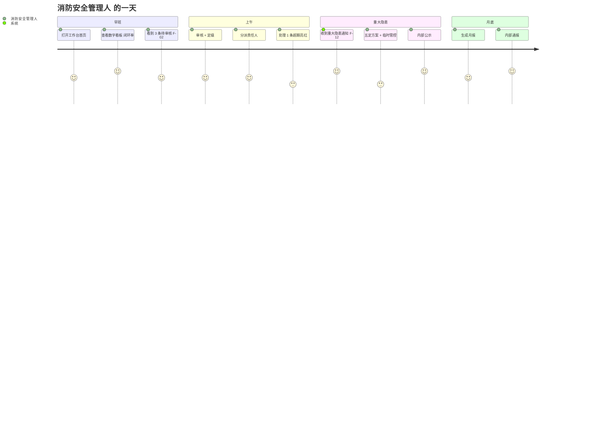
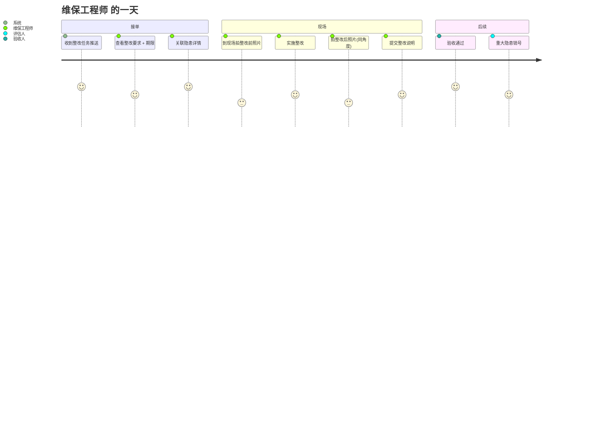
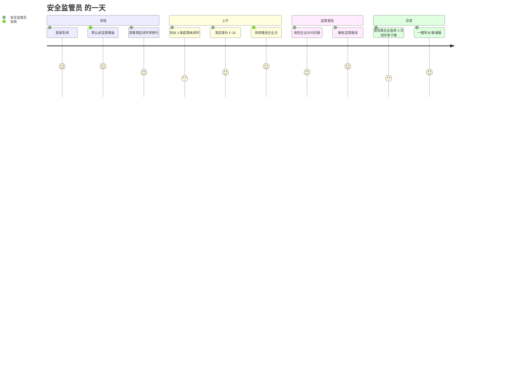

# 隐患排查治理 — 业务设计大纲

> 版本:v0.3 | 最后更新:2026-10-09
> 关联文档:[参考法规清单.md](./参考法规清单.md) · [法规-功能映射.md](./法规-功能映射.md)

---

## 一、产品定位

### 1.1 一句话定位

**为多业态经营单位提供覆盖排查→整改→验收→销号→督办→报表全场景的隐患排查治理闭环能力,系统自动按法规调度、不依赖人盯不靠 Excel 记,让消防安全管理人省出时间处理真正难的问题。首批适用于消防安全与安全生产两类场景,后续可按需扩展至其他领域。**

### 1.2 三大产品边界(详见 §3.1 范围切分)

| 维度 | 在做 | 不做 |
|---|---|---|
| 业务范围 | 隐患全生命周期(制度、排查、整改、报表) | AI 自动识别、跨企业分派、视频证据 |
| 用户范围 | 社会单位/服务机构/监管机构/运营管理四类 | 终端消费者、政府执法处罚 |
| 法规范围 | 国家法律 ★★★ + 部门规章 ★★ + 地方法规 ★ + 推荐国标 ★ | 团体/企业标准(留行业插件扩展) |

### 1.3 与平台其他模块的边界切割

| 与谁 | 关系 | 说明 |
|---|---|---|
| 巡查检查(同分组) | 上游 | 巡查任务是入口之一,但隐患独立存在(可任意渠道上报) |
| 设备管理(M7 故障隐患) | 关联 | 设备异常被判定为安全风险时进入本域,字段复用 |
| 危险作业(动火) | 关联 | 动火作业中的隐患进入本域闭环 |
| 协同管理(工单) | 承载 | 流程由 fire-hazard-report / fire-hazard-rectify 模板承载 |
| 监控与值守 | 不混合 | 告警/事件处置不进入本域 |
| 数据可视化/工作台 | 下游 | 提供统计、待办入口,不重复功能 |
| 平台运营管理 | 配置 | 制度模板、SLA、字段字典由平台运营配置,**不归本域** |

---

## 二、核心用户与价值

### 2.1 五种四方角色(按法规扩展至消防 + 安全生产两类场景)

| 角色 | 所属方 | 一句话职责 | 使用端 | 频次 | 适用场景 |
|---|---|---|---|---|---|
| **消防安全责任人** | 社会单位 | 法定负责人,大屏查看闭环率、签发月报 | Web | 每日查看 | 消防 |
| **消防安全管理人** | 社会单位 | 日常管理,审核分派、组织验收、签发月报 | Web | 每日高频 | 消防 |
| **巡查员** | 社会单位 | 自查上报、紧急工单、接收整改通知、上传对比照片 | PC + 移动端 | 每日连续 | 共用 |
| **维保工程师** | 服务机构 | 接收被指派整改任务、现场整改、上传证据 | 移动端 | 按合同 | 共用 |
| **安全监管员** | 监管机构 | 查看辖区闭环率、超期清单、督办建议 | Web | 每日查看 | 共用 |
| **安全生产第一责任人** | 社会单位 | 安全生产第一责任人(法规 §5),签发隐患治理月报 / 年报、统筹整改资源 | Web | 每日查看 | 安全生产 |
| **安全生产管理人员** | 社会单位 | 日常安全生产检查,审核分派、组织验收、推动整改闭环 | PC + 移动端 | 每日高频 | 安全生产 |
| **从业人员** | 社会单位 | 接收隐患通报、主动上报身边隐患、班前会交底 | PC + 移动端 | 每日连续 | 安全生产 |
| **安全员**(班组 / 车间 / 专职 / 兼职) | 社会单位 | 隐患排查最小执行单元:车间 / 班组日常巡查、班前会交底、协助复查 | PC + 移动端 | 每日连续 | 安全生产 |


### 2.2 用户价值矩阵

| 角色 | 价值 |
|---|---|
| 消防安全责任人 | "打开工作台,看到所有隐患的红绿灯,这个月闭环率多少,需要我签字的只有月报一项" |
| 消防安全管理人 | "系统自动派单给责任人、超期自动催办,我只在审核和验收两个节点做事,Excel 不用翻了" |
| 巡查员 | "扫码定位,拍 3 张照片,选个等级,提交。整改责任人手机上立刻看到通知" |
| 维保工程师 | "系统推任务到手机,按位置到现场,拍对比照,提交。不用记口头约定" |
| 安全监管员 | "辖区所有企业的闭环率、超期数一眼看到,谁有问题直接发督办,不用等企业主动报告" |

### 2.3 权限矩阵

| 操作 | 消防安全责任人 | 消防安全管理人 | 巡查员 | 维保工程师 | 安全监管员 |
|---|:--:|:--:|:--:|:--:|:--:|
| 查看本企业台账 | ✅ | ✅ | ✅ | — | — |
| 查看辖区数据 | — | — | — | — | ✅ |
| 上报隐患 | ✅ | ✅ | ✅ | ✅ | — |
| 审核/定级 | ✅ | ✅ | — | — | — |
| 分派/指定责任人 | ✅ | ✅ | — | — | — |
| 现场整改上传 | — | ✅ | ✅ | ✅ | — |
| 验收 | ✅ | ✅ | — | — | — |
| 销号 | ✅ | ✅ | — | — | — |
| 建立企业排查制度 | ✅ | ✅ | — | — | — |
| 配置定期排查计划 | ✅ | ✅ | — | — | — |
| 执行定期排查任务 | ✅ | ✅ | ✅ | — | — |
| 生成/签发月报/年报 | ✅ | ✅ | — | — | — |
| 接收内部通报 | ✅ | ✅ | ✅ | ✅ | — |
| 发起督办 | — | — | — | — | ✅ |

### 2.4 主用户

按 docs/biz-design.md §三 画像归属,**主用户是消防安全管理人**。所有页面布局、字段优先级、提醒频次,优先服务消防安全管理人视角。

---

## 三、模块全景(4 个模块)

### 3.1 范围切分(做/不做/延后)

| # | 必做(MVP) | 不做 | 延后(v2) |
|---|---|---|---|
| 1 | 隐患全生命周期闭环 | AI 自动识别(图片→类型/等级) | 举报奖励发放 |
| 2 | 重大隐患挂牌督办 + 五定 + 销号 | 智慧消防告警自动隐患 | 第三方评估机构对接 |
| 3 | 企业隐患排查治理制度建设 | 跨企业隐患自动分派(集团统管) | 申请恢复生产 + 现场审查 |
| 4 | 定期排查任务 + 排查清单 | 隐患知识库 / 案例推荐 | 许可证暂扣联动 |
| 5 | 月报/年报 + 第一责任人签字(消防侧为消防安全责任人,安全生产侧为安全生产第一责任人) | 视频流替代照片证据 | 信用评级联动 |
| 6 | 双报告(监管 + 内部公示) | 行政处罚流程 | 约谈培训流程 |
| 7 | 跨地区法规自动加载(L1-L3) | 团体/企业标准(L4 默认关闭) | — |
| 8 | 行业插件(教育/危化品/电力等) | 终端消费者使用 | — |

### 3.2 模块划分(4 个模块)

```
┌──────────────────────── 隐患排查治理 ──────────────────────────┐
│                                                            │
│  M1 隐患排查        M2 隐患整改       M3 制度与计划        │
│  ┌──────────┐       ┌──────────┐       ┌──────────┐         │
│  │ 上报     │       │ 整改执行 │       │ 制度建设 │         │
│  │ 审核     │       │ 验收     │       │ 排查计划 │         │
│  │ 定级     │       │ 销号     │       │ 排查任务 │         │
│  │ 分派     │       │ 超期处理 │       │ 排查清单 │         │
│  └─────┬────┘       └─────┬────┘       └─────┬────┘         │
│        │                  │                  │              │
│        └──────┬───────────┴──────┬───────────┘              │
│               ▼                  ▼                          │
│        ┌──────────────────────────────┐                    │
│        │ M4 报表与统计分析            │                    │
│        │ 周期报表/看板/统计/通报/报送  │                    │
│        └──────────────────────────────┘                    │
│                                                            │
└────────────────────────────────────────────────────────────┘
```

| 模块 | 一句话定位 | 核心动作 | 主用户 |
|---|---|---|---|
| **M1 隐患排查** | 隐患的发现、登记、分类、定级、审核分派 | 上报 / 审核 / 分派 | 消防安全管理人、巡查员 |
| **M2 隐患整改** | 整改任务执行、前后对比取证、验收闭环、超期督办 | 整改 / 验收 / 销号 / 督办 | 消防安全管理人、维保工程师 |
| **M3 隐患制度与排查计划** | 企业隐患排查治理制度建设 + 定期排查计划 + 排查任务执行 | 建制度 / 排计划 / 派任务 / 执行 | 消防安全管理人、巡查员 |
| **M4 报表与统计分析** | 月报/年报自动生成、签字、内部通报、监管报送 | 出报表 / 签字 / 通报 / 报送 | 消防安全责任人、消防安全管理人 |

### 3.3 M1 隐患排查 — 子功能

| # | 功能 | 形态 | 法规 |
|---|---|---|---|
| M1-1 | 隐患上报 | 页面+按钮 | R-03 ★★ §3 |
| M1-2 | 重大隐患判定 | 弹窗 | F-10 ★★ |
| M1-3 | 审核定级 | 页面 | F-03 ★★ |
| M1-4 | 隐患台账 | 页面 | F-11 ★★ |
| M1-5 | 隐患详情 | 页面 | F-12 ★★★ |
| M1-6 | 五定方案(仅重大) | 弹窗 | F-16 ★ |
| M1-7 | 临时管控(仅重大) | 字段 | F-18 ★★★ |
| M1-8 | 内部公示(仅重大) | Tab | F-13 ★★★ |
| M1-9 | 隐患举报 | 按钮 | F-31 ★★ |

### 3.4 M2 隐患整改 — 子功能

| # | 功能 | 形态 | 法规 |
|---|---|---|---|
| M2-1 | 整改工单 | 页面 | F-19 ★ |
| M2-2 | 前后对比 | 字段 | F-19 ★ |
| M2-3 | 验收 | 页面 | F-19 ★ |
| M2-4 | 销号(仅重大) | 弹窗 | F-20 ★★ |
| M2-5 | 超期提醒 | 通知 | F-29 ★ |
| M2-6 | 整改看板 | 页面 | F-14 ★ |
| M2-7 | 挂牌督办 | 字段 | F-23 ★★ |
| M2-8 | 监管清单 | 页面 | F-25 ★ |

### 3.5 M3 制度与计划 — 子功能

> 法规:R-01 ★★★ §41(企业必建制度)、R-04 ★★ §15(每半月登录排查)、R-08 ★ §5.5.3.1(排查清单)

| # | 功能 | 形态 | 法规 |
|---|---|---|---|
| M3-1 | 制度建设 | 页面 | F-05 ★ |
| M3-2 | 排查计划 | 页面 | F-34 ★ |
| M3-3 | 排查任务 | 页面 | R-08 ★ §8.2 |
| M3-4 | 排查清单 | 页面 | F-35 ★ |
| M3-5 | 排查方式 | 字段 | R-04 ★★ §13 |
| M3-6 | 判定标准 | 页面 | R-08 ★ §8.3 |
| M3-7 | 相关方范围 | 字段 | R-08 ★ §8.2 |
| M3-8 | 覆盖率统计 | 通知 | 行业共识 |
| M3-9 | 制度备案 | 页面 | R-01 ★★★ §41 |

### 3.6 M4 报表与统计 — 子功能

> 法规:R-03 ★★ §14(统计分析表 + 签字)、R-08 ★ §8.3(每月统计)、R-01 ★★★ §41(双报告)

| # | 功能 | 形态 | 法规 |
|---|---|---|---|
| M4-1 | 月报（对内） | Tab | F-14 ★ |
| M4-2 | 季报（监管） | Tab | F-15 ★★ |
| M4-3 | 年报（监管） | Tab | F-28 ★★ |
| M4-4 | 内部通报 | 按钮 | R-08 ★ §8.3 |
| M4-5 | 监管报送 | 按钮 | R-03 ★★ §24 |
| M4-6 | 双报告（重大） | 工作流 | F-12 ★★★ |
| M4-7 | 数字看板 | 页面 | F-14 ★ |
| M4-8 | 闭环率 | 字段 | F-37 ★★ |
| M4-9 | 超期率 | 字段 | F-37 ★★ |
| M4-10 | 监管看板 | 页面 | F-25 ★ |
| M4-11 | 趋势分析 | 页面 | 行业共识 |
| M4-12 | 数据导出 | 按钮 | F-26 ★ |

### 3.7 模块间数据流

```
                M3 制度与计划
                       │
                       ▼  (生成排查任务)
                排查任务执行
                       │
                       ▼  (发现隐患)
   ┌────────────────────────────────────────────┐
   │                                            │
   │       M1 隐患排查 ←──→ M2 隐患整改         │
   │       (工单入口)        (工单出口)         │
   │            │                  │            │
   │            └──────┬───────────┘            │
   │                   ▼                        │
   │           M4 报表与统计分析                │
   │       (月报/年报/看板/报送)                │
   │                                            │
   └────────────────────────────────────────────┘
                       │
                       ▼
                  监管方/平台
```

### 3.8 MVP / v2 / 不做 三段切分

| 模块 | MVP | v2 | 不做 |
|---|---|---|---|
| **M1 隐患排查** | M1-1/2/3/4/5/6/7/8(8 个) | M1-9 举报奖励发放 | — |
| **M2 隐患整改** | M2-1/2/3/5/6/7(6 个) | M2-4/8 + 申请恢复生产 + 许可证暂扣 | — |
| **M3 制度与计划** | M3-1/2/3/4/5/6(6 个) | M3-7/8/9 | — |
| **M4 报表与统计** | M4-1/2/3/4/5/6/7/8/9(9 个) | M4-11 趋势 + M4-10 监管看板增强 + 信用评级联动 | — |
| **合计** | **29 子功能** | 9 项 | — |

### 3.9 子功能计数校验

| 模块 | MVP 子功能数 | 法规依据覆盖 |
|---|:--:|:--:|
| M1 | 8 | F-03/F-04/F-07/F-09/F-10/F-11/F-12/F-13/F-16/F-18/F-19/F-26/F-30 |
| M2 | 6 | F-14/F-19/F-23/F-25/F-29 |
| M3 | 6 | F-05/F-34/F-35 |
| M4 | 9 | F-12/F-14/F-15/F-25/F-28/F-29/F-37 |
| **合计** | **29** | — |

### 3.10 模块适用场景与可扩展性

本模块是一个**通用框架**,首批适用场景为消防安全与安全生产两类;两者复用同一套 4 模块结构(M1-M4)、同一套角色口径、同一套流程引擎承载。

**扩展原则**:后续若发现某一类场景(如环保、职业健康等)在法规要求、字段定义、报表格式上与首批场景产生**本质差异**,再单独拆分实现;现阶段不预先分化场景实现。

> **周期报表统一入口决策**:月报、季报、年报底层数据同源,但受众和签字流程不同——对内走「消防安全责任人签字 + 内部公示」(R-08 §8.3),监管走「统一格式 + 监管报送」(R-03 §24)。菜单层**只露一个入口**,用户进来按受众切换,避免三份并列菜单带来的认知噪音;周期切换由页内 Tab(月/季/年)承接,法规硬约束不丢。本决策**仅作为 §1 菜单设计的产品约束**,具体页面/路由/挂载位置见 `module-plan.md`。

---

## §3 边界声明(给 §1 的输入)

- §0 提供:38 个子功能编号 + 名称 + 形态(页面/弹窗/按钮/Tab/字段/通知) + 法规依据 + MVP/v2/不做切分
- §1 承接:每个子功能展开为「核心功能点」+ 平台标注(Web/H5/App/共用) + 优先级 + 复杂度 + 关键页面 + 依赖模块
- §0 **不写**:页面路由、字段、UI 草图、API 路径(均属下游阶段)

---

## 四、关键业务流程

### 4.1 主流程 — 隐患全闭环(从发现到销号)



**关键节点说明**:

| 节点 | 处理人 | 时限 | 法规依据 |
|---|---|---|---|
| 隐患上报 | 任意员工 | 即时 | R-03 ★★ §3 |
| 审核定级 | 消防安全管理人 | 4h | F-03 ★★ |
| 分派 | 消防安全管理人 | 1d | F-03 ★★ |
| 五定方案(仅重大) | 消防安全管理人 | 1d | F-16 ★ |
| 内部公示(仅重大) | 系统自动 | 即时 | F-13 ★★★ |
| 整改执行 | 责任人 | 期限由分派定 | F-19 ★ |
| 验收 | 部门负责人 | 1d | F-19 ★ |
| 销号(仅重大) | 消防安全管理人 | 自评/委托评估 | F-20 ★★ |

### 4.2 异常流程



**异常覆盖**:
- **超期** — 系统自动检测、自动亮红、自动通知(不依赖人)
- **验收不通过** — 退回整改环节,重新计时
- **重复上报** — 不合并,只提示(避免系统误判)
- **隐患恶化** — 转入应急事件处置流程(覆盖火警 / 坍塌 / 中毒 / 爆炸 / 机械伤害等),原隐患工单挂起;应急事件处置完成后,按结论决定工单继续整改 / 关闭 / 销号
- **责任人不可用** — 支持改派
- **监管督办** — 单独流程,挂牌标记

### 4.3 状态机

#### 4.3.1 隐患状态机



#### 4.3.2 整改工单状态机(简化)



### 4.4 关键场景用户旅程

> 每个角色走一遍真实一天,验证 §3.2 4 模块协同是否顺畅。
> 角色:巡查员 / 消防安全管理人 / 维保工程师 / 监管员(共 4 条)。

#### 4.4.1 巡查员 — 典型一天



**关键节点验证**:
- ✅ §3.5 M3-3 排查任务派发 → 巡查员能接到
- ✅ §3.5 M3-4 排查清单 → 巡查员有结构化检查项
- ✅ §3.3 M1-1 隐患上报 → 移动端 3 步可完成
- ✅ §3.3 M1-2 重大隐患判定 → 系统自动判定,无需人为判断
- ⚠️ §3.3 M1-4 详情页重复提示 → 已埋点

#### 4.4.2 消防安全管理人 — 典型一天



**关键节点验证**:
- ✅ §3.6 M4-7 数字看板 首屏可见闭环率
- ✅ §3.3 M1-3 审核定级 权限有(F-02 消防安全责任人可做)
- ✅ §3.4 M2-6 整改看板 看超期
- ✅ §3.6 M4-1 月报 月底生成

#### 4.4.3 维保工程师 — 典型一天



**关键节点验证**:
- ✅ §3.4 M2-1 整改工单 移动端可见
- ✅ §3.4 M2-2 前后对比 同位置对比要求
- ✅ §3.4 M2-4 销号 仅重大走

#### 4.4.4 监管员 — 典型一天



**关键节点验证**:
- ✅ §3.10 菜单结构 监管方角色登录后默认入口 = M4-10 监管看板
- ✅ §3.4 M2-8 监管清单 与 M4-10 是同一组件两个视角
- ✅ §3.6 M4-5 监管报送 闭环

### 4.5 流程完整性校验

| 校验项 | 状态 |
|---|---|
| 每条法规硬约束都有对应流程节点 | ✅ 见 [法规-功能映射.md §十四](./法规-功能映射.md) |
| 每个用户角色都能走通完整闭环 | ✅ 4.4.1 ~ 4.4.4 |
| 异常流程有专门路径(不靠"出错了再说") | ✅ 4.2 |
| 状态机覆盖所有合法路径 | ✅ 4.3.1(10 状态)/4.3.2(7 状态) |
| 系统自动动作(超期/通知)不依赖人 | ✅ M2-5 后台定时 + 推送 |

---

## 五、与平台组织模型的关系

### 5.1 多层级纳管

本域复用平台**四方多租户**组织模型(`docs/平台岗位设计.md §一`),不新增企业层级。

```
应急管理局安全管理中心(监管方)
       │  监管链
       ▼
社会单位 / 物业方(消防安全责任人 / 消防安全管理人 / 巡查员)
       │  委托链(可选,跨企业协同工单)
       ▼
服务机构 / 服务方(维保工程师)
       │
       ▼
平台运营方(系统角色)— 仅配置制度模板 / SLA / 字段字典,不参与本域业务
```

**关键节点**:
- **监管方** ↔ **社会单位**:沿平台纳管关系链(同消防控制室管理、协同管理)
- **社会单位** ↔ **服务机构**:通过协同管理下的《火灾隐患排查上报流程模板》《火灾隐患整改处置流程模板》承载跨企业协同节点,不新建链
- **平台运营方**:按 §3.1 边界,**不读本域业务数据**,只配制度模板 / SLA / 字段字典

### 5.2 数据权限(沿平台四方递进)

| 角色 | 所属方 | 数据范围 | 法规依据 | 适用场景 |
|---|---|---|---|---|
| 消防安全责任人 | 物业方 | 本企业全量 + 月报/年报签字 | F-02 ★★★ | 消防 |
| 消防安全管理人 | 物业方 | 本企业全量(审核 / 分派 / 验收 / 销号) | F-03 ★★ | 消防 |
| 巡查员 | 物业方 | 本企业全量台账 + 自查上报 + 接收整改通知 | R-03 ★★ §3 | 共用 |
| 维保工程师 | 服务方 | 仅分派给我的整改任务 | — | 共用 |
| 安全监管员 | 监管方 | 辖区全量(沿平台纳管链透传) | F-25 ★ | 共用 |
| 安全生产第一责任人 | 物业方 | 本企业全量 + 月报/年报签字 | 安全生产法 §5(第一责任人)、§21、§29 | 安全生产 |
| 安全生产管理人员 | 物业方 | 本企业全量(审核 / 分派 / 验收 / 销号) | 安全生产法 §46 | 安全生产 |
| 从业人员 | 物业方 | 本人上报的隐患 + 接收到的本班组 / 岗位通报 | 安全生产法 §47、福建省条例 §25 | 安全生产 |
| 安全员(班组 / 车间) | 物业方 | 本人所在车间 / 班组的隐患排查执行 + 协助复查 | 安全生产法 §46(具体执行层) | 安全生产 |

**平台复用**:
- 数据范围过滤直接复用平台的**岗位数据范围字段**(本企业 / 本服务商 / 全量)
- 不在 biz-design 层新建权限模型,沿用《平台岗位设计》§三 的岗位 × 工单操作矩阵

### 5.3 平台侧栏归属

| 项 | 归属 | 来源 |
|---|---|---|
| 一级菜单「隐患排查治理」 | 「🔍 巡查与隐患」导航分组(同分组:巡查检查) | 平台菜单配置文件第 108-170 行(已落地) |
| 10 个菜单可见页面 | 单位端(`unit-*` 前缀) | 同上 |
| 监管方入口(M4-10 监管看板 / M2-8 监管清单) | 监管方角色登录后默认入口,**不走本菜单** | 安全监管员岗位 |
| 制度模板 / SLA / 字段字典配置 | 平台方「运营管理」分组 | 平台运营管理角色 |
| 排查上报浮动按钮(M1-9) | 工作台首页(消防安全管理人 / 巡查员) | 工作台首页快捷入口组件 |

### 5.4 与平台基础设施的复用清单

| 平台能力 | 本域复用方式 | 是否新增 |
|---|---|---|
| 组织树 / 用户 / 角色 | 复用《平台岗位设计》全部 | 否 |
| 流程引擎(M0) | 通过《火灾隐患排查上报流程模板》《火灾隐患整改处置流程模板》承载 | 否 |
| 工单体系 | 整改工单 = 跨企业协同工单(同《火灾隐患整改处置流程模板》) | 否 |
| 通知推送 | M2-5 超期提醒 / M4-4 内部通报 / 监管报送 | 复用基础设施,不新建通道 |
| 文件存储 | 隐患照片 / 前后对比照 / 验收附件 | 复用 |
| 数据看板组件 | M4-7 数字看板复用工作台已有数据看板组件 | 否 |
| 法规字段字典(L1-L3) | 由平台运营管理角色在「运营管理」配置 | 否,本域只消费 |
| 重大隐患销号评估机构对接 | v2 延后,平台无对应基础设施 | 待 v2 评估 |

> **本域不新建任何平台级基础设施**。所有诉求都通过现有平台能力组合实现。

---

## 六、Demo 当前状态

> 最后更新:2026-10-09

### 6.1 已落地的演示资产

| 模块 | 演示资产 | 路径 | 状态 |
|---|---|---|---|
| **模块介绍页** | 隐患排查治理模块介绍(对客户演示) | `public/hazard-intro/index.html`(505 行) | ✅ 已落地 |
| **模块介绍页(Vue)** | 同上,工作台内嵌版本 | `src/views/hazard/HazardIntro.vue`(639 行) | ✅ 已落地 |
| **菜单结构** | 一级菜单「隐患排查治理」与文档对齐 | `src/config/navigation.ts:108-170` | ✅ 已落地 |
| **导航分组归属** | 归属「🔍 巡查与隐患」分组 | 同上 | ✅ 已落地 |

### 6.2 演示资产状态(已落地 vs 待新增)

> 本节是 §0 评审时的演示资产对照表,**不是页面清单**——具体页面路由、文件路径、依赖关系见 §1 module-plan。
> 本节目的:评审时一眼看清"现在演示版能看到什么、还差什么",辅助评审 §3.1 范围切分的"必做 MVP"判断。

| 演示资产 | 状态 | 路径 |
|---|---|---|
| 模块介绍页(门户 HTML) | ✅ 已落地 | `docs/隐患管理/汇报/架构图-文案规格.md` + 评审汇报 HTML |
| 模块介绍页(Vue) | ✅ 已落地 | `src/views/hazard/HazardIntro.vue`(639 行) |
| 菜单结构 | ✅ 一级菜单「隐患排查治理」与文档对齐 | `src/config/navigation.ts:108-170` |
| 导航分组归属 | ✅ 归属「🔍 巡查与隐患」分组 | 同上 |
| 10 个菜单可见页面 | ❌ 全部待新增 | 路由 + 页面文件路径见 §1 module-plan |

### 6.3 演示路径规划

- **Light 阶段(目标 2 周)**:实现 4 个 P0 入口页 — 隐患台账 / 隐患上报 / 整改看板 / 数字看板,使用 Mock 数据(本地浏览器缓存持久化)
- **Full 阶段**:按 MVP 29 项子功能排期,见 §7 设计索引
- **演示用法规支撑**:8 部法规原文已收录于 `docs/隐患管理/法规原文/` 目录,与《法规-功能映射表》联动

---

## 七、设计索引

### 7.1 已落地文档

| 文档 | 路径 | 状态 |
|---|---|---|
| 业务设计 | 隐患排查治理 — 业务设计大纲 | v0.3 |
| 参考法规清单 | `docs/隐患管理/参考法规清单.md` | ✅ |
| 法规-功能映射 | `docs/隐患管理/法规-功能映射.md` | ✅ |
| 法规原文(8 部) | `docs/隐患管理/法规原文/` | ✅ |
| 模块介绍页(静态) | `public/hazard-intro/index.html` | ✅ |
| 模块介绍页(Vue) | `src/views/hazard/HazardIntro.vue` | ✅ |
| 菜单配置 | `src/config/navigation.ts` | ✅ |
| 流程模板(火灾隐患排查上报) | 协同管理目录下《火灾隐患排查上报流程模板》 | ✅ |
| 流程模板(火灾隐患整改处置) | 协同管理目录下《火灾隐患整改处置流程模板》 | ✅ |

### 7.2 待编写文档

| 文档 | 路径 | 优先级 | 编写时机 |
|---|---|---|---|
| 模块拆分方案(module-plan) | `docs/隐患管理/module-plan.md` | P0 | §0 评审通过后立即启动 |
| 结构化 PRD | `docs/隐患管理/prd/隐患排查治理.md` | P1 | module-plan 后 |
| 详细设计(technical) | `docs/隐患管理/technical/0X-*.md` | P1 | PRD 后 |
| AI 代码规格(ai-spec) | `docs/隐患管理/ai-spec/*.md`(每页一份) | P1 | 详细设计后 |
| 接口设计 | `docs/隐患管理/api.md` | P1 | ai-spec 后 |
| 功能介绍 | `docs/隐患管理/功能介绍.md` | P2 | 演示版发布前 |
| 功能介绍与使用说明 | `docs/隐患管理/功能介绍与使用说明.md` | P2 | 用户验收前 |

### 7.3 后续衍生文档的编写约定

> 按 `docs/工单管理/` 现有矩阵对齐:

- **module-plan.md** 的「核心功能点」列需**逐条标注平台**(Web / H5 / App / 共用),沿用平台跨端(网页 / H5 / 小程序 / App)单代码库做法,不单独立两份清单;另需**列出所有菜单可见页面 + 路由 + 关键依赖**
- **ai-spec/** 每页一份,数量 = module-plan 阶段拆出的全部菜单可见页面 + 详情页/弹窗/Tab 触发页
- **api.md** 字段级粒度,流程接口走 `docs/工单管理/api.md` 现有规范,不复写

### 7.4 跨模块引用

| 引用 | 来自 |
|---|---|
| 四方多租户模型 | `docs/平台岗位设计.md §一` |
| 岗位 × 工单操作矩阵 | `docs/平台岗位设计.md §三` |
| 流程模板规范 | `docs/协同管理/流程模板/README.md` |
| 数据看板组件 | `src/views/workbench/widgets/`(已有统计卡 / 实时告警 / 应用入口) |
| 平台介绍 PPT 大纲 | `docs/平台介绍PPT大纲.md`(后续补充本域章节) |

---

## §8 设计推进路线图

> 体现本域遵循平台沉淀的产品设计工作流。**当前阶段为 §0 业务设计**,后续按既定节奏推进。

| 阶段 | 名称 | 核心工作内容 | 工时 | 状态 |
|---|---|---|---|---|
| **§0** | 业务设计 | 业务调研 · 法规梳理 · 顶层定位 · 模块拆分 · 关键流程设计 · 与平台组织模型对齐 · 演示菜单结构 · 模块介绍页 | 已完成 | ✅ |
| **§1** | 方案设计 | 模块拆分细化 · 跨端标注 · 字段级产品需求 · 流程详细设计 · 每个页面的详细设计 · 角色权限矩阵细化 | 待评估 | □ |
| **§2** | 原型验证 | 选 4 个最关键入口页 · 模拟数据设计 · 前端原型实现 · 内部走查 · 收集反馈 · 修正设计 | 待评估 | □ |
| **§3** | 正式开发 | 最小可用版 29 项分批开发 · 接入流程引擎 · 接入角色权限 · 接入法规配置 · 双报告工作流落地 | 待评估 | □ |
| **§4** | 试点上线 | 选 1 个客户场景 · 数据初始化 · 培训支持 · 真实使用 · 反馈收集 · 后续增强版排期 | 待评估 | □ |

**节奏说明**:
- 每个阶段的核心工作内容明确,阶段之间不重叠(避免「设计未完成就开发」或「开发未验证就上线」)
- 各阶段工时待评估,根据 §1 启动时的工作量再细化
- §3 正式开发按 最小可用版 / 后续增强版 / 不做 三段切分推进,后续增强版不阻塞主线交付
- §4 试点反馈直接驱动后续增强版排期,形成「业务设计 → 方案设计 → 原型验证 → 正式开发 → 试点上线」的闭环

---

## §4 评审清单

- [ ] §4.1 主流程图(发现→销号)节点是否漏
- [ ] §4.1 关键节点表(处理人/时限/法规)是否合理
- [ ] §4.2 异常流程 6 种覆盖是否够(超期/不通过/重复/恶化/改派/督办)
- [ ] §4.3.1 隐患状态机 10 状态是否过多或漏
- [ ] §4.3.2 整改工单状态机 7 状态是否合理
- [ ] §4.4.1 巡查员旅程 5 节点是否漏
- [ ] §4.4.2 消防安全管理人旅程 6 节点是否漏
- [ ] §4.4.3 维保工程师旅程 4 节点是否漏
- [ ] §4.4.4 监管员旅程 4 节点是否漏
- [ ] §4.5 完整性校验是否同意

---

## §1-§3 评审清单

请你逐项确认:

- [ ] §1.1 一句话定位是否准确
- [ ] §1.2 三大产品边界是否同意
- [ ] §1.3 与其他模块的边界切割是否清晰
- [ ] §2.1 五种角色是否齐全
- [ ] §2.2 用户价值矩阵是否需要调整
- [ ] §2.3 权限矩阵是否有错漏
- [ ] §2.4 主用户是消防安全管理人,是否同意
- [ ] §3.1 范围切分(做/不做/延后 三段)是否合理
- [ ] §3.2 **4 个模块划分**是否接受(M1排查 + M2整改 + **M3制度与计划** + **M4报表与统计**)
- [ ] §3.3 M1 八个子功能是否漏/多
- [ ] §3.4 M2 八个子功能是否漏/多
- [ ] §3.5 **M3 九个子功能**是否齐全
- [ ] §3.6 **M4 十二个子功能**是否齐全
- [ ] §3.8 MVP/v2 切分是否合理
- [ ] §3.9 子功能计数是否正确
- [ ] **§3 周期报表统一入口决策**(对内/监管 单入口 + Tab 切周期)是否同意
- [ ] **§3 边界声明**(§0 不写页面路由/字段/UI/API)是否同意

