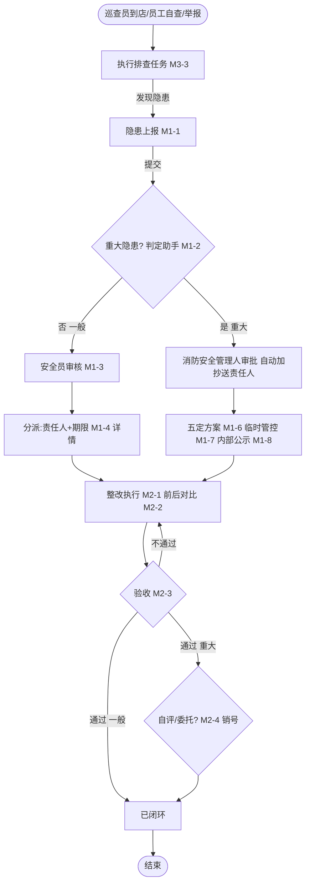
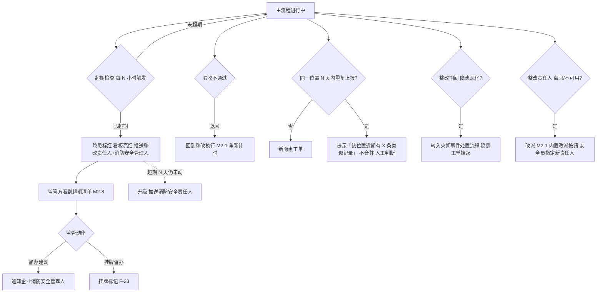
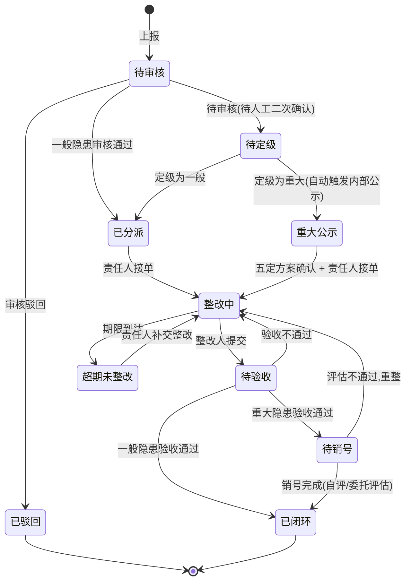
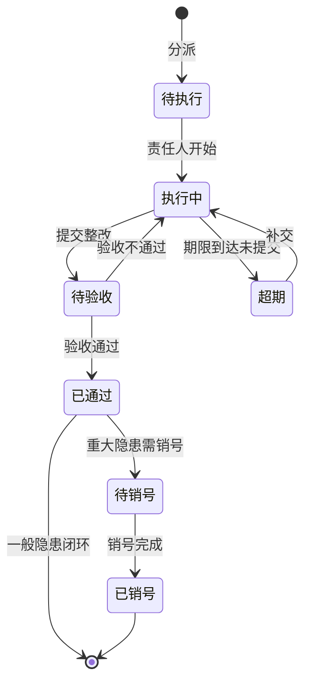
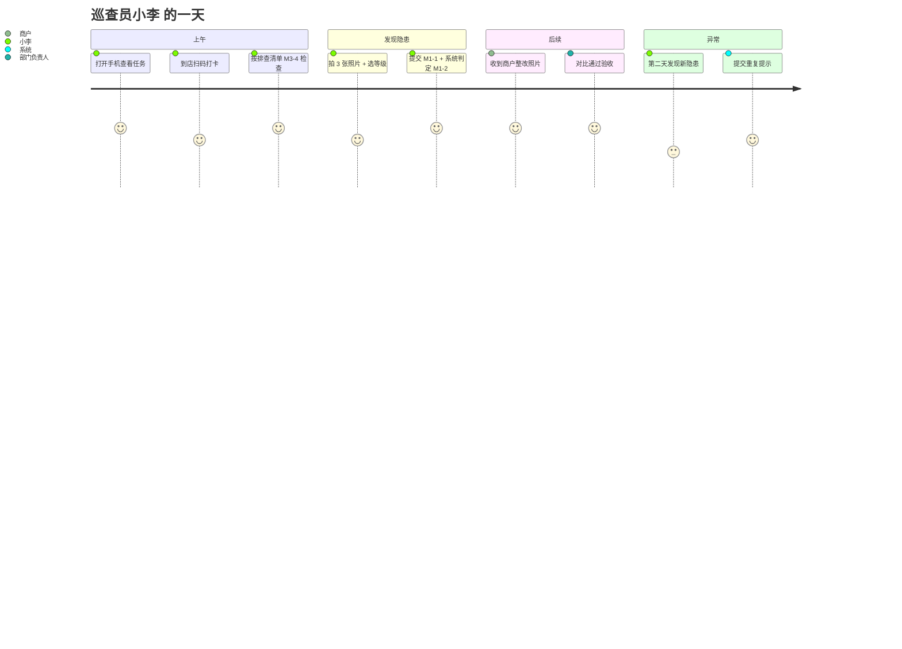
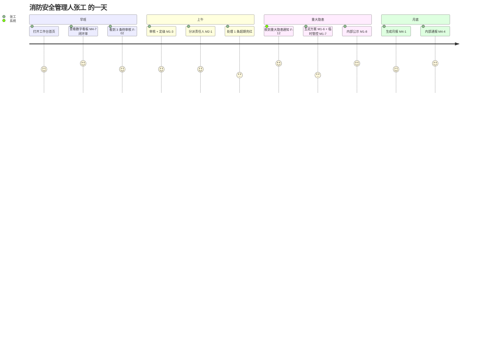
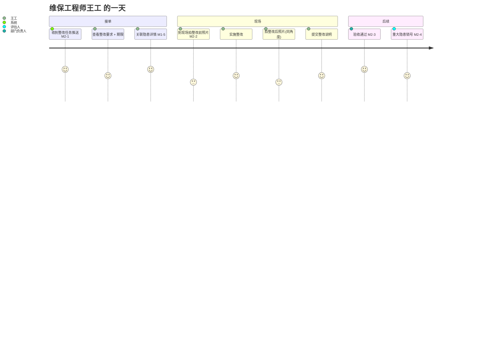
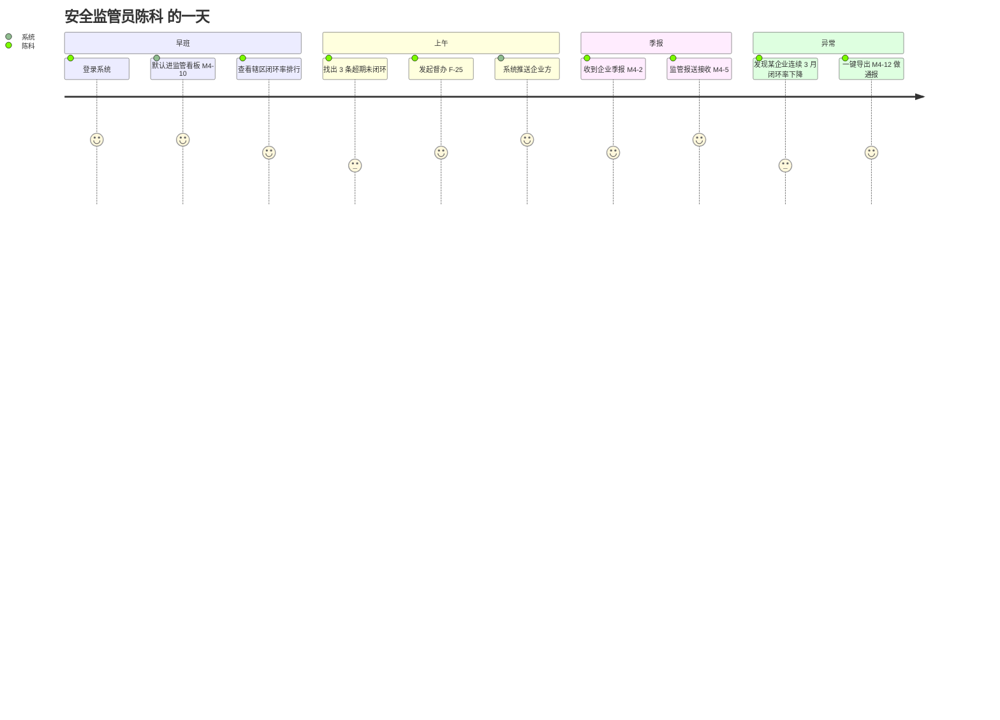

# 隐患管理 — 业务设计大纲(评审稿 v0.2)

> 用途:评审稿,只覆盖 §1-§3,等你审过后再继续 §4-§7
> 版本:v0.2 | 最后更新:2026-10-08(基于 v0.1 评审反馈调整)
> 评审范围:仅本章 §1-§3
> 关联文档:[参考法规清单.md](./参考法规清单.md) · [法规-功能映射.md](./法规-功能映射.md)
> 变更:见文末「v0.1 → v0.2 变更说明」

---

## §0 修订记录(本版本)

| 项 | v0.1 | v0.2 |
|---|---|---|
| §1 内容 | 含痛点/承诺/边界 | 回归"定位"主题,痛点承诺边界迁出 |
| 模块数 | 2 | **4 个** |
| 隐患制度与排查计划 | 漏 | **M3 独立模块** |
| 报表与统计分析 | 仅 M2 子功能 | **M4 独立模块** |

---

## 一、产品定位

### 1.1 一句话定位

**为多业态经营单位的隐患管理提供覆盖排查→整改→验收→销号→督办→报表全场景的闭环能力,系统自动按法规调度、不依赖人盯不靠 Excel 记,让消防安全管理人省出时间处理真正难的问题。**

### 1.2 三大产品边界(详见 §3.1 范围切分)

| 维度 | 在做 | 不做 |
|---|---|---|
| 业务范围 | 隐患全生命周期(制度、排查、整改、报表) | AI 自动识别、跨企业分派、视频证据 |
| 用户范围 | 社会单位/服务机构/监管机构/运营管理四类 | 终端消费者、政府执法处罚 |
| 法规范围 | 国家法律 ★★★ + 部门规章 ★★ + 地方法规 ★ + 推荐国标 ★ | 团体/企业标准(留行业插件扩展) |

### 1.3 与平台其他模块的边界切割

| 与谁 | 关系 | 说明 |
|---|---|---|
| 巡查检查(同分组) | 上游 | 巡查任务是入口之一,但隐患独立存在(可任意渠道上报) |
| 设备管理(M7 故障隐患) | 关联 | 设备异常被判定为安全风险时进入本域,字段复用 |
| 危险作业(动火) | 关联 | 动火作业中的隐患进入本域闭环 |
| 协同管理(工单) | 承载 | 流程由 fire-hazard-report / fire-hazard-rectify 模板承载 |
| 监控与值守 | 不混合 | 告警/事件处置不进入本域 |
| 数据可视化/工作台 | 下游 | 提供统计、待办入口,不重复功能 |
| 平台运营管理 | 配置 | 制度模板、SLA、字段字典由平台运营配置,**不归本域** |

---

## 二、核心用户与价值

### 2.1 五种四方角色

| 角色 | 所属方 | 一句话职责 | 使用端 | 频次 |
|---|---|---|---|---|
| **消防安全责任人** | 社会单位 | 法定负责人,大屏查看闭环率、签发月报 | Web | 每日查看 |
| **消防安全管理人** | 社会单位 | 日常管理,审核分派、组织验收、签发月报 | Web | 每日高频 |
| **消控值班员 / 巡查员** | 社会单位 | 自查上报、紧急工单、接收整改通知、上传对比照片 | PC + 移动端 | 每日连续 |
| **维保工程师** | 服务机构 | 接收被指派整改任务、现场整改、上传证据 | 移动端 | 按合同 |
| **安全监管员** | 监管机构 | 查看辖区闭环率、超期清单、督办建议 | Web | 每日查看 |

> **脚注 1** :本域"巡查员"实际包含两个子场景 — **物业巡查员**(社会单位内部,负责自查上报)和 **商户员工**(商户侧,负责接收整改通知 + 拍对比照)。两者使用同一移动端入口但权限边界不同:物业巡查员看本企业全量台账,商户员工仅可见本商户点位的整改任务。后续 §2 单独评审时再决定是否拆为独立角色。

### 2.2 用户价值矩阵(用户语言,不是产品语言)

| 角色 | 价值 |
|---|---|
| 消防安全责任人 | "打开工作台,看到所有隐患的红绿灯,这个月闭环率多少,需要我签字的只有月报一项" |
| 消防安全管理人 | "系统自动派单给责任人、超期自动催办,我只在审核和验收两个节点做事,Excel 不用翻了" |
| 巡查员 | "扫码到店,拍 3 张照片,选个等级,提交。商户手机上立刻看到通知" |
| 商户员工 | "手机上看到整改通知 + 整改前照片,整改完拍同角度对比照,提交就完事" |
| 维保工程师 | "系统推任务到手机,按位置到现场,拍对比照,提交。不用记口头约定" |
| 安全监管员 | "辖区所有企业的闭环率、超期数一眼看到,谁有问题直接发督办,不用等企业主动报告" |

### 2.3 权限矩阵

| 操作 | 消防安全责任人 | 消防安全管理人 | 巡查员 | 维保工程师 | 安全监管员 |
|---|:--:|:--:|:--:|:--:|:--:|
| 查看本企业台账 | ✅ | ✅ | ✅ | — | — |
| 查看辖区数据 | — | — | — | — | ✅ |
| 上报隐患 | ✅ | ✅ | ✅ | ✅ | — |
| 审核/定级 | ✅ | ✅ | — | — | — |
| 分派/指定责任人 | ✅ | ✅ | — | — | — |
| 现场整改上传 | — | ✅ | ✅ | ✅ | — |
| 验收 | ✅ | ✅ | — | — | — |
| 销号 | ✅ | ✅ | — | — | — |
| 建立企业排查制度 | ✅ | ✅ | — | — | — |
| 配置定期排查计划 | ✅ | ✅ | — | — | — |
| 执行定期排查任务 | ✅ | ✅ | ✅ | — | — |
| 生成/签发月报/年报 | ✅ | ✅ | — | — | — |
| 接收内部通报 | ✅ | ✅ | ✅ | ✅ | — |
| 发起督办 | — | — | — | — | ✅ |

### 2.4 主用户

按 docs/biz-design.md §三 画像归属,**主用户是消防安全管理人**。所有页面布局、字段优先级、提醒频次,优先服务消防安全管理人视角。

---

## 三、模块全景(4 个模块)

### 3.1 范围切分(做/不做/延后)

> 从原 §1.4 迁出,与"产品定位"主题分离,放在模块全景章节作铺垫。

| # | 必做(MVP) | 不做 | 延后(v2) |
|---|---|---|---|
| 1 | 隐患全生命周期闭环 | AI 自动识别(图片→类型/等级) | 举报奖励发放 |
| 2 | 重大隐患挂牌督办 + 五定 + 销号 | 智慧消防告警自动隐患 | 第三方评估机构对接 |
| 3 | 企业隐患排查治理制度建设 | 跨企业隐患自动分派(集团统管) | 申请恢复生产 + 现场审查 |
| 4 | 定期排查任务 + 排查清单 | 隐患知识库 / 案例推荐 | 许可证暂扣联动 |
| 5 | 月报/年报 + 主要负责人签字 | 视频流替代照片证据 | 信用评级联动 |
| 6 | 双报告(监管 + 内部公示) | 行政处罚流程 | 约谈培训流程 |
| 7 | 跨地区法规自动加载(L1-L3) | 团体/企业标准(L4 默认关闭) | — |
| 8 | 行业插件(教育/危化品/电力等) | 终端消费者使用 | — |

### 3.2 模块划分(4 个模块)

```
┌──────────────────────── 隐患管理 ──────────────────────────┐
│                                                            │
│  M1 隐患排查        M2 隐患整改       M3 制度与计划        │
│  ┌──────────┐       ┌──────────┐       ┌──────────┐         │
│  │ 上报     │       │ 整改执行 │       │ 制度建设 │         │
│  │ 审核     │       │ 验收     │       │ 排查计划 │         │
│  │ 定级     │       │ 销号     │       │ 排查任务 │         │
│  │ 分派     │       │ 超期处理 │       │ 排查清单 │         │
│  └─────┬────┘       └─────┬────┘       └─────┬────┘         │
│        │                  │                  │              │
│        └──────┬───────────┴──────┬───────────┘              │
│               ▼                  ▼                          │
│        ┌──────────────────────────────┐                    │
│        │ M4 报表与统计分析            │                    │
│        │ 月报/年报/通报/看板/统计      │                    │
│        └──────────────────────────────┘                    │
│                                                            │
└────────────────────────────────────────────────────────────┘
```

| 模块 | 一句话定位 | 核心动作 | 主用户 |
|---|---|---|---|
| **M1 隐患排查** | 隐患的发现、登记、分类、定级、审核分派 | 上报 / 审核 / 分派 | 消防安全管理人、巡查员 |
| **M2 隐患整改** | 整改任务执行、前后对比取证、验收闭环、超期督办 | 整改 / 验收 / 销号 / 督办 | 消防安全管理人、维保工程师 |
| **M3 隐患制度与排查计划** | 企业隐患排查治理制度建设 + 定期排查计划 + 排查任务执行 | 建制度 / 排计划 / 派任务 / 执行 | 消防安全管理人、巡查员 |
| **M4 报表与统计分析** | 月报/年报自动生成、签字、内部通报、监管报送 | 出报表 / 签字 / 通报 / 报送 | 消防安全责任人、消防安全管理人 |

### 3.3 M1 隐患排查 — 子功能

| # | 功能 | 形态 | 法规 |
|---|---|---|---|
| M1-1 | 隐患上报 | 页面+按钮 | R-03 ★★ §3 |
| M1-2 | 重大隐患判定 | 弹窗 | F-10 ★★ |
| M1-3 | 审核定级 | 页面 | F-03 ★★ |
| M1-4 | 隐患台账 | 页面 | F-11 ★★ |
| M1-5 | 隐患详情 | 页面 | F-12 ★★★ |
| M1-6 | 五定方案(仅重大) | 弹窗 | F-16 ★ |
| M1-7 | 临时管控(仅重大) | 字段 | F-18 ★★★ |
| M1-8 | 内部公示(仅重大) | Tab | F-13 ★★★ |
| M1-9 | 隐患举报 | 按钮 | F-31 ★★ |

### 3.4 M2 隐患整改 — 子功能

| # | 功能 | 形态 | 法规 |
|---|---|---|---|
| M2-1 | 整改工单 | 页面 | F-19 ★ |
| M2-2 | 前后对比 | 字段 | F-19 ★ |
| M2-3 | 验收 | 页面 | F-19 ★ |
| M2-4 | 销号(仅重大) | 弹窗 | F-20 ★★ |
| M2-5 | 超期提醒 | 通知 | F-29 ★ |
| M2-6 | 整改看板 | 页面 | F-14 ★ |
| M2-7 | 挂牌督办 | 字段 | F-23 ★★ |
| M2-8 | 监管清单 | 页面 | F-25 ★ |

### 3.5 M3 制度与计划 — 子功能

> 法规:R-01 ★★★ §41(企业必建制度)、R-04 ★★ §15(每半月登录排查)、R-08 ★ §5.5.3.1(排查清单)

| # | 功能 | 形态 | 法规 |
|---|---|---|---|
| M3-1 | 制度建设 | 页面 | F-05 ★ |
| M3-2 | 排查计划 | 页面 | F-34 ★ |
| M3-3 | 排查任务 | 页面 | R-08 ★ §8.2 |
| M3-4 | 排查清单 | 页面 | F-35 ★ |
| M3-5 | 排查方式 | 字段 | R-04 ★★ §13 |
| M3-6 | 判定标准 | 页面 | R-08 ★ §8.3 |
| M3-7 | 相关方范围 | 字段 | R-08 ★ §8.2 |
| M3-8 | 覆盖率统计 | 通知 | 行业共识 |
| M3-9 | 制度备案 | 页面 | R-01 ★★★ §41 |

### 3.6 M4 报表与统计 — 子功能

> 法规:R-03 ★★ §14(统计分析表 + 签字)、R-08 ★ §8.3(每月统计)、R-01 ★★★ §41(双报告)

| # | 功能 | 形态 | 法规 |
|---|---|---|---|
| M4-1 | 月报 | 页面 | F-14 ★ |
| M4-2 | 季报 | 页面 | F-15 ★★ |
| M4-3 | 年报 | 页面 | F-28 ★★ |
| M4-4 | 内部通报 | 按钮 | R-08 ★ §8.3 |
| M4-5 | 监管报送 | 按钮 | R-03 ★★ §24 |
| M4-6 | 双报告(重大) | Tab | F-12 ★★★ |
| M4-7 | 数字看板 | 页面 | F-14 ★ |
| M4-8 | 闭环率 | 字段 | F-37 ★★ |
| M4-9 | 超期率 | 字段 | F-37 ★★ |
| M4-10 | 监管看板 | 页面 | F-25 ★ |
| M4-11 | 趋势分析 | 页面 | 行业共识 |
| M4-12 | 数据导出 | 按钮 | F-26 ★ |

### 3.7 模块间数据流

```
                M3 制度与计划
                       │
                       ▼  (生成排查任务)
                排查任务执行
                       │
                       ▼  (发现隐患)
   ┌────────────────────────────────────────────┐
   │                                            │
   │       M1 隐患排查 ←──→ M2 隐患整改         │
   │       (工单入口)        (工单出口)         │
   │            │                  │            │
   │            └──────┬───────────┘            │
   │                   ▼                        │
   │           M4 报表与统计分析                │
   │       (月报/年报/看板/报送)                │
   │                                            │
   └────────────────────────────────────────────┘
                       │
                       ▼
                  监管方/平台
```

### 3.8 MVP / v2 / 不做 三段切分

| 模块 | MVP | v2 | 不做 |
|---|---|---|---|
| **M1 隐患排查** | M1-1/2/3/4/5/6/7/8(8 个) | M1-9 举报奖励发放 | — |
| **M2 隐患整改** | M2-1/2/3/5/6/7(6 个) | M2-4/8 + 申请恢复生产 + 许可证暂扣 | — |
| **M3 制度与计划** | M3-1/2/3/4/5/6(6 个) | M3-7/8/9 | — |
| **M4 报表与统计** | M4-1/2/3/4/5/6/7/8/9(9 个) | M4-11 趋势 + M4-10 监管看板增强 + 信用评级联动 | — |
| **合计** | **29 子功能** | 9 项 | — |

### 3.9 子功能计数校验

| 模块 | MVP 子功能数 | 法规依据覆盖 |
|---|:--:|:--:|
| M1 | 8 | F-03/F-04/F-07/F-09/F-10/F-11/F-12/F-13/F-16/F-18/F-19/F-26/F-30 |
| M2 | 6 | F-14/F-19/F-23/F-25/F-29 |
| M3 | 6 | F-05/F-34/F-35 |
| M4 | 9 | F-12/F-14/F-15/F-25/F-28/F-29/F-37 |
| **合计** | **29** | — |

### 3.10 菜单与页面结构(独立路由,菜单可见)

> 38 个子功能中,**只有以下 10 项是菜单可见的独立页面**;其余 28 项是按钮 / 弹窗 / Tab / 字段 / 通知(挂在这些页面里)。
>
> 子功能用 6 种形态区分:`页面` | `弹窗` | `按钮` | `Tab` | `字段` | `通知`

#### 3.10.1 菜单结构(MVP)

```
隐患管理(导航分组:🔍 巡查与隐患)
│
├── 隐患排查
│    ├── 隐患台账              ← M1-4 页面
│    ├── 隐患上报              ← M1-1 按钮入口
│    └── 排查任务              ← M3-3 页面
│
├── 隐患整改
│    └── 整改看板              ← M2-6 页面
│
├── 制度与计划
│    ├── 制度建设              ← M3-1 页面
│    ├── 排查计划              ← M3-2 页面
│    └── 排查清单              ← M3-4 页面
│
└── 报表与统计
     ├── 数字看板              ← M4-7 页面
     ├── 月报                  ← M4-1 页面
     ├── 季报                  ← M4-2 页面
     └── 年报                  ← M4-3 页面
```

#### 3.10.2 形态分布统计

| 形态 | 子功能数 | 占比 | 备注 |
|---|:--:|:--:|---|
| **页面**(菜单可见) | 10 | 26% | 路由级入口 |
| **页面**(隐藏/跳转) | 4 | 11% | 通过按钮/Tab 触发,不算菜单 |
| **弹窗** | 3 | 8% | 嵌套在页面里 |
| **按钮** | 4 | 11% | 嵌套在页面里 |
| **Tab** | 3 | 8% | 详情页内切换 |
| **字段** | 6 | 16% | 表单里的输入项 |
| **通知** | 2 | 5% | 后台任务 |
| **合计** | **38** | 100% | — |

> 评审时**菜单结构**代表用户视角的"门脸",**形态分布**代表开发视角的"工作量分布"。

#### 3.10.3 不挂菜单的子功能(挂载位置)

| 子功能 | 挂载在哪 |
|---|---|
| M1-2 重大隐患判定 | 隐患上报弹窗内(M1-1) |
| M1-3 审核定级 | 隐患详情页(M1-5)操作栏 |
| M1-5 隐患详情 | 隐患台账(M1-4)点击行 |
| M1-6 五定方案 | 隐患详情页(M1-5)「方案」Tab(仅重大) |
| M1-7 临时管控 | 五定方案(M1-6)内字段 |
| M1-8 内部公示 | 隐患详情页(M1-5)「公示」Tab(仅重大) |
| M1-9 隐患举报 | 工作台首页浮动按钮 |
| M2-1 整改工单 | 隐患详情页(M1-5)「整改」Tab |
| M2-2 前后对比 | 整改工单(M2-1)内字段 |
| M2-3 验收 | 整改工单(M2-1)操作按钮 |
| M2-4 销号 | 整改工单(M2-1)操作按钮(仅重大) |
| M2-5 超期提醒 | 后台定时任务 + 推送通知 |
| M2-7 挂牌督办 | 隐患详情页(M1-5)状态字段 |
| M2-8 监管清单 | 监管方角色登录后默认入口(不走隐患管理菜单) |
| M3-5 排查方式 | 排查清单(M3-4)配置项 |
| M3-6 判定标准 | 制度建设(M3-1)配置项 |
| M3-7 相关方范围 | 制度建设(M3-1)配置项 |
| M3-8 覆盖率统计 | 数字看板(M4-7)内卡片 |
| M3-9 制度备案 | 制度建设(M3-1)操作按钮 |
| M4-4 内部通报 | 月报(M4-1)操作按钮 |
| M4-5 监管报送 | 季报/年报(M4-2/3)操作按钮 |
| M4-6 双报告 | 隐患详情页(M1-5)「双报告」Tab |
| M4-8 闭环率 | 数字看板(M4-7)内卡片 |
| M4-9 超期率 | 数字看板(M4-7)内卡片 |
| M4-10 监管看板 | 监管方角色默认入口 |
| M4-11 趋势分析 | 数字看板(M4-7)内 Tab |
| M4-12 数据导出 | 月报/季报/年报(M4-1/2/3)操作按钮 |

---

## 四、关键业务流程

> 本章用 mermaid 画图(按你 memory 偏好:图表一律 mermaid,节点文本禁英文双引号)。

### 4.1 主流程 — 隐患全闭环(从发现到销号)



**关键节点说明**:

| 节点 | 处理人 | 时限 | 法规依据 |
|---|---|---|---|
| 隐患上报 | 任意员工 | 即时 | R-03 ★★ §3 |
| 审核定级 | 安全员 | 4h | F-03 ★★ |
| 分派 | 消防安全管理人 | 1d | F-03 ★★ |
| 五定方案(仅重大) | 消防安全管理人 | 1d | F-16 ★ |
| 内部公示(仅重大) | 系统自动 | 即时 | F-13 ★★★ |
| 整改执行 | 责任人 | 期限由分派定 | F-19 ★ |
| 验收 | 部门负责人 | 1d | F-19 ★ |
| 销号(仅重大) | 消防安全管理人 | 自评/委托评估 | F-20 ★★ |

### 4.2 异常流程



**异常覆盖**:
- **超期** — 系统自动检测、自动亮红、自动通知(不依赖人)
- **验收不通过** — 退回整改环节,重新计时
- **重复上报** — 不合并,只提示(避免系统误判)
- **隐患恶化** — 转入火警事件处置流程
- **责任人不可用** — 支持改派
- **监管督办** — 单独流程,F-23 挂牌标记

### 4.3 状态机

#### 4.3.1 隐患状态机



**状态数 = 10**:待审核、待定级、已驳回、已分派、重大公示、整改中、超期未整改、待验收、待销号、已闭环。

#### 4.3.2 整改工单状态机(简化)



### 4.4 关键场景用户旅程

> 每个角色走一遍真实一天,验证 §3.2 4 模块协同是否顺畅。
> 角色:巡查员 / 消防安全管理人 / 维保工程师 / 监管员(共 4 条)。

#### 4.4.1 巡查员 — 典型一天



**关键节点验证**:
- ✅ §3.5 M3-3 排查任务派发 → 巡查员能接到
- ✅ §3.5 M3-4 排查清单 → 巡查员有结构化检查项
- ✅ §3.3 M1-1 隐患上报 → 移动端 3 步可完成
- ✅ §3.3 M1-2 重大隐患判定 → 系统自动判定,无需人为判断
- ⚠️ §3.3 M1-4 详情页重复提示 → 已埋点

#### 4.4.2 消防安全管理人 — 典型一天



**关键节点验证**:
- ✅ §3.6 M4-7 数字看板 首屏可见闭环率
- ✅ §3.3 M1-3 审核定级 权限有(F-02 主要负责人可做)
- ✅ §3.4 M2-6 整改看板 看超期
- ✅ §3.6 M4-1 月报 月底生成

#### 4.4.3 维保工程师 — 典型一天



**关键节点验证**:
- ✅ §3.4 M2-1 整改工单 移动端可见
- ✅ §3.4 M2-2 前后对比 同位置对比要求
- ✅ §3.4 M2-4 销号 仅重大走

#### 4.4.4 监管员 — 典型一天



**关键节点验证**:
- ✅ §3.10 菜单结构 监管方角色登录后默认入口 = M4-10 监管看板
- ✅ §3.4 M2-8 监管清单 与 M4-10 是同一组件两个视角
- ✅ §3.6 M4-5 监管报送 闭环

### 4.5 流程完整性校验

| 校验项 | 状态 |
|---|---|
| 每条法规硬约束都有对应流程节点 | ✅ 见 [法规-功能映射.md §十四](./法规-功能映射.md) |
| 每个用户角色都能走通完整闭环 | ✅ 4.4.1 ~ 4.4.4 |
| 异常流程有专门路径(不靠"出错了再说") | ✅ 4.2 |
| 状态机覆盖所有合法路径 | ✅ 4.3.1(10 状态)/4.3.2(7 状态) |
| 系统自动动作(超期/通知)不依赖人 | ✅ M2-5 后台定时 + 推送 |

---

## §4 评审清单

- [ ] §4.1 主流程图(发现→销号)节点是否漏
- [ ] §4.1 关键节点表(处理人/时限/法规)是否合理
- [ ] §4.2 异常流程 6 种覆盖是否够(超期/不通过/重复/恶化/改派/督办)
- [ ] §4.3.1 隐患状态机 10 状态是否过多或漏
- [ ] §4.3.2 整改工单状态机 7 状态是否合理
- [ ] §4.4.1 巡查员旅程 5 节点是否漏
- [ ] §4.4.2 消防安全管理人旅程 6 节点是否漏
- [ ] §4.4.3 维保工程师旅程 4 节点是否漏
- [ ] §4.4.4 监管员旅程 4 节点是否漏
- [ ] §4.5 完整性校验是否同意

---

## §1-§3 评审清单

请你逐项确认:

- [ ] §1.1 一句话定位是否准确
- [ ] §1.2 三大产品边界是否同意
- [ ] §1.3 与其他模块的边界切割是否清晰
- [ ] §2.1 五种角色是否齐全
- [ ] §2.2 用户价值矩阵是否需要调整
- [ ] §2.3 权限矩阵是否有错漏
- [ ] §2.4 主用户是消防安全管理人,是否同意
- [ ] §3.1 范围切分(做/不做/延后 三段)是否合理
- [ ] §3.2 **4 个模块划分**是否接受(M1排查 + M2整改 + **M3制度与计划** + **M4报表与统计**)
- [ ] §3.3 M1 八个子功能是否漏/多
- [ ] §3.4 M2 八个子功能是否漏/多
- [ ] §3.5 **M3 九个子功能**(本次新增)是否齐全
- [ ] §3.6 **M4 十二个子功能**(本次新增)是否齐全
- [ ] §3.8 MVP/v2 切分是否合理
- [ ] §3.9 子功能计数是否正确

---

## v0.1 → v0.2 变更说明

| 评审意见 | 修订动作 |
|---|---|
| §1.2/§1.3/§1.4 与"定位"主题不符 | 痛点/承诺迁出,边界简化为 §1.2 三段;原 §1.4 范围切分迁至 §3.1 |
| 模块全景不全,缺制度与计划 | 新增 M3 模块(9 子功能,6 MVP) |
| 模块全景不全,缺报表与统计 | 新增 M4 模块(12 子功能,9 MVP) |
| 模块数从 2 → 4 | 重新绘制 §3.2 模块全景图 |
| 缺失内容补充 | M3/M4 子功能均对应法规条款标注,详见每节末「法规依据」列 |

> **等你回复**:
> - 接受 → 继续写 §4 关键业务流程(主流程 + 异常流程)+ §5 与平台组织模型关系 + §6 Demo 状态 + §7 设计索引
> - 修订 → 告诉我具体改哪里
