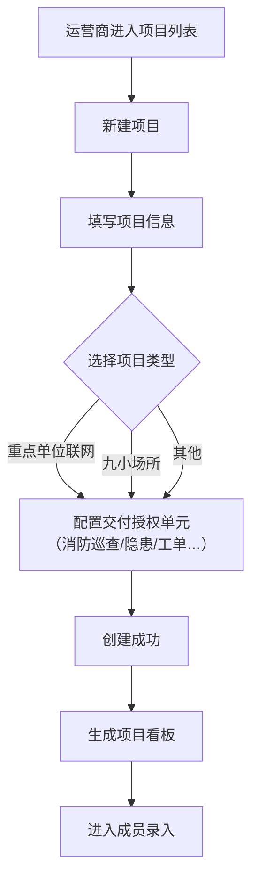
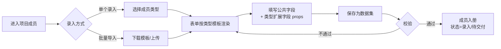
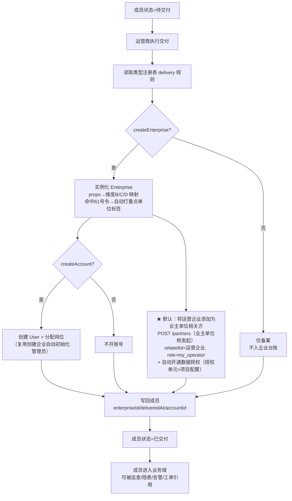
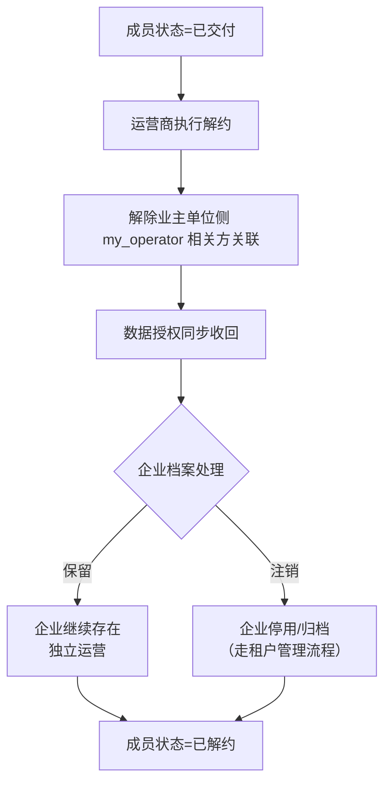

# 项目管理 — 业务设计

> AI 安全管理平台子模块。最后更新：2026-08-03。
> 基于四方用户定位（监管机构 / 社会单位 / 技术服务机构 / 社会民众）中**运营商**（社会单位特殊形态）的项目管理场景设计。

---

## 一、产品定位

项目管理是 AI 安全管理平台的**运营商业务中枢**，以"项目"为业务容器，支撑运营商承接"重点单位联网项目""九小场所管理"等业务时，完成**单位录入 → 交付开通 → 日常运营**的全流程管理。

**核心业务链路**：

| 阶段 | 运营商动作 | 系统响应 |
|------|-----------|---------|
| 建项 | 创建项目（重点单位联网 / 九小场所 / 其他） | 生成项目容器 + 项目看板 |
| 收录 | 录入/批量导入成员（企业 / 九小场所 / 家庭…） | 成员以轻量"数据集"形态入册，不要求完整企业档案 |
| 交付 | 对成员执行交付 | 实例化企业 + 开通管理员账号 + **将运营企业添加为业主单位相关方（`my_operator`）并授权**，一次完成 |
| 运营 | 查看项目看板、按项目维度管理工单 | 聚合成员单位的告警 / 隐患 / 工单流转状态 |

**核心闭环**：项目创建 → 成员录入 → 交付实例化 → 授权开通 → 业务域运营 → 解约回收，覆盖运营商项目全生命周期。

**项目管理不是**：
- 不是企业档案管理——成员交付前只是项目内的"数据集"，交付后才成为全局企业；企业档案的维护在租户管理
- 不是任务系统——项目内的任务就是现有**工单**跨企业流转，项目只做数据过滤维度，不设独立任务实体
- 不是权限配置工具——`my_operator` 相关方授权是交付的自动产物，权限体系仍在相关方模型内
- 不是管理单元——管理单元是企业内部组织抓手（设备/点位/区域），项目管理是运营商跨企业组织被管单位，两者职责分离

---

## 二、核心用户与价值

| 角色 | 端侧 | 核心诉求 | 价值 |
|------|------|---------|------|
| 运营商（项目负责人） | Web | 建项目、批量收录单位、执行交付、看项目看板 | 用项目组织被管单位，交付一次闭环（档案+账号+授权），不再逐个企业手工建档 |
| 运营商（运营人员） | Web | 按项目查看成员单位工单/隐患/告警状态 | 项目 = 数据过滤维度，跨企业业务一屏掌握 |
| 平台运营方（platform-ops） | Web | 维护成员类型注册表 | 新类型（学校/医院/仓库…）只加配置，不发版 |
| 被管单位（已交付） | Web/移动 | 获得企业档案与账号，进入平台业务域 | 交付即开通，免去重复建档 |

---

## 三、与"管理单元"的职责边界（2026-08-03 决策）

**管理单元仅作为企业内部管理抓手**，项目 / 九小 / 家庭类型在项目管理功能上线后从管理单元中**去除**：

| 维度 | 管理单元 | 项目管理 |
|------|---------|---------|
| 定位 | 企业内部组织工具 | 运营商跨企业业务容器 |
| 管什么 | 设备 / 点位 / 区域 / 车间 / 商铺位 | 项目 → 成员（企业/九小/家庭数据集） |
| 类型 | 虚拟类型（收敛后，不再含项目/九小/家庭） | 成员类型注册表（enterprise/small_shop/family/…） |
| 嵌套 | 树形文件夹，多层嵌套 | 项目（1 层）→ 成员（叶子） |
| 谁用 | 企业自己 | 运营商 |
| 数据授权 | 相关方授权时可选的"管理单元范围" | 交付时自动建立相关方授权（见 §四 4.3） |

**原则**：两个体系各归其位——管理单元管"企业内部的空间与资产"，项目管理管"运营商承接的业务与单位"。互不寄生。

---

## 四、核心业务流程

### 4.1 项目创建流程

**关键节点**：
- 项目类型来自字典，与成员类型注册表解耦（项目类型 ≠ 成员类型）
- 交付授权单元可在项目创建时预配置（默认模板），决定交付后开通哪些业务域数据访问
- 项目状态：筹建 → 运营 → 已结项

### 4.2 成员录入流程（数据集形态）

**关键节点**：
- 成员类型决定字段模板（企业字段多、家庭字段少），差异收敛在 `props` JSON
- 数据集只存在于项目上下文，**不可被业务域引用**（系统里"看不到"）
- 类型注册表新增类型 → 录入表单自动适配，零代码

### 4.3 交付流程（实例化 + 相关方授权）

**关键节点**：
- 交付动作**规则驱动**（读注册表 delivery 配置），不是 if-else
- 三种内置类型验证机制：企业（全量交付）、九小场所（dimB 映射九小类）、家庭（**只备案不开账号**，不开授权）
- **相关方授权是默认动作**：以业主单位视角将运营企业添加为"我的运营方"，并自动开通数据授权（授权单元 = 项目创建时配置的模块集）
- 授权方向符合现有相关方语义：**数据持有方（业主单位）发起**，回答"对方是我的谁" = `my_operator`
- 交付一次完成三件事：档案 + 账号 + 授权，对运营商是单点操作

### 4.4 解约流程

**关键节点**：
- 解约默认**保留企业档案**（企业可能同时服务多个项目/独立运营），只收回项目相关方授权
- 授权回收即时生效，不留孤儿授权

---

## 五、关键业务规则

### 5.1 数据集与实例化

| 规则 | 说明 |
|------|------|
| 成员先数据集、后企业 | 交付前成员只存在于项目上下文，交付时才实例化为全局企业 |
| 交付即闭环 | 实例化企业 + 开通管理员账号 + 建立 `my_operator` 相关方授权，单点操作一次完成 |
| 泛化承载 | 表结构只认"公共字段 + props JSON"，类型差异收敛于扩展字段 |

### 5.2 单向数据同步

| 规则 | 说明 |
|------|------|
| 交付前编辑源 | 数据集（ProjectMember），运营商维护 |
| 交付后编辑源 | **企业档案（Enterprise）**，企业管理员 + 平台运营方兜底 |
| 冲突裁决 | 以企业档案为准，项目成员页对企业字段只读展示 |
| 反向禁止 | 项目 → 企业 的字段修改不允许（或作为企业档案的批量编辑入口直接写企业） |
| 历史留痕 | 成员记录保留交付时间戳；签约信息追溯由操作日志承载 |

### 5.3 类型注册表

| 规则 | 说明 |
|------|------|
| 维护位置 | 平台运营方后台（platform-ops），与岗位管理同级 |
| 新增类型 | 注册表加一行配置（fields 模板 + delivery 规则），零 DDL、零发版 |
| 内置类型 | `enterprise`（全量交付）/ `small_shop`（dimB 映射九小类）/ `family`（只备案不开账号） |
| 项目类型 ≠ 成员类型 | 两者独立字典，解耦演进 |

### 5.4 相关方授权（交付默认动作）

| 规则 | 说明 |
|------|------|
| 授权建立 | 交付时**默认**在业主单位侧创建相关方：`relatedId=运营企业, role=my_operator` + 自动开通数据授权 |
| 授权单元 | 由项目创建时配置（消防巡查/隐患管理/工单等模块集），可项目级覆盖 |
| 发起方向 | 业主单位（数据持有方）侧发起，符合现有相关方语义 |
| 多项目并存 | 同一单位可在多个项目 → 多个 `my_operator` 关联，天然支持 |
| 授权回收 | 解约时解除相关方关联，权限同步收回 |

### 5.5 任务承载

| 规则 | 说明 |
|------|------|
| 不设独立任务系统 | 项目内任务 = 现有工单跨企业流转（发起→分派→接单→处置→验收→归档） |
| 项目 = 过滤维度 | 运营商按项目查工单，成员单位按自己查工单 |
| 复用流程引擎 | 模板 / 审批流 / 指派 / 督办全部复用现有工单管理域 |

---

## 六、与平台组织模型的关系

### 6.1 多企业纳管

平台采用**扁平企业模型**（所有主体平级为"企业"，管理链通过关联动态建立）。项目管理遵循同一原则：

- 项目是运营商企业下的业务容器，**不新增企业层级**
- 项目成员交付后是平级企业，通过 `my_operator` 相关方关联表达"谁运营谁"
- 运营商、被管单位、服务方、监管方之间的数据流仍走现有关联链

### 6.2 数据权限

- 交付 = 业主单位侧自动创建 `my_operator` 相关方 + 授权单元开通（授权范围由项目创建时配置）
- 项目页展示的成员数据（告警/隐患/工单）均通过授权校验，与相关方体系共用一套鉴权
- 监管端看相关方体系 = 完整关系网（谁运营谁），与项目解耦可审计

### 6.3 平台侧栏归属

| 项 | 归属 |
|----|------|
| 项目列表/详情/成员 | 运营商侧（单位端导航分组下） |
| 类型注册表 | 平台运营方（platform-ops 导航分组下） |

---

## 七、与租户管理 / 管理单元的关系

| 维度 | 租户管理 | 管理单元 | 项目管理 |
|------|---------|---------|---------|
| 定位 | 企业档案全生命周期 + 企业间关联 | 企业内部组织工具（设备/点位/区域） | 运营商以项目组织被管单位 |
| 服务对象 | 平台运营方（建档）+ 企业管理员 | 企业自己 | 运营商（项目运营） |
| 企业创建 | 手动创建 / 交付复用其逻辑 | — | **交付动作自动触发**（实例化） |
| 数据权限 | 下级管理 + 相关方 | 相关方授权的可选范围 | 复用相关方 `my_operator`（交付自动建立） |
| 依赖方向 | 不依赖项目管理 | 不依赖项目管理 | 依赖租户管理的企业创建 + 相关方授权能力 |

**原则**：
- 项目管理独立成域、独立闭环，但交付动作复用租户管理的企业创建 + 相关方授权底层能力，不重复实现
- 管理单元与项目管理**职责分离**：上线后管理单元类型收敛为纯企业内部抓手，不再含项目/九小/家庭类型

---

## 八、Demo 当前状态

| 模块 | 状态 |
|------|------|
| 项目列表 / 详情 / 成员 / 成员编辑 / 类型注册表 / 交付结果 | ❌ 全部待新增 |
| 现有导航"项目管理（项目列表/任务管理）"节点 | 占位节点，无路由 |
| 管理单元 mock（车间/锅炉房等） | 保留，仅企业内部使用 |

**Demo 规划**：light 阶段实现 6 个页面 + Mock 数据（localStorage 持久化），交付动作用 Mock 模拟企业创建 + 相关方关联写入。

---

## 九、模块设计索引

| 模块 | 设计文档 | 状态 |
|------|---------|------|
| M0-M5 | `ai-spec/`（待编写） | 待创建 |

> 按 `docs/工单管理/ai-spec/` 的规格编写各页面 ai-spec（新增编辑项目、项目详情、项目成员、类型注册表）。

---

## 十、版本历史

| 日期 | 版本 | 变更 |
|------|------|------|
| 2026-08-03 | v0.1 | 初始版本：项目实体模型、成员数据集、类型注册表、交付动作、单向同步、工单承载 |
| 2026-08-03 | v0.2 | **管理单元职责分离**：项目管理独立成域，管理单元类型收敛为纯企业内部抓手（去项目/九小/家庭类型）；交付动作明确为"将运营企业添加为业主单位相关方（my_operator）并授权" |
